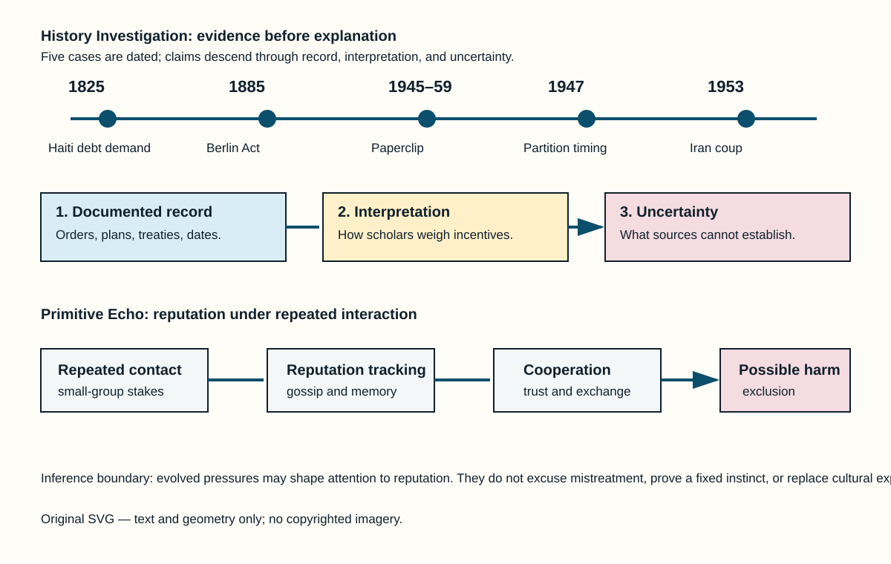

# History Investigation — 23 September 2026

**Method.** Each card separates what records establish from interpretation and uncertainty. Source lists are not part of the card body count.

## 1. Haiti’s Independence Was Paired With a Financial Demand

**Documented fact.** On 17 April 1825, Charles X offered recognition of Haiti’s independence only if Haiti paid 150 million francs and reduced customs duties for French ships. France sent a naval force as the order was delivered. The sum was reduced in 1838, but Haiti borrowed to meet payments and refinancing continued for decades. This is not a metaphorical “debt”: the ordinance and later treaty set explicit terms.

**Scholarly interpretation.** Historians describe the arrangement as a coercive indemnity imposed by a former colonial power. It helped make formal recognition conditional on an external financial burden, even while Haiti was building state institutions after a revolution and war. The overlooked point is institutional: independence came with a price set by the state whose slave regime Haiti had defeated.

**Uncertainty.** The records do not let us calculate one clean share of Haiti’s present poverty caused by the indemnity. Internal politics, foreign intervention, trade, disaster, and later debt also matter. They do establish the demand and its long fiscal afterlife.

**Sources**

- [Ordonnance du roi, 17 April 1825 — Bibliothèque nationale de France](https://gallica.bnf.fr/ark:/12148/bpt6k486962f)
- [Convention entre la France et Haïti, 1838 — Yale Law School Avalon Project](https://avalon.law.yale.edu/19th_century/haiti.asp)
- [Haiti’s Double Debt — *The Conversation*, scholarly overview](https://theconversation.com/haitis-double-debt-the-cost-of-independence-162562)

## 2. Partition’s Deadline Was a Political Force

**Documented fact.** Britain announced the transfer of power on 3 June 1947, with independence set for August. Cyril Radcliffe’s boundary commissions had to divide Punjab and Bengal while using population, district, and communications data. The final awards were dated 12 August but released on 17 August, after India and Pakistan became independent. The timetable was therefore measured in weeks, not years.

**Scholarly interpretation.** This short administrative clock did not itself explain communal violence or the long political conflict. It did restrict surveying, consultation, and preparations for migration. The records shift attention from a story about one person’s private desire for power toward institutions: an imperial exit, competing political programmes, provincial fears, and a boundary process under severe time pressure.

**Uncertainty.** Motives cannot be read straight from a public plan. Muslim League, Congress, Sikh leaders, British officials, and local actors held different aims. No archival record supports reducing Partition to a single founder’s concealed motive; evidence supports a multi-causal political crisis.

**Sources**

- [The 3 June Plan, 1947 — UK Parliament Living Heritage](https://www.parliament.uk/about/living-heritage/evolutionofparliament/legislativescrutiny/parliament-and-empire/collections1/partition-of-india/3-june-plan/)
- [Radcliffe Award, Punjab, 1947 — National Archives of India](https://nationalarchives.nic.in/)
- [The Partition of India — British Library](https://www.bl.uk/learning/timeline/item126692.html)

## 3. Iran 1953 Was Not Merely an Internal Change of Government

**Documented fact.** Declassified United States records show that the CIA planned Operation TPAJAX against Prime Minister Mohammad Mosaddegh. The operation followed Iran’s oil nationalization and a dispute with Britain. The plan used political contacts, propaganda, and money; the Shah’s decrees also mattered, as did Iranian military officers, clerics, parties, crowds, and opponents of Mosaddegh. Mosaddegh fell in August 1953 and General Fazlollah Zahedi took office.

**Scholarly interpretation.** The documents overturn any claim that the outcome was wholly spontaneous or purely domestic. They do not erase Iranian agency. A stronger reading is that foreign intervention entered an already divided political system, where oil sovereignty, royal authority, Cold War fears, and constitutional conflict overlapped.

**Uncertainty.** Scholars still debate the relative weight of CIA action, British pressure, the Shah, military networks, street mobilization, and Mosaddegh’s own decisions. Declassification strengthens evidence of planning and support; it cannot turn a complex crisis into a single-cause story.

**Sources**

- [Foreign Relations of the United States, 1952–1954: Iran — U.S. State Department](https://history.state.gov/historicaldocuments/frus1952-54Iran)
- [CIA, *The Battle for Iran* (declassified history)](https://nsarchive2.gwu.edu/NSAEBB/NSAEBB435/)
- [The 1953 Coup in Iran — Association for Diplomatic Studies and Training](https://adst.org/2015/07/the-coup-against-irans-mohammad-mossadegh/)

## 4. Berlin 1884–85 Used Humanitarian Language and Commercial Rules

**Documented fact.** The Berlin Conference’s General Act declared freedom of trade in the Congo Basin and Niger region, rules for navigation, and obligations framed as protection of local populations and suppression of slavery. No African polity signed the Act. European occupation of African territory was already underway; the conference set procedures for notification of future occupations rather than drawing every later colonial border.

**Scholarly interpretation.** The contrast between humanitarian vocabulary and commercial-strategic rules is important. It reveals how law could make expansion legible and competitive among European states while claiming moral purpose. The relevant hidden context is not a secret meeting room: it is what the published legal text prioritized—trade access, navigation, and interstate notice.

**Uncertainty.** The Act alone did not cause the “Scramble for Africa,” and it neither created every colonial claim nor explains African resistance, diplomacy, and survival. Historians differ on how decisive Berlin was. The documentary record supports a narrower claim: it helped regulate European imperial competition without African representation.

**Sources**

- [General Act of the Berlin Conference, 1885 — Yale Law School Avalon Project](https://avalon.law.yale.edu/19th_century/berlin.asp)
- [Berlin Conference of 1884–1885 — Encyclopaedia Britannica](https://www.britannica.com/event/Berlin-West-Africa-Conference)
- [Africa and the Berlin Conference — British Library](https://www.bl.uk/collection-items/general-act-of-the-berlin-conference-on-west-africa-1885)

## 5. Project Paperclip Made Security Competition Override Full Disclosure

**Documented fact.** After the Second World War, the United States recruited German specialists through programs that became known as Project Paperclip. Government records show work on rockets, aircraft, medicine, and other military fields. The programme’s Cold War rationale was to prevent skills and knowledge from reaching the Soviet Union. Some recruits had Nazi-party or wartime links; U.S. officials adjusted screening and immigration handling in cases they judged useful.

**Scholarly interpretation.** Paperclip is often told as a space-race story. The record adds a conflict of incentives: military advantage, intelligence fears, and public accountability pulled in opposite directions. Recruitment did not mean every participant committed the same acts, but it did mean the United States accepted uneven vetting and later reputational risk for selected expertise.

**Uncertainty.** A list of recruits is not a verdict on each person. Claims about individual crimes need individual evidence. Archives establish the programme and its priority structure; they do not justify treating all German scientists as identical or treating technological success as proof of moral exoneration.

**Sources**

- [Project Paperclip and the Exploitation of German Scientists — U.S. National Archives](https://www.archives.gov/iwg/declassified-records/rg-330-defense-secretary)
- [Operation Paperclip — U.S. Army Center of Military History](https://history.army.mil/books/70-7_15.htm)
- [Project Paperclip — U.S. Holocaust Memorial Museum](https://encyclopedia.ushmm.org/content/en/article/operation-paperclip)

## Primitive Echo — Reputation Tracking in Small Groups

**Documented fact.** Human groups exchange information about absent people. Experiments show that gossip can spread reputational information and can support cooperation when people expect future interaction. Anthropological work also documents food sharing, monitoring, and sanctions in small-scale societies. These findings support a mechanism: repeated social life makes it useful to know who reciprocates, who defects, and who may be trusted.

**Scholarly interpretation.** Modern online call-outs, workplace rumours, ratings, and fear of exclusion can draw on this old coordination problem. Reputation systems reduce uncertainty when contracts are weak or costly. They can therefore feel urgent even when the immediate stakes are low.

**Uncertainty.** This is not proof that any present behaviour is a fixed “primitive instinct.” Human learning, law, culture, platforms, class, and personal history change how reputation works. Gossip can help cooperation, but it can also spread error, punish difference, and magnify power. Evolutionary explanation identifies a possible pressure, not a moral excuse.

**Sources**

- [Gossip and cooperation — *Proceedings of the Royal Society B*](https://royalsocietypublishing.org/doi/10.1098/rspb.2015.2090)
- [Reputation and cooperation — *Nature Human Behaviour*](https://www.nature.com/articles/s41562-018-0516-4)
- [Hunter-gatherer cooperation — *Current Anthropology*](https://www.journals.uchicago.edu/doi/10.1086/673121)

## Illustration

*Illustration alt text: A text-and-shape timeline names Haiti 1825, Berlin 1885, Iran 1953, Partition 1947, and Paperclip 1945–59. Below, an evidence ladder separates direct records, interpretation, and uncertainty. A behavior loop shows repeated interaction leading to reputation tracking, cooperation, and possible exclusion.*
