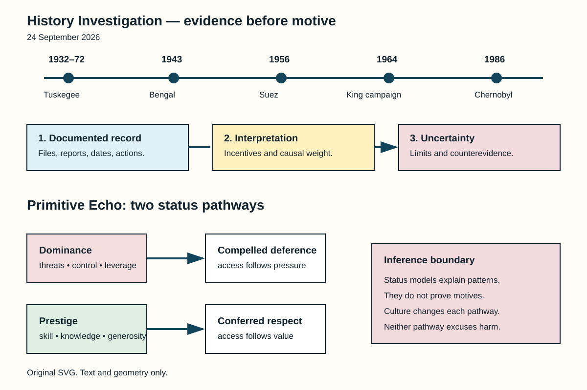

# History Investigation — 24 September 2026

**Method.** Records anchor each card. Interpretations remain identified. Uncertainty stays beside claims. Source lists remain separate.

## 1. Suez: The Ultimatum Followed Planning

**Documented fact.** Delegates met near Paris. Britain, France, Israel participated. Their protocol stayed secret. It fixed a sequence. Israel would attack Sinai. Britain and France followed. They would issue ultimatums. Canal occupation was demanded. Rejection triggered their intervention. Israel attacked on 29 October. Allied bombing then began. Contemporary suspicions lacked proof. Later records supplied documentation.

**Scholarly interpretation.** The sequence created pretext. Public peacekeeping language concealed coordination. Egypt faced asymmetric demands. Canal nationalization supplied context. Regional warfare also mattered. Israeli security concerns mattered too. French Algerian interests mattered. British prestige mattered. Britain also faced decline. These motives could coexist.

**Uncertainty.** The protocol proves coordination. It cannot reveal everything. Selwyn Lloyd disputed “collusion.” Participant memoirs differ slightly. Their core sequence agrees. The agreement proves planning. It does not prove omnipotence. Washington opposed the invasion. United Nations pressure followed. Financial pressure also mattered. Withdrawal became unavoidable.

**Sources**

- [Sèvres agreement — U.S. State Department, FRUS](https://history.state.gov/historicaldocuments/frus1955-57v16/d373)
- [“Anatomy of a War Plot” — *International Affairs*](https://www.jstor.org/stable/2624270)
- [General Assembly Resolution 1001 — United Nations](https://docs.un.org/en/A/RES/1001(ES-I))

## 2. Martin Luther King Jr.: Surveillance Became Political Warfare

**Documented fact.** Federal agents monitored King. Surveillance expanded during 1963. Wiretaps targeted his associates. Bugs entered private spaces. Officials found no communist direction. The campaign then changed. Personal information became ammunition. An anonymous package followed. It contained a recording. Its letter threatened exposure. King understood suicidal pressure. Senate investigators later examined everything. They condemned FBI abuses.

**Scholarly interpretation.** Security powers served politics. Hoover viewed King hostilely. Bureaucratic tools enabled harassment. The target remained nonviolent leadership. Surveillance therefore exceeded investigation. It sought public destruction. This context matters today. Released files contain accusations. Accusations are not findings. Smear campaigns exploit that confusion.

**Uncertainty.** Some recordings remain restricted. Existing files have biases. Agents selected their evidence. Personal allegations remain contested. They need independent proof. The record establishes surveillance. It establishes attempted discrediting. It establishes official hostility. It does not establish everything alleged. King’s assassination needs separate evidence. Surveillance alone proves no assassin.

**Sources**

- [Intelligence Activities and Americans’ Rights — U.S. Senate Church Committee](https://www.intelligence.senate.gov/wp-content/uploads/2024/08/sites-default-files-94755-ii.pdf)
- [Federal Bureau of Investigation — Stanford King Institute](https://kinginstitute.stanford.edu/federal-bureau-investigation-fbi)
- [Martin Luther King Jr. files — FBI Vault](https://vault.fbi.gov/Martin%20Luther%20King,%20Jr.)

## 3. Bengal 1943: Scarcity Became Unequal Starvation

**Documented fact.** Wartime Bengal faced shocks. Burma’s rice imports vanished. A cyclone damaged crops. Plant disease reduced yields. Wartime inflation raised prices. Military purchasing changed demand. Provincial barriers constrained trade. “Boat denial” disrupted transport. Price controls repeatedly failed. Rural purchasing power collapsed. Calcutta received protected supplies. Rural labourers lacked protection. Starvation and disease followed.

**Scholarly interpretation.** Food scarcity mattered greatly. Distribution mattered equally. Amartya Sen emphasized entitlements. People starved without purchasing power. Colonial priorities shaped allocation. Wartime defense dominated planning. Provincial failures also mattered. Traders and hoarders mattered. Weather and disease mattered. No single mechanism suffices.

**Uncertainty.** Mortality estimates still vary. Crop data remain disputed. Causal weights remain contested. Churchill made racist remarks. Those remarks show prejudice. They prove no famine plan. Evidence supports policy failure. It supports delayed relief. It supports unequal protection. Deliberate genocide requires stronger proof. The archives cannot establish that.

**Sources**

- [*Report on Bengal* — Famine Inquiry Commission, Government of India](https://archive.org/details/in.ernet.dli.2015.206311)
- [Colonial Biopolitics — PubMed Central](https://pmc.ncbi.nlm.nih.gov/articles/PMC9735018/)
- [*Poverty and Famines* — Oxford University Press](https://global.oup.com/academic/product/poverty-and-famines-9780198284635)

## 4. Tuskegee: The Crime Was Withholding Care

**Documented fact.** The study began during 1932. It involved Black Alabama men. Researchers observed untreated syphilis. The infected group numbered 399. They already carried syphilis. Researchers did not infect them. Another 201 formed controls. Meaningful consent was absent. Participants expected health care. Penicillin later became standard. Researchers still withheld treatment. The study ended during 1972.

**Scholarly interpretation.** The correction matters greatly. Deliberate infection was unnecessary. Deception already caused harm. Untreated disease caused harm. Racism shaped participant selection. Institutional authority sustained compliance. Local partnerships enabled continuation. The scandal changed research governance. Federal reforms then followed. Belmont articulated ethical principles.

**Uncertainty.** Individual outcomes differed. Records cannot restore consent. The correction reduces mythology. It never reduces wrongdoing. Tuskegee also affected families. Some partners acquired syphilis. Its legacy shapes medical distrust. That effect has many causes. No single study explains everything. Modern safeguards also vary. Rules alone guarantee nothing.

**Sources**

- [Untreated Syphilis Study — CDC](https://www.cdc.gov/tuskegee/about/index.html)
- [Tuskegee records — U.S. National Archives](https://catalog.archives.gov/id/281642)
- [The Belmont Report — U.S. Health Department](https://www.hhs.gov/ohrp/regulations-and-policy/belmont-report/index.html)

## 5. Chernobyl: The First Blame Story Changed

**Documented fact.** Reactor Four exploded during testing. The date was 26 April. Early Soviet accounts blamed operators. International summaries repeated much. Later evidence changed findings. Some alleged violations vanished. Some procedures permitted them. Operators lacked safety information. The reactor had feedback risks. Shutdown rods had defects. Their insertion could increase reactivity. Regulators knew important weaknesses. Corrective action had lagged.

**Scholarly interpretation.** Operator actions still mattered. The test changed improvisationally. Yet design shaped consequences. Secrecy shaped operator knowledge. Regulation lacked independence. Safety culture remained weak. Blame therefore became systemic. This revision carries lessons. Systems must tolerate mistakes. Hidden hazards defeat training.

**Uncertainty.** The final initiating sequence remains debated. INSAG-7 acknowledged that limit. It did not exonerate everyone. Staff accepted unstable conditions. Procedures were changed onsite. Designers created dangerous dependencies. Managers tolerated those dependencies. Exact blame shares resist measurement. The strongest conclusion stays mixed. Design, operations, regulation interacted.

**Sources**

- [INSAG-7: *The Chernobyl Accident* — IAEA](https://www-pub.iaea.org/MTCD/publications/PDF/Pub913e_web.pdf)
- [NUREG-1250 Chernobyl report — U.S. Nuclear Regulatory Commission](https://www.nrc.gov/docs/ML0716/ML071690245.pdf)
- [Chernobyl assessments — United Nations Scientific Committee](https://www.unscear.org/unscear/en/areas-of-work/chernobyl.html)

## Primitive Echo — Status Uses Two Roads

**Documented fact.** Human groups organize rank. Research distinguishes two pathways. Dominance uses coercive leverage. Threats can secure deference. Prestige works differently. Others confer it voluntarily. Skill can produce prestige. Knowledge can produce prestige. Generosity can help too. Both pathways create influence. People often recognize both.

**Scholarly interpretation.** Modern institutions preserve both. A manager may threaten. Another manager may teach. Influencers display competence. Politicians display toughness. Followers reward useful knowledge. Followers may also submit. Status anxiety tracks access. Rank once shaped resources. It shaped alliances too. Those pressures remain plausible.

**Uncertainty.** Two pathways simplify reality. Cultures define valued skills. Institutions constrain coercion. Wealth changes status signals. Gender changes opportunities. Technology changes audiences. People combine both pathways. Personality also matters. Evolution supplies hypotheses. It never proves motives. It never excuses bullying. Present behavior needs context. “Primitive” means inherited pressures. It never means destiny.

**Sources**

- [Evolution of prestige — *Evolution and Human Behavior*](https://doi.org/10.1016/S1090-5138(00)00071-4)
- [Two routes toward social rank — *Journal of Personality and Social Psychology*](https://doi.org/10.1037/a0030398)
- [Dominance and prestige review — *Current Directions in Psychological Science*](https://doi.org/10.1177/0963721417714323)

## Illustration

*Alt text: Five dated historical cases appear above three evidence levels. Below, two arrows show dominance producing compelled deference, while prestige produces freely conferred respect. A boundary note says status theories explain patterns, not individual motives.*
