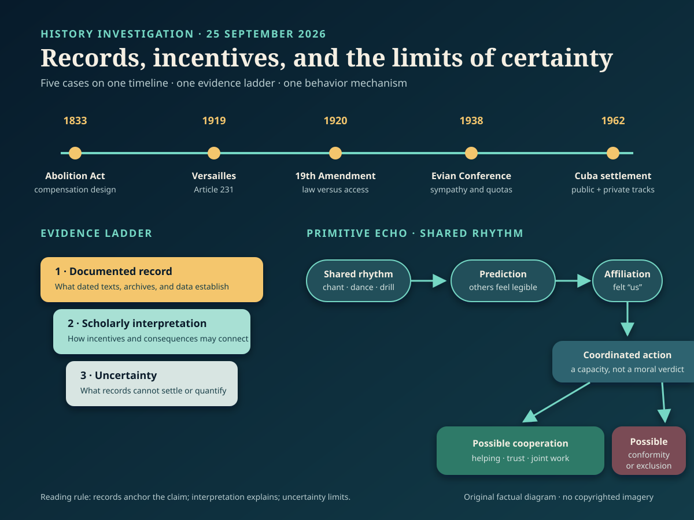

# History Investigation — 25 September 2026

**Method.** Each card distinguishes documented record, scholarly interpretation, and uncertainty. Source lists sit outside the 140–200-word card bodies.

## 1. Cuba 1962: The Public Settlement Had a Private Track

**Documented fact.** Kennedy’s public 27 October letter offered to end the quarantine and promise no invasion if Soviet missiles left Cuba; it did not offer a Turkey trade. Inside the Executive Committee, however, officials repeatedly discussed obsolete U.S. Jupiter missiles in Turkey. Robert Kennedy’s later memorandum says he rejected a formal quid pro quo when meeting Soviet ambassador Anatoly Dobrynin. Yet its archival note records a deleted sentence saying that, after four or five months, the issue could be resolved. The Jupiters were subsequently withdrawn.

**Scholarly interpretation.** The two-track settlement let Washington protect NATO credibility while giving Moscow reason to remove its Cuban missiles. It complicates the familiar image of a unilateral American victory: coercion, reciprocal restraint, alliance management, and face-saving operated together.

**Uncertainty.** Accounts differ over how explicit or binding Robert Kennedy’s private assurance was. The missiles were already considered militarily obsolete, and their removal required Turkish consultation. The record supports a private linkage; it does not show that every detail was a fixed written bargain or that the Turkey issue alone resolved the crisis.

**Sources**

- [ExComm meeting, 27 October 1962 — U.S. State Department](https://history.state.gov/historicaldocuments/frus1961-63v11/d90)
- [Kennedy’s public message to Khrushchev — U.S. State Department](https://history.state.gov/historicaldocuments/frus1961-63v11/d95)
- [Robert Kennedy memorandum and archival note — U.S. State Department](https://history.state.gov/historicaldocuments/frus1961-63v11/d96)

## 2. British Emancipation Compensated Enslavers

**Documented fact.** Parliament’s 1833 Slavery Abolition Act ended legal slavery across much, but not all, of the British Empire from 1834. The settlement appropriated £20 million for people claiming ownership of enslaved people. Claimants submitted forms listing people as property; the formerly enslaved received no compensation. Most adults were also placed into compulsory “apprenticeship,” which delayed full freedom until 1838. The Bank of England administered compensation payments, and UCL’s database traces recipients and later uses of awards.

**Scholarly interpretation.** Emancipation was a major victory produced by resistance, abolitionist organizing, and politics. Its financing also reveals whose property claims the state protected. Compensation and apprenticeship helped secure parliamentary agreement by shifting costs toward the public and the emancipated rather than former owners.

**Uncertainty.** Present-value conversions of £20 million vary sharply by method, so one modern equivalent can mislead. Compensation records demonstrate transfers to claimants, not a simple causal line to every later fortune or institution. Nor did the Act abolish every form of slavery everywhere under British rule at once. The strongest claim concerns the settlement’s documented design, not a total explanation of Britain’s later wealth.

**Sources**

- [Abolition Act and compensation claims — UK National Archives](https://www.nationalarchives.gov.uk/explore-the-collection/explore-by-time-period/georgians/1833-abolition-of-slavery-act-and-compensation-claims/)
- [Legacies of British Slave-ownership — University College London](https://www.ucl.ac.uk/social-historical-sciences/history/research/research-projects-and-centres/centre-study-legacies-british-slavery-cslbs/cslbs-projects-and-partners/legacies-british-slave-ownership)
- [Collection of slavery compensation, 1835–43 — Bank of England](https://www.bankofengland.co.uk/working-paper/2022/the-collection-of-slavery-compensation-1835-43)

## 3. The Nineteenth Amendment Did Not Open Every Poll

**Documented fact.** Ratified in 1920, the U.S. Nineteenth Amendment prohibited federal and state governments from denying the vote “on account of sex.” It removed a major constitutional barrier. It did not erase poll taxes, literacy tests, violence, intimidation, citizenship exclusions, or discriminatory administration. Black women participated in suffrage organizing before 1920 and voted where they could afterward, but many—especially in the South—remained obstructed until federal enforcement expanded, notably through the Voting Rights Act of 1965. Other women faced different citizenship and state-law barriers.

**Scholarly interpretation.** “Women won the vote in 1920” is accurate as a constitutional milestone but incomplete as social history. A legal category changed immediately; practical access remained structured by race, citizenship, location, and official power. Black women’s organizations connected sex equality to wider civil rights precisely because a sex-only rule could not dismantle racial exclusion.

**Uncertainty.** No single date marks equal access for every group or jurisdiction. Barriers and participation varied, and some women of color voted before and after 1920. The evidence therefore disputes both extremes: the amendment was neither merely symbolic nor universal enfranchisement in practice.

**Sources**

- [Nineteenth Amendment text and history — U.S. National Archives](https://www.archives.gov/milestone-documents/19th-amendment)
- [Black women and voting rights — U.S. National Park Service](https://www.nps.gov/articles/black-women-and-the-fight-for-voting-rights.htm)

## 4. Evian 1938: Sympathy Without Sufficient Admission

**Documented fact.** Delegates from 32 countries met at Evian, France, in July 1938 as persecution pushed Jews to leave Nazi Germany and annexed Austria. Representatives voiced sympathy, but most governments declined substantial new admissions. The United States kept its quota system. Existing rules treated refugees largely as ordinary immigrants, and available German quota places were not consistently filled: the U.S. Holocaust Memorial Museum calculates roughly 118,000 unused German quota slots from 1933 through 1941. By June 1939, 309,000 German, Austrian, and Czech Jews had applied for about 27,000 available U.S. quota places.

**Scholarly interpretation.** Evian exposed a collective-action failure. Governments could condemn persecution while assigning domestic jobs, security, racial preferences, and political risk greater weight than rescue. No secret coordination is needed to explain the result; aligned restrictions across many states produced a closed system.

**Uncertainty.** Evian occurred before the Nazis began systematic mass murder, so delegates did not possess full later knowledge. Counterfactual totals—how many additional admissions would have survived—cannot be calculated precisely. Nazi Germany bears responsibility for persecution and genocide. The conference documents a failure of refuge, not shared responsibility for perpetrating the Holocaust.

**Sources**

- [The Evian Conference — U.S. Holocaust Memorial Museum](https://encyclopedia.ushmm.org/content/en/article/the-evian-conference)
- [German Jewish refugees, 1933–1939 — U.S. Holocaust Memorial Museum](https://encyclopedia.ushmm.org/content/en/article/german-jewish-refugees-1933-1939)
- [U.S. immigration and refugee law, 1921–1980 — U.S. Holocaust Memorial Museum](https://encyclopedia.ushmm.org/content/en/article/united-states-immigration-and-refugee-law-1921-1980)

## 5. Versailles Article 231 Was More Than a Nickname

**Documented fact.** Article 231 of the 1919 Treaty of Versailles appears under “Reparation.” It says Germany and its allies accepted responsibility for Allied loss and damage caused by the war imposed through their aggression. It does not use the word “guilt.” Article 232 immediately acknowledged that Germany lacked resources for complete reparation and specified compensation for civilian damage. A U.S. diplomatic history of the peace conference describes Article 231 as the basis for assessing reparations, distinct from the treaty’s provisions on individual responsibility.

**Scholarly interpretation.** Historians such as Sally Marks argue that the clause supplied legal liability, while the label “war guilt clause” converted it into a broader moral verdict. That reception mattered: German politicians used the clause as evidence of humiliation, and public meaning became politically potent even if it exceeded the drafters’ technical purpose.

**Uncertainty.** Legal function does not make the wording politically harmless or the reparations system wise. Scholars still debate responsibility for the First World War and the settlement’s economic effects. Versailles contributed to instability, but the documents cannot support a single-step claim that Article 231 caused Nazism or the Second World War.

**Sources**

- [Treaty of Versailles, Part VIII — Yale Law School Avalon Project](https://avalon.law.yale.edu/imt/partviii.asp)
- [Article 231 diplomatic commentary — U.S. State Department](https://history.state.gov/historicaldocuments/frus1919Parisv13/ch17subch1)
- [“The Myths of Reparations” — *Central European History*](https://www.cambridge.org/core/journals/central-european-history/article/myths-of-reparations/3CEE5EC186E3B119551910B68BBDD569)

## Primitive Echo — Moving Together Can Manufacture “Us”

**Documented fact.** Experiments have tested what happens when people walk, sing, tap, or dance in time. Some studies report greater cooperation or affiliation after synchronous action. In a “silent disco” experiment, synchronized dancers reported more closeness and showed higher pain thresholds than comparison groups, although they did not contribute more in an economic cooperation task. A separate dance study found that synchrony and exertion independently increased reported bonding and pain threshold. Pain tolerance was used only as an indirect proxy for endorphin activity.

**Scholarly interpretation.** Chants, drills, worship, concerts, and stadium movements may reuse an old coordination technology: shared timing makes strangers easier to predict and can blur boundaries between self and group. Groups able to coordinate defense, work, childcare, or ritual may have gained advantages, making sensitivity to synchrony a plausible biocultural inheritance.

**Uncertainty.** Evolutionary function is a hypothesis, not a recovered eyewitness account. Experiments are short, culturally situated, and measures of closeness do not guarantee durable trust or moral behavior. Synchrony can support mutual aid, but it can also intensify conformity and exclusion. Moving together helps explain bonding; it does not prove why any particular crowd formed or whether its purpose is good.

**Sources**

- [“Synchrony and Cooperation” — *Psychological Science*](https://pubmed.ncbi.nlm.nih.gov/19152536/)
- [Dance synchrony, exertion, and bonding — *Biology Letters*](https://doi.org/10.1098/rsbl.2015.0767)
- [“Silent disco” experiment — PubMed Central](https://pmc.ncbi.nlm.nih.gov/articles/PMC4985033/)

## Illustration

*Alt text: A horizontal timeline marks British emancipation in 1833, Versailles in 1919, the Nineteenth Amendment in 1920, Evian in 1938, and the Cuban missile settlement in 1962. An evidence ladder separates records, interpretation, and uncertainty. A lower flow diagram shows shared rhythm leading to easier prediction, felt affiliation, coordinated action, and either cooperation or conformity.*
