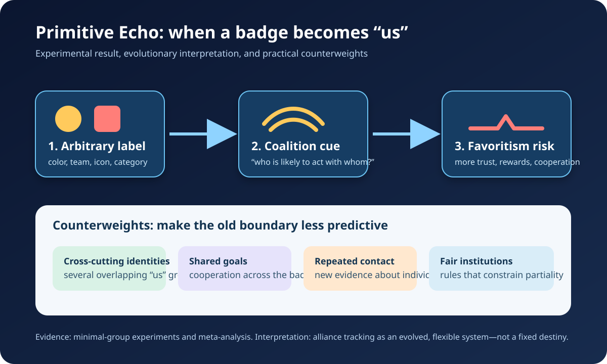

# History Investigation — 26 September 2026

Five evidence-led histories and one Primitive Echo. Each card distinguishes the record from interpretation and uncertainty; source lists are outside the card word counts.

## 1. Guatemala, 1954: the coup had more than one motive

**Documented fact.** A declassified November 1953 plan for Operation PBSUCCESS stated two objectives: covertly remove Guatemala’s government, described by U.S. planners as Communist-controlled, and install a pro-U.S. government. The plan prescribed economic pressure, propaganda, a trained exile force, sabotage, and plausible denial. President Jacobo Árbenz’s agrarian reform also threatened United Fruit Company holdings; the company lobbied in Washington and promoted anti-Árbenz publicity. In June 1954, Árbenz resigned after the CIA-backed force invaded and psychological warfare magnified its apparent strength.

**Scholarly interpretation.** The evidence supports a mixed explanation. Cold War officials sincerely interpreted communist participation as a strategic danger, while U.S. commercial interests and elite networks helped define land reform as intolerable. Corporate pressure mattered, but “the coup was only for bananas” compresses a documented convergence of ideology, property, diplomacy, and covert power into one cause.

**Uncertainty.** Records establish U.S. direction and United Fruit’s campaign, but they cannot assign a precise percentage of responsibility to each motive. Officials’ private anticommunism and material interests were often mutually reinforcing rather than separable.

**Sources**

- [PBSUCCESS draft memorandum, 12 November 1953 — U.S. Department of State, Office of the Historian](https://history.state.gov/historicaldocuments/frus1952-54Guat/d65)
- [CIA and Assassinations: The Guatemala 1954 Documents — National Security Archive](https://nsarchive2.gwu.edu/NSAEBB/NSAEBB4/)
- [Guatemala 1954 historical documents collection — U.S. Department of State, Office of the Historian](https://history.state.gov/historicaldocuments/frus1952-54Guat/comp1)

## 2. The First Opium War: “free trade” included an illegal drug market

**Documented fact.** Britain bought large quantities of Chinese tea, silk, and porcelain, creating a trade imbalance. British merchants and the East India Company’s Indian revenue system answered it with opium sold into China despite Qing prohibitions. Commissioner Lin Zexu’s 1839 suppression campaign confiscated and destroyed foreign merchants’ opium. Britain then used naval force. The 1842 Treaty of Nanking opened ports, transferred Hong Kong, and imposed an indemnity; later agreements widened foreign privileges. In Parliament, opponents openly described the traffic as smuggling, while defenders stressed commerce, compensation, diplomatic equality, and national honor.

**Scholarly interpretation.** Calling the conflict simply a war “for free trade” hides what was being protected: access to markets, a profitable narcotics circuit, and Britain’s preferred diplomatic order. Yet it was not only about opium. Historians also identify disputes over jurisdiction, official communication, merchant security, and the unequal Canton trade system.

**Uncertainty.** Motives varied among ministers, merchants, officers, and MPs. The record strongly links opium and financial interests to escalation, but it does not reduce every British participant’s reasoning to drug profit alone.

**Sources**

- [War with China debate, 7 April 1840 — UK Parliament, Hansard](https://api.parliament.uk/historic-hansard/commons/1840/apr/07/war-with-china)
- [Hong Kong and the Opium Wars — The National Archives (UK)](https://www.nationalarchives.gov.uk/education/teaching-resources/hong-kong-and-the-opium-wars/)
- [The Opening to China, Part I — U.S. Department of State, Office of the Historian](https://history.state.gov/milestones/1830-1860/china-1)
- [The Opium Wars of 1839–1860 — Cambridge University Press](https://doi.org/10.1017/9781108807401.010)

## 3. Mandela’s armed turn: sabotage, strategy, and moral risk

**Documented fact.** At the 1964 Rivonia Trial, Nelson Mandela admitted helping create Umkhonto we Sizwe (MK) and planning sabotage. He said years of constitutional protest and then nonviolent defiance had met tighter repression, banning, and state force. MK therefore targeted infrastructure and property while initially trying to avoid deaths, regarding sabotage as less destructive than terrorism or guerrilla war. Mandela nevertheless acknowledged that escalation could follow if sabotage failed. The apartheid court convicted him and others; later MK operations did cause civilian deaths.

**Scholarly interpretation.** The familiar image of Mandela as reconciliation’s saint is incomplete without this strategic turn. His defense was not a denial of coercion but an argument about constrained choices, proportionality, and preventing uncontrolled racial war. That context explains the decision; it does not make every armed act ethically harmless.

**Uncertainty.** Mandela’s dock statement is indispensable but also advocacy by a defendant. Responsibility for individual operations varied, and the Truth and Reconciliation Commission later found that armed resistance could entail unlawful injury and gross violations. Neither apartheid propaganda nor heroic simplification resolves those case-specific questions.

**Sources**

- [“I am prepared to die,” full Rivonia statement — Nelson Mandela Foundation](https://www.nelsonmandela.org/uploads/files/Prepared-to-die-20-April-1964-speech-final.pdf)
- [Umkhonto we Sizwe archive collection — South African History Online](https://sahistory.org.za/collections/16522)
- [Truth and Reconciliation Commission findings, Chapter 6 — Nelson Mandela Foundation/O’Malley Archive](https://omalley.nelsonmandela.org/index.php/site/q/03lv02167/04lv02264/05lv02335/06lv02357/07lv02398/08lv02404.htm)

## 4. The Manhattan Project’s uranium began in colonial Congo

**Documented fact.** The Manhattan Project is usually mapped through Los Alamos, Oak Ridge, and Hanford, but an essential supply chain began at Shinkolobwe in the Belgian Congo, now the Democratic Republic of the Congo. Its exceptionally rich ore was mined under Belgian colonial ownership. Union Minière executive Edgar Sengier had moved roughly 1,250 metric tons to Staten Island before U.S. officials bought that stock in 1942 and contracted for thousands more tons. Ore traveled through Canada and U.S. processing plants; uranium fuel then entered both enrichment and plutonium-production pathways.

**Scholarly interpretation.** The bomb was not solely an American laboratory achievement. It depended on imperial mining rights, African labor, corporate foresight, Allied shipping, and extraordinary secrecy. Centering that chain changes the story from isolated scientific genius to a global wartime system that distributed recognition very unevenly.

**Uncertainty.** Public institutional histories document the route and purchases more clearly than the identities, working conditions, and exposures of individual Congolese miners. They also do not permit a simple claim that one ore shipment alone “made” either bomb: materials from several sources and complex industrial processes were combined.

**Sources**

- [300 Area Fuel Fabrication Site — U.S. National Park Service](https://www.nps.gov/places/000/300-area-fuel-fabrication-site.htm)
- [Corporate Partners: Edgar Sengier and Congolese uranium — Atomic Heritage Foundation/Nuclear Museum](https://ahf.nuclearmuseum.org/ahf/history/corporate-partners/)
- [Manhattan Project locations FAQ — U.S. National Park Service](https://home.nps.gov/mapr/faqs.htm)

## 5. Bretton Woods: cooperation designed under unequal bargaining power

**Documented fact.** Delegates from 44 countries met at Bretton Woods in July 1944 and created the IMF and what became the World Bank. British negotiator John Maynard Keynes proposed an International Clearing Union, a new unit called the bancor, and pressure on both deficit and surplus countries. U.S. negotiator Harry Dexter White proposed a smaller fund based on national currencies and gold. The final design more closely resembled White’s plan: currencies were pegged to the dollar, and the dollar alone was convertible to gold at $35 an ounce.

**Scholarly interpretation.** Bretton Woods was real multilateral cooperation, meant to prevent competitive devaluations and interwar instability. It was also bargaining under material asymmetry. The United States held immense productive capacity and gold reserves, while Britain was financially exhausted. Institutional architecture therefore reflected not just superior economic theory but the creditor’s leverage.

**Uncertainty.** Counterfactual claims that Keynes’s bancor would have prevented later crises cannot be proved. The agreement included compromises and delivered decades of exchange-rate stability; its dollar-centered design was influential, but it was not the sole cause of the system’s 1971 breakdown.

**Sources**

- [Creation of the Bretton Woods System — Federal Reserve History](https://www.federalreservehistory.org/essays/bretton-woods-created)
- [Articles of Agreement of the International Monetary Fund — IMF](https://www.imf.org/external/pubs/ft/aa/index.htm)
- [Keynes for Our Times — IMF Finance & Development](https://www.imf.org/en/publications/fandd/issues/2026/06/keynes-for-our-times-robert-skidelsky)

## Primitive Echo. Why a meaningless badge can become “us”

**Documented fact.** In Henri Tajfel and colleagues’ minimal-group experiments, participants were sorted by trivial categories with no prior hostility or personal gain at stake. They still tended to allocate more rewards to their own category, sometimes preferring a larger gap over a larger combined payoff. A later meta-analysis found a small-to-moderate overall tendency to cooperate more with in-group than out-group members. Other experiments showed that apparent racial encoding could weaken quickly when visible, cross-racial coalitions supplied better alliance cues.

**Scholarly interpretation.** One evolutionary account proposes that humans became attentive to alliances because cooperation, reciprocity, and conflict made “who acts with whom” consequential. Modern jerseys, party colors, fandoms, and online labels can hijack that flexible tracking system: the badge need not be ancient or meaningful before it organizes expectation and favoritism.

**Uncertainty.** Minimal-group studies demonstrate a readily triggered bias, not an unavoidable destiny or a complete explanation of prejudice. Evolutionary coalition detection is a supported hypothesis, not a recovered observation of prehistory. Institutions, norms, shared goals, and cross-cutting identities can change which boundary matters—and sometimes reduce its force.

**Sources**

- [Social categorization and intergroup behaviour — European Journal of Social Psychology](https://doi.org/10.1002/ejsp.2420010202)
- [Ingroup favoritism in cooperation: a meta-analysis — Psychological Bulletin/PubMed](https://pubmed.ncbi.nlm.nih.gov/25222635/)
- [Can race be erased? Coalitional computation and social categorization — PNAS](https://doi.org/10.1073/pnas.251541498)

---

*Editorial note: This edition is educational, evidence-led, and deliberately distinguishes documented records from interpretation and uncertainty. The accompanying WordPress-ready HTML file remains an unpublished draft.*
