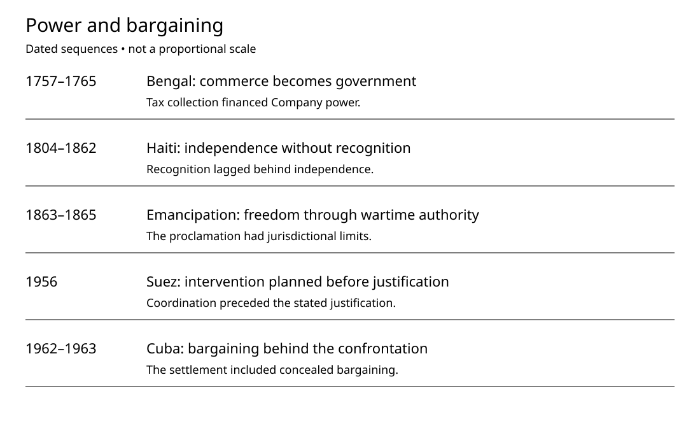

# History Investigation: Power and bargaining

27 September 2026 · Visual edition

## Bengal: commerce becomes government

**Documented fact.** Plassey was fought in 1757. Clive commanded Company forces. Siraj-ud-Daulah governed Bengal. Mir Jafar withheld his support. Negotiations had preceded the battle. Company representatives supported replacing Siraj. Banking interests supported that change. Their interests were not identical. In 1765, authority expanded. Shah Alam II granted diwani. The Company could collect revenues. Taxation helped finance export purchases. Commerce had become territorial government.

**Scholarly interpretation.** The museum identifies overlapping incentives. These included revenue and security. Ambition also drove expansion. Victory depended on political relationships. Firepower alone cannot explain it. Company armies employed Indian soldiers. Empire therefore involved local participation. Participation did not mean equality. Nor did it establish consent. Taxpayers did not negotiate sovereignty.

**Uncertainty.** This account summarizes institutional mechanisms. It cannot measure every motive. Museum narratives require source criticism. Participants left unequal documentary traces. One battle cannot explain empire. Later wars expanded Company rule. Avoid blaming entire communities. Named participants made particular choices. Their descendants inherit no responsibility.

**Sources**

- [Battle of Plassey — National Army Museum](https://www.nam.ac.uk/explore/battle-plassey)

- [Company armies — National Army Museum](https://www.nam.ac.uk/explore/armies-east-india-company)

## Haiti: independence without recognition

**Documented fact.** Haiti declared independence in 1804. Enslaved people had overthrown slavery. France lost its colony. Washington withheld recognition until 1862. That delay lasted 58 years. Earlier US policies had shifted. Adams supported trade with Toussaint. Jefferson pursued isolation after him. Slaveholders feared rebellion spreading. Commercial interests also shaped policy. Nonrecognition did not eliminate exchange. Haiti maintained connections across borders.

**Scholarly interpretation.** Gaffield challenges narratives of isolation. Her research follows those connections. Trade and legal relationships mattered. Recognition operated through several channels. Formal diplomacy was one channel. Independence required work beyond declarations. Merchants could trade without recognition. Governments could cooperate without equality. That distinction explains apparent contradictions. Principles and interests could diverge. Haiti's survival depended on agency.

**Uncertainty.** These sources concern foreign relations. They cannot explain every hardship. Nonrecognition was not total isolation. Trade was not equal treatment. Neither conclusion cancels the other. Motives changed across administrations. Leaders also differed within governments. Avoid assigning one national motive. Diplomatic records privilege official voices. Haitian experiences exceeded those records.

**Sources**

- [Haitian Revolution — Office of the Historian](https://history.state.gov/milestones/1784-1800/haitian-rev)

- [Haitian foreign relations — Julia Gaffield](https://commonplace.online/article/on-the-list-of-free-nations/)

- [Haiti recognition record — Office of the Historian](https://history.state.gov/countries/haiti)

## Emancipation: freedom through wartime authority

**Documented fact.** Lincoln issued it in 1863. It targeted areas in rebellion. It exempted the border states. Some Confederate areas were exempted. Enforcement depended on Union advances. The document authorized Black enlistment. Enslaved people also pursued freedom. They were actors, not bystanders. Abolition required another legal step. The amendment followed in 1865. Its text contains an exception. Punishment after conviction remains excepted.

**Scholarly interpretation.** The Archives identifies strategic aims. Emancipation could strengthen Union forces. It could discourage foreign intervention. Moral purpose and strategy overlapped. Limits reflected its wartime authority. Those limits shaped freedom's geography. A proclamation was not enforcement. Neither was it meaningless symbolism. Its implementation changed the conflict. People escaping slavery influenced events. Freedom emerged through interacting pressures.

**Uncertainty.** Documents cannot weigh every motive. Lincoln's thinking also changed. One text cannot capture that. Abolition did not establish equality. Nor did freedom arrive uniformly. Dates identify changes in authority. They cannot summarize lived experience. Read exceptions alongside the promise. Read people's actions alongside policy. Both belong in this history.

**Sources**

- [Emancipation Proclamation — National Archives](https://www.archives.gov/milestone-documents/emancipation-proclamation)

- [Thirteenth Amendment — National Archives](https://www.archives.gov/milestone-documents/13th-amendment)

## Suez: intervention planned before justification

**Documented fact.** July brought the company’s nationalization. He offered compensation to shareholders. Britain and France opposed him. Israel joined their invasion planning. Representatives met at Sèvres. Their agreement preceded the attack. Israel invaded Egypt in October. Britain and France then intervened. Protecting the canal supplied justification. Their coordination was already established. Washington opposed its allies' operation. Pressure helped produce a ceasefire.

**Scholarly interpretation.** The history identifies overlapping aims. Britain and France feared displacement. Israel viewed Nasser as threatening. Washington feared escalation. Colonial association also concerned it. Partners did not share everything. Coordination joined interests for action. Bar-On's account documents the meetings. His perspective came from participation. That makes it evidence. It does not eliminate bias. Compare it with diplomatic histories.

**Uncertainty.** The coordination is not conjecture. Its interpretation still requires care. Accounts differ in emphasis. Participants defended decisions and reputations. Evidence supports a specific agreement. It establishes no timeless cabal. Nor does it indict populations. State leaders authorized these choices. Their motives cannot represent everyone. Distinguish planning from retrospective justification.

**Sources**

- [Suez Crisis — Office of the Historian](https://history.state.gov/milestones/1953-1960/suez)

- [Three Days in Sèvres — Bar-On](https://doi.org/10.1093/hwj/dbl010)

## Cuba: bargaining behind the confrontation

**Documented fact.** Soviet missiles arrived in 1962. Washington demanded their removal. Kennedy ordered a naval quarantine. Leaders exchanged messages under pressure. On October 27, intermediaries met. Robert Kennedy spoke with Dobrynin. They discussed Turkey’s Jupiter missiles. Washington offered withdrawal through intermediaries. Moscow agreed to withdraw missiles. Washington also pledged against invasion. Turkey’s Jupiters left during 1963.

**Scholarly interpretation.** The settlement combined pressure, concessions. Victory narratives can obscure bargaining. Dobrynin's report records that channel. Secrecy helped preserve leaders' reputations. Public positions constrained possible compromises. Private communication widened those possibilities. The example challenges surrender narratives. It does not erase coercion. Nor does it eliminate danger. Threats and negotiations operated together. Both shaped the eventual settlement.

**Uncertainty.** Reports reflect their authors' positions. They are not verbatim recordings. The precise balance remains debated. Planned modernization complicates the interpretation. Withdrawal planning preceded the crisis. Their removal still mattered diplomatically. No document proves war inevitable. No document measures every risk. Cuba and Turkey had interests. Superpower accounts can marginalize them.

**Sources**

- [Cuban Missile Crisis — Office of the Historian](https://history.state.gov/milestones/1961-1968/cuban-missile-crisis)

- [Dobrynin conversation record — National Security Archive](https://nsarchive.gwu.edu/document/19766-national-security-archive-doc-01-anatoly)

## Primitive Echo: gossip and cooperation

**Documented fact.** People exchange information about others. That information can influence cooperation. Feinberg and colleagues tested this. Participants shared information about reputations. It guided recipients’ partner choices. Some excluded people increased contributions. These findings concern experimental groups. They do not describe everyone. Pan and colleagues modeled evolution. Their agents exchanged reputation information. Cooperation could support gossip's persistence. Results depended on model assumptions.

**Scholarly interpretation.** Partner choice presents a problem. Cooperation can enable exploitation. Reputation may reduce that uncertainty. Sharing information could confer advantages. This is an evolutionary hypothesis. It links behavior, selection pressures. It does not establish ancestry. Workplace gossip offers an analogy. People may seek reputational information. That application is our inference. These experiments did not test workplaces.

**Uncertainty.** Models cannot recover ancestral conversations. Experiments do not establish universality. Culture changes what people share. Institutions change consequences and incentives. Rumors can mislead or exclude. Accuracy cannot be assumed. Benefits do not establish morality. Evolution does not excuse cruelty. Ask who witnessed the behavior. Check evidence before passing judgments.

**Sources**

- [Gossip and ostracism — Feinberg et al., 2014](https://pubmed.ncbi.nlm.nih.gov/24463551/)

- [Evolution of gossip — Pan et al., 2024](https://pubmed.ncbi.nlm.nih.gov/38377206/)

WordPress status: unpublished file. Website upload unavailable.

Video: a four-minute visual summary. Full card bodies appear above. Diagram arrows show the explained sequence; they do not prove single-cause explanations.