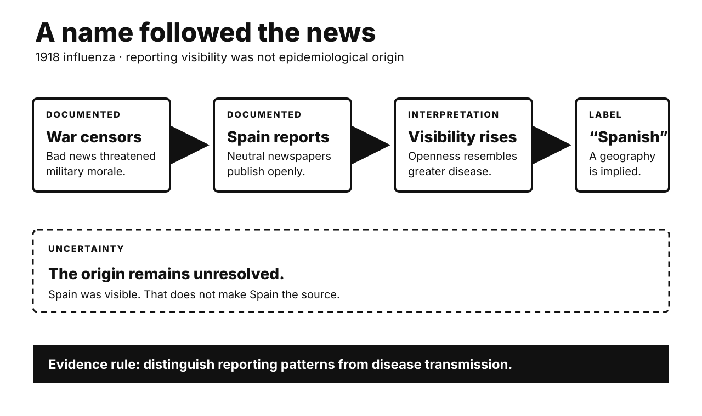

# History Investigation: Labels, law, and agency

27 September 2026 · Visual edition

Five historical investigations and one Primitive Echo. Each body separates documented fact, interpretation, and uncertainty. Source lists are outside body counts.

## 1918 influenza: the name followed censorship

**Documented fact.** The 1918 influenza pandemic spread worldwide. Spain was not its proven source. Spain remained neutral during war. Its wartime censorship was lighter. Spanish newspapers reported outbreaks openly. King Alfonso XIII became ill. Belligerent governments restricted bad news. They feared weakening public morale. Spain therefore looked unusually afflicted. The label followed that visibility. It did not establish origin. Troop movements aided transmission. Crowded camps also mattered.

**Scholarly interpretation.** The name records media conditions. It is not epidemiology. Wartime incentives shaped public knowledge. Censorship distorted apparent disease geography. Neutral reporting looked like exceptional suffering. National disease labels can stigmatize. They can also misdirect attention.

**Uncertainty.** Researchers still debate the origin. Proposed locations include several continents. Surviving evidence remains incomplete. Censorship also varied between states. Newspapers were not uniformly silent. No single government invented everything. Spain did not cause naming alone. The term spread through networks. Those routes remain partly unclear.

**Sources**

- [History of the 1918 Flu Pandemic — CDC](https://archive.cdc.gov/www_cdc_gov/flu/pandemic-resources/1918-commemoration/1918-pandemic-history.htm)
- [Trench Conflict and Infectious Disease — CDC Emerging Infectious Diseases](https://wwwnc.cdc.gov/eid/article/24/11/ac-2411_article)
- [FDR and the Flu Pandemic — U.S. National Archives](https://fdr.blogs.archives.gov/2020/04/28/one-of-the-millions-fdr-and-the-flu-pandemic-of-1918-1920/)

## Magna Carta: a failed truce became a rights symbol

**Documented fact.** Magna Carta was sealed in 1215. It addressed an armed conflict. King John faced rebel barons. They demanded specific protections. Most clauses regulated feudal grievances. Clause 61 empowered twenty-five barons. They could compel royal compliance. Pope Innocent III annulled it. About ten weeks had passed. Civil war then resumed. John died the next year. Regents reissued a revised charter. Further versions followed later. The 1225 version endured.

**Scholarly interpretation.** Modern memory often reads backward. Later lawyers elevated selected clauses. “No free man” gained reach. Tax consent gained wider significance. Repetition transformed a failed truce. It became a constitutional symbol. This legacy was historically constructed. It was not instant democracy.

**Uncertainty.** Original beneficiaries were narrowly defined. Women lacked equal standing. Unfree peasants gained little protection. Yet later influence was real. Symbols can reshape institutions. Direct causal lines remain disputable. Modern constitutions have many sources. Magna Carta created none alone. Myth and influence can coexist.

**Sources**

- [How did Magna Carta come about? — UK Parliament](https://www.parliament.uk/about/living-heritage/evolutionofparliament/originsofparliament/birthofparliament/overview/magnacarta/magnacartahow/)
- [The contents of Magna Carta — UK Parliament](https://www.parliament.uk/about/living-heritage/evolutionofparliament/originsofparliament/birthofparliament/overview/magnacarta/magnacartaclauses/)
- [The legacy of Magna Carta — UK Parliament](https://www.parliament.uk/about/living-heritage/evolutionofparliament/originsofparliament/birthofparliament/overview/magnacarta/magnacartalegacy/)
- [The annulment of Magna Carta — British Library](https://www.bl.uk/stories/blogs/posts/shameful-and-demeaning-the-annulment-of-magna-carta)

## The UDHR: global delegates changed the words

**Documented fact.** The UN adopted the Declaration. The date was 10 December 1948. Eighteen commissioners represented varied backgrounds. Over fifty states joined drafting. Eleanor Roosevelt chaired the commission. She did not write alone. Hansa Mehta represented India. She secured “all human beings.” Earlier wording said “all men.” Lakshmi Menon defended sex equality. Begum Shaista Ikramullah represented Pakistan. She pressed freedom within marriage. P. C. Chang represented China. Charles Malik represented Lebanon. Both shaped major debates.

**Scholarly interpretation.** This was negotiated authorship. It was not one American gift. Nor was it purely Western. Delegates crossed philosophical traditions. Women corrected masculine language. Smaller states changed important provisions. Roosevelt’s leadership still mattered. Shared authorship does not diminish it.

**Uncertainty.** Contributions cannot be cleanly measured. Meeting records privilege formal delegates. Many colonial peoples lacked seats. Power among states remained unequal. The Declaration was initially nonbinding. Its legal influence developed later. Universalism also remains contested. These limits do not erase participation. They qualify the familiar story.

**Sources**

- [History of the Declaration — United Nations](https://www.un.org/en/about-us/udhr/history-of-the-declaration)
- [Women who shaped the UDHR — United Nations](https://www.un.org/sites/un2.un.org/files/2019/11/women_who_shaped_the_udhr.pdf)
- [UDHR procedural history — United Nations Audiovisual Library](https://legal.un.org/avl/ha/udhr/udhr.html)

## The New Deal: exclusion had unequal consequences

**Documented fact.** The 1935 Social Security Act excluded agricultural labor. It also excluded domestic service. The National Labor Relations Act did likewise. These sectors employed many Black workers. Domestic work also employed many women. The exclusions therefore hit unequally. Other workers were excluded too. Government and nonprofit workers appeared there. Administrative records cited collection problems. Small employers kept few records. Congress later expanded some coverage. Major gaps nevertheless persisted.

**Scholarly interpretation.** A common account cites racism. Its factual core is substantial. Southern power protected labor hierarchy. Employers also resisted new taxes. Administrators feared implementation costs. Roosevelt needed a broad coalition. These incentives could reinforce each other. One motive need not exclude another.

**Uncertainty.** Disparate impact is well documented. A single controlling motive is not. Surviving records do not prove that race alone determined these clauses. Administrative reasons could be genuine. They could also be convenient. Political bargaining left uneven traces. Avoid turning complexity into innocence. Avoid turning impact into mind-reading.

**Sources**

- [Social Security Act (1935) — U.S. National Archives](https://www.archives.gov/milestone-documents/social-security-act)
- [Excluding agricultural and domestic workers — Social Security Administration](https://www.ssa.gov/policy/docs/ssb/v70n4/v70n4p49.html)
- [African Americans and the American Labor Movement — U.S. National Archives](https://www.archives.gov/publications/prologue/1997/summer/american-labor-movement.html)

## Meiji Restoration: old language, new machinery

**Documented fact.** Imperial rule was proclaimed in 1868. Tokugawa government then ended. A small former-samurai coalition led. The new state abolished domains. Prefectures replaced them in 1871. National conscription followed in 1873. Land taxes became cash payments. These reforms funded central government. They also provoked resistance. Farmers protested conscription and taxes. Disaffected samurai also revolted. State forces suppressed those challenges. A constitution arrived in 1889. The Imperial Diet opened in 1890. Voting remained tightly restricted.

**Scholarly interpretation.** “Restoration” legitimized revolutionary construction. Leaders invoked ancient imperial authority. They built unfamiliar state machinery. Western institutions were selectively borrowed. National strength guided those choices. Unequal treaties also drove urgency. This was neither simple Westernization nor timeless revival.

**Uncertainty.** Top-down stories remain incomplete. Tokugawa commerce enabled later growth. Education had expanded earlier. Local officials implemented reforms. Commoners resisted and adapted. Leaders also disagreed internally. Industrialization was not prewritten. Later imperial expansion was consequential. It was not every reformer’s single purpose. Outcomes exceeded original intentions.

**Sources**

- [Supporters of the Meiji government — National Diet Library](https://www.ndl.go.jp/portrait/e/pickup/012)
- [The Meiji Restoration and Modernization — Columbia University](https://afe.easia.columbia.edu/special/japan_1750_meiji.htm)
- [Opposition movements in early Meiji — Cambridge University Press](https://www.cambridge.org/core/books/abs/cambridge-history-of-japan/opposition-movements-in-early-meiji-18681885/4AD341D1897AF6FDF7984E36D0304845)
- [The Iwakura Mission and domestic reform — Japan Center for Asian Historical Records](https://www.jacar.go.jp/english/exhibition/iwakura_en/column/index.html)

## Primitive Echo: why chatbots feel social

**Documented fact.** Humans often anthropomorphize nonhumans. We assign intentions and emotions. Epley and colleagues modeled this. Social need can increase attribution. Uncertainty can also increase it. Later experiments tested predictability. Anthropomorphism made stimuli seem understandable. Individual differences predict trust. They also predict moral concern. Chatbots provide contingent language. Humanlike cues affect social responses. A recent meta-analysis found small effects. Effects differed across designs.

**Scholarly interpretation.** Evolutionary accounts emphasize agency detection. Missing a real agent mattered. Predators and allies carried consequences. False positives could cost less. Responsive language now supplies cues. Chatbots can therefore feel social. That feeling need not be foolish. It uses ordinary social machinery.

**Uncertainty.** The evolutionary account remains inferential. We cannot inspect ancestral cognition. Anthropomorphism also reflects culture. Loneliness and interface design matter. Not every user responds alike. Social feelings may aid engagement. They may also inflate trust. Fluent output proves no consciousness. Warmth proves no inner experience. Keep usefulness separate from personhood.

**Sources**

- [On seeing human — Psychological Review/PubMed](https://pubmed.ncbi.nlm.nih.gov/17907867/)
- [Effectance motivation increases anthropomorphism — PubMed](https://pubmed.ncbi.nlm.nih.gov/20649365/)
- [Human-like cues in conversational agents: meta-analysis — Humanities and Social Sciences Communications](https://www.nature.com/articles/s41599-025-05618-w)
- [Motion, identity and the bias toward agency — Frontiers in Human Neuroscience](https://www.frontiersin.org/journals/human-neuroscience/articles/10.3389/fnhum.2014.00597/full)

---

*WordPress status: unpublished file. Remote website upload is unavailable.*

*Video status and verified specifications appear in manifest.json.*
