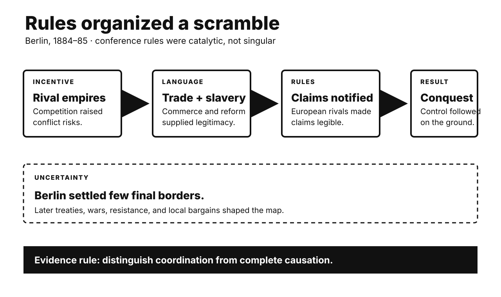

# History Investigation: Rules, choice, and prestige

27 September 2026 · Visual edition

Five historical investigations and one Primitive Echo. Each body separates documented fact, interpretation, and uncertainty. Source lists are outside body counts.

## Berlin 1884–85: rules enabled conquest

**Documented fact.** Fourteen states met in Berlin. No African state participated. The conference ran from November 1884. It ended in February 1885. Its General Act promised free trade. It also invoked suppressing slavery. Articles 34 and 35 regulated claims. Powers had to notify rivals. Coastal authority needed effective protection. The meeting settled few later borders. Most partition followed afterward. Bilateral deals and conquest mattered.

**Scholarly interpretation.** Diplomacy reduced European friction. It made expansion more legible. Humanitarian language supplied legitimacy. Commercial access supplied incentives. The rules did not divide everything. They helped organize the scramble. African sovereignty was largely excluded. Resistance continued across the continent.

**Uncertainty.** Causation should remain qualified. Imperial expansion already preceded Berlin. Technology and capital also mattered. Local alliances shaped outcomes. The conference was catalytic, not singular. Its border legacy is often overstated. Many boundaries emerged later. That correction does not absolve imperialism. It specifies the mechanism.

**Sources**

- [General Act of the Berlin West Africa Conference — German Federal Foreign Office](https://archiv.diplo.de/arc-en/the-political-archive/general-act-2684414)
- [General Act of the Conference at Berlin — WorldJPN, University of Tokyo](https://worldjpn.net/documents/texts/pw/18850226.T1E.html)
- [Endogenous Colonial Borders — American Political Science Review](https://www.cambridge.org/core/journals/american-political-science-review/article/endogenous-colonial-borders-precolonial-states-and-geography-in-the-partition-of-africa/132D6CBDE92946D14CCC64E59A94D3D2)

## Bandung 1955: solidarity without sameness

**Documented fact.** Twenty-nine Asian and African governments met. Bandung hosted them in April 1955. Their communiqué condemned colonialism. It supported self-determination. It also promoted economic cooperation. Ten principles emphasized sovereignty and peace. Participants differed sharply. China was communist. Turkey belonged to NATO. Pakistan joined Western security pacts. India pursued nonalignment. Delegates disputed which imperialism counted. Consensus language accommodated those conflicts.

**Scholarly interpretation.** Bandung created political space. New states could bargain collectively. They rejected compulsory Cold War alignment. Yet nonalignment was not neutrality. Nor was it ideological uniformity. Anti-colonial solidarity enabled cooperation. National interests still structured positions. The coalition’s diversity was its achievement. It was also its constraint.

**Uncertainty.** Bandung did not directly create everything. The Non-Aligned Movement arrived in 1961. Later leaders reworked its memory. State diplomacy also excluded many activists. Internal repression received limited scrutiny. Colonial legacies remained unequal. Bandung’s influence is therefore institutional and symbolic. Exact causal weight remains debated.

**Sources**

- [Final Communiqué of the Asian-African Conference — AALCO](https://www.aalco.int/Basicdocuments/FINAL%20COMMUNIQU%C3%89%20OF%20THE%20ASIAN-AFRICAN%20CONFERENCE.pdf)
- [Bandung Conference, 1955 — U.S. Office of the Historian](https://history.state.gov/milestones/1953-1960/bandung-conf)
- [Afro-Asian Internationalisms in the Early Cold War — Leiden University](https://scholarlypublications.universiteitleiden.nl/access/item%3A2912516/view)

## Marshall Plan: aid served several interests

**Documented fact.** George Marshall proposed European assistance in 1947. Congress enacted it in 1948. About $13.3 billion followed. Funds supplied food and equipment. They also supported industrial recovery. The law sought stable conditions. It encouraged participating countries to cooperate. It promoted expanded foreign trade. Communist influence worried American officials. Soviet leaders rejected participation. Eastern European governments then stayed outside. Western European institutions coordinated requests.

**Scholarly interpretation.** The plan was generous. It was also strategic. Recovery could reduce political extremism. Prosperity could support American markets. Cooperation could integrate Western Europe. These aims reinforced each other. Charity and national interest need not conflict. Treating either as the sole motive loses evidence. Recipients also shaped implementation.

**Uncertainty.** Europe was already recovering unevenly. Economists debate marginal impact. American money was important. Domestic reforms mattered too. The plan did not cause integration alone. Nor did it simply buy obedience. European governments bargained actively. Counterfactual outcomes remain unknowable. Success cannot reveal one private motive.

**Sources**

- [Marshall Plan (1948) — U.S. National Archives](https://www.archives.gov/milestone-documents/marshall-plan)
- [Marshall Plan, 1948 — U.S. Office of the Historian](https://history.state.gov/milestones/1945-1952/marshall-plan)
- [Foreign Assistance Act of 1948 — Marshall Foundation](https://www.marshallfoundation.org/the-marshall-plan/f-a-act-1948/)

## Korean armistice: prisoner choice delayed peace

**Documented fact.** Armistice talks began in July 1951. Front lines soon stabilized. Prisoners became the central obstacle. Communist negotiators demanded general repatriation. The United Nations Command opposed forced return. Many Chinese and North Korean prisoners resisted repatriation. Screening occurred amid coercion and violence. South Korea released thousands unilaterally. The final 1953 agreement used neutral supervision. Prisoners could decline immediate return. The ceasefire followed on 27 July.

**Scholarly interpretation.** A humanitarian principle became strategic. Washington presented voluntary repatriation as individual freedom. It also offered propaganda value. Beijing and Pyongyang invoked treaty rules. They also feared mass defection’s symbolism. Prisoners themselves exercised agency. Camp factions constrained that agency. The dispute prolonged lethal fighting. Moral claims and power politics intertwined.

**Uncertainty.** Individual choices were not fully free. Some prisoners feared punishment. Others faced anti-communist pressure. Screening records remain imperfect. Casualties attributable to negotiation delay vary. Neither side owned humanitarian consistency. The settlement solved no peace treaty. It stopped large-scale combat. Korea remains divided. Motives differed within every delegation.

**Sources**

- [Korean Armistice Agreement — U.S. National Archives](https://www.archives.gov/milestone-documents/armistice-agreement-restoration-south-korean-state)
- [Prisoner of War Issue and the Search for Peace — Truman Library](https://www.trumanlibrary.gov/library/online-collections/korea-prisoners)
- [Conflicts in Voluntary Repatriation — UC eScholarship](https://escholarship.org/uc/item/14d4n47s)

## Bangladesh 1971: warnings met strategic silence

**Documented fact.** Pakistan’s army attacked East Pakistan in March 1971. Diplomats in Dacca reported atrocities. Archer Blood transmitted a dissent cable. It condemned American silence. The cable used the term genocide. Washington nevertheless backed President Yahya Khan. Pakistan carried secret messages to China. Nixon valued that channel. India received millions of refugees. War followed in December. Bangladesh then became independent.

**Scholarly interpretation.** The record supports strategic complicity. Nixon and Kissinger prioritized Pakistan. They feared Soviet-backed India. They protected China diplomacy. Bureaucratic dissent shows alternatives existed. Policy was not mere ignorance. Officials received strong warnings. Strategic calculation overrode public condemnation. That conclusion does not assign equal knowledge everywhere. It concerns senior policy choices.

**Uncertainty.** Death estimates vary widely. Legal genocide findings require careful scope. Scholars debate targeted groups and totals. India also pursued strategic interests. Bengali forces committed abuses too. Those facts do not erase Pakistan’s campaign. Nor do they excuse Washington’s choices. Evidence supports awareness and restraint failure. It cannot expose every private calculation.

**Sources**

- [Dissent Telegram from Dacca — Foreign Relations of the United States](https://history.state.gov/historicaldocuments/frus1969-76v11/d19)
- [The Tilt: U.S. and South Asia, 1971 — National Security Archive](https://nsarchive2.gwu.edu/NSAEBB/NSAEBB79/)
- [South Asia Crisis and Bangladesh — U.S. Office of the Historian](https://history.state.gov/milestones/1969-1976/south-asia)

## Primitive Echo: why prestige drives copying

**Documented fact.** Humans often learn socially. We cannot test everything ourselves. Prestige offers a shortcut. People observe who receives deference. They may then copy that person. Experiments have tested this pattern. Participants preferentially learned from popular models. Online groups also generated prestige cues. Success and attention sometimes aligned. They did not always align. Children and adults show contextual variation.

**Scholarly interpretation.** Cultural-evolution theory treats prestige bias as adaptive. Skilled models can reduce learning costs. Deference provides second-order information. Social platforms magnify those signals. Followers and likes become visible proxies. Influencers therefore attract imitation across domains. A beauty celebrity may sell nutrition. The ancient shortcut meets engineered metrics.

**Uncertainty.** Prestige bias is not automatic. Evidence varies by task. Popularity differs from expertise. Algorithms shape exposure first. Advertising adds persuasion. Culture changes valued signals. Evolutionary explanations remain partly inferential. Online diffusion does not prove ancestral adaptation. Users also resist famous models. The safest lesson is modest: attention can cue learning, but cannot certify competence.

**Sources**

- [Prestige-biased social learning: current evidence — Humanities and Social Sciences Communications](https://www.nature.com/articles/s41599-019-0228-7)
- [Emergence and adaptive use of prestige online — Royal Society Open Science](https://pmc.ncbi.nlm.nih.gov/articles/PMC7374563/)
- [Formalising prestige bias — Royal Society Open Science](https://pmc.ncbi.nlm.nih.gov/articles/PMC11058518/)

---

*WordPress status: unpublished file. Remote website upload is unavailable.*

*Video status and verified specifications appear in manifest.json.*
