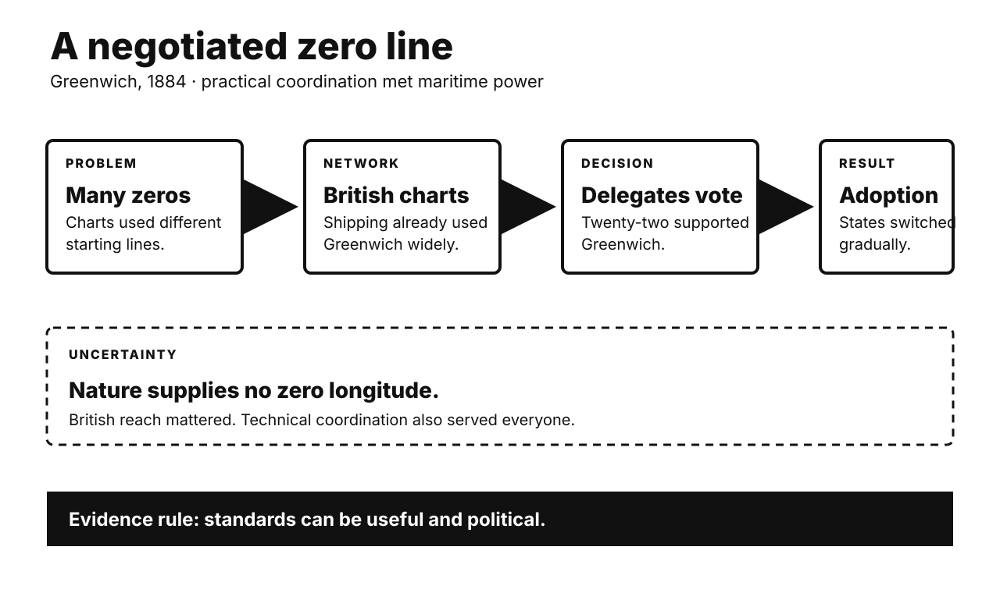

# History Investigation: Lines, war, and disgust

27 September 2026 · Visual edition

Five historical investigations and one Primitive Echo. Each body separates documented fact, interpretation, and uncertainty. Source lists are outside body counts.

## Greenwich: zero longitude was negotiated

**Documented fact.** Longitude needs an agreed starting line. Nature supplies none. Different states once used different meridians. Forty-one delegates met in Washington. They represented twenty-five nations. The conference opened in October 1884. Delegates recommended one global meridian. Greenwich won twenty-two votes. France and Brazil abstained. San Domingo voted against. British charts were already widespread. Much commercial shipping used Greenwich. The resolution simplified navigation and mapping.

**Scholarly interpretation.** Greenwich converted existing power into standards. British maritime reach created network effects. More users made switching cheaper. Agreement also served many states. Shared coordinates reduced practical confusion. The choice was therefore political and useful. It was not scientifically inevitable. Standards often hide negotiated history.

**Uncertainty.** The conference only recommended adoption. National transitions happened gradually. France retained Paris time conventions longer. Greenwich itself later shifted geodetically. Modern zero longitude differs slightly. British dominance did not force every vote. Delegates weighed technical concerns. One cause cannot explain consensus. The line remains conventional. Its utility remains real.

**Sources**

- [Prime Meridian Line — Royal Museums Greenwich](https://www.rmg.co.uk/royal-observatory/attractions/stand-on-prime-meridian-line)
- [Adoption of a Prime Meridian — Royal Observatory Greenwich](https://www.royalobservatorygreenwich.org/articles.php?article=1240)
- [International Meridian Conference (1884) — Greenwich Meridian](https://www.thegreenwichmeridian.org/tgm/articles.php?article=10)

## Napoleon in Egypt: scholarship served invasion

**Documented fact.** Napoleon invaded Egypt in 1798. He brought more than 160 scholars. Engineers and artists joined them. They formed the Institut d’Égypte. Their work covered antiquities and nature. It also covered towns and industry. French soldiers found the Rosetta Stone. The military campaign ultimately failed. Britain acquired the Stone in 1801. French research later filled the Description de l’Égypte. Publication began in 1809.

**Scholarly interpretation.** Science and conquest reinforced each other. Surveying produced valuable knowledge. Knowledge helped administration and prestige. The Description expanded Egyptology. It also framed Egypt for European audiences. Calling the scholars mere looters oversimplifies. Calling them detached researchers also fails. Their extraordinary work depended on invasion. Modern expertise grew inside imperial structures.

**Uncertainty.** Individual motives varied widely. Some pursued genuine discovery. Egyptian scholars retained their own knowledge traditions. European accounts often marginalized them. The expedition did not create Egyptian history. Nor did one artifact decode everything. Champollion worked decades later. British possession followed French defeat. Present ownership debates remain unresolved.

**Sources**

- [Description of Egypt — Library of Congress](https://www.loc.gov/item/2021666110/)
- [Description de l’Égypte — Metropolitan Museum of Art](https://www.metmuseum.org/art/collection/search/591846)
- [Rosetta Stone Collection Record — British Museum](https://www.britishmuseum.org/collection/object/Y_EA24)

## Kellogg–Briand: failed peace, durable law

**Documented fact.** Fifteen states signed in 1928. More joined afterward. They renounced war as policy. They promised peaceful dispute settlement. The pact created no enforcement machinery. Self-defense remained available. Japan invaded Manchuria in 1931. Italy invaded Ethiopia in 1935. Germany invaded Poland in 1939. The pact plainly failed prevention. Nuremberg prosecutors later cited it. They treated aggressive war as illegal.

**Scholarly interpretation.** The treaty was not simply naïve paper. It changed legal vocabulary. Conquest lost accepted legitimacy. Later institutions developed that shift. Nuremberg prosecuted crimes against peace. The UN Charter restricted force further. Yet causal claims remain contested. Law followed power as well. Great powers applied norms selectively. Failure and influence can coexist.

**Uncertainty.** The pact did not cause postwar peace. Nuclear deterrence also mattered. Decolonization changed borders. American power shaped enforcement. Some scholars credit outlawry heavily. Others see retrospective importance. Nuremberg’s legality was disputed. Aggression remains difficult to prosecute. A norm can constrain behavior unevenly. It cannot explain every decline in conquest.

**Sources**

- [Kellogg–Briand Pact, 1928 — U.S. Office of the Historian](https://history.state.gov/milestones/1921-1936/kellogg)
- [Nuremberg Judgment on the Pact — Yale Avalon Project](https://avalon.law.yale.edu/imt/judlawch.asp)
- [Why Have We Criminalized Aggressive War? — Yale Law Journal](https://yalelawjournal.org/article/why-have-we-criminalized-aggressive-war)

## Chile 1973: destabilization is documented

**Documented fact.** Salvador Allende won election in 1970. Nixon ordered covert opposition. CIA programs influenced media and politics. Track II sought to block inauguration. Coup plotting then involved Chilean officers. General Schneider was killed. After Track II failed, covert pressure continued. Economic and diplomatic hostility persisted. Chile’s military overthrew Allende on 11 September 1973. Pinochet’s dictatorship followed.

**Scholarly interpretation.** Declassified records establish American destabilization. Cold War strategy drove it. Nationalization and corporate interests also mattered. Washington helped weaken democratic legitimacy. Chilean actors still made decisive choices. Polarization, inflation, strikes, and institutional conflict mattered. The best account combines external intervention and domestic crisis. Neither cancels the other.

**Uncertainty.** No released document proves Washington commanded the final operation. CIA reporting anticipated coup activity. Knowledge is not operational control. Missing records may remain. Absence cannot prove innocence. Broad claims need precise dates. The 1970 conspiracy differs from 1973. Pinochet’s later crimes remain his regime’s responsibility. American complicity should not erase Chilean agency.

**Sources**

- [Documents on Chile, 1969–1973 — Foreign Relations of the United States](https://history.state.gov/historicaldocuments/frus1969-76ve16)
- [Chile Declassified Documents — National Security Archive](https://nsarchive2.gwu.edu/NSAEBB/NSAEBB8/nsaebb8i.htm)
- [Covert Action in Chile, 1963–1973 — U.S. National Archives](https://www.archives.gov/files/declassification/iscap/pdf/2010-009-doc17.pdf)

## Smallpox: eradication required finding cases

**Documented fact.** WHO launched eradication efforts in 1959. Progress was initially uneven. An intensified program began in 1967. Vaccination remained fundamental. Teams also searched for cases. They isolated patients when possible. Contacts received targeted vaccination. Rewards encouraged reporting. House-to-house searches found hidden outbreaks. This strategy became surveillance-containment. The last natural case appeared in 1977. WHO certified eradication in 1980.

**Scholarly interpretation.** The overlooked technology was information. Vaccines worked only when delivered. Case detection revealed transmission chains. Targeting conserved limited supply. Local workers made global coordination operational. Flexible strategy mattered more than slogans. Eradication joined biology with management. It was neither vaccine-only nor surveillance-only. Their combination broke spread.

**Uncertainty.** Mass vaccination still mattered greatly. Country strategies differed. Surveillance-containment was not invented once. Several teams refined it. Reported cases could be missed. Political cooperation varied. Laboratory stocks remain today. Eradication does not mean zero future risk. Smallpox’s biology also helped. Humans were its only reservoir. Visible symptoms aided detection.

**Sources**

- [History of Smallpox Vaccination — World Health Organization](https://www.who.int/news-room/spotlight/history-of-vaccination/history-of-smallpox-vaccination)
- [Mass Vaccination and Surveillance-Containment — American Journal of Epidemiology](https://pmc.ncbi.nlm.nih.gov/articles/PMC7120753/)
- [Global Smallpox Eradication — U.S. CDC](https://stacks.cdc.gov/view/cdc/27929/cdc_27929_DS1.pdf)

## Primitive Echo: when disgust becomes morality

**Documented fact.** Disgust promotes contaminant avoidance. Many triggers predict infection risk. Researchers call this behavioral immunity. Moral violations can also evoke disgust language. Early experiments induced incidental disgust. Participants sometimes judged acts more harshly. Later replications produced mixed results. A fifty-study meta-analysis found tiny effects. Publication-bias adjustment erased them. Newer reviews preserve the debate.

**Scholarly interpretation.** A protective emotion may be reused socially. Purity metaphors turn wrongdoing into contamination. That can intensify exclusion. Culture teaches which acts feel polluting. Biology supplies no complete moral code. Modern rhetoric exploits bodily language. Describing groups as dirty can make avoidance feel righteous. This mechanism is plausible, not universal.

**Uncertainty.** Pathogen disgust has stronger evidence. Moral spillover has weaker evidence. Correlation does not prove causation. Political attitudes have many causes. Context and personality matter. Some laboratory findings did not replicate. Evolutionary accounts remain inferential. Disgust can follow moral judgment. It need not cause it. Treat visceral certainty as a signal, not a verdict.

**Sources**

- [Disgust as Disease Avoidance — Philosophical Transactions B](https://pmc.ncbi.nlm.nih.gov/articles/PMC3013466/)
- [Incidental Disgust Meta-analysis — PubMed](https://pubmed.ncbi.nlm.nih.gov/26177951/)
- [What Does Disgust Have to Do With Moral Judgment? — PubMed](https://pubmed.ncbi.nlm.nih.gov/41047371/)

---

*WordPress status: unpublished file. Remote website upload is unavailable.*

*Video status and verified specifications appear in manifest.json.*
