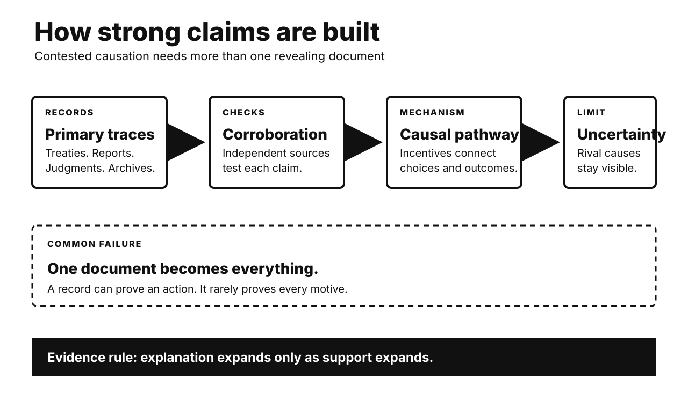

# History Investigation: Bargains, systems, and punishment

27 September 2026 · Visual edition

Five historical investigations and one Primitive Echo. Each body separates documented fact, interpretation, and uncertainty. Source lists are outside body counts.

## Partition: bargaining collapsed before borders appeared

**Documented fact.** Britain’s Cabinet Mission proposed federation in 1946. Provinces would enter three groups. Congress and the Muslim League initially accepted parts. Their interpretations soon diverged. Congress resisted compulsory grouping. Jinnah’s League later withdrew acceptance. It demanded Pakistan again. Communal violence then widened. Mountbatten advanced British withdrawal. Independence came in August 1947. Boundary awards arrived afterward. Millions crossed new borders. Catastrophic violence accompanied migration.

**Scholarly interpretation.** Power mattered for every leadership. Yet a single power-grab story fails. Congress favored a stronger center. The League sought enforceable Muslim safeguards. British officials wanted rapid exit. Provincial interests complicated both positions. Violence narrowed political options. The final settlement emerged through interaction. Bargaining failure amplified distrust. Imperial haste multiplied human costs.

**Uncertainty.** Motives cannot be measured exactly. Jinnah’s preferred endpoint remains debated. Some historians emphasize bargaining leverage. Others stress sincere nationhood. Cabinet Mission success was never assured. Later memoirs protect reputations. Counterfactual unity cannot be proven. Responsibility was distributed unevenly. It was never singular.

**Sources**

- [India Statement by the Cabinet Mission — UK Parliament](https://api.parliament.uk/historic-hansard/lords/1946/may/16/india-statement-by-the-cabinet-mission)
- [Partition of India — Partition Museum](https://www.partitionmuseum.org/partition-of-india)
- [Jinnah on Partition, 4 May 1947 — UK National Archives](https://www.nationalarchives.gov.uk/education/resources/indian-independence/jinnah-partition/)
- [U.S. Assessment of Partition, 1947 — Foreign Relations of the United States](https://history.state.gov/historicaldocuments/frus1947v03/d91)

## Berlin Airlift: currency reform preceded blockade

**Documented fact.** Germany remained under four-power occupation. Berlin also had four sectors. Western zones moved toward economic merger. They introduced a new currency. Western authorities extended it into West Berlin. Soviet authorities objected. They blocked land access in June 1948. Electricity was also restricted. Western aircraft supplied the city. Flights delivered food and coal. They continued for eleven months. The Soviet Union lifted restrictions. The airlift ended afterward.

**Scholarly interpretation.** Currency reform was an immediate trigger. It was not moral equivalence. The blockade targeted civilian supply. Stalin sought political leverage. Western leaders answered without armed convoys. Logistics became strategic communication. Every landing signaled endurance. The crisis also hardened division. Two German states soon emerged.

**Uncertainty.** Intentions remain partly inferred. Soviet records reveal security fears. Western integration was already advancing. Neither side desired general war. Exact causal weights remain disputed. The airlift served propaganda too. Humanitarian benefit was still real. Context explains coercion. It does not excuse it.

**Sources**

- [The Berlin Airlift, 1948–1949 — U.S. Office of the Historian](https://history.state.gov/milestones/1945-1952/berlin-airlift)
- [The Berlin Airlift 1948/49 — Allied Museum](https://www.alliiertenmuseum.de/en/thema/the-berlin-airlift-1948-49/)
- [Report on the Berlin Blockade — UK National Archives](https://www.nationalarchives.gov.uk/education/resources/cold-war-on-file/report-on-blockade-ordered/)

## Bhopal: catastrophe came through a system

**Documented fact.** Water entered a methyl-isocyanate tank. A runaway reaction followed. Toxic gas escaped overnight. It reached nearby settlements. Thousands died immediately or soon. Many more developed lasting illness. Refrigeration was not operating. Other safeguards proved inadequate. Public warnings failed. Emergency information was poor. The plant stored large MIC quantities. Maintenance and staffing had declined.

**Scholarly interpretation.** The disaster resists one-part explanations. A chemical trigger mattered. So did organizational decisions. Cost pressures weakened safety margins. Urban proximity increased exposure. Neighborhood poverty increased vulnerability. Medical uncertainty delayed treatment. Regulation and emergency planning failed. Corporate structure complicated accountability. This was a sociotechnical catastrophe. Hazards became disaster through institutions.

**Uncertainty.** Entry of water is accepted. How it entered remains disputed. Union Carbide alleged sabotage. Many analyses emphasize maintenance failures. Reliable proof of sabotage remains contested. The gas cloud’s composition is debated. Death totals vary substantially. Long-term exposure estimates differ. Uncertainty should not erase established failures.

**Sources**

- [The Bhopal Disaster and Its Aftermath — Environmental Health](https://pmc.ncbi.nlm.nih.gov/articles/PMC1142333/)
- [Mental Health of Bhopal Survivors — Indian Journal of Psychiatry](https://pmc.ncbi.nlm.nih.gov/articles/PMC4361985/)
- [Bhopal Health Effects Review — PubMed](https://pubmed.ncbi.nlm.nih.gov/12641179/)
- [What Caused the Bhopal Gas Tragedy? — Philosophy of Science](https://www.cambridge.org/core/services/aop-cambridge-core/content/view/B0D7836EA17B49296DD5E92DD9FFD698/S0031824800018122a.pdf/what-caused-the-bhopal-gas-tragedy-the-philosophical-importance-of-causal-and-pragmatic-details.pdf)

## Rwanda: genocide was organized, not ancient

**Documented fact.** The genocide began in April 1994. Extremist leaders targeted Tutsi civilians. Moderate Hutu were also murdered. Officials distributed weapons and orders. Militias operated roadblocks. Local leaders mobilized neighbors. RTLM broadcasts promoted persecution. Some broadcasts directly incited killing. UN peacekeepers lacked capacity. The Security Council reduced the force. The Rwandan Patriotic Front ended the genocide. Its forces also committed abuses.

**Scholarly interpretation.** Calling this ancient tribal hatred misleads. Colonial rule had hardened identities. Postcolonial politics deepened exclusion. Yet organized choices activated violence. Administrative reach accelerated participation. Propaganda identified enemies and permission. International retreat reduced deterrence. Structure mattered. Perpetrators still retained agency.

**Uncertainty.** Planning unfolded at several levels. Scholars debate its timing and centralization. Participation motives varied. Fear, coercion, gain, and ideology mixed. Victim totals are estimates. RPF violations require investigation. They do not negate genocide findings. International action might have saved lives. Exact counterfactual numbers remain unknowable.

**Sources**

- [The Rwanda Genocide — U.S. Holocaust Memorial Museum](https://encyclopedia.ushmm.org/content/en/article/the-rwanda-genocide)
- [Three Media Leaders Convicted — UN International Criminal Tribunal for Rwanda](https://unictr.irmct.org/en/news/three-media-leaders-convicted-genocide)
- [Independent Inquiry into UN Actions — UN Digital Library](https://digitallibrary.un.org/record/405039?v=pdf)
- [UNAMIR Background — United Nations Peacekeeping](https://peacekeeping.un.org/sites/default/files/past/unamirFT.htm)

## The NPT: restraint rests on an unequal bargain

**Documented fact.** The treaty opened in 1968. It entered force in 1970. Five states received nuclear-weapon status. The cutoff was January 1967. Other parties promised non-acquisition. Safeguards verify peaceful commitments. Article IV protects peaceful nuclear cooperation. Article VI requires disarmament negotiations. Most countries joined. India, Israel, and Pakistan did not. North Korea announced withdrawal in 2003.

**Scholarly interpretation.** The NPT is not simple prohibition. It embeds a political exchange. Non-nuclear states accept unequal status. In return, they claim technology access. They also expect disarmament progress. Verification raises detection costs. Security alliances also influence restraint. The treaty reinforces a broader system. Its inequality supports and strains compliance.

**Uncertainty.** Causation is hard to isolate. Some states lacked weapons ambitions. Others relied on allies. Enforcement has been selective. Article VI has no deadline. Disarmament progress remains disputed. Peaceful technology can create dual-use capacity. The treaty reduced risks. It never eliminated them.

**Sources**

- [Text of the Nuclear Non-Proliferation Treaty — United Nations](https://www.un.org/en/conf/npt/2015/pdf/text%20of%20the%20treaty.pdf)
- [Treaty on the Non-Proliferation of Nuclear Weapons — IAEA](https://www.iaea.org/publications/documents/treaties/npt)
- [Nuclear Non-Proliferation Treaty — UN Office for Disarmament Affairs](https://disarmament.unoda.org/en/our-work/weapons-mass-destruction/nuclear-weapons/treaty-non-proliferation-nuclear-weapons)

## Primitive Echo: why punishment feels worth paying

**Documented fact.** Experiments create shared-money dilemmas. Participants can punish free riders. Punishment costs the punisher. Many still choose it. Cooperation often rises afterward. Fifteen-population studies found punishment everywhere. Its strength varied greatly. Larger societies showed more third-party punishment. Antisocial punishment also occurs. People sometimes punish cooperators.

**Scholarly interpretation.** Costly punishment may stabilize norms. Groups benefit when cheating carries costs. Reputation can reward enforcers. Institutions can replace personal retaliation. Evolution likely shaped flexible tendencies. Culture supplies targets and limits. Modern outrage uses similar machinery. The same impulse supports boycotts. It also fuels pile-ons. Online punishment is unusually cheap. Visibility multiplies reputational rewards.

**Uncertainty.** Laboratory games simplify life. Small stakes distort choices. Samples differ across societies. Punishment can destroy welfare. It may enforce harmful norms. Evolutionary pathways remain debated. Group selection is not settled. Cooperation has multiple mechanisms. Reciprocity and reputation also matter. Feeling punitive proves no guilt.

**Sources**

- [Reciprocity, Culture and Human Cooperation — Philosophical Transactions B](https://pmc.ncbi.nlm.nih.gov/articles/PMC2689715/)
- [More ‘Altruistic’ Punishment in Larger Societies — Proceedings B](https://pmc.ncbi.nlm.nih.gov/articles/PMC2596817/)
- [The Origins and Psychology of Human Cooperation — Annual Review of Psychology](https://www.annualreviews.org/doi/10.1146/annurev-psych-081920-042106)
- [Costly Punishment Across Human Societies — Science](https://www.science.org/doi/10.1126/science.1127333)

---

*WordPress status: unpublished file. Remote website upload is unavailable.*

*Video status and verified specifications appear in manifest.json.*
