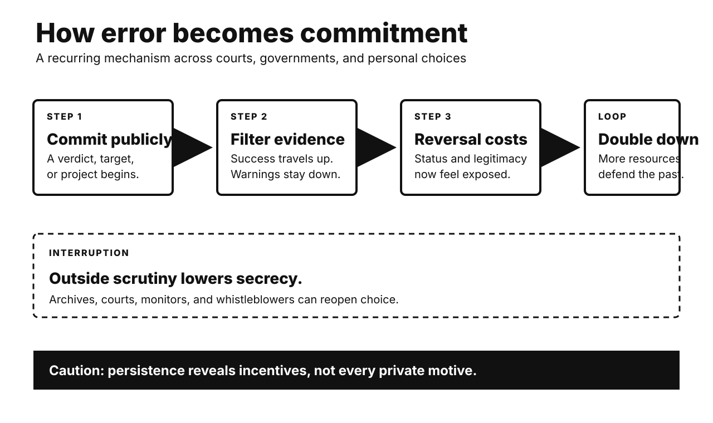

# History Investigation: Files, fear, and persistence

27 September 2026 · Visual edition

Five historical investigations and one Primitive Echo. Each body separates documented fact, interpretation, and uncertainty. Source lists are outside body counts.

## Dreyfus: institutional honor displaced evidence

**Documented fact.** France convicted Captain Alfred Dreyfus in 1894. He was a Jewish officer. Treason evidence centered on handwriting. Judges also received secret material. The defense could not inspect it. Lieutenant Colonel Picquart later found evidence implicating Esterhazy. Senior officers resisted reopening the case. Major Henry forged supporting evidence. His forgery was exposed. Dreyfus faced another conviction in 1899. A presidential pardon followed. France’s highest court fully exonerated him in 1906.

**Scholarly interpretation.** Antisemitism made Dreyfus a plausible target. Institutional loyalty sustained the error. Leaders feared military disgrace. Secrecy protected their earlier judgment. Each defense raised reversal costs. Zola’s intervention widened public scrutiny. The affair became a constitutional struggle. Republican justice confronted nationalist authority.

**Uncertainty.** No single motive explains every actor. Some officers likely believed guilt. Others knowingly concealed contrary evidence. Public camps also changed. The affair influenced Zionist debate. It did not alone create Zionism. Exact effects on French politics remain debated. Exoneration establishes innocence. It cannot reveal every private motive.

**Sources**

- [Dreyfus Military Justice File — French Ministry of Defence](https://www.memoiredeshommes.defense.gouv.fr/recrutement-parcours-individuels/des-hommes-des-vies/dossier-de-justice-militaire-dalfred-dreyfus-dit-dossier-secret)
- [Recognition of Alfred Dreyfus’s Innocence — Cour de cassation](https://www.courdecassation.fr/toutes-les-actualites/2026/07/12/journee-de-commemoration-nationale-de-la-reconnaissance-de)
- [The Dreyfus Affair — National Library of Israel](https://www.nli.org.il/en/discover/judaism/jewish-history/dreyfus-affair)
- [Dreyfus: Engagement and Propaganda — Museum of Jewish Art and History](https://histoiredesarts.culture.gouv.fr/Toutes-les-ressources/Musee-d-Art-et-d-Histoire-du-judaisme/L-affaire-Dreyfus.-Engagement-et-propagande-annexes)

## Iran 1953: foreign action met domestic conflict

**Documented fact.** Prime Minister Mohammad Mosaddeq nationalized oil. Britain resisted losing control. Its officials proposed regime change. The Eisenhower administration approved covert action. CIA and British intelligence supported Zahedi. They funded propaganda and political organization. An initial move failed. Mosaddeq remained temporarily secure. Demonstrations and military action then shifted power. The Shah returned. Eisenhower privately noted American help. Mosaddeq was arrested and tried.

**Scholarly interpretation.** Oil shaped British incentives. Cold War fears shaped Washington. The operation exploited Iranian divisions. Clerics, royalists, officers, crowds, and politicians had agency. Foreign intervention was decisive support. It was not remote mind-control. Domestic conflict made leverage possible. The coup later damaged American legitimacy. It strengthened the Shah’s rule.

**Uncertainty.** Many operational files remain missing. Some were destroyed. Historians debate crowd spontaneity. They also debate constitutional authority. Mosaddeq had accumulated emergency powers. That context does not erase intervention. Precise causal shares remain unknowable. The coup’s contribution to 1979 is plausible. It was not sufficient alone.

**Sources**

- [British Coup Proposal, November 1952 — Foreign Relations of the United States](https://history.state.gov/historicaldocuments/frus1951-54IranEd2/d148)
- [CIA Retrospective on the Coup — Foreign Relations of the United States](https://history.state.gov/historicaldocuments/frus1951-54Iran/d306)
- [Eisenhower Diary on U.S. Help — Foreign Relations of the United States](https://history.state.gov/historicaldocuments/frus1951-54Iran/d328)
- [Iran: Mosaddeq Overthrow, 1953 — National Security Archive](https://nsarchive.gwu.edu/events/iran-mosaddeq-overthrow-1953)

## Great Leap famine: false success became extraction

**Documented fact.** China launched the Great Leap in 1958. Communes reorganized rural life. Labor shifted toward industrial campaigns. Officials announced extraordinary harvests. Many reports were inflated. Procurement targets followed reported output. Actual production then declined. State collection continued. Rural food availability collapsed. Famine spread widely. Policy adjustments came slowly. Millions died before recovery. Exact totals remain disputed.

**Scholarly interpretation.** Information failure became coercive extraction. Local cadres faced promotion pressure. Bad news invited punishment. Inflated numbers moved upward. Grain obligations moved downward. Collective dining and labor diversion also mattered. Weather caused some losses. Policy transformed shortage into catastrophe. Political fear blocked correction. Central ambition and local enforcement interacted.

**Uncertainty.** Chinese archives remain unevenly accessible. Demographic methods produce different totals. Regional experiences varied greatly. Officials sometimes concealed grain. Others protected residents. Natural shocks contributed unevenly. They do not explain the scale alone. Intent to industrialize is documented. Intent to cause mass death is not established. Responsibility still follows foreseeable policy effects.

**Sources**

- [China’s Great Leap Forward, 1958–1961 — Wilson Center Digital Archive](https://digitalarchive.umd.edu/topics/chinas-great-leap-forward-1958-1961)
- [Grain Procurements During the Great Leap Forward — The China Quarterly](https://www.jstor.org/stable/657456)
- [Great Famine Through Documentary Evidence — University of Essex Repository](https://repository.essex.ac.uk/17572/)
- [U.S. Intelligence Assessment, 1961 — Foreign Relations of the United States](https://history.state.gov/historicaldocuments/frus1961-63v22/d17)

## Paperclip: expertise outranked clean accountability

**Documented fact.** American forces captured German technical records. Project Paperclip recruited specialists. The program expanded after 1945. Officials sought military knowledge. They also denied expertise to rivals. Hundreds entered the United States. Many had Nazi Party ties. Personnel dossiers recorded backgrounds. Some recruits worked around V-2 production. Prisoners had endured lethal forced labor there. Screening and immigration created recurring disputes.

**Scholarly interpretation.** Paperclip exposed competing postwar priorities. Punishment confronted strategic advantage. The coming Soviet rivalry accelerated recruitment. Bureaucracies separated technical value from complicity. That division often obscured victims. Yet recruits’ histories differed. Membership, knowledge, and direct crimes were not identical. Individual assessment remains necessary. Collective absolution remains indefensible.

**Uncertainty.** Party membership alone proves limited conduct. Coercion sometimes shaped affiliation. Dossiers may omit crimes. Later accounts can sensationalize. Estimates of implicated recruits vary. Scientific contributions also vary. Rocket development had many sources. Paperclip did not single-handedly create NASA. Soviet recruitment followed parallel incentives. Moral compromise is documented. Its boundaries require case files.

**Sources**

- [Project Paperclip Personnel Dossiers — U.S. National Archives](https://www.archives.gov/iwg/declassified-records/rg-330-defense-secretary)
- [Paperclip Expansion, 1946 — Foreign Relations of the United States](https://history.state.gov/historicaldocuments/frus1946v05/d446)
- [Nazi War Crimes Disclosure Interim Report — U.S. National Archives](https://www.archives.gov/iwg/reports/nazi-war-crimes-interim-report-october-1999)
- [Mittelbau-Dora and Rocket Production — U.S. Holocaust Memorial Museum](https://encyclopedia.ushmm.org/content/en/article/mittelbau-main-camp-in-depth)

## Helsinki 1975: recognition created an accountability tool

**Documented fact.** Thirty-five states signed Helsinki’s Final Act. It was politically binding. It was not a treaty. Signatories affirmed European frontiers. They also accepted human-rights principles. Travel and information appeared too. Western critics feared legitimizing Soviet gains. Soviet leaders valued border stability. Activists later formed Helsinki monitoring groups. They documented violations against signed commitments. Governments raised these records internationally.

**Scholarly interpretation.** The bargain carried asymmetric hopes. Moscow emphasized security recognition. Western governments emphasized cooperation and rights. Dissidents exploited the whole text. Public commitments lowered coordination costs. Shared standards connected local abuses internationally. The document did not cause communism’s collapse. It widened political space. Diplomacy supplied activists with leverage.

**Uncertainty.** States violated many provisions. Monitors faced prison and exile. Strategic pressure mattered alongside norms. Economic stagnation also mattered. Leadership changes mattered later. Counterfactual influence cannot be measured exactly. Some governments used rights selectively. Helsinki’s effect was gradual. Its unintended consequences remain an interpretation. Activist use is documented.

**Sources**

- [Helsinki Final Act — OSCE](https://projects.osce.org/helsinki-final-act)
- [Helsinki Final Act, 1975 — U.S. Office of the Historian](https://history.state.gov/milestones/1969-1976/helsinki)
- [Our History: The Helsinki Process — OSCE](https://www.osce.org/history)
- [Helsinki Final Act Text — University of Minnesota Human Rights Library](https://hrlibrary.umn.edu/osce/new/FINALACT.htm)

## Primitive Echo: why quitting feels like wasting

**Documented fact.** Sunk costs cannot be recovered. Rational choice ignores them. Experiments show frequent persistence. People continue after prior investment. Money can trigger it. Time and effort can too. Meta-analysis finds a real effect. Its size varies by design. Mice and rats also persist. Cross-species tasks show parallels. Other animal findings remain inconsistent.

**Scholarly interpretation.** Persistence usually serves survival. Abandoning every difficult pursuit would waste learning. Effort can signal future value. Modern environments sometimes break that link. Past investment then distorts forecasts. Self-justification adds pressure. Reputation adds another. Organizations escalate failing projects. Individuals keep unused subscriptions. The ancient rule becomes misapplied.

**Uncertainty.** No single evolutionary account prevails. Animal tasks may measure waiting. Human scenarios may measure reputation. Loss aversion offers another mechanism. Learned persistence may suffice. Culture changes self-justification. Not every continuation is irrational. New information can favor staying. Ask one clean question: which future option now pays better?

**Sources**

- [Sunk-Cost Effect Across Species — PubMed](https://pubmed.ncbi.nlm.nih.gov/27151560/)
- [Sunk-Cost Effect Meta-analysis — Business Research](https://link.springer.com/article/10.1007/s40685-014-0014-8)
- [Sensitivity to Sunk Costs in Mice, Rats, and Humans — Science](https://pmc.ncbi.nlm.nih.gov/articles/PMC6377599/)
- [Sunk Cost in Pigeons and Humans — Journal of the Experimental Analysis of Behavior](https://pmc.ncbi.nlm.nih.gov/articles/PMC1193697/)

---

*WordPress status: unpublished file. Remote website upload is unavailable.*

*Video status and verified specifications appear in manifest.json.*
