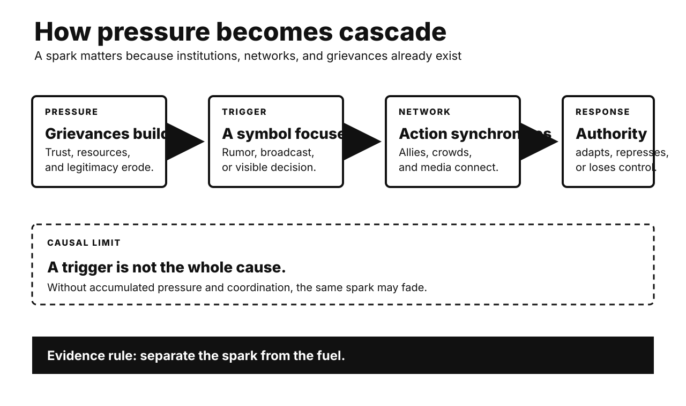

# History Investigation: Allies, sparks, and cascades

27 September 2026 · Visual edition

Five historical investigations and one Primitive Echo. Each body separates documented fact, interpretation, and uncertainty. Source lists are outside body counts.

## Tenochtitlan: conquest depended on Indigenous allies

**Documented fact.** Cortés entered Mexico in 1519. His Spanish force was small. Translators enabled negotiation. Tlaxcalans first fought the newcomers. They later became crucial allies. Other Indigenous communities joined too. Many opposed Mexica demands. Smallpox spread during 1520. It killed residents and leaders. A coalition besieged Tenochtitlan in 1521. Brigantines controlled lake movement. Causeways restricted supplies. The city fell after brutal fighting.

**Scholarly interpretation.** The conquest was not Spaniards alone. It became an Indigenous civil war. Spaniards supplied leadership and technology. Local rivalries supplied mass forces. Disease weakened every defense. Coalition partners pursued their own goals. They did not foresee colonial rule. Agency and exploitation coexisted.

**Uncertainty.** Numbers vary sharply. Spanish accounts justified conquerors. Later Indigenous records had colonial constraints. Alliance motives differed by town. Disease was crucial, not sufficient. Weapons offered advantages, not inevitability. Mexica political dominance created enemies. That does not legitimize invasion. No single factor explains collapse.

**Sources**

- [Mexican America: Conquest and Indigenous Allies — Smithsonian](https://www.si.edu/spotlight/mexican-america/history)
- [The Fall of Tenochtitlan — Origins, Ohio State University](https://origins.osu.edu/milestones/fall-tenochtitlan)
- [Narrative Letter by Hernán Cortés — Library of Congress](https://www.loc.gov/item/2021666768/)
- [Florentine Codex as a Primary Source — American Historical Association](https://www.historians.org/resource/primary-sources-used-in-this-project/)

## India 1857: cartridges ignited accumulated grievances

**Documented fact.** Indian soldiers served Company armies. New rifle cartridges required biting. Rumors alleged cow and pig grease. These threatened Hindu and Muslim practice. Company changes came too late. Soldiers mutinied at Meerut. Rebels entered Delhi in May 1857. Some rulers and civilians joined. Fighting spread unevenly across northern India. Other regions stayed quiet. Many Indian troops remained loyal. Britain suppressed the uprising violently. Crown rule replaced Company government.

**Scholarly interpretation.** Cartridges acted as a spark. Older grievances supplied fuel. Annexations displaced ruling families. Revenue demands disrupted landholders. Service rules offended soldiers. Missionary activity increased religious fears. Rebels pursued different futures. Shared opposition did not create one program. Calling it only mutiny narrows history. Calling it one national war also simplifies.

**Uncertainty.** Motives varied by region. British sources often racialized rebels. Nationalist accounts can impose later unity. Atrocity occurred on both sides. Colonial reprisals were extensive. Precise deaths remain uncertain. Religious rumor carried political meaning. Cartridge composition mattered less than distrust. Counterfactual reforms might not have prevented revolt.

**Sources**

- [Why Did the Indian Rebellion Happen? — National Army Museum](https://www.nam.ac.uk/explore/why-did-indian-mutiny-happen)
- [India 1857 — UK National Archives](https://www.nationalarchives.gov.uk/education/teachers/professional-development/project-resources/roehampton-ma-resources/india-1857/)
- [Why Did Indian People Rebel? — UK National Archives](https://cdn.nationalarchives.gov.uk/documents/education/india1857.pdf)
- [Decisive Events of 1857 — National Army Museum](https://www.nam.ac.uk/explore/decisive-events-indian-mutiny)

## Abolition 1807: morality needed organization and power

**Documented fact.** Britain dominated slave trafficking earlier. Abolitionists organized nationally. Black writers exposed enslavement directly. Olaudah Equiano became influential. Petitioning reached Parliament repeatedly. Consumers boycotted slave-grown sugar. Earlier abolition motions failed. Parliament banned British trafficking in 1807. Enslavement inside colonies continued. Emancipation came only in 1833. Enslavers received compensation. Enslaved people received none. Naval patrols later intercepted some ships.

**Scholarly interpretation.** Moral mobilization mattered enormously. Organization converted feeling into votes. Black abolitionists shaped public knowledge. Quaker networks sustained campaigning. Wartime politics altered commercial interests. Naval dominance enabled enforcement. Britain also gained diplomatic leverage. Humanitarian and strategic incentives coexisted. Self-interest does not erase activism. Activism alone cannot explain timing.

**Uncertainty.** Historians debate economic decline’s role. Profitability varied by trade. Enforcement remained incomplete. Illegal trafficking continued. Naval patrols sometimes caused deaths. Abolition did not end coerced labor. British commemoration can hide prior leadership in trafficking. It can also ignore African resistance. Causal weights remain contested. The legislative sequence is clear.

**Sources**

- [Parliament and the British Slave Trade — UK Parliament](https://www.parliament.uk/slavetrade/)
- [Parliament Abolishes the Slave Trade — UK Parliament](https://www.parliament.uk/about/living-heritage/transformingsociety/tradeindustry/slavetrade/overview/parliament-abolishes-the-slave-trade/)
- [Abolition Campaign Arguments — UK Parliament](https://www.parliament.uk/about/living-heritage/transformingsociety/tradeindustry/slavetrade/overview/abolition-campaign-the-arguements/)
- [Slave-Trade Abolition Bill Debate, 1807 — Hansard](https://api.parliament.uk/historic-hansard/commons/1807/feb/27/slave-trade-abolition-bill)

## Haber–Bosch: fertilizer and explosives shared chemistry

**Documented fact.** Plants need usable nitrogen. Natural nitrate supplies were limited. Fritz Haber synthesized ammonia from gases. Carl Bosch scaled the reaction industrially. BASF opened production in 1913. Ammonia enabled artificial fertilizer. It also enabled nitric acid. That acid supplied explosives. Wartime blockade cut Chilean nitrate imports. German factories replaced them synthetically. Haber also led poison-gas work. Bosch later questioned wartime outcomes.

**Scholarly interpretation.** The process transformed global agriculture. Higher nitrogen inputs expanded yields. It also separated warfare from nitrate geography. Industrial chemistry served food and state power. Calling the invention good or evil misses infrastructure. Uses depended on institutions. Haber's personal military role adds another layer. Scientific achievement and moral responsibility can coexist.

**Uncertainty.** Claims that fertilizer feeds half humanity use models. Exact shares change over time. Synthetic nitrogen also damages ecosystems. It contributes greenhouse emissions. Germany’s war duration had many causes. Ammonia was important, not sufficient. Haber and Bosch held different responsibilities. Innovation cannot predict every later use. It still creates foreseeable choices.

**Sources**

- [Fritz Haber Biography — Nobel Prize](https://www.nobelprize.org/prizes/chemistry/1918/haber/biographical/)
- [Carl Bosch Facts — Nobel Prize](https://www.nobelprize.org/prizes/chemistry/1931/bosch/facts/)
- [Fritz Haber — Science History Institute](https://www.sciencehistory.org/education/scientific-biographies/fritz-haber/)
- [Carl Bosch and Industrial Ammonia — Max Planck Society](https://www.mpg.de/8241495/carl-bosch)

## Berlin Wall: a mistaken answer triggered a cascade

**Documented fact.** East Germans demanded freer travel. Many exited through neighboring countries. Mass demonstrations expanded during 1989. Soviet leaders rejected military rescue. East German officials drafted new travel rules. Günter Schabowski briefed reporters on 9 November. He lacked full implementation details. Asked when rules began, he said immediately. Television spread that answer. Crowds reached Berlin checkpoints. Guards lacked clear orders. At Bornholmer Strasse, they opened barriers. Other crossings followed.

**Scholarly interpretation.** The announcement was a trigger. It was not the whole cause. Protest eroded regime authority. Emigration exposed policy failure. Soviet restraint changed coercive expectations. Live media synchronized citizens. Crowds created an operational dilemma. Guards chose de-escalation. A planned reform became an uncontrolled opening. Political weakness became visible instantly.

**Uncertainty.** Schabowski’s exact understanding remains debated. Officials intended liberalization, not that evening’s opening. No single guard toppled the regime. Violence remained possible. Several checkpoints made separate choices. Western pressure mattered indirectly. Eastern European reforms mattered too. German reunification was not predetermined. The Wall’s opening accelerated it.

**Sources**

- [9 November 1989 — German Federal Government](https://www.bundesregierung.de/breg-en/service/archive/archive/9-november-a-historically-signficant-date-411370)
- [Fall of the Berlin Wall Documents — National Security Archive](https://nsarchive2.gwu.edu/NSAEBB/NSAEBB490/)
- [The Berlin Wall, 1961–1989 — U.S. Office of the Historian](https://history.state.gov/milestones/1961-1968/berlin-wall)

## Primitive Echo: why crowds can delay helping

**Documented fact.** Classic experiments found less helping in groups. Responsibility appeared to diffuse. People also watched other observers. Calm faces reduced perceived urgency. This is pluralistic ignorance. Later meta-analysis confirmed an average effect. Context strongly changed it. Dangerous events reduced the inhibition. Some real violent incidents showed high intervention rates. Friends and coordinated groups help differently.

**Scholarly interpretation.** Watching others is normally efficient. Group cues help classify uncertainty. Shared vigilance once reduced false alarms. Modern strangers provide weaker signals. Everyone can mistake caution for knowledge. Responsibility also becomes ambiguous. The result is collective hesitation. Clear assignments interrupt it. Naming one helper restores ownership.

**Uncertainty.** Evolutionary explanations remain inferential. Laboratory emergencies are artificial. Camera studies miss private decisions. Intervention can increase risk. Group presence sometimes helps. Dangerous clarity can mobilize people. Relationship strength matters. Culture and training matter too. The popular Genovese story was oversimplified. The effect remains conditional, not universal.

**Sources**

- [Bystander-Effect Meta-analysis — PubMed](https://pubmed.ncbi.nlm.nih.gov/21534650/)
- [Public Violence and Bystander Intervention — PubMed](https://pubmed.ncbi.nlm.nih.gov/31359450/)
- [A Century of Pluralistic Ignorance — Frontiers in Social Psychology](https://www.frontiersin.org/journals/social-psychology/articles/10.3389/frsps.2023.1260896/full)
- [Bystander Intervention Guidance — American Psychological Association](https://www.apa.org/pi/health-equity/bystander-intervention)

---

*WordPress status: unpublished file. Remote website upload is unavailable.*

*Video status and verified specifications appear in manifest.json.*
