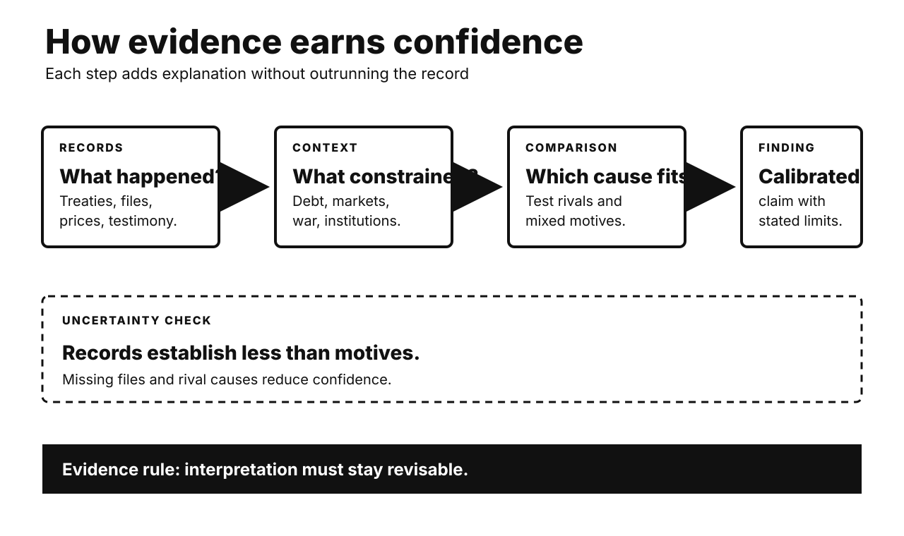

# History Investigation: Debt, borders, and ownership

27 September 2026 · Visual edition

Five historical investigations and one Primitive Echo. Each body separates documented fact, interpretation, and uncertainty. Source lists are outside body counts.

## Louisiana Purchase: Haiti changed Napoleon’s calculation

**Documented fact.** Jefferson wanted secure Mississippi access. France controlled Louisiana again. Napoleon also sought Caribbean empire. Saint-Domingue was its center. France sent a major expedition. Haitian forces resisted fiercely. Disease devastated French troops. France lost the colony. War with Britain resumed. Louisiana became harder to defend. Napoleon offered the entire territory. American envoys exceeded instructions. They accepted for $15 million.

**Scholarly interpretation.** The purchase was not inevitable. Haitian victory altered French strategy. It weakened Napoleon’s American project. European war raised cash needs. British naval power increased risk. American credit enabled quick agreement. Jefferson’s diplomacy still mattered. So did Indigenous dispossession afterward. A celebrated bargain had wider makers.

**Uncertainty.** Napoleon left no single motive. Historians weigh several pressures. Haiti was crucial, not solitary. British threats mattered too. So did financial calculation. American negotiators were genuinely surprised. The treaty did not settle sovereignty. Indigenous nations never broadly consented. Later expansion exceeded the purchase itself.

**Sources**

- [The United States and the Haitian Revolution — U.S. Office of the Historian](https://history.state.gov/milestones/1784-1800/haitian-rev)
- [Napoleonic Wars and the United States — U.S. Office of the Historian](https://history.state.gov/milestones/1801-1829/napoleonic-wars)
- [Louisiana Purchase, 1803 — U.S. Office of the Historian](https://history.state.gov/milestones/1801-1829/louisiana-purchase)
- [Louisiana Purchase Treaty — U.S. National Archives](https://www.archives.gov/milestone-documents/louisiana-purchase-treaty)

## French Revolution: hunger activated a fiscal crisis

**Documented fact.** France carried heavy war debts. Debt service consumed royal revenue. Privileged groups resisted broader taxation. Regional courts blocked reforms. Louis XVI summoned the Estates-General. That opened representation disputes. Meanwhile, the 1788 harvest failed. Grain prices rose sharply. Bread dominated ordinary diets. Crowds attacked suppliers and officials. The Bastille fell during July 1789. Rural uprisings followed that summer.

**Scholarly interpretation.** Hunger explains urgency, not everything. Fiscal weakness constrained relief. Tax privilege damaged legitimacy. Institutional deadlock politicized finance. Enlightenment arguments widened expectations. The Estates-General created collective opportunity. Environmental stress activated existing conflict. Food markets linked households and government. Material and political crises reinforced each other.

**Uncertainty.** No variable caused revolution alone. France had survived earlier shortages. Drought effects varied regionally. Bread riots were not automatically republican. Elite conflict preceded mass revolt. Popular action then changed outcomes. The famous cake quotation lacks evidence. It distracts from institutions. Causal emphasis still divides historians.

**Sources**

- [The Long and Short Reasons for Revolution — Swansea University](https://www.swansea.ac.uk/history/history-study-guides/the-long-and-short-reasons-for-why-revolution-broke-out-in-france-in-1789/)
- [Social Causes of Revolution — George Mason University](https://revolution.chnm.org/exhibits/show/liberty--equality--fraternity/social-causes-of-revolution)
- [Drought, Peasant Uprisings, and Demand — Journal of Economic Growth](https://link.springer.com/article/10.1007/s10887-023-09230-y)

## Panama 1903: independence and canal power intertwined

**Documented fact.** Panama belonged to Colombia. Separatist movements already existed. A canal promised major revenue. Colombia rejected a canal treaty. Panamanian conspirators sought American support. U.S. warships deterred Colombian movement. Panama declared independence in November 1903. Washington recognized it quickly. Philippe Bunau-Varilla represented Panama abroad. He was French, not Panamanian. His treaty granted extensive American control. Panama received payment and protection.

**Scholarly interpretation.** Independence had genuine local support. American power changed its feasibility. Roosevelt wanted rapid canal construction. Investors also protected concessions. Bunau-Varilla’s role compressed Panamanian bargaining. The treaty resembled unequal sovereignty. Yet describing Panama as invented erases local agency. Strategic coercion and separatism coexisted.

**Uncertainty.** Support levels are hard measuring. Colombian forces faced logistics too. U.S. intervention was still decisive. Separatists held varied motives. Later Panamanian ratification gave legality. It did not erase imbalance. Panamanians repeatedly challenged the arrangement. The 1977 treaties eventually transferred control.

**Sources**

- [Building the Panama Canal, 1903–1914 — U.S. Office of the Historian](https://history.state.gov/milestones/1899-1913/panama-canal)
- [Hay–Bunau-Varilla Treaty Text — U.S. Foreign Relations](https://history.state.gov/historicaldocuments/frus1904/d542)
- [Panama Canal and Torrijos–Carter Treaties — U.S. Office of the Historian](https://history.state.gov/milestones/1977-1980/panama-canal)

## Mau Mau files: archives changed public accountability

**Documented fact.** Britain declared Kenya’s Emergency in 1952. Colonial forces detained many Kenyans. Screening sought Mau Mau supporters. Survivors later alleged torture. Litigation forced deeper archive searches. Officials located migrated colonial records. They had been retained in Britain. National Archives series FCO 141 documents them. A 2012 ruling allowed claims forward. Britain settled in 2013. It recognized torture and ill-treatment. Compensation covered 5,228 claimants. A memorial also followed.

**Scholarly interpretation.** Archives altered the power balance. Survivor testimony already carried evidence. Retained files strengthened corroboration. Bureaucratic records exposed institutional knowledge. Litigation made preservation politically consequential. The case challenged tidy decolonization narratives. It also showed delayed disclosure costs. Accountability came through testimony, archives, and law together.

**Uncertainty.** Settlement admitted abuses broadly. It was not full adjudication. Liability questions remained contested. Records are incomplete and colonial. Many victims never claimed. Mau Mau violence also occurred. That does not excuse state torture. Archive discovery cannot recover every experience. Exact detention and death totals vary.

**Sources**

- [Mau Mau Claims Settlement — UK Parliament](https://hansard.parliament.uk/commons/2013-06-06/debates/13060646000005/MauMauClaims%28Settlement%29)
- [Settlement Statement — GOV.UK](https://www.gov.uk/government/news/statement-to-parliament-on-settlement-of-mau-mau-claims)
- [Mau Mau Screening Record, FCO 141 — UK National Archives](https://discovery.nationalarchives.gov.uk/details/r/C13298973)
- [Colonies and Dependencies Records — UK National Archives](https://www.nationalarchives.gov.uk/help-with-your-research/research-guides/colonies-dependencies-further-research)

## 1973 oil shock: embargo met existing vulnerability

**Documented fact.** Arab producers acted during war. OAPEC embargoed selected supporters. Production cuts also followed. Oil prices rose dramatically. American gasoline lines became visible. The embargo ended during March 1974. Yet energy strain preceded October. American production had peaked earlier. Import dependence was growing. Global demand was strong. Inflation already troubled policymakers. Price controls distorted domestic allocation. The shock deepened recession and inflation.

**Scholarly interpretation.** The embargo was a catalyst. Market tightening increased producer leverage. National pricing systems shaped shortages. Dollar devaluation affected oil income. Political signaling influenced expectations. Later institutions addressed vulnerability. Strategic reserves expanded. Energy efficiency gained support. Consumer coordination became permanent. Geopolitics and market structure interacted.

**Uncertainty.** Economists dispute recession channels. Monetary policy also mattered. So did wage dynamics. Quantifying each contribution remains difficult. The embargo did not remove all imports. Global fungibility weakened targeting. Price increases outlasted restrictions. Calling everything an embargo effect oversimplifies. Denying its importance also misleads.

**Sources**

- [Oil Embargo, 1973–1974 — U.S. Office of the Historian](https://history.state.gov/milestones/1969-1976/oil-embargo)
- [Oil Shock of 1973–74 — Federal Reserve History](https://www.federalreservehistory.org/essays/oil-shock-of-1973-74)
- [Historical Oil Shocks — NBER](https://www.nber.org/papers/w16790)

## Primitive Echo: ownership changes perceived value

**Documented fact.** Classic experiments assigned simple objects. Owners demanded higher selling prices. Buyers offered less. Repeated markets did not erase gaps. Researchers called this endowment effect. Loss aversion became one explanation. Later experiments changed instructions carefully. Some valuation gaps then disappeared. Other studies still found asymmetries. Choice uncertainty can also widen gaps. Familiar markets sometimes reduce them.

**Scholarly interpretation.** Possession creates a reference point. Giving up feels like loss. Earlier humans guarded scarce resources. Ownership signals may deter conflict. These evolutionary ideas remain hypotheses. Modern value also comes socially. Identity attaches to possessions. Memory strengthens attachment. Clear comparison and practice can weaken bias. Markets teach alternative reference points.

**Uncertainty.** The effect is not universal. Procedures strongly affect results. Confusion can imitate loss aversion. Cultural variation needs more study. High-value choices differ from mugs. Evolutionary stories are difficult testing. Ownership rules are historically variable. The safest claim stays behavioral: possession often shifts valuation. Mechanisms remain contested.

**Sources**

- [Experimental Tests of the Endowment Effect — Journal of Political Economy](https://web.mit.edu/curhan/www/docs/Articles/15341_Readings/Behavioral_Decision_Theory/Kahneman_et_al_1990_Experimental_tests.pdf)
- [Endowment Effect, Loss Aversion, and Status Quo Bias — American Economic Association](https://www.aeaweb.org/articles?id=10.1257%2Fjep.5.1.193)
- [Valuation Gaps and Experimental Procedures — American Economic Association](https://pubs.aeaweb.org/doi/10.1257/0002828054201387)
- [Choice Uncertainty and the Endowment Effect — Scientific Reports](https://pmc.ncbi.nlm.nih.gov/articles/PMC9200560/)

---

*WordPress status: unpublished file. Remote website upload is unavailable.*

*Video status and verified specifications appear in manifest.json.*
