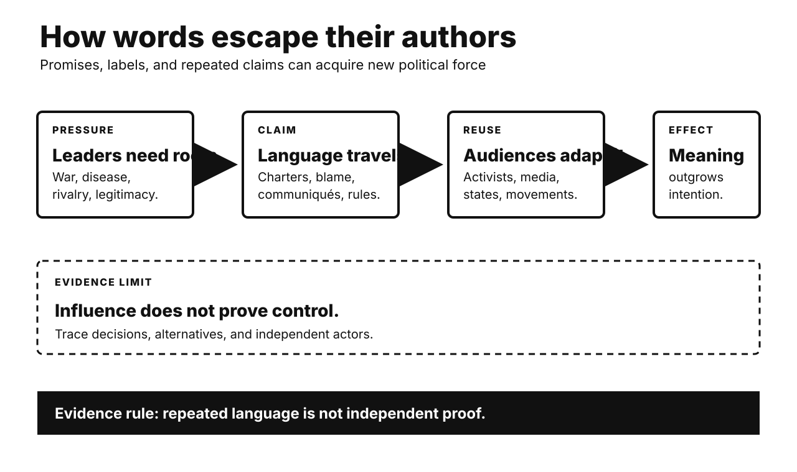

# History Investigation: Promises, pressure, and repetition

27 September 2026 · Visual edition

Five historical investigations and one Primitive Echo. Each body separates documented fact, interpretation, and uncertainty. Source lists are outside body counts.

## Atlantic Charter: universal language met imperial limits

**Documented fact.** Roosevelt and Churchill met secretly. Their August 1941 charter listed principles. It rejected territorial aggrandizement. It endorsed chosen government. It promised restored sovereign rights. Britain still ruled vast colonies. Churchill soon narrowed application. He emphasized Nazi-occupied European nations. American diplomats recorded Indian discontent. Colonial activists nevertheless cited the charter. Allied governments later adopted its language. The charter influenced United Nations planning.

**Scholarly interpretation.** The document served wartime strategy. It advertised moral distinction from fascism. Roosevelt also challenged imperial trade preferences. Churchill protected imperial authority. Their ambiguity produced wider political leverage. Anticolonial movements repurposed Allied language. A limited declaration became vocabulary for claims. Promises can empower unintended audiences.

**Uncertainty.** The charter was not binding. Roosevelt’s colonial intentions were inconsistent. Churchill’s position also evolved slowly. Independence movements predated 1941. The charter did not create them. It supplied international legitimacy. War weakened European empires independently. Decolonization followed different local paths. Rhetorical influence remains difficult measuring.

**Sources**

- [Atlantic Charter Text — Yale Avalon Project](https://avalon.law.yale.edu/wwii/atlantic.asp)
- [Atlantic Conference and Charter — U.S. Office of the Historian](https://history.state.gov/milestones/1937-1945/atlantic-conf)
- [Churchill Statement and Indian Discontent — U.S. Foreign Relations](https://history.state.gov/historicaldocuments/frus1941v03/d137)
- [The Atlantic Charter — FDR Presidential Library](https://www.fdrlibrary.org/atlantic-charter)

## Japan’s surrender: two shocks disrupted strategy

**Documented fact.** Japan faced blockade and bombing. Leaders remained divided during 1945. America demanded surrender at Potsdam. Hiroshima was bombed August 6. The Soviet Union declared war August 8. Soviet armies invaded Manchuria. Nagasaki was bombed August 9. Japan’s council still deadlocked. Emperor Hirohito intervened twice. Japan announced surrender August 15. The imperial institution ultimately survived occupation.

**Scholarly interpretation.** Atomic destruction created unprecedented pressure. Soviet entry closed another option. Tokyo had sought Soviet mediation. Invasion threatened continental positions. It also raised partition fears. These shocks worked together. Existing military defeat framed both. The emperor’s intervention resolved deadlock. Single-cause stories obscure institutional decisions.

**Uncertainty.** Historians dispute causal weights. Japanese records support multiple readings. Leaders mentioned bombs and Soviets. Counterfactual surrender timing is unknowable. American invasion forecasts varied. Soviet plans had independent motives. The bombs killed civilians massively. Explaining decisions does not justify them. Moral and causal questions differ.

**Sources**

- [Atomic Bombings and Japan’s Surrender — National Security Archive](https://nsarchive.gwu.edu/briefing-book/nuclear-vault/2025-08-05/atomic-bombings-japan-and-end-world-war-ii-80-years-later)
- [Soviet Offensives of August 1945 — Truman Presidential Library](https://www.trumanlibrary.gov/public/Manchuria_DocumentSet.pdf)
- [Decision to Drop the Atomic Bomb — Truman Presidential Library](https://www.trumanlibrary.gov/education/presidential-inquiries/decision-drop-atomic-bomb)
- [Understanding the Bomb and Surrender — JSTOR](https://www.jstor.org/stable/24912295)

## Indonesia 1965: foreign support met domestic violence

**Documented fact.** Officers were killed September 1965. The army blamed Indonesia’s Communist Party. General Suharto gained command. Soldiers and allied groups attacked alleged communists. Killings spread across regions. Detention also became massive. Death estimates vary widely. U.S. diplomats reported executions contemporaneously. Washington welcomed the army’s campaign. American aid supported military operations. Sukarno lost power gradually. Suharto established authoritarian rule.

**Scholarly interpretation.** Domestic actors organized the violence. Local rivalries shaped victim selection. Army coordination mattered centrally. Cold War support reduced external constraints. American officials viewed outcomes strategically. Anti-communism enabled political realignment. Foreign backing was consequential, not controlling. Indonesia was not merely manipulated. Internal and international incentives intersected.

**Uncertainty.** Exact deaths remain unknown. Regional patterns differed substantially. Records are incomplete. Some remain classified. Claims about specific name lists remain debated. Declassified cables clearly show knowledge. They also show encouragement and assistance. They do not prove total American direction. Indonesian responsibility remains primary.

**Sources**

- [U.S. Embassy Files on Indonesia’s Mass Killings — National Security Archive](https://nsarchive.gwu.edu/briefing-book/indonesia/2017-10-17/indonesia-mass-murder-1965-us-embassy-files)
- [Indonesia Documents, 1964–1968 — U.S. Foreign Relations](https://history.state.gov/historicaldocuments/frus1964-68v26)
- [Indonesia: U.S. Documents Released — Human Rights Watch](https://www.hrw.org/news/2017/10/18/indonesia-us-documents-released-1965-66-massacres)

## AIDS activism: patients became research participants

**Documented fact.** AIDS deaths rose rapidly. Treatments remained severely limited. FDA approved AZT in 1987. Access costs were high. ACT UP formed that year. Members studied virology and regulation. They protested FDA policies nationally. Activists demanded faster access. They also challenged exclusionary trials. Agencies created expanded-access pathways. FDA established accelerated approval in 1992. Surrogate endpoints enabled earlier decisions. Later therapies transformed survival.

**Scholarly interpretation.** Activism was not anti-science. It contested research governance. Patients supplied experiential knowledge. Technical fluency increased negotiating power. Protest created urgency. Insider meetings redesigned proposals. Regulators balanced speed and evidence. This changed patient participation broadly. AIDS politics reshaped medical citizenship.

**Uncertainty.** Activists held diverse positions. Agencies were already adapting. Drug companies also pursued reform. Accelerated approval carries real risks. Surrogate endpoints can mislead. Early access may complicate trials. Later success involved many actors. Activism was influential, not solitary. Benefits varied across communities.

**Sources**

- [Clinical Research and Drug Regulation — National Academies / NIH Bookshelf](https://www.ncbi.nlm.nih.gov/books/NBK234563/)
- [Seize Control of the FDA — ACT UP Oral History Project](https://www.actuporalhistory.org/actions/seize-control-of-the-fda)
- [FDA’s HIV/AIDS Role — U.S. Food and Drug Administration](https://www.fda.gov/about-fda/fda-history-exhibits/history-fdas-role-preventing-spread-hivaids)
- [Accelerated Approval — U.S. Food and Drug Administration](https://www.fda.gov/patients/fast-track-breakthrough-therapy-accelerated-approval-priority-review/accelerated-approval)

## Nixon in China: ideology yielded to strategic balance

**Documented fact.** Washington recognized Taiwan’s government. China and America lacked relations. China’s Soviet alliance had fractured. Border fighting erupted in 1969. Nixon signaled possible engagement. Pakistan carried private messages. Kissinger visited secretly during 1971. Nixon arrived in February 1972. He met Mao and Zhou. The Shanghai Communiqué listed sharp disagreements. Both opposed regional hegemony. Taiwan language remained deliberately different. Full normalization waited until 1979.

**Scholarly interpretation.** This was not ideological conversion. Strategic geometry changed incentives. Beijing feared Soviet pressure. Washington sought leverage globally. Vietnam negotiations mattered too. Nixon’s anti-communist standing reduced domestic costs. Ambiguous wording postponed impossible agreement. Ceremony advertised a new balance. Rivalry made limited cooperation rational.

**Uncertainty.** Triangular pressure was not everything. Trade interests remained modest initially. Domestic Chinese politics mattered. Nixon’s electoral incentives also mattered. Beijing and Washington interpret Taiwan differently. The communiqué recorded divergence rather than settlement. Later cooperation was not predetermined. Rapprochement survived Watergate nonetheless.

**Sources**

- [Shanghai Communiqué — U.S. Foreign Relations](https://history.state.gov/historicaldocuments/frus1969-76v17/d203)
- [Kissinger’s Secret Trip to China — National Security Archive](https://nsarchive2.gwu.edu/NSAEBB/NSAEBB66/)
- [Nixon’s China Visit and Joint Communiqué — Chinese Foreign Ministry](https://www.mfa.gov.cn/eng/zy/wjls/3604_665547/202405/t20240531_11367541.html)

## Primitive Echo: repetition can feel like truth

**Documented fact.** Experiments began during the 1970s. Participants rated repeated statements truer. Later studies replicated the pattern. Researchers call it illusory truth. Repetition increases processing fluency. Familiar claims feel easier. The effect reaches news headlines. Prior knowledge offers incomplete protection. More repetitions can strengthen belief. Delays can reduce effects. Warnings help inconsistently. Study designs remain mostly laboratory-based.

**Scholarly interpretation.** Familiarity is normally useful. Repeated signals often reflect social importance. Shared information supports cultural learning. Efficient minds reuse recognition cues. Modern media can exploit this shortcut. Automated feeds multiply exposure. Source memory also fades. Fluency then masquerades as corroboration. Repeating corrections may carry risk.

**Uncertainty.** Adaptive explanations remain inferential. Repetition is not always persuasive. Strong beliefs can resist it. Attention and coherence matter. Most studies use short claims. Real information environments are noisier. Recent meta-analysis supports an average effect. Its size varies substantially. Verification can interrupt familiarity.

**Sources**

- [Frequency and Referential Validity — Journal of Verbal Learning and Verbal Behavior](https://www.sciencedirect.com/science/article/pii/S0022537177800121)
- [Illusory Truth Review — PubMed](https://pubmed.ncbi.nlm.nih.gov/38113667/)
- [Illusory Truth Systematic Map — PubMed Central](https://pmc.ncbi.nlm.nih.gov/articles/PMC9166874/)
- [Prior Exposure and Fake News — PubMed Central](https://pmc.ncbi.nlm.nih.gov/articles/PMC6279465/)

---

*WordPress status: unpublished file. Remote website upload is unavailable.*

*Video status and verified specifications appear in manifest.json.*
