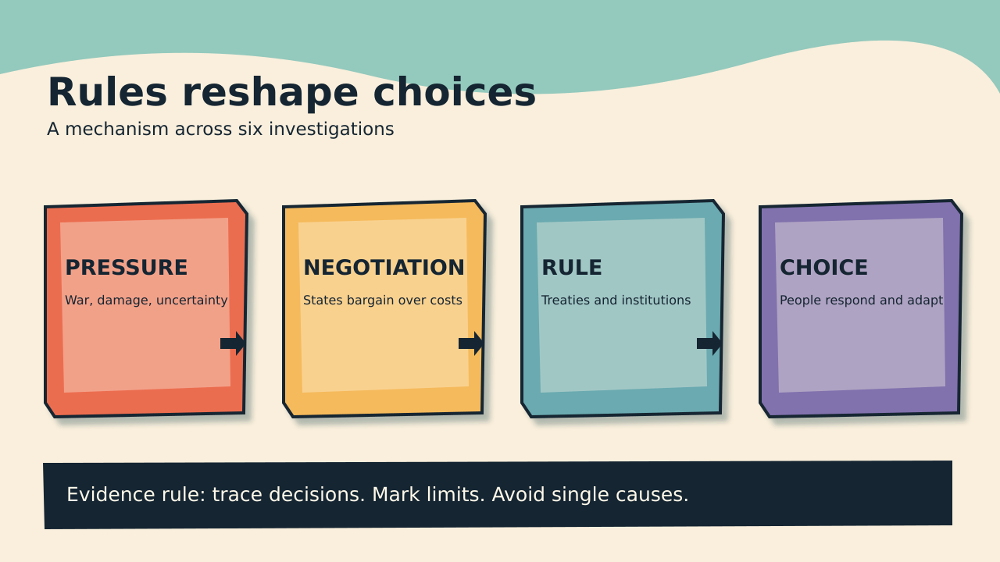

# History Investigation: Rules, resources, and copying

27 September 2026 · 20:59 Indian/Reunion

Five historical cards. One Primitive Echo.

## Suez: allies rejected an invasion

**Documented fact.** Egypt nationalized the Suez Canal. Nasser offered compensation. Britain and France objected. They planned force with Israel. Israel attacked Sinai in October 1956. British and French troops followed. Their stated peacekeeping purpose concealed coordination. Washington did not support invasion. The United States backed United Nations action. It pressed allies toward withdrawal. Oil shortages hit Europe. American oil assistance became conditional. U.S. records tied supply to compliance. A ceasefire came in November.

**Scholarly interpretation.** Alliance membership had limits. Eisenhower feared wider war. Soviet intervention remained possible. Colonial association threatened American influence. Hungary sharpened reputational concerns. Washington condemned Soviet force there. Supporting Suez would undermine consistency. Oil became diplomatic leverage. Egypt defended sovereignty through nationalization. Britain defended regional influence. France had separate strategic concerns. Israel saw security threats. Their interests converged temporarily. The crisis exposed unequal alliance power.

**Uncertainty.** No single motive explains withdrawal. Financial pressure also mattered. British politics added strain. U.S. files document policy choices. They cannot reveal every private calculation. The invasion's consequences remained regional. A ceasefire did not solve conflict. American opposition did not imply neutral interests. Washington soon expanded regional policy. The Eisenhower Doctrine followed. Historians differ on causal weights. The documented sequence supports multiple pressures.

**Sources**

- [Suez Crisis — U.S. Office of the Historian](https://history.state.gov/milestones/1953-1960/suez)
- [Suez oil and withdrawal telegram — U.S. Foreign Relations](https://history.state.gov/historicaldocuments/frus1955-57v16/d608)

## Bretton Woods: cooperation retained hierarchy

**Documented fact.** Delegates met during July 1944. War still continued. They designed monetary institutions. The IMF received proposed quotas. Quotas shaped subscriptions and votes. Basic votes also existed. Larger economies received more influence. The United States held leverage. British proposals differed from American ones. Keynes sought broader liquidity. White favoured a smaller fund. Delegates accepted compromise articles. Many colonies lacked independent representation. The agreement reflected wartime power. The Fund began operations later.

**Scholarly interpretation.** Rules promised monetary stability. Leaders feared interwar breakdown. Funding commitments justified weighted votes. Yet weighting preserved hierarchy. A universal institution emerged unevenly. Economic size defined institutional voice. Technical formulas also carried politics. Creditor interests could shape constraints. Debtor states faced different pressures. Cooperation and unequal influence coexisted. The design traded formal equality against contribution. Later membership expanded substantially. Voting debates persisted across decades.

**Uncertainty.** Founding design did not predetermine outcomes. National policies mattered greatly. Keynes and White were nuanced. Their proposals changed during negotiation. Describing one sole architect misleads. Colonies had differing constitutional positions. Their absence matters nonetheless. Voting power also changed later. Present quotas differ from 1944. Economic stability has many causes. The archives show negotiated rules. They cannot settle every counterfactual.

**Sources**

- [Bretton Woods, chapter five — IMF history](https://www.elibrary.imf.org/display/book/9798400276132/ch005.xml)
- [Voting compromise — IMF Survey](https://www.elibrary.imf.org/view/journals/023/0033/003/article-A002-en.xml)

## Stockholm: environment met development

**Documented fact.** Governments met in Stockholm during 1972. They debated human environmental protection. The conference adopted guiding principles. It also proposed action. Industrial pollution received attention. Developing states raised poverty concerns. The declaration linked environmental conditions. It recognized development needs. Cooperation crossed North–South divisions. UNEP emerged after the conference. Its headquarters opened in Nairobi. Environmental policy gained global institutions. Agreement did not erase disagreements.

**Scholarly interpretation.** Environmental rules raised distribution questions. Industrial states had consumed resources. Poorer states feared growth restrictions. Their delegates wanted development space. This changed the agenda. Pollution could not stand alone. Poverty also shaped exposure. Financing and technology remained contested. Nairobi signaled broader geographic ownership. Stockholm anticipated sustainable development debates. The conference built a shared vocabulary. Shared language concealed distinct priorities.

**Uncertainty.** Declarations were not binding treaties. Attendance counts vary across summaries. Influence cannot equal implementation. National policies followed unevenly. Delegates disagreed among themselves. Developing countries were not unified. Industrial countries also differed. Later climate politics had other origins. Stockholm supplied institutions and language. It did not resolve redistribution. Its long-term effects require comparison. One conference cannot explain environmentalism.

**Sources**

- [Stockholm conference report — UNEP](https://wedocs.unep.org/items/02076f3b-5c0f-45fd-8490-96303b8022cc)
- [Stockholm Declaration — UNEP](https://wedocs.unep.org/items/31b7824d-fe26-4138-8581-5696464580a9)
- [Stockholm legacy — UNEP](https://www.unep.org/news-and-stories/story/what-you-need-know-about-stockholm50)

## Outer Space Treaty: rivalry created rules

**Documented fact.** Space competition intensified during the 1960s. American and Soviet delegates drafted principles. Negotiations moved through United Nations channels. The treaty opened in 1967. States rejected national sovereignty claims. Exploration was framed for everyone. Nuclear weapons faced orbital restrictions. Other mass-destruction weapons faced restrictions. Celestial bodies had peaceful-use rules. States retained responsibility for national activities. The treaty entered force that October. It did not ban every weapon.

**Scholarly interpretation.** Rivals shared some restraint interests. Neither wanted exclusive lunar claims. Nuclear deployment invited strategic danger. Rules reduced selected risks. The treaty also protected exploration. Cooperation did not end competition. Ambiguous language eased agreement. It left future disputes open. Commercial activity later raised questions. Military support systems also remained possible. Legal compromise enabled broad participation. Its reach was limited by design.

**Uncertainty.** Peaceful use has contested meanings. Ordinary weapons face different treatment. The treaty text needs careful reading. It does not demilitarize orbit. Enforcement relies on states. Technology changed since 1967. Intentions varied among signatories. Documents show draft negotiations. They cannot establish identical motives. Future resource extraction remains disputed. Calling space wholly weapon-free misstates law. Its exact boundaries remain debated.

**Sources**

- [Outer Space Treaty text — UNOOSA](https://www.unoosa.org/oosa/en/ourwork/spacelaw/treaties/outerspacetreaty.html)
- [Treaty negotiations — U.S. Foreign Relations](https://history.state.gov/historicaldocuments/frus1964-68v11/d145)

## Montreal: finance made compliance possible

**Documented fact.** Scientists linked chemicals to ozone depletion. States adopted the Protocol in 1987. It targeted controlled substances. Reduction timetables differed by development status. Parties reviewed science and technology. Developing countries sought assistance. The 1990 London meeting debated costs. Negotiators created a funding mechanism. The Multilateral Fund began in 1991. It financed agreed transition costs. Technical support accompanied money. The treaty later gained universal ratification. Controls expanded over time.

**Scholarly interpretation.** Science informed the threat. Diplomacy built practical incentives. Rich states had industrial advantages. Poorer states faced transition costs. Shared targets alone were insufficient. Funding made obligations more feasible. Differentiated schedules recognized unequal capacity. Technology transfer supported substitution. Industrial change also affected prices. The fund institutionalized burden sharing. Revisions kept the treaty adaptable. Success depended on sustained implementation.

**Uncertainty.** The fund was added later. It was not fully present in 1987. Negotiating positions varied. Industry played several roles. Ozone recovery takes decades. Other treaties address different pollutants. Reported progress relies on measurement. Some substitutes create climate problems. The Kigali Amendment addressed that issue. Funding alone cannot explain outcomes. Compliance also required national regulation. Causal shares remain difficult estimating.

**Sources**

- [Montreal Protocol overview — UNEP](https://www.unep.org/ozonaction/who-we-are/about-montreal-protocol)
- [1990 meeting report — Ozone Secretariat](https://ozone.unep.org/Meeting_Documents/mop/02mop/MOP_2.shtml)
- [London Amendment — Ozone Secretariat](https://ozone.unep.org/treaties/montreal-protocol/amendments/london-amendment-1990-amendment-montreal-protocol-agreed)

## Primitive Echo: copy when unsure

**Documented fact.** People sometimes copy observed choices. Experiments measure this tendency. Participants receive social information. Their confidence affects decisions. Uncertain people copy more often. Demonstrator success can matter. Group consensus can matter. Task costs also matter. Researchers call these social-learning strategies. Results vary across settings. Copying is not automatic conformity. People often use personal knowledge. Some experiments support conditional copying. Models predict benefits under uncertainty.

**Scholarly interpretation.** Independent discovery can be costly. Others may reveal useful solutions. Learning socially may conserve effort. This could aid survival historically. Modern choices retain uncertainty. Reviews, queues, and trends attract attention. A crowded option can seem tested. Yet crowds can share errors. Copying without checking propagates mistakes. Success cues may beat popularity. Context should guide trust. The evolutionary account remains a hypothesis.

**Uncertainty.** Laboratory tasks simplify real life. Cultural norms differ widely. Individual histories shape choices. Not every copied decision is adaptive. Models use assumptions about environments. Social media creates unusual signals. Algorithms can fabricate apparent consensus. The historical origin cannot be observed. Evolutionary explanation needs multiple evidence lines. The experiments show decision patterns. They do not prove ancestral causes. Check independent sources when stakes rise.

**Sources**

- [Evolutionary basis of social learning — Royal Society](https://pmc.ncbi.nlm.nih.gov/articles/PMC3248730/)
- [Individual social information use — Royal Society](https://pmc.ncbi.nlm.nih.gov/articles/PMC3871325/)
- [Uncertainty and social learning — peer-reviewed model](https://pmc.ncbi.nlm.nih.gov/articles/PMC10426062/)

---

WordPress-ready file remains unpublished. No website upload occurred.