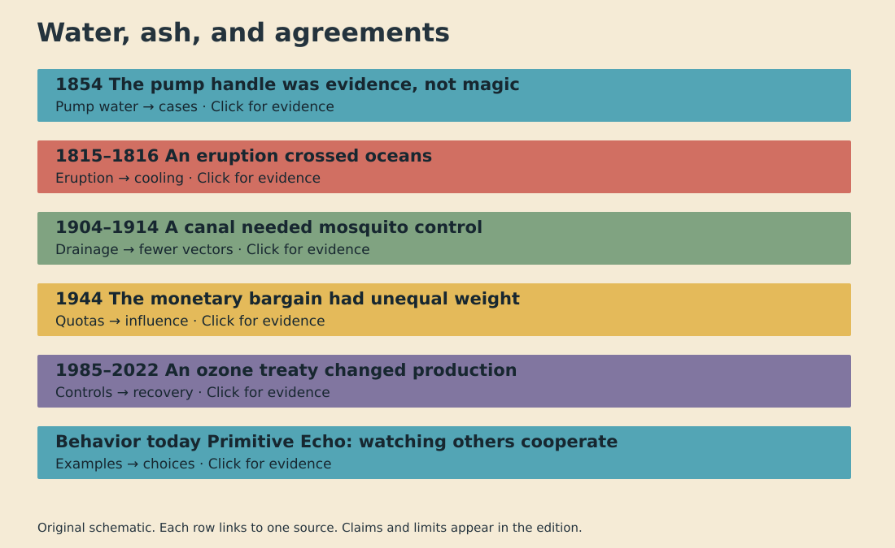

# History Investigation: Water, ash, and agreements

27 September 2026 · 22:00 Réunion

Six sourced investigations.

The video uses symbolic reconstruction. The WordPress file is unpublished.

## 1. The pump handle was evidence, not magic

**Question:** How did one pump become suspect?

**Documented fact · interpretation · uncertainty**

Documented fact: In 1854, cholera struck the Broad Street area of London. John Snow collected addresses and drinking histories. His map located many deaths near one public pump. He also investigated exceptions. Some distant victims drank its water. Some nearby residents used another source. Officials removed the pump handle. The surviving parish report records the local inquiry. Scholarly interpretation: Snow's strength was combining geography with exposure histories. A cluster alone could not establish transmission. His evidence challenged the prevailing belief that foul air carried cholera. The pump became a model for investigating outbreaks through linked observations. Uncertainty: The familiar story often gives the handle sole credit for ending the outbreak. The epidemic was already declining. Many residents had fled. The timing therefore cannot prove the removal alone stopped transmission. Later microbiology established the waterborne mechanism. The 1854 intervention mattered as a precaution and a test of the explanation, even without a clean before-and-after experiment.

**Sources**

- [Wellcome: parish inquiry and Snow map](https://wellcomecollection.org/works/uxgfjt62)
- [CDC: John Snow and pump handle](https://www.cdc.gov/mmwr/preview/mmwrhtml/mm5334a1.htm)
- [CDC: epidemiology lesson](https://archive.cdc.gov/www_cdc_gov/csels/dsepd/ss1978/lesson1/section2.html)

## 2. An eruption crossed oceans

**Question:** How did Sumbawa affect harvests abroad?

**Documented fact · interpretation · uncertainty**

Documented fact: Tambora erupted on Sumbawa in April 1815. Smithsonian records identify it as the largest explosive eruption in recorded history. The eruption sent material high into the atmosphere. In 1816, parts of Europe and North America saw unusual cold, rain, and frost. Historical accounts report crop failures and food shortages. Scholarly interpretation: Sulfur gases formed stratospheric aerosols. Those particles scattered sunlight. This supplied a physical route from an Indonesian eruption to distant cooling. Weather systems then shaped where the consequences became severe. The event shows why a local disaster can travel through a shared atmosphere. Uncertainty: Not every failed harvest came from Tambora alone. Regional weather, farming conditions, trade, and poverty also affected suffering. The phrase ‘year without a summer’ is a useful label, but it can flatten uneven conditions. The eruption is a strong contributor to 1816 cooling; any specific famine needs its own local evidence.

**Sources**

- [Smithsonian: Global Volcanism Program, Tambora](https://volcano.si.edu/volcano.cfm?vn=264040)
- [Smithsonian: When Volcanoes Erupt](https://naturalhistory.si.edu/education/teaching-resources/earth-science/when-volcanoes-erupt)
- [NOAA: Tambora and the year without summer](https://www.nesdis.noaa.gov/news/day-history-mount-tambora-explosively-erupts-1815)

## 3. A canal needed mosquito control

**Question:** What made excavation possible?

**Documented fact · interpretation · uncertainty**

Documented fact: Mosquito-borne yellow fever and malaria disrupted canal work in Panama. U.S. sanitation officials began organized mosquito control after 1904. Crews drained or treated standing water, screened buildings, and attacked breeding sites. The Smithsonian's canal materials show how water containers could sustain yellow-fever vectors. CDC history links vector control to the eventual completion of the canal in 1914. Scholarly interpretation: The engineering project depended on public-health labor. Excavators could not work safely at scale without changing mosquito habitat. Carlos Finlay's earlier mosquito hypothesis and subsequent research informed the intervention; credit belongs to more than one official. Uncertainty: Disease control did not remove the project's human cost. Historians document unequal health protections and severe risks for Caribbean contract workers. Also, sanitation was one condition among finance, machines, labor, and politics. Saying one doctor ‘built the canal’ hides those dependencies and the workers who carried them.

**Sources**

- [CDC: Special Wonders of the Canal](https://wwwnc.cdc.gov/eid/article/27/8/ac-2708_article)
- [Smithsonian Libraries: Bug war](https://www.sil.si.edu/exhibitions/make-the-dirt-fly/bugwar.html)
- [AMA Journal of Ethics: race and tropical medicine](https://journalofethics.ama-assn.org/article/how-racism-and-tropical-medicine-built-panama-canal/2024-02)

## 4. The monetary bargain had unequal weight

**Question:** Who shaped the postwar rules?

**Documented fact · interpretation · uncertainty**

Documented fact: Delegates from 44 nations met at Bretton Woods in July 1944. They signed a Final Act containing charters for the International Monetary Fund and the International Bank for Reconstruction and Development. The World Bank archive notes that many operating decisions still remained. IMF histories record intense bargaining over quotas, contributions, credit, and voting. Scholarly interpretation: The agreement was shaped by the power gap between wartime partners. Harry Dexter White's U.S. plan differed from John Maynard Keynes's British proposal. Quotas linked finance with influence. A table full of flags did not mean every delegation held equal leverage. Uncertainty: It is too simple to call the outcome one man's design. Plans changed through preparatory meetings and conference negotiations. The system also evolved after 1944, including the end of dollar-gold convertibility decades later. The original papers show a negotiated starting point, not a permanent, fully finished monetary order.

**Sources**

- [World Bank Archives: Bretton Woods](https://www.worldbank.org/en/archive/history/exhibits/Bretton-Woods-and-the-Birth-of-the-World-Bank)
- [IMF History: Bretton Woods chapter](https://www.elibrary.imf.org/display/book/9798400276132/ch005.xml)
- [IMF: Why White, Not Keynes?](https://www.imf.org/external/pubs/ft/wp/2002/wp0252.pdf)

## 5. An ozone treaty changed production

**Question:** How did measurements change factories?

**Documented fact · interpretation · uncertainty**

Documented fact: British Antarctic Survey researchers reported a severe Antarctic ozone decline in 1985. Governments signed the Montreal Protocol in 1987. UNEP states that the agreement controls production and consumption of ozone-depleting substances. Later amendments strengthened the controls. The 2022 scientific assessment reports declining atmospheric levels of controlled substances and a recovering ozone layer. Scholarly interpretation: This was an institutional chain. Measurements made a diffuse atmospheric problem visible. Chemical research explained a mechanism. Governments then changed industrial incentives. Manufacturers altered products and processes. The familiar image of a hole is only the first part of the story; enforcement and substitution mattered. Uncertainty: The original treaty did not instantly ban every CFC. Recovery is slow because chemicals persist. Forecast dates depend on compliance and future emissions. Replacement chemicals can introduce different climate costs. The observed improvement supports the treaty's effect, while continuing measurements remain necessary.

**Sources**

- [British Antarctic Survey: ozone discovery](https://www.bas.ac.uk/about/history/ozone-hole-discovery/)
- [UNEP: Montreal Protocol overview](https://www.unep.org/ozonaction/who-we-are/about-montreal-protocol)
- [WMO: 2022 ozone assessment summary](https://public.wmo.int/sites/default/files/2023-03/Scientific-Assessment-of-Ozone-Depletion-2022-Executive-Summary.pdf)

## 6. Primitive Echo: watching others cooperate

**Question:** Why do contributions follow others?

**Documented fact · interpretation · uncertainty**

Documented fact: In public-goods experiments, many participants change their contributions after learning what others contribute. Some appear to match group behavior. Cross-cultural studies also find substantial variation. This resembles daily choices around shared work, queues, and community resources. Scholarly interpretation: Watching others may help people avoid exploitation while keeping mutual help possible. Social learning and group pressures could have favored such flexible responses over always giving or always withholding. That is a plausible evolutionary account, not a direct reading of prehistoric minds. Uncertainty: Laboratory tokens are not real villages. Researchers dispute why matching occurs. One study argues that confusion about the game can mimic conditional cooperation. Other experiments find cooperation survives clearer instructions. Culture, incentives, trust, and comprehension all matter. The safe conclusion is narrower: observed contributions often affect later contributions. A single ancient instinct cannot explain every act of generosity or restraint.

**Sources**

- [PNAS: conditional cooperation and confusion](https://www.pnas.org/doi/10.1073/pnas.1509740113)
- [PNAS: confusion cannot explain cooperation](https://www.pnas.org/doi/10.1073/pnas.2310109121)
- [Royal Society: culture and cooperation](https://pmc.ncbi.nlm.nih.gov/articles/PMC2936171/)

## Video and viewer

The silent MP4 is a reconstruction. The HTML viewer adds controls and source links.

The WordPress-ready draft remains unpublished.
