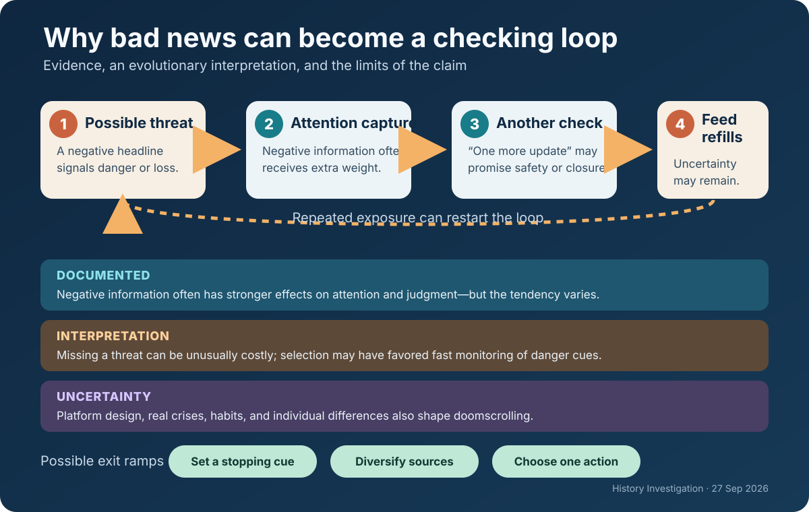

# History Investigation — 27 September 2026

Five evidence-led histories and one Primitive Echo. Each card distinguishes the record from interpretation and uncertainty; source lists are outside the card word counts.

## 1. Congo Free State: humanitarian language and a coercive rubber economy

**Documented fact.** King Leopold II presented his African project as philanthropic, scientific, and anti-slavery. International recognition nevertheless gave him personal control of the Congo Free State. The state treated much “vacant” land as its property, granted vast concessions, and demanded rubber and other products. Officials and concession companies used the Force Publique, hostage-taking, beatings, imprisonment, and village destruction to enforce quotas. Roger Casement’s 1904 British report documented killings, mutilation, and forced labor; parliamentary pressure contributed to Belgium’s annexation of the territory in 1908.

**Scholarly interpretation.** The rubber boom turned territorial rule into an extraction system in which humanitarian claims supplied legitimacy while coercion produced revenue. That does not mean every explorer, missionary, official, or reformer shared one motive. It means the institutions Leopold controlled rewarded output and concealed violence behind an international civilizing vocabulary.

**Uncertainty.** Abuses are supported by official inquiries, testimony, and archives; the exact demographic toll is not. Population records were weak, and deaths also reflected disease, famine, flight, and falling births. Precise totals—and attempts to assign every loss to a single cause—remain contested.

**Sources**

- [History of the Congo Free State — Royal Museum for Central Africa](https://www.africamuseum.be/en/discover/history_articles/kongo-kingdom)
- [The Casement Report, 1904 — scanned primary document](https://commons.wikimedia.org/wiki/File:Casement_Report.djvu)
- [Congo Free State debate, 26 February 1908 — UK Parliament, Hansard](https://api.parliament.uk/historic-hansard/commons/1908/feb/26/congo-free-state-1)

## 2. Japanese American incarceration: security claims and dispossession

**Documented fact.** Executive Order 9066 did not name an ethnic group, but military orders made Japanese ancestry the basis for removing about 120,000 people from the West Coast, most of them U.S. citizens. Families had little time to dispose of farms, shops, leases, homes, and possessions; government records later estimated enormous property and income losses. The federal Commission on Wartime Relocation and Internment of Civilians concluded in 1983 that the policy was not justified by military necessity and resulted from “race prejudice, war hysteria and a failure of political leadership.”

**Scholarly interpretation.** The episode was not merely a mistaken emergency precaution. Longstanding anti-Asian exclusion shaped who appeared suspicious, while forced removal transferred opportunities and assets to others. Economic dispossession was therefore integral to the harm and welcomed by some local interests, though evidence does not establish private enrichment as Washington’s single controlling motive.

**Uncertainty.** Officials possessed fragmentary intelligence and feared attack after Pearl Harbor. That context explains urgency, but later reviews found no evidentiary basis for mass ancestry-based confinement. Individual acts of opportunism are documented unevenly, so broad claims about every buyer, neighbor, or official would exceed the record.

**Sources**

- [Executive Order 9066 — U.S. National Archives](https://www.archives.gov/milestone-documents/executive-order-9066)
- [Personal Justice Denied: Summary — federal commission report](https://www.archives.gov/files/research/japanese-americans/justice-denied/summary.pdf)
- [Japanese American property loss — U.S. National Archives](https://www.archives.gov/research/aapi/ww2/property)

## 3. The Green Revolution: harvest gains inside a Cold War strategy

**Documented fact.** From the 1940s onward, international research programs developed and spread high-yield wheat and rice alongside irrigation, fertilizer, pesticides, credit, and extension services. In Mexico, India, and parts of Asia, cereal production and yields rose sharply; later research associates the diffusion with lower food prices, improved food security, and reduced poverty. Rockefeller Foundation records also place its Indian agricultural program inside fears about population growth, political instability, and Cold War competition.

**Scholarly interpretation.** The Green Revolution was both agronomic assistance and political strategy. U.S. foundations and officials hoped reliable harvests would support development and make revolutionary alternatives less attractive. That geopolitical purpose does not cancel the crops’ measurable benefits. It helps explain why a technology-intensive model—suited to states, scientists, and well-supplied regions—received extraordinary institutional backing.

**Uncertainty.** Outcomes varied by crop, region, landholding, gender, and access to water and credit. Yield comparisons cannot by themselves settle questions about inequality, groundwater depletion, pesticide exposure, biodiversity, or alternative policies. Nor does Cold War sponsorship prove that researchers or farmers were insincere: humanitarian, scientific, commercial, and strategic aims often overlapped.

**Sources**

- [Rockefeller Foundation agriculture program in India — Rockefeller Archive Center](https://resource.rockarch.org/story/the-rockefeller-foundations-agriculture-program-in-india-1950s-1960s/)
- [Green Revolution: Impacts, limits, and the path ahead — PNAS](https://doi.org/10.1073/pnas.0912953109)
- [Environmental consequences of the Green Revolution — IFPRI/CGIAR](https://cgspace.cgiar.org/items/49be3d06-45af-4ce7-8a8e-c4773c865a66)

## 4. Apollo: lunar science powered by a prestige contest

**Documented fact.** Apollo landed twelve astronauts on the Moon between 1969 and 1972, returned samples, deployed instruments, and transformed engineering and planetary science. Yet President John F. Kennedy’s private and public records show that the program’s timetable was also strategic. After Soviet space successes, he asked for a goal the United States could win and told NASA administrator James Webb that landing before the Soviet Union was the program’s highest priority. Congress then funded an immense national mobilization.

**Scholarly interpretation.** Apollo’s scientific achievements were real, but science alone does not explain the deadline, scale, or political urgency. A visible lunar victory converted industrial capacity into international prestige, reassuring allies and contesting Soviet claims of technological superiority. “Space race” was therefore more than a metaphor: the audience included governments deciding which political-economic system looked modern and capable.

**Uncertainty.** Presidents, legislators, engineers, scientists, contractors, and astronauts did not share one motive. Security signaling, electoral politics, exploration, jobs, institutional ambition, and curiosity overlapped. The archives strongly establish prestige competition as a central driver; they cannot prove that Apollo would never have occurred without the Cold War, only that its actual form was inseparable from it.

**Sources**

- [The Decision to Go to the Moon — NASA History](https://www.nasa.gov/history/the-decision-to-go-to-the-moon/)
- [Kennedy–Webb conversation background — NASA History](https://www.nasa.gov/history/JFK-Webbconv/pages/backgnd.html)
- [The Apollo Program — NASA](https://www.nasa.gov/the-apollo-program/)

## 5. The Balfour Declaration: a short letter amid competing commitments

**Documented fact.** In November 1917, Britain declared support for “the establishment in Palestine of a national home for the Jewish people,” while promising not to prejudice the civil and religious rights of existing non-Jewish communities or Jews’ status elsewhere. The letter did not define “national home,” promise a state, or mention the political rights of Palestine’s Arab majority. Britain issued it during a world war after negotiating other, differently worded arrangements concerning Ottoman territory, including the Hussein–McMahon correspondence and Sykes–Picot Agreement. Palestinians were not consulted on the declaration.

**Scholarly interpretation.** Historians identify overlapping motives: wartime diplomacy, imperial strategy, Christian Zionism, sympathy for Jewish national aspirations, and sustained Zionist advocacy. Treating the declaration as either pure humanitarianism or proof of a secret ethnic cabal erases the documented bargaining and reproduces a conspiracy frame unsupported by evidence.

**Uncertainty.** Scholars dispute the relative weight of those motives and whether Britain’s earlier language to Hussein included Palestine. Later officials also disagreed about compatibility among the commitments. The record supports ambiguity and conflicting imperial promises; it cannot reveal one hidden intention shared by every minister, Zionist negotiator, or Arab leader.

**Sources**

- [Balfour Declaration, CAB 21/58 — The National Archives (UK)](https://images.nationalarchives.gov.uk/asset/51188/)
- [The Zionist Movement and the 1917 Balfour Declaration — Cambridge University Press](https://www.cambridge.org/core/books/international-law-and-the-arabisraeli-conflict/zionist-movement-and-the-1917-balfour-declaration/A296A3D857F40F4E1C2DF0AA14CB39EE)
- [Palestine and competing wartime undertakings, 1939 — U.S. Department of State historical documents](https://history.state.gov/historicaldocuments/frus1939v04/d789)

## Primitive Echo. Why bad news can become a checking loop

**Documented fact.** Psychological reviews have found that negative events often affect attention, learning, and judgment more strongly than comparable positive events. But newer work shows substantial individual and contextual variation rather than one universal “negativity bias.” In digital settings, repeated consumption of distressing news—often called doomscrolling—has been associated with anxiety, poorer well-being, and continued checking, although most studies cannot establish a simple one-way cause.

**Scholarly interpretation.** A plausible evolutionary account is that organisms paid a high price for missing predators, hostility, contamination, or coalition threats. Attention systems that quickly prioritized possible danger could therefore be useful. Modern feeds can exploit that asymmetry: each alarming item promises information relevant to safety, while infinite supply prevents the old stopping cue that came when a threat was understood or escaped.

**Uncertainty.** Evolutionary reasoning is an inference about pressures, not a direct observation of ancestral minds. Doomscrolling also depends on platform design, habit, uncertainty, personality, and real-world crises. Negative attention can be adaptive when it prompts useful action. The evidence does not show that humans are destined to spiral; time limits, deliberate source choice, and action-oriented updates can interrupt the loop.

**Sources**

- [Bad is stronger than good — Review of General Psychology](https://doi.org/10.1037/1089-2680.5.4.323)
- [Rethinking the negativity bias — Behavioral and Brain Sciences/PMC](https://pmc.ncbi.nlm.nih.gov/articles/PMC6132407/)
- [Doomscrolling and mental well-being — Computers in Human Behavior Reports](https://doi.org/10.1016/j.chbr.2024.100438)

---

*Editorial note: This edition is educational, evidence-led, and deliberately distinguishes documented records from interpretation and uncertainty. The accompanying WordPress-ready HTML file remains an unpublished draft.*
