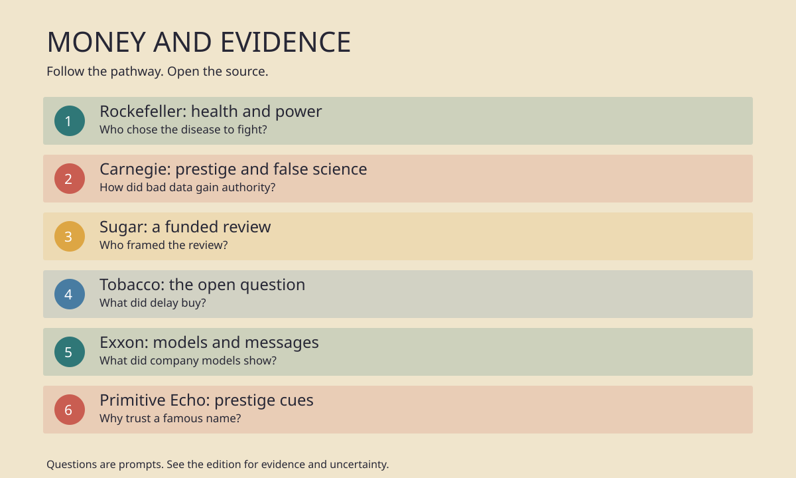

# History Investigation: Money and evidence

28 September 2026 · Réunion

Research can help. Sponsors can steer.

Status: research complete; visual prototype rejected.

## 1. Rockefeller: health and power

**Question:** Who chose the disease to fight?

Documented: In 1909, John D. Rockefeller gave one million dollars to a commission against hookworm in the American South. The disease caused anemia and fatigue. It spread through contaminated soil. The commission combined tests, treatment, education, and state partnerships. Its archive says the campaign helped build public health services. Yet the name promised eradication. Its leaders knew sustained prevention would be harder. The choice also suited Rockefeller philanthropy. A single, treatable disease offered visible results. It could connect doctors, schools, and governments. Interpretation: A family fortune helped choose which health problem gained attention. That choice produced care and lasting institutions. It also gave private donors agenda-setting power. These two outcomes can coexist. Uncertainty: Records support the commission's aims and methods. They cannot establish one private motive for Rockefeller himself. Nor do they prove that this campaign displaced every rival need. The useful question is who defined success. Count treatments, but also ask who set priorities and who would pay after the donor left.

**Sources**

- [Rockefeller Archive Center — campaign history](https://resource.rockarch.org/story/public-health-how-the-fight-against-hookworm-helped-build-a-system/)
- [Rockefeller Archive Center — photo essay](https://resource.rockarch.org/story/the-rockefeller-sanitary-commission-and-the-south/)
- [Elman et al. — public-health study](https://pmc.ncbi.nlm.nih.gov/articles/PMC3910046/)

## 2. Carnegie: prestige and false science

**Question:** How did bad data gain authority?

Documented: The Eugenics Record Office opened at Cold Spring Harbor in 1910. A Harriman donation first supplied land and a building. Carnegie later took the office under its institution. Staff gathered family records and claimed complex human traits followed simple inheritance. Their forms filled cabinets. Harry Laughlin used the work to argue for immigration restrictions and forced sterilization. The National Park Service calls the methods flawed and the underlying assumptions racist. The office closed in 1939. Interpretation: Institutional standing and money helped turn weak categories into apparent evidence. A respected research setting made policy claims seem scientific. Funding did not make the claims true. Uncertainty: Carnegie's role changed across time. The original land came from Harriman funding. A family's name alone cannot explain every policy or every scientist's motive. This case shows a pathway: donors support an institution, researchers classify people, and officials borrow its authority. The archive lets us trace that pathway. It cannot assign every later harm to one patron.

**Sources**

- [Cold Spring Harbor Laboratory — archive](https://www.cshl.edu/archives/institutional-collections/eugenics-record-office/)
- [U.S. National Park Service — history](https://www.nps.gov/articles/000/cold-spring-harbor-laboratory-and-the-place-of-science-in-u-s-history.htm)
- [CSHL ArchivesSpace — collection](https://archivesspace.cshl.edu/repositories/2/resources/67)

## 3. Sugar: a funded review

**Question:** Who framed the review?

Documented: Sugar Research Foundation records show a 1965 project on heart disease. The group paid for a literature review. It set objectives, supplied articles, and saw drafts. The review appeared in the New England Journal of Medicine in 1967. It emphasized fat and cholesterol. It gave less weight to evidence about sugar. The funding and sponsor role were not disclosed. Historians reconstructed the sequence from internal papers. Interpretation: The sponsor did not need to invent data. It could influence which question the review asked and which evidence seemed central. That is a specific conflict of interest. It does not prove fat was harmless. It does not settle the whole history of dietary advice. Uncertainty: The historical analysis shows influence on this review. It cannot measure precisely how much later disease or policy flowed from it. Read the review beside its funding trail. Then ask whether other studies reached the same result without sponsor control.

**Sources**

- [Kearns et al. — JAMA Internal Medicine](https://jamanetwork.com/journals/jamainternalmedicine/article-abstract/2548255)
- [Hegsted et al. — NEJM review, part I](https://www.nejm.org/doi/full/10.1056/NEJM196707272770405)
- [Hegsted et al. — NEJM review, part II](https://www.nejm.org/doi/full/10.1056/NEJM196708032770505)

## 4. Tobacco: the open question

**Question:** What did delay buy?

Documented: Cigarette executives met in 1953 amid rising cancer concerns. In January 1954, companies published a statement framing causation as an open question. They announced an industry research committee. Later, a United States court found a decades-long scheme to deceive smokers. The Justice Department describes research programs and public messages that sustained uncertainty despite internal knowledge. Meanwhile, the 1964 Surgeon General's report concluded cigarettes caused lung cancer in men. Interpretation: Research sponsorship can create a public appearance of inquiry while serving a sales strategy. A call for more studies can be reasonable. Here, the court found deception after reviewing extensive evidence. Uncertainty: The judgment concerns named defendants and specific conduct. It does not mean every funded scientist falsified findings. Nor does the 1954 statement alone prove all later acts. The stronger case comes from the combined archive, testimony, and court findings. Track the funding, the message, and what executives knew at each date.

**Sources**

- [U.S. Justice Department — tobacco findings](https://www.justice.gov/osg/brief/philip-morris-usa-inc-v-united-states-opposition)
- [CDC — Surgeon General history](https://www.cdc.gov/tobacco-surgeon-general-reports/about/history.html)
- [UCSF — Frank Statement archive](https://download.industrydocuments.ucsf.edu/r/y/j/p/ryjp0002/ryjp0002.pdf)

## 5. Exxon: models and messages

**Question:** What did company models show?

Documented: Exxon scientists made climate projections between 1977 and 2003. A 2023 quantitative study compared them with later temperatures. Depending on its metric, 63 to 83 percent matched observations. The researchers found the projections contradicted several public claims about uncertainty. ExxonMobil says its scientists published research and disputes accusations that critics selected documents unfairly. Interpretation: A company can produce capable science while its public messaging presents another picture. The contrast matters more than a slogan about what executives knew. Scientists, managers, and advertisers held different roles. Uncertainty: Model skill alone cannot show what each executive believed. It also cannot establish the legal result of current disputes. ExxonMobil's response deserves reading beside the study. The study's measured comparison remains a testable claim. Follow a dated model, then a dated advertisement. Check whether their uncertainty language matches. This case concerns the handling of corporate research, not the invention of the greenhouse effect.

**Sources**

- [Supran et al. — Science study](https://www.science.org/doi/10.1126/science.abk0063)
- [Harvard — study methods and figures](https://news.harvard.edu/gazette/story/2023/01/harvard-led-analysis-finds-exxonmobil-internal-research-accurately-predicted-climate-change/)
- [ExxonMobil — company response](https://ir.exxonmobil.com/news-releases/news-release-details/exxonmobil-says-climate-research-stories-inaccurate-and)

## 6. Primitive Echo: prestige cues

**Question:** Why trust a famous name?

Documented: Humans often learn from others. One proposed shortcut uses prestige: attention and respect may signal useful skill. In an online experiment, people copied respected peers more when relevant success information was missing. A review found mixed evidence across settings. It warned that prestige does not always predict competence. Interpretation: In uncertain settings, a university name, donor, or expert title can save attention. The shortcut may help when status tracks real skill. It can mislead when wealth or publicity creates status. That matters for research funding. An impressive sponsor can make a claim seem stronger before anyone checks its methods. Uncertainty: No single experiment proves an ancient instinct causes modern science errors. Culture, incentives, and institutions also shape trust. Prestige effects can stay within one field. A skilled chemist need not know nutrition. A useful response is simple: ask who funded the work, inspect methods, and compare independent findings. Status can guide a first look. It should never replace evidence.

**Sources**

- [Jiménez and Mesoudi — evidence review](https://www.nature.com/articles/s41599-019-0228-7)
- [Brand et al. — PLOS experiment](https://journals.plos.org/plosone/article?id=10.1371/journal.pone.0255346)
- [Brand et al. — Scientific Reports experiment](https://www.nature.com/articles/s41598-020-68982-4)

## Illustration

WordPress-ready file remains unpublished.