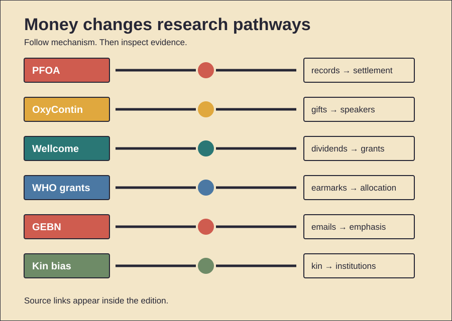

# Fortunes, Funding, and Focus

History Investigation — 28 September 2026, 01:00 Réunion

Five cases examine private funding. One behavior card follows. Facts, interpretation, and uncertainty stay separate.

## 1. DuPont: science followed contamination

**Documented fact.** DuPont used PFOA near Parkersburg. Production began during 1951. The chemical aided fluoropolymer production. Internal studies recorded liver effects. Later documents tracked worker exposures. Community water also became contaminated. Those findings were not public. Litigation released many records. A 2004 settlement followed. It funded blood testing. Nearly 70,000 people participated. Independent scientists formed a panel. Their work linked exposures. Several diseases received probable links. These included kidney cancer. Testicular cancer also qualified. Ulcerative colitis also qualified. Thyroid disease also qualified. Pregnancy hypertension also qualified. High cholesterol also qualified. The project produced epidemiology. It also informed regulation. **Scholarly interpretation.** Corporate control delayed scrutiny. Litigation changed research incentives. Money then funded independent work. That mechanism matters historically. Harmful products create evidence gaps. Courts can reopen them. **Counterevidence and limits.** Early toxicology lacked certainty. Animal effects prove limited things. Community studies remain observational. A probable link differs. It does not prove causation. Exposure estimates also varied. DuPont disputed many conclusions. The record supports delayed disclosure. It cannot quantify motives. Nor does every illness qualify.

*Word count: 174*

### Sources

- [The Devil They Knew](https://pmc.ncbi.nlm.nih.gov/articles/PMC10237242/)
- [The C8 Health Project](https://pmc.ncbi.nlm.nih.gov/articles/PMC2799461/)
- [Evidence of Air Dispersion](https://pmc.ncbi.nlm.nih.gov/articles/PMC8015386/)

## 2. Sackler gifts met Purdue markets

**Documented fact.** The Sacklers owned Purdue Pharma. Purdue launched OxyContin during 1996. The company funded pain education. It supported university programs. Tufts received related gifts. Purdue also paid speakers. Government records show more. Purdue later admitted conspiracies. One involved misleading DEA reporting. Another involved doctor payments. Those payments encouraged prescriptions. Purdue funded electronic prompts. They recommended Purdue opioids. The Justice Department announced settlements. Purdue’s plea covered 2007–2017. Sackler shareholders settled allegations separately. Pain treatment had real needs. Many patients lacked relief. Better education could help. Controlled-release opioids also had uses. **Scholarly interpretation.** Funding created credibility channels. Education and marketing overlapped. University prestige softened scrutiny. Speaker programs widened reach. **Counterevidence and limits.** A grant proves no corruption. Researchers retain individual agency. Legitimate pain care existed. OxyContin caused no crisis alone. Prescribing culture also mattered. Regulators also made decisions. Insurers shaped treatment options. Illicit fentanyl later dominated deaths. The record establishes payments. It establishes corporate admissions. It supports institutional influence. It cannot assign each prescription. Nor can gifts prove intent. Specific documents carry weight.

*Word count: 173*

### Sources

- [Congressional Hearing 116-130](https://www.govinfo.gov/app/details/CHRG-116hhrg43010)
- [Justice Department Resolution](https://www.oversight.gov/justice-department-announces-global-resolution-criminal-and-civil-investigations-opioid)
- [How Tufts Gifts Advanced Goals](https://www.statnews.com/2019/04/09/sackler-purdue-pharma-gifts-to-tufts-advanced-company-interests/)

## 3. Wellcome: medicine funded medicine

**Documented fact.** Henry Wellcome sold medicines. His 1936 will created Wellcome. The trust inherited his company. It owned every share. Dividends funded medical research. Early grants followed founder interests. Pharmacy received attention. Pharmacology received attention. Tropical medicine received attention. Veterinary medicine also benefited. The company became profitable. Research spending then expanded. Partial share sales began. A 1986 listing diversified assets. Remaining shares sold later. Investment returns replaced dividends. The trust funded major infrastructure. Sanger helped sequence genomes. Overseas programs built partnerships. Ebola research gained fast support. Peer reviewers now assess grants. **Scholarly interpretation.** Commercial wealth built public knowledge. Ownership also shaped early scope. Diversification reduced one dependency. Independent governance added distance. This model shows dual effects. Concentrated wealth enables scale. Concentrated choice sets agendas. **Counterevidence and limits.** Founder influence changed over time. Today’s trust differs greatly. Its company no longer funds grants. External reviewers constrain decisions. Public agencies also choose priorities. Genome success has many funders. Attribution therefore remains shared. The archive documents structures. It does not prove capture. Scale alone proves no harm. Accountability still warrants scrutiny.

*Word count: 178*

### Sources

- [Wellcome Trust Corporate Archive](https://wellcomecollection.org/works/x5w2tw8d)
- [Wellcome: How We Are Funded](https://wellcome.org/about-us/investments)
- [Wellcome History](https://wellcome.org/about-us)
- [Wellcome Governance](https://wellcome.org/about-us/our-people/governance)

## 4. Gates grants steer WHO resources

**Documented fact.** The Gates Foundation funds WHO. Grants usually carry purposes. A 2025 study counted them. It covered 2000 through 2024. Researchers found 640 grants. Their value reached $5.5 billion. Infectious diseases received four-fifths. Polio received almost three-fifths. Vaccine work received over half. Health systems received 0.7 percent. Noncommunicable diseases received under one percent. WHO relies heavily on voluntary money. Most such money is earmarked. Gates funding supported vaccination. It supported disease modeling. It supported new medical tools. These programs can prevent deaths. They also mobilize other donors. **Scholarly interpretation.** Earmarks shift institutional attention. Donors gain agenda power. Measurable technologies become attractive. System capacity can lose funding. **Counterevidence and limits.** Funding alignment proves no coercion. WHO accepts each grant. Member states created dependence. Their assessed payments stayed low. Polio eradication requires concentration. Vaccines bring broad benefits. The study tracked allocations. It did not measure outcomes. It also found no secret control. Gates reports public priorities. The documented mechanism is earmarking. The unresolved question concerns balance. Public financing could change it.

*Word count: 170*

### Sources

- [Who’s Leading WHO?](https://gh.bmj.com/content/10/10/e015343)
- [BMJ Study Summary](https://bmjgroup.com/world-health-organizations-priorities-shaped-by-its-reliance-on-grants-from-donor-organisations-such-as-the-gates-foundation/)
- [Gates Foundation Work](https://www.gatesfoundation.org/our-work)
- [Global Health Philanthropy Conflicts](https://pmc.ncbi.nlm.nih.gov/articles/PMC3075225/)

## 5. Coca-Cola funded energy-balance science

**Documented fact.** Coca-Cola funded nutrition researchers. It also backed GEBN. That network launched during 2014. Its message stressed energy balance. Physical activity received strong emphasis. Diet received less emphasis. Researchers later examined emails. Freedom-of-information requests produced them. The corpus exceeded 18,000 pages. Analysts found messaging coordination. They found constituency building. Some communications minimized funding visibility. Coca-Cola also published funding lists. Another study mapped those disclosures. Funded work clustered around activity. Energy balance also featured. Exercise research has real value. Obesity has multiple causes. Activity improves many health outcomes. **Scholarly interpretation.** Funding selected helpful questions. Those questions favored company interests. Influence worked through emphasis. It required no false experiment. Network building amplified messages. **Counterevidence and limits.** Funding never disproves findings. Energy balance remains valid biology. Researchers were not identical. Email analysis involves interpretation. It cannot measure every effect. The work covered selected universities. GEBN later dissolved publicly. Coca-Cola promised more transparency. Disclosure improved some visibility. Yet transparency lists remained incomplete. The strongest claim concerns influence. It does not prove fabrication.

*Word count: 170*

### Sources

- [Coca-Cola Emails Analysis](https://pubmed.ncbi.nlm.nih.gov/32744984/)
- [Research Funding Network Analysis](https://pmc.ncbi.nlm.nih.gov/articles/PMC5962884/)
- [Science Organisations and Coca-Cola](https://pmc.ncbi.nlm.nih.gov/articles/PMC6109246/)
- [GEBN Disbanded](https://www.bmj.com/content/351/bmj.h6590)

## 6. Primitive Echo: kin advantage

**Documented evidence.** Humans often help relatives. Small-scale societies show this. Food transfers frequently favor kin. Evolutionary theory offers one mechanism. Helping relatives can preserve genes. Hamilton formalized that logic. Yet human kinship exceeds biology. Families also exchange repeatedly. Reputation can stabilize support. Marriage links networks. Cultural rules define relatives. Institutions later formalize inheritance. Firms can preserve family control. Foundations can preserve family priorities. **Scholarly interpretation.** Old kin bias scales upward. Wealth makes that scaling durable. Trust strengthens close networks. It can reduce transaction costs. It can also restrict access. Outsiders receive less information. Succession can bypass competence. Philanthropy redirects some wealth. It can fund public goods. **Counterevidence and limits.** Kin selection explains no dynasty alone. One Ache study found reciprocity stronger. Food transfers followed exchange patterns. Cultural institutions also dominate choices. Laws reshape inheritance. Markets reward non-kin cooperation. Many founders surrender control. Some relatives reject succession. Biology creates tendencies, not commands. Nepotism requires institutional analysis. Family support is not corruption. Harm depends on power. Transparency changes that risk. Independent review can counterbalance it.

*Word count: 173*

### Sources

- [Reciprocal Altruism, Rather Than Kin Selection](https://gurven.anth.ucsb.edu/sites/secure.lsit.ucsb.edu.anth.d7_gurven/files/sitefiles/papers/allenaraveetal2008.pdf)
- [Cultural Group Selection and Cooperation](https://pmc.ncbi.nlm.nih.gov/articles/PMC10427285/)
- [Nepotistic Cooperation in Primates](https://pmc.ncbi.nlm.nih.gov/articles/PMC2781876/)
- [Kin Selection Theory History](https://arxiv.org/abs/1305.4354)

## Illustration

## Production note

The HTML file remains unpublished. The video and viewer share lesson data. The viewer works offline.