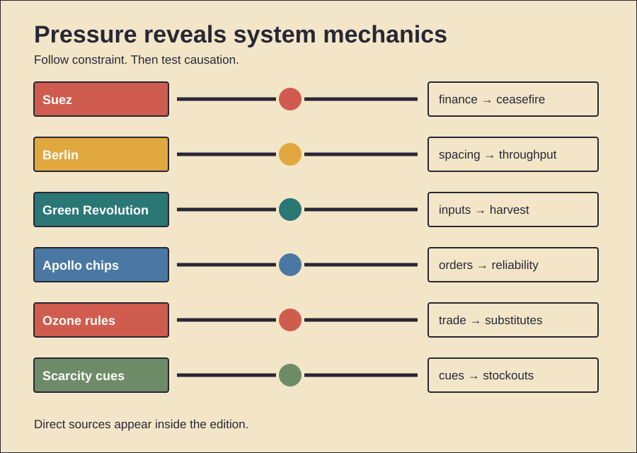

# Pressure, Systems, and Scale

History Investigation — 28 September 2026, 11:00 Réunion

Five cases examine systems under pressure. One behavior card follows. Facts, interpretation, and uncertainty stay separate.

## 1. Sterling constrained Suez

**Documented fact.** Egypt nationalized the canal. Britain, France, and Israel invaded. Their forces advanced during 1956. Britain’s reserves then weakened. Oil routes were disrupted. Sterling faced speculative pressure. Britain requested American support. It also needed IMF access. Washington withheld immediate backing. Britain accepted a ceasefire. Later financing then followed. **Scholarly interpretation.** Military movement met financial limits. American leverage mattered greatly. Archival and IMF studies support this. Finance made diplomacy coercive. The crisis exposed dependency. It also accelerated decolonization’s politics. **Counterevidence and limits.** Money acted within pressure. The United Nations also intervened. Soviet threats affected calculations. Domestic opposition also grew. France and Israel differed. Battlefield failure alone explains little. Yet finance was not solitary. Nor did one week erase empire. Britain’s relative decline began earlier. Egypt also suffered invasion. Canal traffic temporarily stopped. The evidence supports constraint. It cannot isolate one cause. Claims of instant imperial collapse overreach.

*Word count: 147*

### Sources

- [Suez and the United States](https://www.nationalarchives.gov.uk/education/resources/fifties-britain/suez-united-states/)
- [U.K. Financial Position](https://history.state.gov/historicaldocuments/frus1955-57v27/d247)
- [Northwest of Suez](https://www.imf.org/external/pubs/ft/wp/2000/wp00192.pdf)
- [Spotlight on Suez](https://www.nationalarchives.gov.uk/education/students/videos/spotlight-on/spotlight-on-suez-crisis/spotlight-on-suez-crisis-video-transcript/)

## 2. Berlin became a conveyor

**Documented fact.** Soviet authorities blocked surface routes. Western Berlin needed supplies. Aircraft used three corridors. Early operations remained inefficient. Congestion followed bad weather. Managers then standardized movement. Loaded planes used fixed spacing. Missed landings meant immediate return. Ground crews shortened unloading. Routes became one-way streams. Coal dominated tonnage. A new Tegel runway helped. Almost 278,000 flights operated. They carried 2.3 million tons. The blockade ended in May 1949. Flights continued through September. **Scholarly interpretation.** The decisive innovation was flow. Aircraft alone were insufficient. Rules converted scarce corridors. Repetition raised daily capacity. Civilian labor also mattered. So did British participation. The airlift became political signaling. It avoided armed road convoys. **Counterevidence and limits.** It remained dangerous. Seventy-six people died. Rations stayed austere. Eastern routes were not hermetic. The blockade ended through negotiation too. Airlift capacity cannot prove compellence. Soviet motives remain debated. Yet operational records are clear. Standardized timing changed throughput. The event was collective logistics.

*Word count: 156*

### Sources

- [Berlin Airlift Collection](https://www.trumanlibrary.gov/library/online-collections/berlin-airlift)
- [1949 Berlin Airlift](https://www.afhistory.af.mil/FAQs/Fact-Sheets/Article/458961/1949-the-berlin-airlift/)
- [Airlift Airport Tempelhof](https://www.thf-berlin.de/en/history-of-location/symbol-of-freedom/airlift)
- [Operation Vittles](https://www.amcmuseum.org/history/operation-vittles-berlin-airlift/)

## 3. Seeds needed a system

**Documented fact.** India faced severe food shortages. High-yield wheat then spread. Seeds were only one input. Irrigation expanded. Fertilizer use rose. Credit supported purchases. Guaranteed prices reduced risk. Public procurement bought grain. Storage and rationing moved it. Cereal production eventually tripled. Food dependence declined. **Scholarly interpretation.** The Green Revolution was institutional. Seed genetics required complements. State capacity changed adoption. Benefits reached many farmers. Lower prices reduced poverty. Higher yields also spared land. **Counterevidence and limits.** Gains were uneven. Irrigated regions moved first. Rice and wheat dominated. Other crops lagged. Fertilizer damaged some soils. Pumps depleted groundwater. Subsidies reinforced intensive farming. Inequality findings remain mixed. Some studies find diffusion. Others find regional gaps. The package did not end malnutrition. Nor did seeds cause every harm. Weather and later policies mattered. Counterfactual famine estimates vary. The record supports large gains. It also supports ecological costs. Future systems need broader crops. Water limits now matter.

*Word count: 152*

### Sources

- [Green Revolution: Impacts and Limits](https://pmc.ncbi.nlm.nih.gov/articles/PMC3411969/)
- [World Bank–India Partnership](https://www.worldbank.org/en/country/india/publication/the-world-bank-celebrates-75-years-of-partnership-with-india)
- [FAO Agricultural Transformation](https://www.fao.org/4/ag087e/ag087e05.htm)
- [Post-Green Revolution Cereals](https://pmc.ncbi.nlm.nih.gov/articles/PMC6911172/)

## 4. Apollo bought reliability

**Documented fact.** Integrated circuits existed already. Apollo adopted them early. Weight constraints encouraged that choice. Each guidance computer used thousands. NASA bought standardized logic gates. Repeated orders expanded production. Screening rejected weak batches. Reliability requirements shaped testing. Prices then fell. More suppliers entered. Apollo computers guided lunar missions. **Scholarly interpretation.** Procurement created a market. Demand reduced manufacturing uncertainty. Reliability was purchased deliberately. Public missions therefore shaped industry. The effect extended beyond invention. It helped make chips credible. **Counterevidence and limits.** Apollo was not alone. Minuteman also bought circuits. Military orders soon became larger. Manufacturers had prior designs. Commercial computing also drove demand. Available market-share data conflict. NASA historians call attribution uncertain. Apollo did not invent silicon. Nor did falling prices have one cause. Learning, competition, and scale interacted. Spaceflight nevertheless provided demanding proof. Its influence was catalytic. Exact shares remain unknowable. Celebratory claims require caution. The stronger claim concerns early demand.

*Word count: 151*

### Sources

- [Apollo Guidance Computer and Chips](https://airandspace.si.edu/stories/editorial/apollo-guidance-computer-and-first-silicon-chips)
- [Apollo Computer Object](https://www.si.edu/object/nasm_A19720343000)
- [Historical Studies of Spaceflight](https://www.nasa.gov/wp-content/uploads/2016/01/historical-studies-societal-impact-spaceflight-ebook_tagged.pdf)
- [Aerospace Systems and ICs](https://www.computerhistory.org/siliconengine/aerospace-systems-are-first-the-applications-for-ics-in-computers/)

## 5. Ozone rules changed markets

**Documented fact.** Scientists linked CFCs to ozone loss. Satellite evidence sharpened concern. Governments signed the Montreal Protocol. The agreement controlled production. It also restricted trade. Timetables tightened repeatedly. A multilateral fund supported transitions. Technical panels evaluated substitutes. Industry redesigned refrigeration. Aerosols also changed. CFC production largely ended. Ozone recovery is now projected. **Scholarly interpretation.** Science alone was insufficient. Trade rules discouraged free-riding. Finance widened participation. Available substitutes reduced resistance. Adjustable schedules handled uncertainty. Institutions converted discovery into action. **Counterevidence and limits.** Early industry opposition existed. Some substitutes caused warming. HCFCs still damaged ozone. HFCs later required reduction. Illegal trade also persisted. Recovery remains slow. Climate change affects estimates. No single company caused success. Nor was compliance costless. Developing states received longer timelines. Essential-use exemptions remained. The treaty’s record is strong. Its mechanism was layered. Science, markets, money, and enforcement interacted. Replication elsewhere is difficult. Carbon dioxide has fewer substitutes. Its sources are broader.

*Word count: 153*

### Sources

- [Montreal Protocol Text](https://ozone.unep.org/treaties/montreal-protocol-substances-deplete-ozone-layer)
- [Protocol Introduction](https://ozone.unep.org/treaties/montreal-protocol-substances-deplete-ozone-layer/introduction)
- [EPA Regulatory History](https://www.epa.gov/archive/epa/aboutepa/regulatory-history-cfcs-and-other-stratospheric-ozone-depleting-chemicals-1993.html)
- [1995 Chemistry Prize](https://www.nobelprize.org/prizes/chemistry/1995/9060-the-nobel-prize-in-chemistry-1995-1995-2/)

## 6. Primitive Echo: scarcity cascades

**Documented evidence.** Crisis buying follows cues. Perceived scarcity predicts purchases. Uncertainty strengthens that response. Seeing others buy matters. Empty shelves amplify urgency. Social media spreads images. Many shoppers add modest amounts. Their combined demand creates shortages. Stockpiling can be rational. Storm preparation reduces risk. **Scholarly interpretation.** Storage may echo scarcity adaptation. Keeping reserves protects households. Social observation also saves time. Others become danger sensors. Modern supply chains change effects. Synchronized buying overwhelms inventory. A protective response becomes collective harm. **Counterevidence and limits.** Evolutionary accounts remain hypotheses. Direct ancestral evidence is unavailable. Culture shapes storage norms. Income limits purchasing capacity. Household size matters. Retail restrictions change behavior. Panic is often misnamed. Fear is not universal. Conscientious planning can look similar. Hoarding disorder is different. It involves persistent impairment. Crisis stockpiling is temporary. Surveys also rely on self-report. Pandemic findings may not generalize. The best-supported mechanism combines scarcity, uncertainty, control, and imitation. Biology alone explains little.

*Word count: 154*

### Sources

- [Psychological Causes of Panic Buying](https://pmc.ncbi.nlm.nih.gov/articles/PMC7277661/)
- [Biopsychosocial Panic Buying Model](https://pmc.ncbi.nlm.nih.gov/articles/PMC7943846/)
- [Pandemic Buying Model](https://pmc.ncbi.nlm.nih.gov/articles/PMC7840055/)
- [Panic Buying Review](https://pmc.ncbi.nlm.nih.gov/articles/PMC10967731/)

## Illustration

## Production note

The HTML file remains unpublished. The video and viewer share lesson data. The viewer works offline.