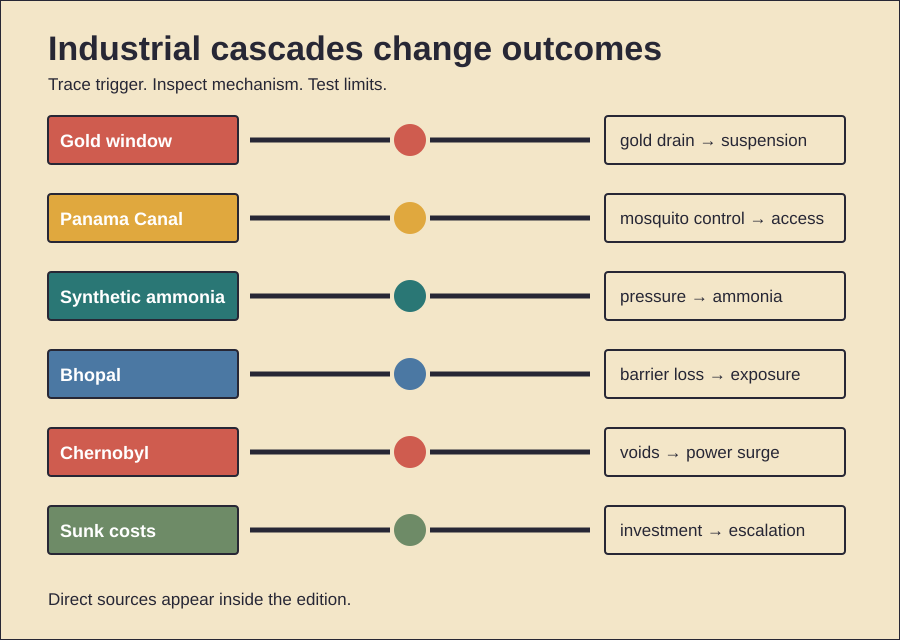

# Industrial Systems and Cascades

History Investigation — 28 September 2026, 12:00 Réunion

Five cases trace interacting systems. One behavior card follows. Facts, interpretation, and uncertainty stay separate.

## 1. The gold window jammed

**Documented fact.** Dollar claims exceeded American gold. Inflation was rising. Foreign holders sought conversion. On 15 August 1971, Nixon suspended dollar convertibility. He also froze wages. Prices were frozen too. A ten-percent import surcharge followed. Foreign-policy officials had limited warning. December's Smithsonian Agreement reset parities. It did not restore durability. Major currencies floated by March 1973. **Scholarly interpretation.** Domestic politics met reserve pressure. Suspension protected American policy autonomy. The surcharge pushed allies toward negotiation. Bretton Woods ended through steps. One televised speech was pivotal. It was not instantaneous. **Counterevidence and limits.** Convertibility had earlier strains. European governments also resisted adjustment. Speculation was not the sole cause. American fiscal and monetary choices mattered. The Vietnam War mattered indirectly. Great Society spending also mattered. Economists dispute relative weights. Wage controls briefly reduced measured inflation. They later distorted prices. Floating rates did not cure inflation. The archives document decisions. They cannot isolate one motive. Nor did August alone create modern finance.

*Word count: 159*

### Sources

- [Nixon Ends Dollar Convertibility](https://www.federalreservehistory.org/essays/gold-convertibility-ends)
- [Bretton Woods Launched](https://www.federalreservehistory.org/essays/bretton-woods-launched)
- [Smithsonian Agreement](https://www.federalreservehistory.org/essays/smithsonian-agreement)
- [Camp David Decisions](https://history.state.gov/historicaldocuments/frus1969-76v03/d168)

## 2. Mosquitoes shaped the canal

**Documented fact.** French construction had failed earlier. Disease killed many workers. American builders resumed in 1904. Medical teams targeted mosquitoes. They drained standing water. They oiled breeding sites. Buildings received screens. Fumigation also expanded. Yellow fever disappeared locally. Malaria mortality fell sharply. Excavation then accelerated. Railways removed spoil. Locks lifted ships. Caribbean workers supplied much labor. Payroll categories enforced segregation. White Americans often received gold pay. Many Black workers received silver pay. Housing and services also differed. **Scholarly interpretation.** The canal was a system. Medicine enabled engineering. Logistics enabled excavation. Imperial labor hierarchies reduced costs. They also allocated danger unequally. **Counterevidence and limits.** Mosquito control was not solitary. Better sanitation also helped. Hospital care improved survival. Mechanical innovations mattered greatly. Wage categories changed over time. Not every worker fit them. Records undercount some migrants. The canal shortened routes. It also transformed watersheds. Health gains were substantial. Segregation was substantial too. Neither cancels the other. Evidence supports interacting causes.

*Word count: 158*

### Sources

- [Special Wonders: Mosquito Control](https://wwwnc.cdc.gov/eid/article/27/8/ac-2708_article)
- [Yellow Fever and Panama](https://wwwnc.cdc.gov/eid/article/24/5/17-1609_article)
- [1908 Labor Commission Report](https://library.si.edu/digital-library/book/mes00unit)
- [Connecting the Oceans](https://siarchives.si.edu/blog/connecting-oceans-100th-anniversary-panama-canal)

## 3. Air became fertilizer

**Documented fact.** Fritz Haber demonstrated ammonia synthesis. Carl Bosch industrialized it. Nitrogen and hydrogen reacted. High pressure was essential. Heat and catalysts also mattered. BASF built large plants. Synthetic ammonia supplied fertilizer. Crop yields rose dramatically. Modern food systems followed. The process also supplied nitrates. Germany used them for explosives. Wartime blockade pressure increased importance. Today, synthetic fertilizer supports roughly half humanity's food. Ammonia production also uses substantial energy. Reactive nitrogen escapes farms. Rivers receive runoff. Coastal dead zones can grow. Nitrous oxide warms climate. **Scholarly interpretation.** Haber–Bosch broke a natural limit. Industrial chemistry expanded carrying capacity. The same infrastructure served war. Benefits and harms were coupled. Scale transformed both. **Counterevidence and limits.** Fertilizer alone raised no crop. Seeds and water mattered. Distribution mattered too. The exact population share is modeled. It is not directly counted. Explosives predated synthetic ammonia. Germany had other sources. Current emissions depend on fuel. Cleaner hydrogen could reduce them. Nitrogen leakage still remains. The legacy is neither singular progress nor singular harm.

*Word count: 169*

### Sources

- [Carl Bosch — Nobel Facts](https://www.nobelprize.org/prizes/chemistry/1931/bosch/facts/)
- [Fritz Haber — Nobel Biography](https://www.nobelprize.org/prizes/chemistry/1918/haber/biographical/)
- [How Many People Does Nitrogen Feed?](https://pmc.ncbi.nlm.nih.gov/articles/PMC3666697/)
- [Nitrogen Fixation and Sustainability](https://doi.org/10.1073/pnas.1706371114)

## 4. Bhopal lost safety layers

**Documented fact.** Union Carbide India stored methyl isocyanate. Water entered a tank. A runaway reaction followed. Pressure rose rapidly. Toxic gas escaped overnight. Nearby settlements received little warning. At least 3,800 people died immediately. Later death estimates are higher. Hundreds of thousands reported exposure. Multiple protections were degraded. Refrigeration was shut down. The scrubber was ineffective. The flare system was unavailable. Staffing and training had declined. Emergency information was inadequate. **Scholarly interpretation.** Catastrophe required interacting failures. Hazardous inventory met weak barriers. Cost pressure shaped maintenance. Siting magnified exposure. Institutional responsibility crossed borders. **Counterevidence and limits.** Exact water entry remains disputed. Sabotage was alleged. Investigations emphasized broader vulnerabilities. One trigger cannot explain consequences. Long-term health estimates also vary. Exposure records were incomplete. Diagnostic capacity was limited. Corporate, subsidiary, and regulatory duties differed. Courts allocated liability imperfectly. The settlement funded relief. Many survivors found it insufficient. Research documents lasting illness. It cannot precisely attribute every condition. The strongest evidence concerns failed layers.

*Word count: 161*

### Sources

- [Bhopal Disaster Review](https://pmc.ncbi.nlm.nih.gov/articles/PMC1142333/)
- [Risk Concealment at Bhopal](https://pmc.ncbi.nlm.nih.gov/articles/PMC7175960/)
- [In-Utero Exposure Effects](https://pmc.ncbi.nlm.nih.gov/articles/PMC10335451/)
- [WHO Chemical Incident Report](https://iris.who.int/bitstream/handle/10665/70570/WHO_SDE_OEH_01.3_eng.pdf)

## 5. Chernobyl combined failures

**Documented fact.** Operators prepared a turbine test. Reactor power fell too low. They restored partial power. Many control rods were withdrawn. Safety systems were bypassed. The RBMK had dangerous characteristics. Steam formation could increase reactivity. Control-rod design could initially add reactivity. During shutdown, power surged. Explosions destroyed Unit Four. Fire spread radionuclides widely. Two workers died immediately. Acute radiation syndrome killed others. Childhood thyroid cancers later increased. Evacuation and cleanup displaced communities. **Scholarly interpretation.** Later reviews shifted emphasis. Operator violations mattered. So did design defects. Weak safety culture connected them. Secrecy delayed protective action. The accident was systemic. **Counterevidence and limits.** Early Soviet accounts blamed operators heavily. INSAG-7 revised that balance. Radiation effects differ by dose. Thyroid harm is well established. Broader cancer estimates remain uncertain. Screening changed detection. Psychological and social harms were large. They were not radiation injuries. Wildlife recovery proves no safety. It partly reflects human absence. Exact long-term totals depend on models. Evidence supports differentiated impacts, not one number.

*Word count: 163*

### Sources

- [INSAG-7: The Chernobyl Accident](https://www-pub.iaea.org/MTCD/publications/PDF/Pub913e_web.pdf)
- [UNSCEAR: The Chornobyl Accident](https://www.unscear.org/unscear/en/chernobyl.html)
- [UNSCEAR 2008 Annex D](https://www.unscear.org/unscear/uploads/documents/publications/UNSCEAR_2008_Annex-D-CORR.pdf)
- [WHO Chernobyl Q&amp;A](https://www.who.int/news-room/questions-and-answers/item/health-effects-of-the-chernobyl-accident)

## 6. Primitive Echo: sunk costs

**Documented evidence.** People often persist after investment. Money can create this effect. Time can do so. Effort can too. Classic experiments demonstrated it. Later meta-analysis found variation. Framing and responsibility matter. Mice and rats also persist. Comparable foraging tasks show sensitivity. That weakens purely cultural explanations. It does not prove irrationality. Waiting can reveal information. Switching can carry costs. **Scholarly interpretation.** Persistence may reuse older mechanisms. Foragers must avoid abandoning rewards prematurely. Commitment can also protect cooperation. Public consistency may preserve reputation. Modern projects exploit these tendencies. Past spending then feels predictive. It is not. Only future costs matter. **Counterevidence and limits.** Cross-species results remain inconsistent. Tasks may measure patience instead. Human vignettes show low reliability. Reputation explanations also face counterevidence. A 2026 political study found consistency cues mattered more than sunk costs. No fossil records reveal decision rules. Evolutionary claims are hypotheses. Culture, accounting, and blame shape escalation. Persistence is sometimes rational. The practical test is prospective. Ask what the next unit buys. Ignore unrecoverable expenditure.

*Word count: 167*

### Sources

- [The Psychology of Sunk Cost](https://www.sciencedirect.com/science/article/pii/0749597885900494)
- [Sunk Costs Across Species](https://pubmed.ncbi.nlm.nih.gov/27151560/)
- [Mice, Rats, and Humans](https://pmc.ncbi.nlm.nih.gov/articles/PMC6377599/)
- [Low Reliability of Sunk-Cost Vignettes](https://pmc.ncbi.nlm.nih.gov/articles/PMC12384923/)

## Illustration

## Production note

The HTML file remains unpublished. The video and viewer share lesson data. The viewer works offline.