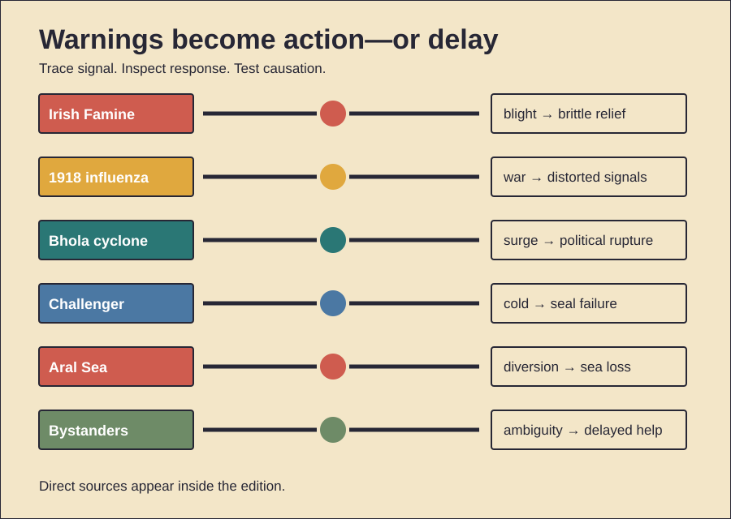

# Failures, Warnings, and Collective Action

History Investigation — 28 September 2026, 13:00 Réunion

Five cases trace warnings and response. One behavior card follows. Facts, interpretation, and uncertainty stay separate.

## 1. Blight met brittle policy

**Documented fact.** Potato blight arrived in 1845. Repeated failures destroyed the staple. Poor tenants lacked alternatives. Many farms still produced food. Grain and livestock exports continued. Robert Peel imported maize. His program provided some relief. Later policy shifted course. Public works required hard labor. Wages often arrived late. Soup kitchens briefly expanded aid. Poor Law workhouses then dominated. Disease killed alongside hunger. Emigration accelerated. Ireland’s population collapsed. **Scholarly interpretation.** Blight triggered catastrophe. Land structure magnified it. Poverty narrowed diets. Market ideology constrained relief. Administrative rules delayed access. Continued exports became morally explosive. **Counterevidence and limits.** Exports alone explain little. Confiscating them posed logistical limits. Imports also entered Ireland. Relief spending was substantial. Some officials worked urgently. Local capacity remained weak. Weather damaged transport. Exact death totals vary. Colonial governance shaped vulnerability. Intentional extermination is unsupported. Negligence and ideology are better documented. The famine combined pathogen, poverty, policy, and disease.

*Word count: 149*

### Sources

- [Famine Records and Relief Commission](https://nationalarchives.ie/help-with-research/research-guides/famine-records-distress-papers-and-the-relief-commission/)
- [Office of Public Works History](https://www.gov.ie/en/office-of-public-works/organisation-information/history-of-the-office-of-public-works/)
- [National Famine Commemoration 2026](https://www.gov.ie/en/department-of-the-taoiseach/speeches/national-famine-commemoration-irish-workhouse-centre-portumna-co-galway-sunday-17-may-2026/)
- [HERB-1 Blight Genome](https://doi.org/10.7554/eLife.00731)

## 2. War distorted pandemic signals

**Documented fact.** Influenza spread globally during 1918. Troop movements connected continents. Crowded camps aided transmission. Warring states controlled information. Spain remained neutral. Its press reported openly. King Alfonso XIII became ill. Foreign readers therefore saw Spanish headlines. The virus gained a misleading name. Some authorities minimized danger. Philadelphia allowed a war-bond parade. Hospitals were soon overwhelmed. Other cities acted earlier. Closures and gathering bans reduced peak mortality. Medicine still lacked antivirals. Effective influenza vaccines came later. **Scholarly interpretation.** War shaped both spread and knowledge. Mobilization moved infection. Censorship obscured comparative risk. Patriotic events delayed distancing. Institutions reacted unevenly. **Counterevidence and limits.** Censorship was not universal. French newspapers sometimes reported outbreaks. Officials also faced diagnostic uncertainty. Influenza was not yet reportable everywhere. The virus’s geographic origin remains unsettled. Kansas is one hypothesis. Other origins remain plausible. Spain did not cause the pandemic. Naming followed visibility. Local intervention studies are observational. Timing still strongly correlates with outcomes.

*Word count: 155*

### Sources

- [CDC: 1918 Pandemic History](https://archive.cdc.gov/www_cdc_gov/flu/pandemic-resources/1918-commemoration/1918-pandemic-history.htm)
- [Spanish Influenza: Lessons](https://pmc.ncbi.nlm.nih.gov/articles/PMC6477554/)
- [Public Health Interventions](https://pmc.ncbi.nlm.nih.gov/articles/PMC1849867/)
- [Fighting Flu in Britain](https://pmc.ncbi.nlm.nih.gov/articles/PMC7574600/)

## 3. A cyclone exposed distance

**Documented fact.** Cyclone Bhola struck East Pakistan in November 1970. A huge storm surge crossed low islands. Death estimates vary widely. Roughly 300,000 is commonly cited. Warnings existed. Many residents lacked shelters. Communications collapsed. Relief reached remote islands slowly. Foreign helicopters and boats later arrived. Public anger targeted Pakistan’s central government. Elections followed in December. The Awami League won decisively. West Pakistani leaders then resisted transferring power. War began in 1971. Bangladesh became independent. **Scholarly interpretation.** Disaster exposed political distance. Unequal state capacity became visible. Recent spatial research links cyclone intensity with later voting and enlistment. Neglect likely strengthened mobilization. **Counterevidence and limits.** The cyclone did not create Bengali nationalism. Language conflict came earlier. Economic grievances were longstanding. Military repression drove war directly. Relief included substantial international aid. Some delays reflected destroyed infrastructure. Death counts remain uncertain. Satellite-based causal studies require assumptions. The strongest claim is catalytic. Bhola sharpened existing distrust. It did not mechanically cause independence.

*Word count: 158*

### Sources

- [NOAA: Bhola Cyclone Anniversary](https://www.aoml.noaa.gov/hurricane_blog/45th-anniversary-of-the-bhola-cyclone/)
- [NOAA Storm-Surge Review](https://repository.library.noaa.gov/view/noaa/59765/noaa_59765_DS1.pdf)
- [The Final Straw?](https://doi.org/10.1080/09584935.2023.2203901)
- [State Neglect and Revolution](https://insights.som.yale.edu/insights/when-state-neglect-turns-weather-into-revolution)

## 4. Challenger reversed proof

**Documented fact.** Challenger launched on 28 January 1986. Air temperatures were unusually low. Shuttle boosters used rubber O-rings. Cold reduced sealing performance. Thiokol engineers opposed launch below prior experience. Managers reversed the recommendation. NASA accepted the launch. Hot gas escaped a joint. The external tank failed. Seven crew members died. The Rogers Commission investigated. It found both technical failure and flawed decision-making. Senior decision-makers lacked key O-ring history. The booster joint was later redesigned. **Scholarly interpretation.** The burden of proof shifted. Engineers were asked to prove failure. Managers treated missing data as safety. Earlier erosion had become normalized. Schedule pressure shaped discussion. **Counterevidence and limits.** No manager wanted disaster. Available temperature data were incomplete. Some warm launches also showed erosion. Rules did not clearly forbid launch. Organizational routines can produce danger without conspiracy. Political pressure is often overstated. The commission documented communication failures. It did not prove one motive. Challenger became a case about uncertainty, hierarchy, and normalization.

*Word count: 158*

### Sources

- [Rogers Commission: Launch Decision](https://www.nasa.gov/history/rogersrep/v1ch5.htm)
- [Rogers Commission: Accident Analysis](https://www.nasa.gov/history/rogersrep/v1ch4.htm)
- [Rogers Commission Report](https://www.nasa.gov/history/rogersrep/genindex.htm)
- [Challenger Center History](https://www.nasa.gov/challenger-sts-51l-accident/)

## 5. Cotton emptied the Aral

**Documented fact.** The Aral Sea was enormous. Two rivers sustained it. Soviet planners expanded irrigation. Canals diverted river water. Cotton output increased. Desert agriculture supported livelihoods. Leakage wasted much water. River inflow then collapsed. The sea split apart. Salinity rose. Fisheries disappeared. Ports became stranded. Exposed lakebed produced dust. Chemicals remained in sediments. Communities faced economic and health burdens. Kazakhstan later built Kok-Aral Dam. The North Aral partly recovered. Fish returned. **Scholarly interpretation.** Targets displaced system feedback. Cotton benefits were immediate. Ecological costs arrived downstream. Poor canal design accelerated loss. Political borders later complicated repair. The northern recovery shows reversibility. Scale and coordination still matter. **Counterevidence and limits.** Irrigation was not pointless. It created farms and employment. Climate variability also affected water. Health studies show serious concerns. Exact causal attribution remains difficult. Poverty and sanitation confound exposure. The southern basin remains far harder. One dam cannot restore the original sea. The evidence supports engineered collapse, uneven benefits, and partial recovery.

*Word count: 160*

### Sources

- [NASA: World of Change — Aral Sea](https://science.nasa.gov/earth/earth-observatory/world-of-change/aral-sea/)
- [NASA: North Aral Recovery](https://science.nasa.gov/earth/earth-observatory/north-aral-sea-recovery-7645/)
- [World Bank Development Report 1992](https://documents1.worldbank.org/curated/en/995041468323374213/pdf/105170REPLACEMENT0WDR01992.pdf)
- [Irrigation-Induced Environmental Change](https://doi.org/10.3390/rs9090900)

## 6. Primitive Echo: waiting crowds

**Documented evidence.** People sometimes help less when others are present. Experiments call this the bystander effect. Responsibility can feel divided. People also watch others. Calm faces reduce perceived danger. Fear of embarrassment inhibits action. A meta-analysis found an overall effect. Context strongly changes it. Dangerous emergencies can reverse it. Groups sometimes help together. Familiarity can increase intervention. **Scholarly interpretation.** Social monitoring is usually useful. Other people supply information. Shared vigilance reduces individual effort. In ambiguous modern emergencies, that shortcut can misfire. Each observer waits. Collective silence then looks reassuring. Reputation concerns add hesitation. **Counterevidence and limits.** The effect is not universal. Famous real cases were often misreported. Laboratory emergencies are simplified. Culture changes intervention norms. Training changes behavior. Clear personal responsibility increases helping. Evolutionary explanations remain hypotheses. No single ancestral pressure is proven. Diffusion also affects perceived agency. Biology alone explains little. The practical countermeasure is explicit assignment. Name one helper. State one action. Ambiguity then falls.

*Word count: 157*

### Sources

- [Bystander Effect Meta-Analysis](https://pubmed.ncbi.nlm.nih.gov/21534650/)
- [Diffusion Reduces Agency](https://pmc.ncbi.nlm.nih.gov/articles/PMC5390744/)
- [Biology of the Bystander Effect](https://pmc.ncbi.nlm.nih.gov/articles/PMC8692770/)
- [Bystander Effect Revisited](https://pmc.ncbi.nlm.nih.gov/articles/PMC6099971/)

## Illustration

## Production note

The HTML file remains unpublished. The video and viewer share lesson data. The viewer works offline.