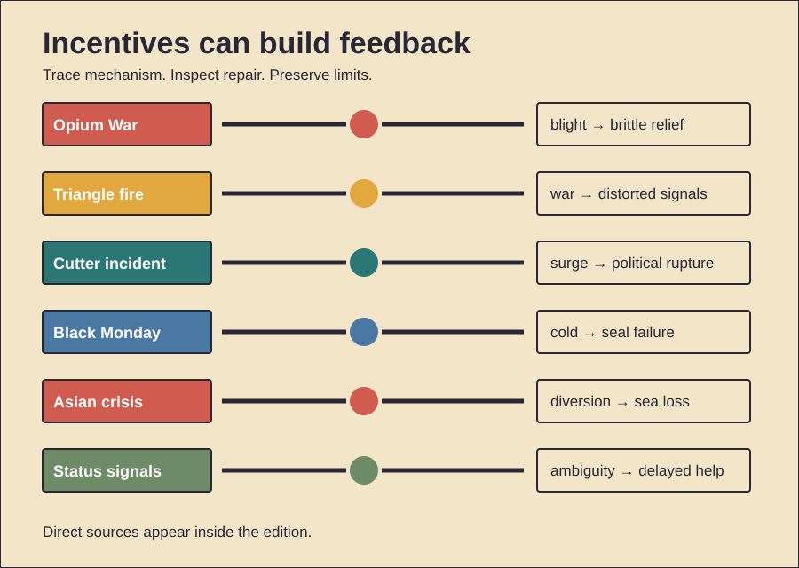

# Trade, Risk, and Repair

History Investigation — 28 September 2026, 17:00 Réunion

Five cases trace incentives, feedback, and institutional repair. One behavior card follows. Facts, interpretation, and uncertainty stay separate.

## 1. Tea payments moved through opium

**Documented fact.** Britain bought Chinese tea. Silk also sold. Porcelain also sold. Qing merchants preferred silver. British silver therefore flowed east. The East India Company controlled Indian opium. Private traders carried it onward. Chinese buyers paid silver. This reversed the flow. Qing law prohibited that trade. Commissioner Lin Zexu acted during 1839. Foreign stocks were surrendered. They were then destroyed. Britain demanded compensation. Parliament debated armed intervention. British forces attacked. The Treaty of Nanjing followed during 1842. It opened treaty ports. It ceded Hong Kong. It imposed an indemnity. **Scholarly interpretation.** Opium joined several conflicts. Trade access mattered. Imperial power mattered. Diplomatic equality also mattered. Compensation became a trigger. **Counterevidence and limits.** Tea demand caused no war alone. Chinese consumers sustained smuggling. British critics opposed intervention. Parliament was divided. Jurisdiction disputes also escalated tensions. Opium remained officially prohibited after the treaty. Full legalization came later. The record supports commercial coercion. It does not reduce everything to one commodity.

*Word count: 158*

### Sources

- [War with China — Commons Debate, 1840](https://api.parliament.uk/historic-hansard/commons/1840/apr/07/war-with-china)
- [Uniform Penny Postage Debate, 1839](https://api.parliament.uk/historic-hansard/lords/1839/aug/05/uniform-penny-postage)
- [British Museum: Opium Pipe](https://www.britishmuseum.org/collection/object/A_OA-6606)
- [British Museum: Collecting and Empire](https://www.britishmuseum.org/visit/object-trails/collecting-and-empire-trail)

## 2. Fire accelerated existing reform

**Documented fact.** Fire struck Triangle Shirtwaist. The date was 25 March 1911. The factory occupied high floors. Fabric burned quickly. One exit door stayed locked. A fire escape collapsed. Fire ladders reached too low. The disaster killed 146 people. Most victims were young workers. Many were immigrant women. The owners faced manslaughter charges. A jury acquitted them. Civil claims followed later. New York created investigations. Factory laws then expanded. Fire safety improved. Building exits changed. Inspections increased. **Scholarly interpretation.** Public horror created leverage. Reformers already had networks. Unions already organized workers. The 1909 garment strike mattered. Frances Perkins already pursued reform. The fire made regulation politically urgent. **Counterevidence and limits.** The fire started no movement alone. Earlier laws already existed. Enforcement remained uneven. Reforms differed across states. Owners claimed ignorance about locking. Trial standards required specific proof. The acquittal proves no safe workplace. Nor does tragedy guarantee durable enforcement. The strongest claim is acceleration. Organization converted grief into rules.

*Word count: 159*

### Sources

- [Cornell: Triangle Factory Fire Archive](https://trianglefire.ilr.cornell.edu/index.html)
- [New York Courts: Remembering Triangle](https://history.nycourts.gov/garfinkel_resources/cornell-remembering-triangle-factory/)
- [Smithsonian: The Triangle Fire](https://www.smithsonianmag.com/history/uncovering-the-history-of-the-triangle-shirtwaist-fire-124701842/)

## 3. A vaccine succeeded; production failed

**Documented fact.** Polio frightened families. A huge field trial tested Salk's vaccine. Results arrived during April 1955. The vaccine proved effective. Licensing followed quickly. Several companies began distribution. Cutter Laboratories made some batches. Those batches retained live virus. Existing tests had still passed them. Vaccinated children developed polio. Infection also reached contacts. Counts vary by definition. More than 250 cases were attributed. Paralysis and deaths followed. Officials recalled Cutter vaccine. National vaccination paused briefly. Plants were reinspected. Testing standards tightened. Production later resumed. **Scholarly interpretation.** Scientific success met manufacturing failure. Speed exposed regulatory weakness. Product safety required process control. Testing finished vials was insufficient. The incident strengthened federal oversight. **Counterevidence and limits.** The vaccine concept did not fail. Other producers avoided comparable outbreaks. Polio cases then fell sharply. Exact casualty totals differ. Direct recipients and contacts get counted differently. Political urgency influenced speed. It proves no general vaccine danger. It shows that scale changes risk. Regulation must follow production, not discovery alone.

*Word count: 163*

### Sources

- [FDA: Science and Biological Regulation](https://www.fda.gov/about-fda/histories-product-regulation/science-and-regulation-biological-products)
- [CDC: Historical Vaccine Concerns](https://www.cdc.gov/vaccine-safety/historical-concerns/index.html)
- [The Cutter Incident](https://pmc.ncbi.nlm.nih.gov/articles/PMC1410842/)
- [FDA: Ruth Kirschstein and Polio](https://www.fda.gov/about-fda/fda-history-exhibits/ruth-l-kirschstein-early-role-polio-vaccine-research)

## 4. Insurance amplified a falling market

**Documented fact.** Markets fell during October 1987. Black Monday came on October 19. The Dow dropped 22.6 percent. Other markets also plunged. Trading systems became overloaded. Price discovery weakened. Portfolio insurance had spread. Its models promised downside protection. Falling prices triggered futures sales. Further falls triggered more sales. Cash and futures markets moved unevenly. Buyers withdrew. Liquidity then evaporated. The Federal Reserve promised liquidity. Markets stabilized afterward. Exchanges later adopted circuit breakers. **Scholarly interpretation.** A protective strategy became feedback. Each seller acted rationally alone. Together they consumed market capacity. Automation accelerated coordination. Institutional links transmitted stress. **Counterevidence and limits.** Portfolio insurance caused no crash alone. Valuations were elevated. Interest rates had risen. Currency tensions also mattered. Ordinary investors also sold. Researchers dispute each factor's weight. The economy avoided depression. Banks remained broadly functional. Circuit breakers cannot remove panic. They create time for orders. The case demonstrates amplification. It does not supply one trigger. Complex markets can fail through interactions.

*Word count: 160*

### Sources

- [Federal Reserve: Brief History of 1987](https://www.federalreserve.gov/pubs/feds/2007/200713/)
- [Federal Reserve History: 1987 Crash](https://www.federalreservehistory.org/essays/stock-market-crash-of-1987)
- [SEC: Future of U.S. Markets, 1988](https://www.sec.gov/news/speech/1988/102088ruder.pdf)
- [Federal Reserve: Financial Crises](https://www.federalreserve.gov/newsevents/speech/kohn20060518a.htm)

## 5. Stable pegs hid currency risk

**Documented fact.** East Asian economies attracted capital. Banks borrowed abroad. Much debt was short-term. Much debt used foreign currency. Exchange rates looked stable. Borrowers often stayed unhedged. Property and corporate lending expanded. Thailand abandoned its baht peg. The date was 2 July 1997. Capital then fled. Currencies weakened. Foreign debts became heavier. Bank failures followed. Contagion reached neighboring economies. The IMF supported Thailand, Indonesia, and Korea. Programs required reforms. Interest rates rose. Fiscal targets initially tightened. Some targets later eased. Recovery eventually followed. **Scholarly interpretation.** Stable pegs disguised risk. Short maturities created runs. Weak supervision magnified exposure. Policy conditions sought confidence. Some also deepened contraction. **Counterevidence and limits.** Countries differed substantially. Crony lending explains no region alone. External lenders also mispriced risk. China avoided collapse. Malaysia later used controls. Its comparison remains contested. IMF funds prevented worse defaults. Critics dispute program timing. Recovery had several causes. Exports helped. Currency depreciation helped. Global demand helped. The crisis mixed domestic fragility, mobile capital, and policy choices.

*Word count: 164*

### Sources

- [IMF: Asian Crisis — Causes and Cures](https://www.imf.org/external/pubs/ft/fandd/1998/06/imfstaff.htm)
- [IMF: What Have We Learned?](https://www.imf.org/external/pubs/ft/fandd/1999/09/lane.htm)
- [IMF Evaluation: Capital Account Crises](https://www.elibrary.imf.org/display/book/9781589061880/pt002.xml)
- [IMF: The Asian Crisis and Advice](https://www.elibrary.imf.org/display/book/9781557758354/ch022.xml)

## 6. Primitive Echo: visible cost

**Documented evidence.** People display expensive goods. Observers often infer status. Experiments test luxury labels. Identical clothing gets judged differently. Visible brands can gain favorable treatment. Romantic motives can alter spending. Social exclusion can also change displays. Costly-signaling theory offers one mechanism. Hard-to-afford signals may seem credible. Waste itself can demonstrate resources. Similar logic appears in biology. **Scholarly interpretation.** Modern luxury markets exploit old inference. Buyers purchase function. They may also purchase rank. Brands coordinate shared meanings. Visibility makes signals useful. Scarcity can strengthen them. Digital platforms widen audiences. **Counterevidence and limits.** Expense guarantees no wealth. Credit can finance display. Counterfeits can imitate brands. Meanings differ by culture. Quiet status signals also exist. People buy quality, beauty, and identity. Experiments simplify real markets. Evolutionary explanations remain hypotheses. Sexual selection explains no purchase alone. Social learning may suffice. Institutions shape which objects matter. Status symbols can reverse quickly. The evidence supports signaling effects. It does not prove one ancestral cause.

*Word count: 158*

### Sources

- [Luxury and Green Labels as Signals](https://pmc.ncbi.nlm.nih.gov/articles/PMC5295666/)
- [Status, Testosterone, and Consumption](https://pmc.ncbi.nlm.nih.gov/articles/PMC5603597/)
- [Luxury Brands as Costly Signals](https://doi.org/10.1016/j.evolhumbehav.2010.12.002)
- [Evolution of Costly Signaling](https://www.nature.com/articles/s41598-019-45272-2)

## Illustration

## Production note

The HTML file remains unpublished. The video and viewer share lesson data. The viewer works offline.