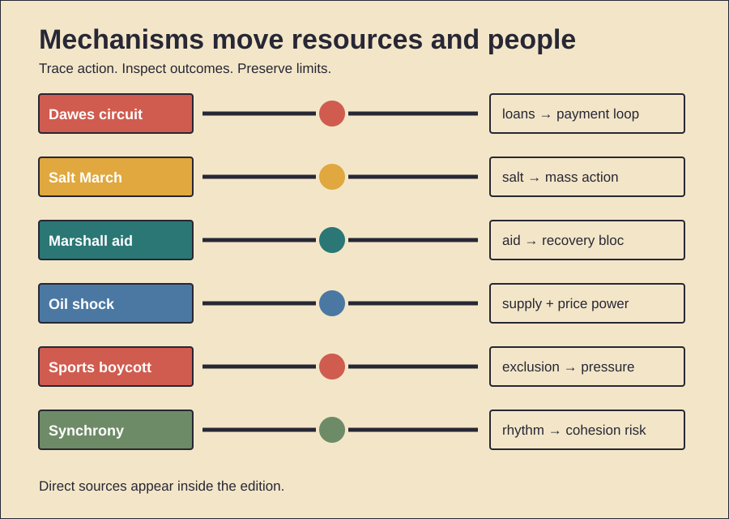

# Circulation, Symbols, and Solidarity

History Investigation — 28 September 2026, 18:00 Réunion

Five cases trace money, symbols, and collective pressure. One behavior card follows. Facts, interpretation, and uncertainty stay separate.

## 1. The Dawes Plan built a circuit

**Documented fact.** Germany owed wartime reparations. Allied governments owed American debts. Payments stalled after 1922. France occupied the Ruhr. German resistance worsened inflation. The Dawes Committee reported during 1924. It reduced immediate installments. It reorganized German finances. A foreign loan followed. American capital then entered Germany. Germany paid Allied reparations. Allies serviced American debts. Industry recovered temporarily. Credit remained largely private. The total reparations bill stayed unsettled. **Scholarly interpretation.** The plan stabilized payments. It also created circulation. American loans supported German transfers. Those transfers supported Allied debt payments. Stabilization therefore depended externally. Political conflict became manageable. Financial dependence quietly increased. **Counterevidence and limits.** The circuit was incomplete. Money was not identical. Trade generated real income. German reforms also mattered. Recovery was not fictional. Reparations and war debts remained legally separate. Officials repeatedly stressed that distinction. The plan caused no Depression. Yet American lending reversed later. That reversal exposed fragility. The evidence supports dependence. It does not prove intentional entrapment.

*Word count: 159*

### Sources

- [The Dawes Plan — Office of the Historian](https://history.state.gov/milestones/1921-1936/dawes)
- [Foreign Relations Papers, 1924](https://history.state.gov/historicaldocuments/frus1924v02/d65)
- [U.S. Economy in the 1920s — EH.net](https://eh.net/encyclopedia/the-u-s-economy-in-the-1920s/)
- [Foreign Relations Papers, 1923](https://history.state.gov/historicaldocuments/frus1923v02/papers)

## 2. Salt made empire tangible

**Documented fact.** British India taxed salt. Colonial law restricted production. Gandhi challenged that monopoly. He first warned Viceroy Irwin. His letter listed broader grievances. Land revenue appeared there. Military spending appeared there. Exchange policy appeared there. Salt became the chosen breach. Gandhi left Sabarmati during March 1930. Marchers reached Dandi during April. He lifted saline mud. Supporters then made salt. Authorities arrested thousands. Gandhi was arrested later. Other protests continued. **Scholarly interpretation.** Salt joined principle with daily life. Everyone needed it. Poor households felt taxation sharply. Making salt required simple action. That made participation visible. The march also created news. Its pacing built attention. The symbol translated constitutional claims. It did not replace them. **Counterevidence and limits.** Salt revenue was not Britain’s sole interest. Independence required more campaigns. Participation varied across regions. Women joined extensively, despite limited initial inclusion. Colonial repression also constrained outcomes. The march brought no immediate independence. Negotiations produced limited concessions. Its strongest effect was mobilization. Symbolic power cannot be measured precisely.

*Word count: 165*

### Sources

- [Background to Salt Satyagraha — Gandhi Heritage Portal](https://www.gandhiheritageportal.org/es/background-to-the-salt-satyagraha)
- [Letter to Lord Irwin — Mani Bhavan Gandhi Museum](https://www.gandhi-manibhavan.org/educational-resources/letter-to-lord-irwin.html)
- [Dandi Heritage Site — Gandhi Heritage Portal](https://gandhiheritageportal.org/ta/gandhi_heritage_site/writeup/MzY%3D)
- [Nehru Circular, 5 March 1930](https://nehruarchive.in/documents/to-secretaries-p-c-cs-5-march-1930-x6go3)

## 3. Marshall aid served several aims

**Documented fact.** Europe faced severe postwar shortages. George Marshall proposed coordinated recovery. Congress passed legislation during 1948. More than twelve billion dollars followed. Participating governments planned jointly. Aid financed food. It financed fuel. It financed machinery. Counterpart funds supported local investment. Production recovered. Trade expanded. European cooperation deepened. The program excluded no country formally. Soviet leaders rejected participation. Eastern governments then withdrew. **Scholarly interpretation.** Relief served several aims. Recovery reduced suffering. It revived trading partners. It strengthened political stability. American officials also feared Communist expansion. Market institutions shaped the program. Integration supported a Western bloc. Those interests can coexist. Mutual benefit does not erase aid. **Counterevidence and limits.** Europe’s recovery had other causes. Domestic reforms mattered. Earlier rebounds had begun. German currency reform mattered. Global demand also helped. Marshall aid was smaller than total investment. Not every shipment came freely. Procurement rules favored available suppliers. Claims of total American control go too far. European governments negotiated priorities. The program accelerated recovery. Its exact contribution remains debated.

*Word count: 166*

### Sources

- [Marshall Plan Act — U.S. National Archives](https://www.archives.gov/milestone-documents/marshall-plan)
- [Marshall Plan, 1948 — Office of the Historian](https://history.state.gov/milestones/1945-1952/marshall-plan)
- [The Truman Doctrine and Marshall Plan](https://history.state.gov/departmenthistory/short-history/truman)
- [Marshall Plan Records — National Archives](https://www.archives.gov/publications/record/1998/09/marshall-plan.html)

## 4. The oil shock had two levers

**Documented fact.** Arab producers announced an embargo. The October 1973 war triggered it. Production cuts also followed. Targeted countries faced restrictions. Separately, OPEC producers raised posted prices. Persian Gulf members increased prices sharply. Prices later quadrupled overall. Importing economies suffered inflation. Recession followed in many places. Governments rationed fuel. They changed speed limits. They built strategic reserves. The IEA formed during 1974. **Scholarly interpretation.** The embargo became the public symbol. Price-setting power mattered separately. Tight supply strengthened bargaining. Dollar weakness also influenced producers. Existing demand growth reduced spare capacity. The shock combined geopolitics with market structure. **Counterevidence and limits.** The embargo was temporary. Its targets shifted. Global barrels were often rerouted. Some shortages reflected controls. Panic buying worsened queues. Inflation had begun earlier. Monetary policy also mattered. OPEC was not perfectly unified. Producers pursued different goals. The war explains timing. It does not explain every price. The evidence supports two levers: reduced supply and coordinated pricing. Their exact shares remain disputed.

*Word count: 161*

### Sources

- [Oil Embargo, 1973–1974 — Office of the Historian](https://history.state.gov/milestones/1969-1976/oil-embargo)
- [OPEC Price and Cutback Decisions — FRUS](https://history.state.gov/historicaldocuments/frus1969-76v25/d200)
- [Economic Effects Memorandum — FRUS](https://history.state.gov/historicaldocuments/frus1969-76v27/d49)
- [History of the IEA](https://www.iea.org/about/mission/history-of-the-iea)

## 5. Sport made isolation visible

**Documented fact.** Apartheid segregated South African sport. Nonracial bodies challenged official teams. African states pressed international federations. South Africa missed Olympic competition. A planned 1968 return collapsed. Boycott threats mattered. During 1976, many African teams left Montreal. They protested New Zealand’s rugby contacts. The United Nations promoted sports isolation. It tracked contacts. A 1985 convention formalized pressure. South Africa returned during 1992. Apartheid laws were then being dismantled. **Scholarly interpretation.** Sport offered unusual leverage. White South Africans valued international competition. Exclusion made pariah status visible. Athletes became political messengers. Newly independent states gained collective influence. Boycotts also connected domestic activists with global institutions. **Counterevidence and limits.** Sport caused no transition alone. Internal resistance remained central. Economic sanctions also mattered. Regional conflict mattered. Diplomatic shifts mattered. Boycotts harmed some athletes. Enforcement stayed uneven. Professional contacts sometimes continued. The 1976 walkout targeted New Zealand, not South Africa directly. That distinction matters. Evidence supports symbolic and social pressure. It cannot isolate one decisive causal effect.

*Word count: 162*

### Sources

- [International Boycott of Apartheid Sport — SAHO](https://sahistory.org.za/article/international-boycott-apartheid-sport-mary-corrigall)
- [UN Declaration Against Apartheid in Sports](https://digitallibrary.un.org/record/77020/files/183969-EN.pdf)
- [UN Sports-Boycott Resolution — Refworld](https://www.refworld.org/legal/resolution/unga/1975/en/19116)
- [UN and Apartheid Timeline — SAHO](https://sahistory.org.za/article/united-nations-and-apartheid-timeline-1946-1994)

## 6. Primitive Echo: moving together

**Documented evidence.** People synchronize during rituals. They clap together. They march together. They dance together. Experiments link synchrony with cooperation. Shared movement can increase affiliation. Large-group studies find similar effects. Dance studies also report bonding. Increased pain thresholds sometimes follow. Researchers use that as an indirect endorphin measure. **Scholarly interpretation.** Synchrony supplies coordination feedback. Each person predicts others. Successful matching signals commitment. Shared arousal strengthens salience. Groups may therefore cooperate faster. Such mechanisms could aid collective action. They may have supported ritual historically. Modern concerts reuse them. Military drill also does. Political rallies can too. **Counterevidence and limits.** Evolutionary function remains inferred. Laboratory tasks simplify culture. Pain thresholds are imperfect proxies. Effects differ across settings. Shared goals matter. Music matters. Prior identity matters. Synchrony can narrow sympathy. It may favor insiders. Reviews also flag conformity. Creativity can decline. Harmful obedience can increase. Moving together guarantees no virtue. The mechanism supports bonding. Culture directs that bond. Institutions shape its consequences.

*Word count: 159*

### Sources

- [Synchrony, Exertion, and Social Bonding](https://pmc.ncbi.nlm.nih.gov/articles/PMC4650190/)
- [Synchrony and Cooperation](https://pmc.ncbi.nlm.nih.gov/articles/PMC3737148/)
- [Large-Group Synchrony and Cooperation](https://pmc.ncbi.nlm.nih.gov/articles/PMC5760525/)
- [Cultural Trade-Offs of Synchrony](https://pmc.ncbi.nlm.nih.gov/articles/PMC7423264/)

## Illustration

## Production note

The HTML file remains unpublished. The video and viewer share lesson data. The viewer works offline.