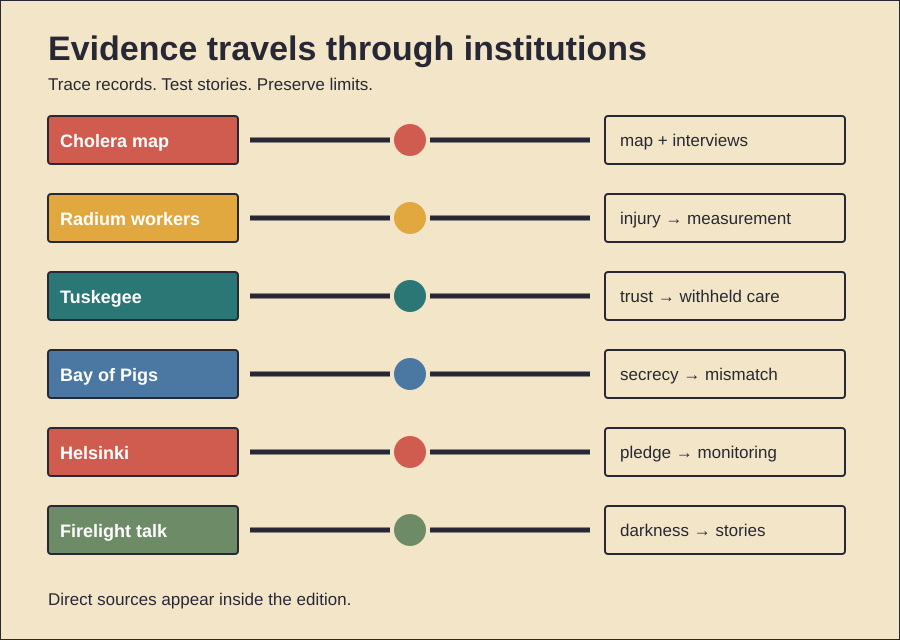

# Maps, Trust, and Pledges

History Investigation — 28 September 2026, 18:56 Réunion

Five cases examine evidence, institutional trust, and commitments. One behavior card follows. Facts, interpretation, and uncertainty stay separate.

## 1. Snow’s map was not solitary proof

**Documented fact.** Cholera struck Soho during 1854. John Snow suspected contaminated water. He interviewed affected households. He compared water suppliers. He examined unusual exceptions. A workhouse had few deaths. It used separate water. A brewery also fared better. Snow linked cases to Broad Street. A map displayed their clustering. Local guardians removed the pump handle. Henry Whitehead investigated locally. Later inquiry found well contamination. **Scholarly interpretation.** Snow built converging evidence. Geography mattered. Interviews mattered equally. Natural comparisons strengthened inference. Whitehead’s local knowledge also mattered. The famous map became memorable. It simplified a collaborative process. **Counterevidence and limits.** The outbreak was already declining. Many residents had fled. Handle removal therefore proves little alone. Snow did not discover bacteria. Filippo Pacini described the organism independently. Snow’s map may not have generated his hypothesis. Officials remained unconvinced. Miasma reforms still improved sanitation. The evidence supports waterborne transmission. It does not support a lone-map miracle.

*Word count: 151*

### Sources

- [John Snow’s Cholera Map — Duke Libraries](https://library.duke.edu/exhibits/hubbard-may_2025)
- [John Snow and the Broad Street Pump](https://pmc.ncbi.nlm.nih.gov/articles/PMC7150208/)
- [Our Sense of Snow — PubMed](https://pubmed.ncbi.nlm.nih.gov/10714917/)
- [Snow and Whitehead — PubMed](https://pubmed.ncbi.nlm.nih.gov/16891036/)

## 2. Radium evidence entered through workers

**Documented fact.** Dial painters used luminous radium paint. Many shaped brushes orally. Radium then entered their bodies. Young women developed jaw injuries. Bone disease followed. Cancers appeared later. Company-linked experts disputed causation. Independent examinations found injury. Workers sued during the 1920s. New Jersey claimants gained settlements. Illinois litigation continued later. Scientific follow-up tracked exposures. Their cases helped quantify internal radiation risks. Publicity changed workplace practice. Brush pointing by mouth declined. **Scholarly interpretation.** The workers became evidence producers. Their bodies challenged controlled research. Litigation opened records. Compensation also recognized occupational disease. The episode connected labor law with radiation science. **Counterevidence and limits.** Early radiation knowledge was incomplete. Latency complicated proof. Exposure levels varied. Different firms behaved differently. Settlement established no universal precedent. Later standards had many causes. Researchers also learned from medical exposures. The women were not merely passive victims. Yet later studies sometimes treated them instrumentally. The record supports preventable workplace harm. It cannot assign identical knowledge to every manager.

*Word count: 160*

### Sources

- [National Bureau of Standards and Dial Painters](https://pmc.ncbi.nlm.nih.gov/articles/PMC10046820/)
- [Radium Dial Workers: Back to the Future](https://pmc.ncbi.nlm.nih.gov/articles/PMC10563809/)
- [Short History of Occupational Disease](https://pmc.ncbi.nlm.nih.gov/articles/PMC7907902/)
- [Bone Cancer Among Dial Workers](https://pubmed.ncbi.nlm.nih.gov/628024/)

## 3. Tuskegee studied withheld care

**Documented fact.** Federal researchers began during 1932. Tuskegee Institute cooperated. The study enrolled 600 Black men. Three hundred ninety-nine had syphilis. Two hundred one did not. Researchers sought natural-history data. Participants lacked informed consent. Staff described special treatment. They instead observed disease. Penicillin became standard later. Researchers still withheld effective treatment. They also discouraged outside treatment. A press report exposed the study during 1972. The project then ended. A federal settlement followed. New review protections developed afterward. **Scholarly interpretation.** Deception sustained participation. Racism shaped vulnerability. Clinical authority made refusal harder. Scientific goals displaced patient duties. The study damaged public trust. **Counterevidence and limits.** Researchers did not infect participants. Not every enrollee had syphilis. Those corrections matter. They do not excuse deception. Early therapies were hazardous. That explains initial uncertainty. It cannot justify post-penicillin continuation. Ethical reforms had other roots. Tuskegee nevertheless accelerated them. Later distrust has multiple causes. The study’s precise effect varies across populations.

*Word count: 155*

### Sources

- [About the Tuskegee Study — CDC](https://www.cdc.gov/tuskegee/about/index.html)
- [Tuskegee Study Timeline — CDC](https://www.cdc.gov/tuskegee/about/timeline.html)
- [Fiftieth Anniversary Review](https://pmc.ncbi.nlm.nih.gov/articles/PMC9872801/)
- [Tuskegee Study Collection — National Archives](https://catalog.archives.gov/id/281642)

## 4. Deniability weakened the invasion

**Documented fact.** The CIA trained Cuban exiles. Brigade 2506 landed during April 1961. Planners expected local support. They expected Castro’s forces to fracture. Air strikes targeted Cuban aircraft. Kennedy limited visible American involvement. Planned air coverage was reduced. Surviving Cuban aircraft attacked ships. Supplies sank offshore. Castro’s forces contained the beachhead. The brigade surrendered quickly. **Scholarly interpretation.** Covert design created contradictions. Success required military force. Deniability restricted that force. Compartmentalization narrowed criticism. Planners discounted contrary evidence. Kennedy inherited the project. He also approved it. Responsibility therefore crossed institutions. **Counterevidence and limits.** No single canceled strike explains defeat. Landing geography mattered. Intelligence errors mattered. Brigade tactics mattered. Castro had prepared defenses. American intervention could have escalated dangerously. Restraint therefore had reasons. Claims of deliberate sabotage lack evidence. CIA reviews criticized planning. Other reviews emphasized presidential decisions. The strongest finding is systemic mismatch. Political constraints and military needs diverged.

*Word count: 147*

### Sources

- [Bay of Pigs — Office of the Historian](https://history.state.gov/milestones/1961-1968/bay-of-pigs)
- [Bay of Pigs — CIA History](https://www.cia.gov/stories/story/the-bay-of-pigs-invasion/)
- [Bay of Pigs Documents — National Security Archive](https://nsarchive.gwu.edu/events/bay-pigs-1961)
- [CIA Inspector General Analysis](https://nsarchive.gwu.edu/briefing-book/cuba-cuban-missile-crisis/2026-04-16/cuba-bay-pigs-invasion-65-years-later)

## 5. Helsinki promises became activist tools

**Documented fact.** Thirty-five states signed during 1975. The Helsinki Final Act addressed security. It affirmed existing frontiers. It promoted economic exchange. It also named human rights. Movement and information appeared. Soviet leaders valued border recognition. Western critics feared concession. The document was politically binding. It was not a treaty. Activists then formed monitoring groups. They recorded violations. They cited signed commitments. Governments raised those reports diplomatically. Authorities also repressed monitors. **Scholarly interpretation.** The agreement created vocabulary. Dissidents converted diplomacy into accountability. Public commitments raised reputational costs. Transnational networks carried evidence outward. An elite bargain gained pressure from below. That consequence exceeded many expectations. **Counterevidence and limits.** The Act stopped no repression immediately. Enforcement remained weak. Signatories violated provisions. Détente had many objectives. Monitoring groups were not protected. Several members were imprisoned. The Soviet bloc ended for many reasons. Economic weakness mattered. National movements mattered. Leadership choices mattered. Helsinki was no secret blueprint. Its contribution lay in usable commitments. Their causal weight remains debated.

*Word count: 163*

### Sources

- [Helsinki Final Act — OSCE](https://www.osce.org/helsinki-final-act)
- [Helsinki Final Act, 1975 — State Department](https://history.state.gov/milestones/1969-1976/helsinki)
- [Helsinki Monitoring Groups — FRUS](https://history.state.gov/historicaldocuments/frus1977-80v02/d80)
- [Helsinki Network — Wilson Center](https://www.wilsoncenter.org/event/human-rights-activism-and-end-the-cold-war-transnational-history-the-helsinki-network)

## 6. Primitive Echo: stories after dark

**Documented evidence.** Anthropologist Polly Wiessner studied Ju/’hoansi talk. Her dataset compared 174 conversations. Sixty-eight translated texts supplemented them. Daytime talk focused on work. Resources also dominated. Night talk changed. Stories became common. Mythic characters appeared. Distant networks appeared. Songs and dances also grew. Fire extended social time. **Scholarly interpretation.** Daylight favors subsistence. Darkness restricts practical work. Fire creates a safe focus. Stories can transmit norms. They can preserve relationships. They can imagine distant people. Shared emotion may build trust. Modern bedtime stories echo this setting. Podcasts may reproduce attention conditions. **Counterevidence and limits.** One population proves no universal past. The study was observational. Conversation categories require judgment. Electric light changes behavior. Modern media differ profoundly. Fire itself may not cause storytelling. Work schedules may explain timing. Cultural traditions also matter. Archaeology cannot recover ancient conversations. Evolutionary claims therefore remain hypotheses. The evidence supports time-structured talk. It does not prove every story began around fires.

*Word count: 155*

### Sources

- [Embers of Society — PNAS](https://www.pnas.org/doi/10.1073/pnas.1404212111)
- [Firelight Talk — PubMed](https://pubmed.ncbi.nlm.nih.gov/25246574/)
- [Embers of Society — PNAS PDF](https://www.pnas.org/doi/pdf/10.1073/pnas.1404212111)
- [PNAS Study Abstract — Harvard ADS](https://ui.adsabs.harvard.edu/abs/2014PNAS..11114027W/abstract)

## Illustration

## Production note

The HTML file remains unpublished. The video and viewer share lesson data. The viewer works offline.