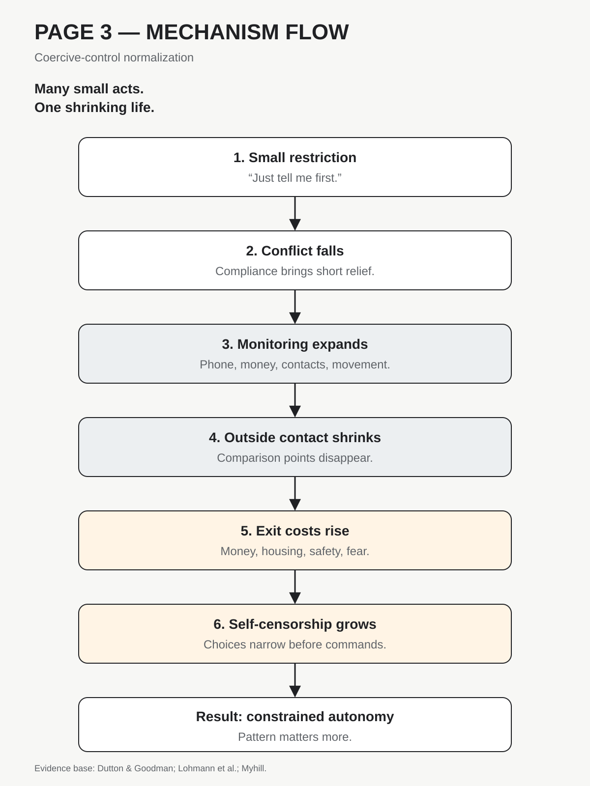
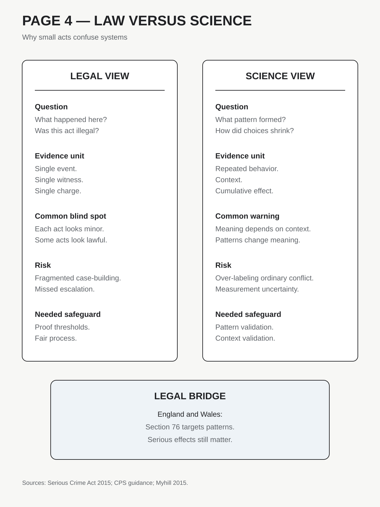
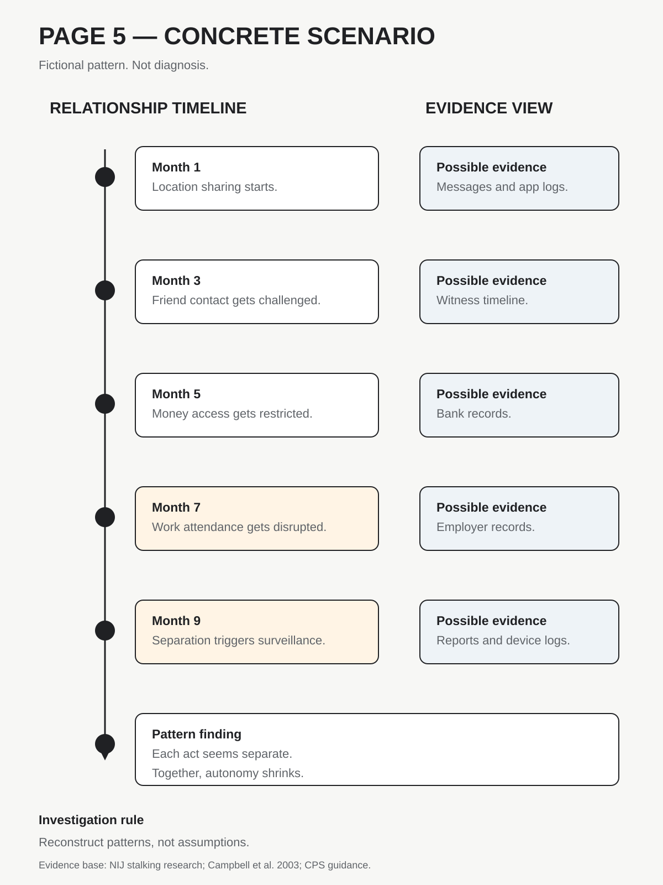

# Human Nature Dossier

## Coercive-Control Normalization

**Date:** 2026-09-23 13:25 +04:00

**Central question:**

What buried trait matters?

How can control normalize?

---

# Page 1

## Core idea

Control rarely announces itself.

It often looks ordinary.

Rules can seem caring.

Monitoring can seem protective.

Money limits seem practical.

Isolation can seem private.

Patterns change the meaning.

Context changes the risk.

**The disturbing truth:** Freedom can vanish without bruises.

**What this does NOT prove:** Control does not ensure violence.

## Definition

Coercive control is patterned.

It restricts another's autonomy.

It uses repeated pressures.

It can include surveillance.

It can include isolation.

It can restrict money.

It can punish independence.

Fear changes everyday choices.

No single act defines it.

The pattern matters most.

## Mechanism

1. A small rule appears.
2. Compliance reduces conflict.
3. New rules appear.
4. Monitoring grows.
5. Outside contacts shrink.
6. Resources become restricted.
7. Resistance becomes costly.
8. Self-censorship becomes routine.
9. Autonomy narrows over time.

This can become normalized.

People adapt incrementally.

Outsiders see fragments.

Victims experience the pattern.

That mismatch matters legally.

## Lens 1: Psychology

People adapt to pressure.

Compliance can reduce conflict.

That can reinforce compliance.

Isolation weakens outside comparison.

Dependency raises exit costs.

Monitoring changes self-presentation.

Fear narrows perceived choices.

Lohmann pooled 45 studies.

Coercive control tracked PTSD.

PTSD correlation reached r=.32.

Depression reached r=.27.

These are associations.

They do not prove causality.

Study variation was high.

That limits precision.

Myhill used national data.

Patterns changed prevalence conclusions.

Situational violence looked symmetric.

Coercive abuse looked gendered.

Women were mostly victims.

Other populations still matter.

## Scientists disagree

Definitions vary across studies.

Measures also vary.

Typologies remain debated.

Gender patterns remain debated.

Context changes classification.

Samples often differ greatly.

Service samples differ too.

Most evidence is observational.

Self-report adds recall bias.

Causality stays difficult.

Same-sex abuse also occurs.

Male victims also exist.

## Counterargument

Not every rule controls.

Care can involve limits.

Partners negotiate boundaries.

Safety can require restrictions.

Some control is reciprocal.

Culture shapes expectations.

Therefore context is essential.

Pattern evidence is essential.

Impact evidence is essential.

---

# Page 2

## Lens 2: Investigation

Single incidents can mislead.

Patterns need reconstruction.

Investigators need context.

Digital traces may help.

Bank records may help.

Witness timelines may help.

Prior reports may matter.

Stalking can follow separation.

Surveillance can continue digitally.

NIJ studies support this.

One survivor study mattered.

Fifty-seven percent reported surveillance.

That sample was specific.

It was not population-wide.

Campbell studied femicide cases.

Controlling-partner estrangement increased risk.

That does not predict individuals.

Risk assessment needs combinations.

### Criminal-investigation implication

Investigate the relationship pattern.

Do not isolate incidents.

Map restrictions over time.

Record victim adaptations too.

Check stalking after separation.

Preserve digital evidence lawfully.

Document economic restrictions too.

Avoid assuming mutual conflict.

## Lens 3: Political history

Political analogy needs caution.

State coercion differs fundamentally.

Still, patterns matter.

GDR archives document surveillance.

They document covert disruption.

Dissenters faced cumulative pressures.

Institutions enabled those pressures.

This is documented history.

The structural parallel differs.

Many acts can aggregate.

That can shrink autonomy.

This is interpretation only.

It does not equate cases.

## Lens 4: Nietzsche

Nietzsche studied moral genealogy.

He distrusted surface motives.

His lens asks this:

Can virtue mask power?

Protection language can dominate.

Care language can dominate.

That remains philosophical interpretation.

It is not evidence.

Nietzsche proves nothing here.

## Lens 5: Greene

Greene writes about power.

He describes strategic dependency.

That resembles some tactics.

Research uses different standards.

Patterns require measured harm.

Greene cannot establish causation.

His work is interpretive.

It is not science.

## Legal conflict

Law likes discrete acts.

Control works through patterns.

Each act may look lawful.

Cumulative effects can dominate.

England and Wales responded.

Section 76 criminalizes patterns.

Serious effects are required.

Knowledge standards also apply.

Post-separation coverage expanded.

CPS guidance emphasizes context.

Prior incidents can matter.

That changes evidence strategy.

## Moral conflict

Moral judgment seeks villains.

Real patterns can look mundane.

Observers may expect violence.

Victims may show compliance.

Compliance can reflect adaptation.

Calm behavior proves little.

Leaving can increase danger.

Dependence can constrain choices.

This complicates blame.

## Social self-image

People value personal autonomy.

Relationships challenge that image.

Control can hide socially.

Concern can become permission.

Permission can become expectation.

Expectation can become enforcement.

The transition feels gradual.

That gradualism feels uncomfortable.

---

# Page 3

## Mechanism flow

---

# Page 4

## Law versus science

---

# Page 5

## Concrete scenario

---

# Method limits

No study captures everything.

Definitions still vary.

Measures still vary.

Heterogeneity remains substantial.

Observational evidence dominates.

Reverse causation can matter.

Recall bias can matter.

Sampling bias can matter.

Legal categories also vary.

Countries define offences differently.

Never diagnose from checklists.

Use trained assessment methods.

# Source list

1. Lohmann S, et al. Systematic review. DOI: https://doi.org/10.1177/15248380231162972
2. Myhill A. National survey analysis. DOI: https://doi.org/10.1177/1077801214568032
3. Dutton MA, Goodman LA. Conceptual framework. DOI: https://doi.org/10.1007/s11199-005-4196-6
4. Hamberger LK, et al. Research review. DOI: https://doi.org/10.1016/j.avb.2017.08.003
5. Campbell JC, et al. Femicide risk study. DOI: https://doi.org/10.2105/AJPH.93.7.1089
6. NIJ coercive-control study. https://nij.ojp.gov/library/publications/sex-differences-intimate-partner-violence-and-use-coercive-control
7. NIJ surveillance study. https://nij.ojp.gov/library/publications/patterns-surveillance-control-and-abuse-among-diverse-sample-intimate-partner
8. UK Serious Crime Act. https://www.legislation.gov.uk/ukpga/2015/9/section/76
9. CPS prosecution guidance. https://www.cps.gov.uk/legal-guidance/controlling-or-coercive-behaviour-intimate-or-family-relationship
10. Bundesarchiv Stasi history. https://www.bundesarchiv.de/publikationen/publikation/the-dissenter-is-the-enemy/
11. Nietzsche primary text. https://www.gutenberg.org/ebooks/52319
12. Greene publisher page. https://www.penguinrandomhouse.com/books/330912/the-48-laws-of-power-by-robert-greene/9780140280197/

# Evidence note

The evidence supports patterns.

It does not support fatalism.

It does not excuse harm.

It does not erase agency.

Context remains necessary.

# Next topic queue

1. Honor-norm retaliation.
2. Self-deception under threat.
3. Motivated forgetting.
4. Status-quo moralization.
5. Memory distrust effects.
