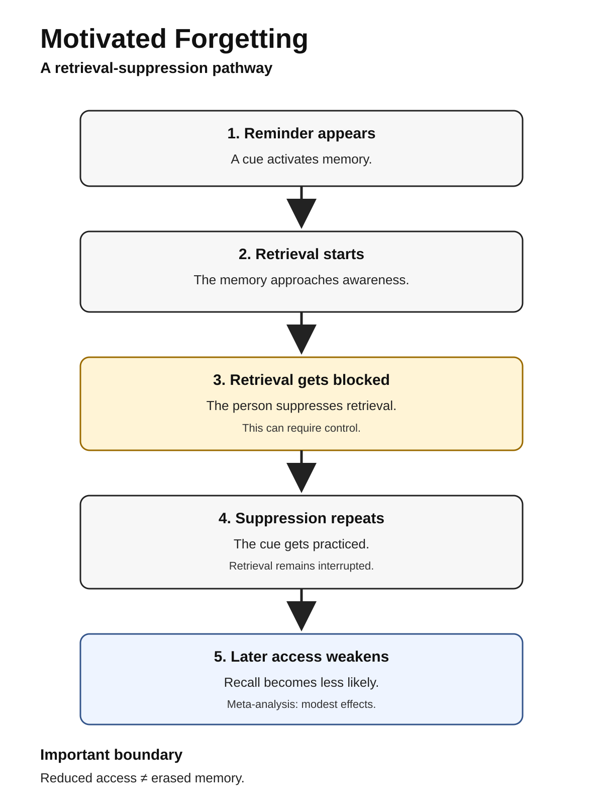
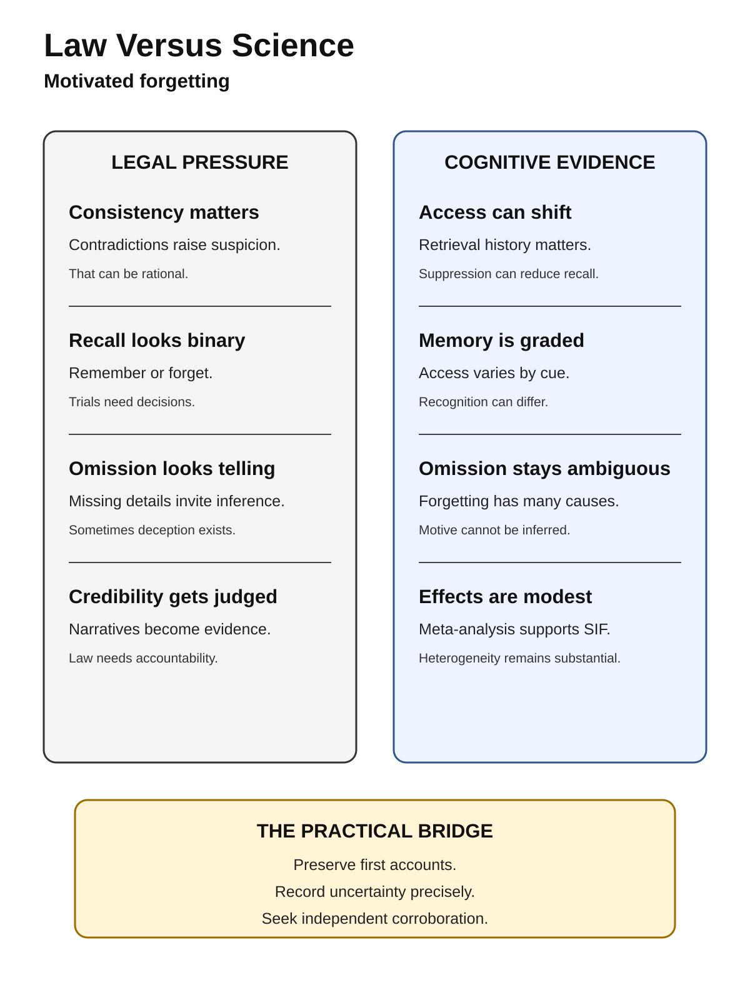
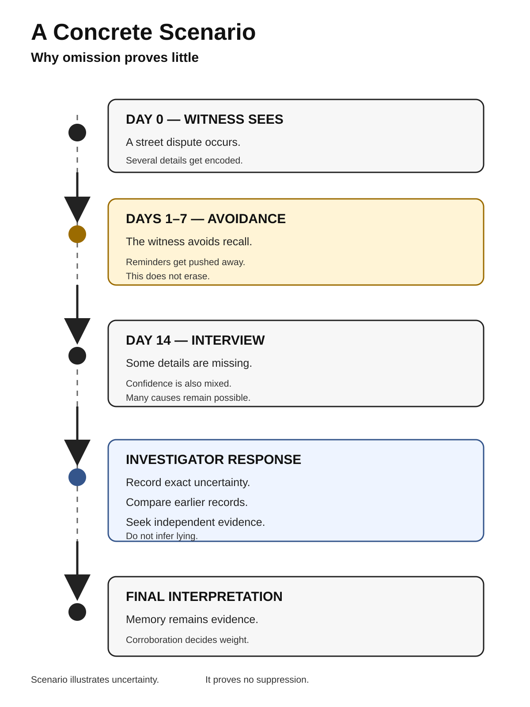

# Human Nature Dossier

## Motivated Forgetting

**Date:** 2026-09-23 14:28 +04:00

**Central question:**

Can people suppress memory?

Can forgetting protect identity?

Can law misread that?

---

# Page 1

## Core idea

Memory is not storage.

Retrieval changes later access.

Attention changes later access.

Suppression changes later access.

Some forgetting is passive.

Some forgetting is active.

People can avoid retrieval.

Repeated avoidance can matter.

Later recall may weaken.

The memory may remain.

Access becomes less likely.

That distinction matters.

**The disturbing truth:** We can help memories weaken.

**What this does NOT prove:** Forgetting proves no guilt.

## Definition

Motivated forgetting is broad.

This dossier stays narrow.

It focuses retrieval suppression.

A cue triggers memory.

The person blocks retrieval.

That effort repeats.

Later recall becomes harder.

Researchers call this SIF.

That means suppression-induced forgetting.

It differs from distraction.

It differs from decay.

It differs from lying.

It differs from amnesia.

It differs from repression.

Those distinctions are essential.

## Mechanism

1. A cue appears.
2. Retrieval begins.
3. Control interrupts retrieval.
4. The memory stays unused.
5. Suppression repeats again.
6. Later cues work worse.
7. Recall becomes less likely.

The effect stays modest.

The effect also varies.

No erasure is required.

No motive is visible.

No guilt is implied.

## Lens 1: Psychology

Anderson and Green tested this.

Their paradigm became standard.

Participants learned word pairs.

Some cues required recall.

Other cues required suppression.

Suppressed items suffered later.

That launched much research.

A 2026 meta-analysis matters.

It covered 120 studies.

It included 500 effects.

Effects were consistently present.

Effect sizes stayed modest.

Same-probe effects reached 6%.

Independent-probe effects reached 5–6%.

Recognition effects reached 2–4%.

Standardized effects varied.

They reached d=.20–.40.

Heterogeneity remained substantial.

Prediction intervals were broad.

Method choices changed outcomes.

Autobiographical material differed too.

That supports the mechanism.

It limits universal claims.

## Why this unsettles

People trust inner sincerity.

We imagine memory neutrality.

We assume facts remain.

We blame selective recall.

Sometimes blame fits.

Sometimes access truly changes.

A person may suppress.

Later non-recall becomes genuine.

Earlier intent still matters.

Later experience can differ.

That troubles moral judgment.

It troubles legal judgment.

## Scientists disagree

The basic effect replicates.

Its size varies greatly.

Mechanisms remain debated.

Inhibition is one account.

Interference is another account.

Strategy use also matters.

Laboratory tasks stay artificial.

Real memories contain context.

Real motives are stronger.

Real stakes change behavior.

Clinical generalization needs caution.

Forensic generalization needs caution.

## Adjacent claim: unethical amnesia

This claim needs caution.

Kouchaki and Gino reported it.

They published nine studies.

Total N reached 2,109.

Unethical memories seemed blurrier.

Later work challenged accuracy.

Stanley and colleagues replicated.

Three studies found nothing.

They tested imagined violations.

Objective accuracy stayed unchanged.

That weakens broad claims.

Another warning emerged.

A 2011 paper matters.

It linked cheating, forgetting.

SAGE flagged it later.

An expression appeared 2025.

Study Two failed replication.

Original data were unavailable.

One author lost confidence.

So caution is mandatory.

## Counterargument

Forgetting can be ordinary.

Time produces memory loss.

Interference produces memory loss.

Stress can alter retrieval.

Sleep affects consolidation too.

People also strategically lie.

Suppression explains only some.

Motivation cannot be inferred.

Non-recall proves very little.

---

# Page 2

## Lens 2: Investigation

Investigations depend on memory.

Homicide cases often do.

Witnesses may delay reporting.

Suspects may avoid recollection.

Victims may avoid recollection.

Investigators face ambiguity.

Silence may be strategic.

Silence may be protective.

Silence may reflect retrieval.

Those states look similar.

They require corroboration.

NIJ guidance emphasizes preservation.

Early recollections should be recorded.

Interview conditions should be documented.

Later changes need context.

Repeated interviews need care.

### Criminal-investigation implication

Preserve the first account.

Record exact uncertainty.

Record exact wording.

Separate recall from inference.

Check independent evidence early.

Avoid memory accusations alone.

Do not equate omission.

Omission is not deception.

Deception also remains possible.

Use corroboration instead.

## Legal conflict

Law tests credibility heavily.

Consistency often affects credibility.

Inconsistency often triggers suspicion.

That has practical reasons.

Science adds a complication.

Memory access can shift.

Retrieval history can matter.

Suppression can reduce access.

Therefore inconsistency is ambiguous.

New Jersey confronted memory.

State v. Henderson mattered.

The court reviewed science.

It found memory malleable.

It revised identification rules.

That case concerns identification.

It does not prove suppression.

Still, the conflict remains.

Law needs stable evidence.

Memory is not stable.

## Moral conflict

Morality tracks responsibility.

People expect self-knowledge.

Forgetting looks self-serving.

Sometimes it probably is.

But access can change.

That creates two questions.

What happened earlier?

What is accessible now?

Those questions can diverge.

Moral judgment merges them.

Science separates them.

## Social self-image

People prefer moral continuity.

We want coherent identities.

Bad memories threaten coherence.

Avoidance can protect coherence.

That need feels ordinary.

Its consequences feel uncomfortable.

A cleaner self-story emerges.

The past feels distant.

Certainty can return afterward.

That certainty proves little.

## Lens 3: Political history

Political forgetting differs here.

States do not have brains.

Institutions still manage memory.

Spain offers one example.

Law 46/1977 granted amnesty.

It covered political acts.

It covered official acts.

The law remains documented.

Later debate became extensive.

Commentators named a pact.

They called it forgetting.

That label is interpretive.

The law itself differs.

It was institutional policy.

It was not cognition.

Still, one parallel appears.

Societies can reduce retrieval.

They can narrow discussion.

They can defer reckoning.

That is historical interpretation.

It proves no mechanism.

## Lens 4: Nietzsche

Nietzsche discussed forgetting.

He treated it positively.

He called it active forgetfulness.

He linked it agency.

He linked it renewal.

His concern was philosophical.

He did not run experiments.

His idea feels relevant.

Forgetting can be functional.

Function can have costs.

Science tests narrower claims.

Nietzsche proves nothing here.

## Lens 5: Greene

Greene discusses repression.

His chapter uses Jung.

He stresses hidden motives.

He stresses denied impulses.

That lens feels adjacent.

But constructs differ greatly.

Retrieval suppression is measurable.

Greene's repression is broader.

His examples are interpretive.

They are not experiments.

His account cannot validate SIF.

SIF cannot validate Greene.

## Where law diverges

Law needs accountable narratives.

Science sees variable retrieval.

Law asks what happened.

Science asks access conditions.

Law tests contradictions.

Science explains some contradictions.

Neither replaces the other.

Corroboration remains central.

## Replication limits

The 2026 review helps.

It supports SIF robustness.

It also shows heterogeneity.

Effects are not huge.

Many studies use words.

Some use autobiographical memories.

Instructions differ across labs.

Testing methods also differ.

Publication bias needs monitoring.

Demand effects remain possible.

Real crimes differ sharply.

Legal claims need restraint.

Unethical amnesia is shakier.

One replication failed clearly.

One related paper flagged.

That evidence stays contested.

---

# Page 3

## Mechanism flow

---

# Page 4

## Law versus science

---

# Page 5

## Concrete scenario

---

# Evidence summary

Strongest evidence concerns SIF.

That effect is modest.

That effect is replicable.

Generalization still needs caution.

Moral forgetting is weaker.

Forensic inference stays limited.

Non-recall proves no motive.

Suppression proves no guilt.

Memory needs corroboration.

# Source list

1. Clark CA, et al. Meta-analysis. DOI: https://doi.org/10.1037/xge0001922
2. Anderson MC, Green C. Nature. DOI: https://doi.org/10.1038/35066572
3. Anderson MC, Levy BJ. Review. DOI: https://doi.org/10.1111/j.1467-8721.2009.01634.x
4. Kouchaki M, Gino F. Unethical amnesia. DOI: https://doi.org/10.1073/pnas.1523586113
5. Stanley ML, et al. Failed replication. DOI: https://doi.org/10.3758/s13421-018-0803-y
6. Shu LL, et al. Original paper. DOI: https://doi.org/10.1177/0146167211398138
7. SAGE expression of concern. DOI: https://doi.org/10.1177/01461672251372058
8. NIJ eyewitness guide. https://nij.ojp.gov/library/publications/eyewitness-evidence-guide-law-enforcement
9. State v. Henderson. https://caselaw.findlaw.com/court/nj-supreme-court/1578475.html
10. Spain Amnesty Law. https://www.boe.es/buscar/act.php?id=BOE-A-1977-24937
11. Nietzsche primary text. https://web.viu.ca/johnstoi/nietzsche/genealogy2.htm
12. Greene publisher page. https://www.penguinrandomhouse.com/books/317474/the-laws-of-human-nature-by-robert-greene/

# Source warnings

Not all sources agree.

One result failed replication.

One paper is flagged.

Those warnings are included.

That protects the conclusion.

# Next topic queue

1. Status-quo moralization.
2. Self-deception under threat.
3. Moral credentialing.
4. Memory distrust effects.
5. Outgroup threat inflation.

## Queue note

Honor retaliation was deferred.

It overlaps status-threat aggression.

That avoids topic repetition.
