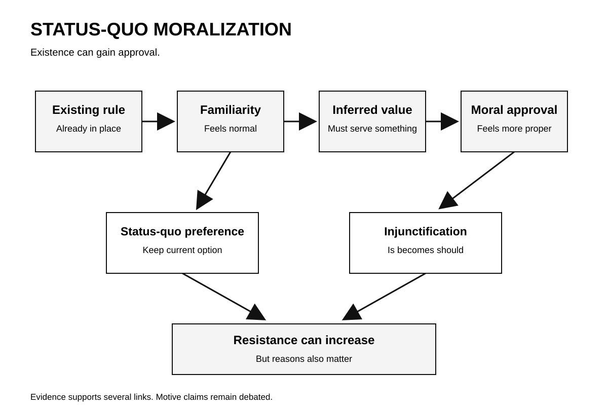
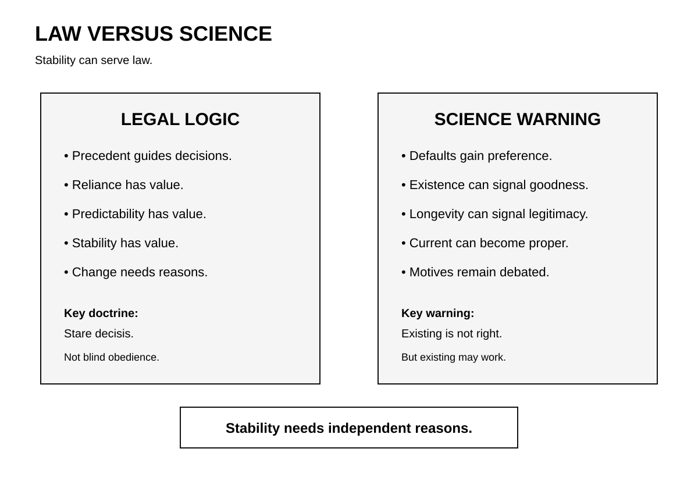
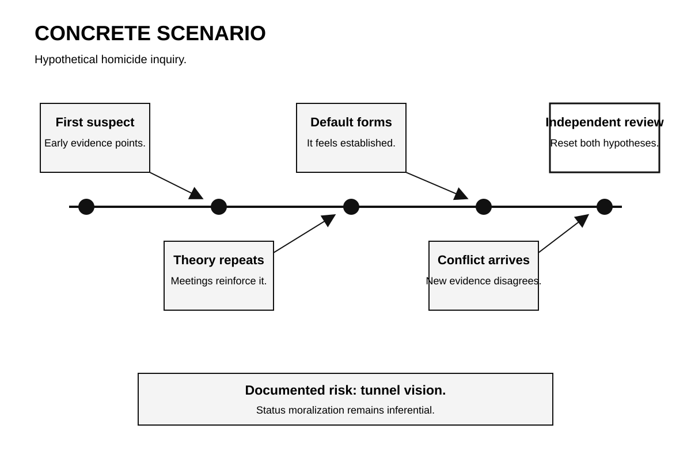

# Human Nature Dossier

## Status-Quo Moralization

**Date:** 2026-09-23 15:22 +04:00

**Central question:**

When does existence become virtue?

When does normal become right?

When does precedent become morality?

---

# Page 1

## Core idea

This dossier uses one label.

Research uses other terms.

Those terms differ.

Status-quo bias concerns choice.

Existence bias concerns evaluation.

Injunctification concerns moral approval.

System justification concerns legitimacy.

They can overlap.

They are not identical.

**The disturbing truth:**

Existing rules can feel moral.

**What this does NOT prove:**

Old systems are always wrong.

## The buried mechanism

People meet existing arrangements.

Those arrangements feel familiar.

Familiarity reduces uncertainty.

Defaults reduce decision costs.

Survival suggests usefulness.

Longevity suggests stability.

Then inference can shift.

Existing becomes acceptable.

Acceptable becomes proper.

Proper becomes deserved.

That final step matters.

Facts become moral signals.

Scientists call this injunctification.

Other work shows existence bias.

Other work shows defaults.

These effects overlap partly.

No single cause explains all.

## Lens 1: Psychology

Samuelson and Zeckhauser tested defaults.

People favored current options.

Experiments showed status preference.

Field choices showed it.

Health plans showed persistence.

Retirement choices showed persistence.

Switching costs partly matter.

Loss concerns also matter.

So does uncertainty.

The finding is broad.

Moral approval goes further.

Eidelman tested mere existence.

Existing things gained approval.

Participants rated them better.

Prevalence also changed ratings.

The authors proposed existence bias.

Kay studied injunctification directly.

Four studies were reported.

Current arrangements gained approval.

System threat increased effects.

Existing power seemed preferable.

Existing funding seemed preferable.

Existing demographics gained approval.

Counter-norm actors faced derogation.

That result feels uncomfortable.

People imagine moral independence.

Yet context can supply morality.

The environment offers defaults.

The mind supplies reasons.

## What scientists debate

The motive remains disputed.

That distinction is important.

Preference can occur automatically.

Preference can reflect learning.

Preference can reflect information.

Preference can reflect identity.

Preference can reflect costs.

Preference can reflect incentives.

Preference can reflect dependence.

No hidden motive is required.

System justification claims more.

It proposes legitimizing motives.

That literature faces concerns.

Sotola examined replicability.

The analysis covered 116 papers.

It covered 232 samples.

Estimated power was 16%.

Predicted replication stayed low.

Threat manipulations looked weaker.

Later studies improved somewhat.

That weakens broad certainty.

It does not erase effects.

Existence bias also faced tests.

McKelvie ran four experiments.

One study reversed direction.

Another effect stayed small.

Two studies supported preference.

So boundaries matter.

Context changes effect sizes.

Measures change conclusions.

Sample choices matter too.

A 2026 study helps.

It used 1,994 participants.

Current institutions gained support.

Democratic principles did not.

That shows construct limits.

Legitimacy needs specific measurement.

## Why this unsettles

Moral judgment feels internal.

Law feels external.

Tradition feels inherited.

Science complicates all three.

Existing rules shape intuition.

Intuition can mimic principle.

Longevity can mimic merit.

Normality can mimic justice.

That is socially awkward.

We praise independent judgment.

We often inherit categories.

We inherit procedures too.

We inherit institutional stories.

Some deserve preservation.

Some deserve challenge.

Psychology cannot decide which.

It can expose bias.

## Counterargument

Status preference can be rational.

Old rules contain information.

Stable systems coordinate behavior.

Switching creates real costs.

Precedent protects reliance.

Tradition can encode learning.

Repeated survival can matter.

Existing options need evidence.

New options need evidence.

Therefore caution makes sense.

The bias claim differs.

Bias appears without reasons.

Bias exceeds available evidence.

That distinction must stay.

---

# Page 2

## Lens 2: Investigation

Investigations build working theories.

Early theories guide searches.

Searches produce more evidence.

Evidence reinforces theories.

Then alternatives receive less attention.

Wrongful convictions document this.

NIJ funded case deconstruction.

Researchers reviewed fifty failures.

Confirmation bias was central.

System failures also mattered.

Tunnel vision was recurrent.

This research matters here.

Status moralization was unmeasured.

That caveat matters.

Still, one risk follows.

An established theory feels official.

Official can feel correct.

Correct can feel deserved.

That shift is dangerous.

### Criminal-investigation implication

Separate theory from evidence.

Record rival hypotheses early.

Assign independent review points.

Preserve rejected explanations.

Track contradictory evidence explicitly.

Do not reward consistency.

Reward diagnostic testing instead.

Blind review can help.

Context controls can help.

Corroboration remains essential.

A long-held theory matters.

Its age proves nothing.

## Legal conflict

Law values precedent openly.

That is called stare decisis.

The doctrine serves stability.

It serves predictability.

It protects reliance.

It supports institutional integrity.

Kimble stated those values.

Science adds one warning.

Longevity can inflate approval.

Existence can inflate goodness.

So two forces coexist.

Legal stability has reasons.

Psychological stability has bias.

They can look identical.

Their justification differs.

That creates tension.

Courts need continuity.

Justice also needs correction.

Kimble recognizes both needs.

Precedent is not absolute.

Psychology cannot replace doctrine.

Doctrine cannot erase psychology.

## Lens 3: Political history

Plessy provides one example.

The case came 1896.

The Court upheld segregation.

Louisiana law remained enforceable.

Legal separation gained precedent.

That precedent lasted decades.

Brown arrived in 1954.

School segregation was rejected.

Brown overruled that principle.

The National Archives documents both.

A psychological reading follows.

Law can normalize arrangements.

Duration can deepen normality.

Normality can support legitimacy.

That is interpretation only.

These cases prove no motive.

Judicial reasoning was complex.

Political pressures also differed.

Constitutional interpretation changed too.

History shows one thing.

Legality can outlast justice.

Later law can reverse.

## Social self-image

People value moral agency.

People value independent thought.

Institutions value continuity too.

Those values can conflict.

We prefer principled explanations.

Habit feels less noble.

Default feels less noble.

Group dependence feels less noble.

So reasons get reconstructed.

Existing rules gain narratives.

Narratives make stability meaningful.

Sometimes those narratives fit.

Sometimes they rationalize.

Science cannot inspect motives.

Behavior supplies partial evidence.

## Lens 4: Nietzsche

Nietzsche anticipated this tension.

His source was philosophy.

Not experimental science.

Human, All Too Human matters.

Sections 96 and 97.

Custom becomes moral there.

Tradition gains reverence there.

Habit produces approval there.

The argument is genealogical.

It questions moral origins.

It does not measure bias.

It does not prove causation.

Still, the parallel matters.

Nietzsche asks origin questions.

Psychology tests narrower processes.

Keep those roles separate.

## Lens 5: Robert Greene

Greene discusses conformity.

His chapter fourteen matters.

Groups reshape personal judgment.

That is his lens.

It overlaps this topic.

But overlap stays partial.

Conformity concerns group pressure.

Existence bias needs no crowd.

Injunctification needs current arrangements.

Greene uses strategic narratives.

Those narratives are interpretive.

They are not experiments.

His lens adds language.

It adds no proof.

Where Greene overreaches,

research needs narrower claims.

## Moral conflict

Morality assumes reflective choice.

Evidence shows default effects.

Morality praises inherited virtue.

Evidence questions inherited approval.

Morality condemns some dissent.

History sometimes vindicates dissent.

Morality also needs continuity.

No society resets constantly.

The conflict stays real.

## Replication limits

Status-quo bias is established.

Mechanisms remain plural.

Existence bias shows support.

Replication results are mixed.

Injunctification has supportive studies.

The broader theory struggles.

Z-curve estimates raise caution.

Threat effects look fragile.

Many studies use scenarios.

Some samples are narrow.

Political measures vary greatly.

Cultural context matters too.

Causal claims need restraint.

Legal applications need more restraint.

Forensic applications need more restraint.

## Bottom line

Existing does not mean right.

Existing does not mean wrong.

Longevity supplies information sometimes.

Longevity also supplies bias.

Law values continuity deliberately.

Minds may value it automatically.

Those are different processes.

Confusing them creates risk.

---

# Page 3

## Mechanism flow

The visual separates pathways.

No single pathway dominates.

---

# Page 4

## Law versus science

Stability can serve justice.

Stability can bias judgment.

Both can coexist.

---

# Page 5

## Concrete scenario

This scenario is hypothetical.

Tunnel vision is documented.

Status moralization remains inferential.

---

# Evidence summary

Strong evidence supports defaults.

Evidence supports existence bias.

Injunctification has direct experiments.

System motives remain disputed.

Replication concerns are substantial.

Legal stability has purposes.

Psychological stability needs scrutiny.

Investigation needs rival hypotheses.

Historical analogy needs caution.

Philosophy proves nothing empirical.

Greene proves nothing empirical.

# Source list

1. Samuelson and Zeckhauser.
   https://doi.org/10.1007/BF00055564

2. Eidelman, Crandall, Pattershall.
   https://doi.org/10.1037/a0017058

3. Kay and colleagues.
   https://doi.org/10.1037/a0015997

4. Eidelman and Crandall.
   https://doi.org/10.1111/j.1751-9004.2012.00427.x

5. Friesen and colleagues.
   https://doi.org/10.1111/bjso.12278

6. Sotola replication analysis.
   https://doi.org/10.1002/ejsp.2858

7. McKelvie replication study.
   https://doi.org/10.2466/07.09.CP.2.3

8. Rubin and colleagues.
   https://doi.org/10.1080/10463283.2022.2046422

9. Vargas Salfate, 2026.
   https://doi.org/10.1111/bjso.70059

10. NIJ wrongful-conviction study.
    https://nij.ojp.gov/library/publications/confirmation-bias-and-other-systemic-causes-wrongful-convictions-sentinel

11. NIJ forensic-bias review.
    https://nij.ojp.gov/topics/articles/impact-false-or-misleading-forensic-evidence-wrongful-convictions

12. Stare decisis overview.
    https://www.law.cornell.edu/wex/stare_decisis

13. Kimble v. Marvel.
    https://www.law.cornell.edu/supremecourt/text/13-720

14. Plessy archival record.
    https://www.archives.gov/milestone-documents/plessy-v-ferguson

15. Brown archival record.
    https://www.archives.gov/milestone-documents/brown-v-board-of-education

16. Nietzsche primary text.
    https://www.gutenberg.org/cache/epub/38145/pg38145-images.html

17. Greene bibliographic record.
    https://libcat.weber.edu/bib/1196292

# Source warnings

Theories are not identical.

Some findings are fragile.

Some replications are mixed.

Legal doctrine differs fundamentally.

Historical analogy proves nothing.

Forensic extension stays cautious.

# Next topic queue

1. Self-deception under threat.
2. Moral credentialing.
3. Memory distrust effects.
4. Outgroup threat inflation.
5. Omission bias.

## Queue note

Status-quo moralization is new.

Earlier folders were checked.

No prior folder matched.
