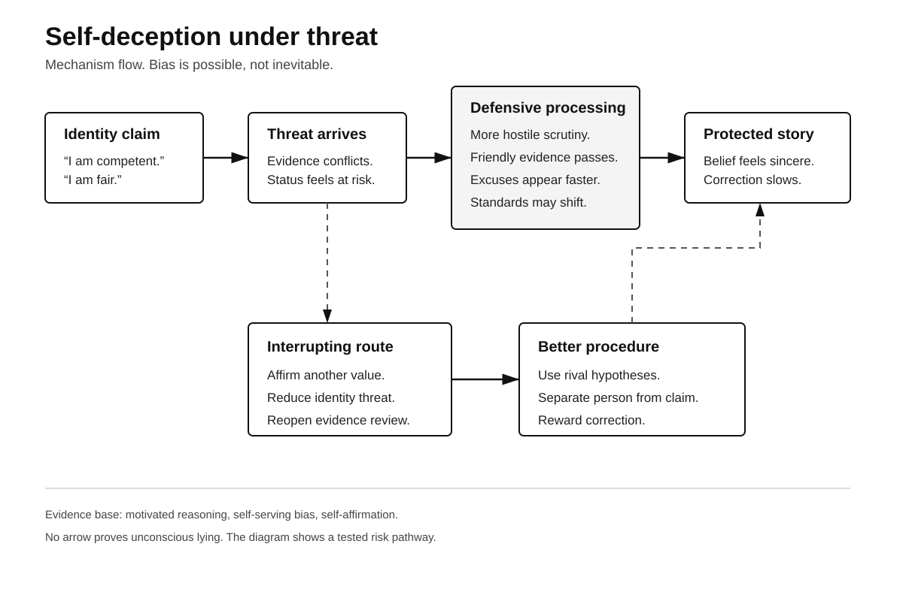
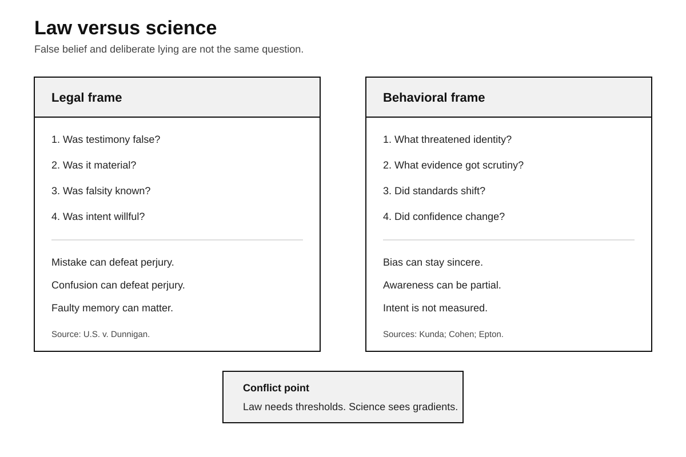
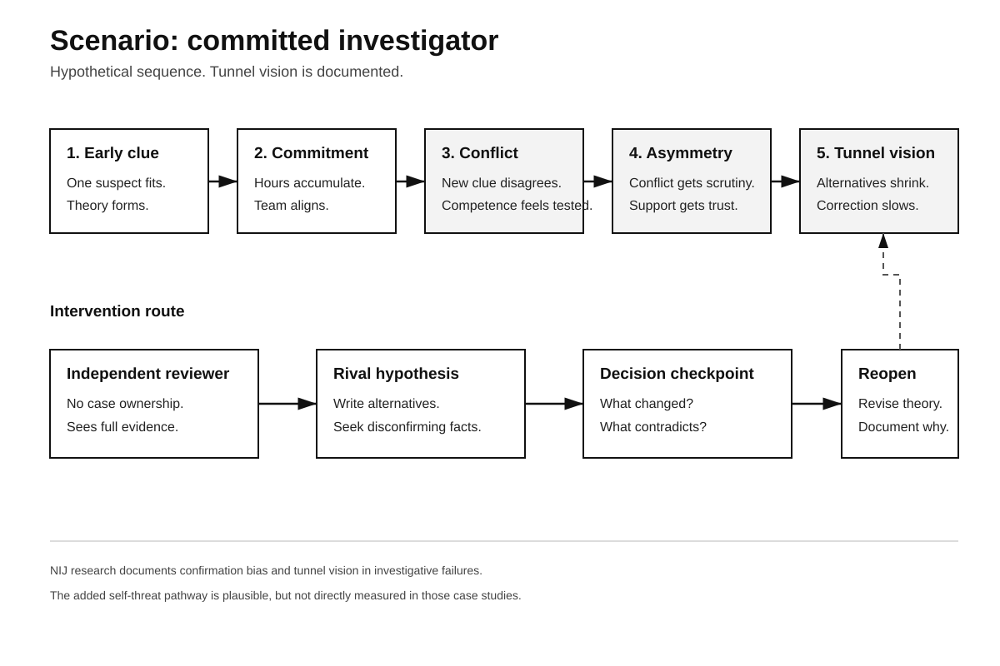

# Human Nature Dossier

## Self-Deception Under Threat

**Date:** 2026-09-23 16:26 +04:00

**Central question:**

Can self-protection bend belief?

Can sincerity still mislead?

Can threat rewrite evidence?

---

# Page 1

## Core idea

This label needs caution.

Self-deception has many meanings.

Here, it means this.

Threat changes evidence processing.

The process may feel sincere.

No deliberate lie is required.

Researchers use narrower terms.

Motivated reasoning is one.

Self-serving bias is another.

Defensive processing is another.

Self-affirmation tests threat effects.

These literatures overlap partly.

They are not identical.

**The disturbing truth:**

Sincerity can coexist with distortion.

**What this does NOT prove:**

People knowingly invent false beliefs.

## The buried mechanism

A person holds identity.

That identity carries value.

Contrary evidence then arrives.

The evidence threatens worth.

Threat creates defensive pressure.

Attention can become selective.

Standards can shift quietly.

Friendly evidence gets accepted.

Hostile evidence gets inspected.

Alternative explanations appear faster.

Memory may favor protection.

Attributions may protect competence.

A coherent story emerges.

The story feels reasonable.

That feeling matters greatly.

Self-deception needs no script.

It can use reasoning.

## Lens 1: Psychology

Kunda reviewed motivated reasoning.

The review proposed mechanisms.

Goals can guide reasoning.

Accuracy goals differ.

Directional goals differ too.

Directional goals seek conclusions.

Reasoning still needs plausibility.

People need acceptable justifications.

That constraint is important.

Wish alone cannot suffice.

Ditto and Lopez tested skepticism.

Unwelcome conclusions faced scrutiny.

Favorable conclusions needed less.

Three experiments supported asymmetry.

Medical feedback was included.

Unwelcome results prompted retesting.

Participants questioned test accuracy.

That resembles ordinary caution.

But caution became asymmetric.

Campbell and Sedikides synthesized studies.

Their meta-analysis tested threat.

Self-threat increased self-serving bias.

Failure got external explanations.

Success got internal explanations.

Threat magnified that pattern.

Cohen and colleagues tested affirmation.

Participants evaluated political evidence.

Self-affirmation reduced defensive evaluation.

Threatening evidence gained acceptance.

That supports self-protection accounts.

Sherman and Cohen reviewed work.

Health threats showed similar patterns.

Team outcomes also mattered.

Political attitudes also mattered.

Effects were not universal.

Later meta-analyses add restraint.

Epton and colleagues synthesized trials.

They studied health messages.

Acceptance effects were small.

Intentions changed slightly.

Behavior changed slightly more.

Sweeney and Moyer agreed broadly.

Their meta-analysis found small effects.

Small effects still matter.

They do not prove universality.

Ferrer and Cohen stressed conditions.

Threat must exist.

Resources must exist too.

Timing also changes effects.

That means context matters.

## Why this unsettles

We praise honest introspection.

We trust sincere testimony.

We trust confident explanations.

We trust professional judgment.

Threat complicates those assumptions.

A person may feel truthful.

Their processing may still bend.

That gap matters socially.

It matters legally too.

Moral blame often asks intent.

Science studies weaker processes.

Those levels can diverge.

## Scientists still disagree

The construct remains broad.

Consciousness is hard measuring.

Motives are hard inferring.

Priors can mimic motivation.

Incentives can mimic motivation.

Attention limits can mimic it.

Learning can explain asymmetry.

Identity effects vary greatly.

Tasks also vary greatly.

Culture can change outcomes.

Some findings stay fragile.

No single mechanism dominates.

## Counterargument

Defensive skepticism can help.

Unwelcome claims deserve scrutiny.

Existing beliefs contain information.

Expertise creates useful priors.

Threat may increase checking.

Checking can improve accuracy.

People also revise beliefs.

Self-interest does not dominate.

Sincerity is often genuine.

Bias is not inevitable.

The key question remains.

Are standards applied evenly?

---

# Page 2

## Lens 2: Investigation

Investigators also hold identities.

Competence matters to them.

Case theories also matter.

Early commitment can grow.

Contrary evidence then hurts.

It threatens case coherence.

It may threaten competence.

That creates a risk.

NIJ-funded research matters here.

Rossmo and Pollock studied failures.

They deconstructed fifty cases.

Confirmation bias was central.

Tunnel vision also recurred.

Another NIJ study compared cases.

Wrongful convictions were compared.

Near misses were included.

Tunnel vision blocked correction.

These studies matter strongly.

But one caveat matters.

They did not measure self-deception.

The extension remains inferential.

Threat may worsen commitment.

That needs direct testing.

### Criminal-investigation implication

Treat certainty as data.

Do not reward consistency.

Record rival hypotheses early.

Assign independent review points.

Separate reviewers from ownership.

Track disconfirming evidence explicitly.

Audit changed explanations.

Preserve rejected alternatives.

Use blind forensic review.

Reopen theories after shocks.

Competence includes revision.

## Legal conflict

Perjury needs willful falsity.

Federal law requires intent.

Mistake does not suffice.

Confusion does not suffice.

Faulty memory does not suffice.

Dunnigan states this distinction.

That protects sincere error.

Science adds another category.

Belief itself can bend.

Threat can shape evaluation.

The person may feel sincere.

Yet sincerity proves little.

Here lies the conflict.

Law needs mental states.

Science sees graded processes.

Intent can be categorical.

Cognition is often continuous.

Courts still need thresholds.

Psychology cannot erase them.

But psychology urges caution.

Confidence is not knowledge.

Sincerity is not accuracy.

### Concrete legal tension

Suppose testimony is false.

The witness denies lying.

Perjury asks willful intent.

Psychology asks another question.

Was belief defensively constructed?

That question differs legally.

It may explain error.

It cannot excuse automatically.

Evidence still controls outcomes.

## Lens 3: Political history

The Dreyfus Affair fits.

Facts come first.

Dreyfus was convicted.

That occurred in 1894.

Secret material was used.

Defense access was limited.

Picquart later found evidence.

Esterhazy became implicated.

Picquart faced resistance.

Henry later forged evidence.

The forgery was exposed.

Dreyfus was later cleared.

Rehabilitation came in 1906.

French archives document this.

BnF materials document it.

Now comes interpretation.

Institutional honor faced threat.

Admission carried reputational costs.

Those conditions invite defensiveness.

They can encourage rationalization.

But history proves no mechanism.

Individual motives remain uncertain.

Anti-Semitism also mattered deeply.

Institutional interests also mattered.

Military secrecy also mattered.

Political conflict also mattered.

Self-deception explains nothing alone.

That separation must remain.

## Social self-image

People prefer moral coherence.

They prefer competent identities.

They prefer stable narratives.

Threat attacks those narratives.

Reasoning can restore coherence.

That can feel virtuous.

It can feel principled.

It can feel careful.

This creates moral discomfort.

The mind may defend itself.

Then it calls defense reason.

## Lens 4: Nietzsche

Nietzsche offers philosophy only.

He supplies no experiment.

Beyond Good and Evil matters.

Section four is relevant.

He treats useful untruths seriously.

His phrase is brief.

"untruth as life-condition."

That is philosophical provocation.

It is not evidence.

The parallel is limited.

Humans may preserve beliefs.

Those beliefs may support life.

Science asks narrower questions.

Nietzsche asks value questions.

Keep those roles separate.

## Lens 5: Robert Greene

Greene discusses defensiveness.

His book names it.

The Law of Defensiveness.

He emphasizes self-opinion.

He treats resistance strategically.

That overlaps this dossier.

Research supports some overlap.

Threat can increase defensiveness.

Affirmation can reduce it.

But Greene goes broader.

His examples are interpretive.

His laws are not laws.

They are literary frameworks.

Use them as prompts.

Do not use proof.

## Replication limits

Older studies dominate here.

Many predate open science.

Some samples were narrow.

Some outcomes were self-report.

Threat manipulations vary greatly.

Affirmation methods vary greatly.

Effect sizes are small.

Context changes them.

Ferrer reports variable effects.

Group affirmation differs further.

Smith and Grant reviewed groups.

Their average effect was null.

Heterogeneity was very high.

That result matters.

It limits broad claims.

Individual affirmation differs.

So direct comparison fails.

Motivated reasoning remains supported.

Its mechanisms remain disputed.

Self-deception remains harder still.

Consciousness cannot be observed.

Intent must be inferred.

## Moral conflict

Morality likes clear categories.

Honest or dishonest.

Brave or cowardly.

Responsible or evasive.

Cognition resists clean boxes.

Defensiveness can be gradual.

Awareness can be partial.

Motives can be mixed.

That complicates blame.

It should not erase accountability.

Consequences still remain real.

Evidence still needs standards.

## Bottom line

Threat can bend reasoning.

The bending may feel sincere.

That matters for law.

It matters for investigations.

It matters for institutions.

It matters for ourselves.

The safeguard is procedural.

Make correction less costly.

Make dissent easier.

Separate identity from claims.

Reward revision over consistency.

---

# Page 3

## Mechanism flow

Threat starts the sequence.

Bias is not guaranteed.

Affirmation can interrupt it.

---

# Page 4

## Law versus science

Law asks intent.

Science studies processes.

The categories only overlap.

---

# Page 5

## Concrete scenario

The scenario is hypothetical.

Tunnel vision is documented.

Self-threat remains inferred.

---

# Evidence summary

Strong evidence supports bias.

Threat can magnify bias.

Motivated skepticism has experiments.

Self-serving bias has synthesis.

Affirmation effects are small.

Those effects are conditional.

Investigation failures show tunnel vision.

Perjury law requires intent.

History shows institutional resistance.

History proves no psychology.

Nietzsche supplies philosophy.

Greene supplies interpretation.

# Source list

1. Kunda, Z. (1990).
   https://doi.org/10.1037/0033-2909.108.3.480

2. Ditto and Lopez (1992).
   https://doi.org/10.1037/0022-3514.63.4.568

3. Campbell and Sedikides (1999).
   https://doi.org/10.1037/1089-2680.3.1.23

4. Cohen, Aronson, Steele (2000).
   https://doi.org/10.1177/01461672002611011

5. Sherman and Cohen (2002).
   https://doi.org/10.1111/1467-8721.00182

6. Epton and colleagues (2015).
   https://doi.org/10.1037/hea0000116

7. Sweeney and Moyer (2015).
   https://doi.org/10.1037/hea0000110

8. Ferrer and Cohen (2019).
   https://doi.org/10.1177/1088868318797036

9. Smith and Grant (2025).
   https://doi.org/10.1177/13684302241276070

10. NIJ investigative failures.
    https://nij.ojp.gov/library/publications/confirmation-bias-and-other-systemic-causes-wrongful-convictions-sentinel

11. NIJ wrongful convictions.
    https://nij.ojp.gov/library/publications/predicting-erroneous-convictions-social-science-approach-miscarriages-justice

12. Cornell perjury overview.
    https://www.law.cornell.edu/wex/perjury

13. United States v. Dunnigan.
    https://www.law.cornell.edu/supremecourt/text/507/87

14. BnF Dreyfus teaching file.
    https://expositions.bnf.fr/zola/zola/pedago/fiches/dreyfus2.pdf

15. Archives nationales.
    https://www.archives-nationales.culture.gouv.fr/

16. Nietzsche primary text.
    https://www.gutenberg.org/files/4363/4363-h/4363-h.htm

17. Greene publisher record.
    https://www.penguinrandomhouse.com/books/317474/the-laws-of-human-nature-by-robert-greene/

# Source warnings

Self-deception is broad.

Motivated reasoning is narrower.

Threat effects vary.

Affirmation effects stay small.

Group effects may differ.

Forensic extension stays cautious.

Historical inference stays cautious.

Philosophy proves nothing empirical.

Greene proves nothing empirical.

# Next topic queue

1. Moral credentialing.
2. Memory distrust effects.
3. Outgroup threat inflation.
4. Omission bias.
5. Pluralistic ignorance.

## Queue note

This topic is new.

Earlier folders were checked.

No prior folder matched.
