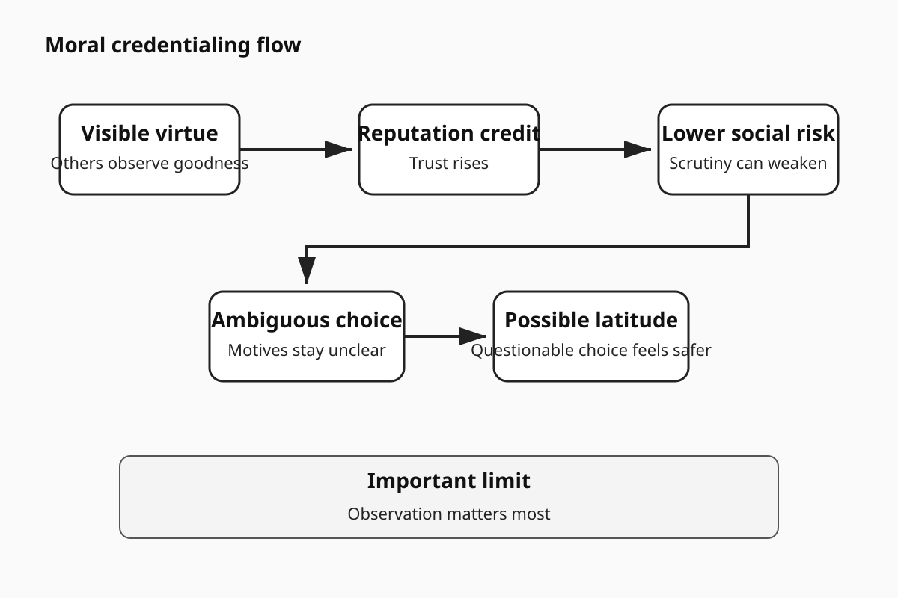
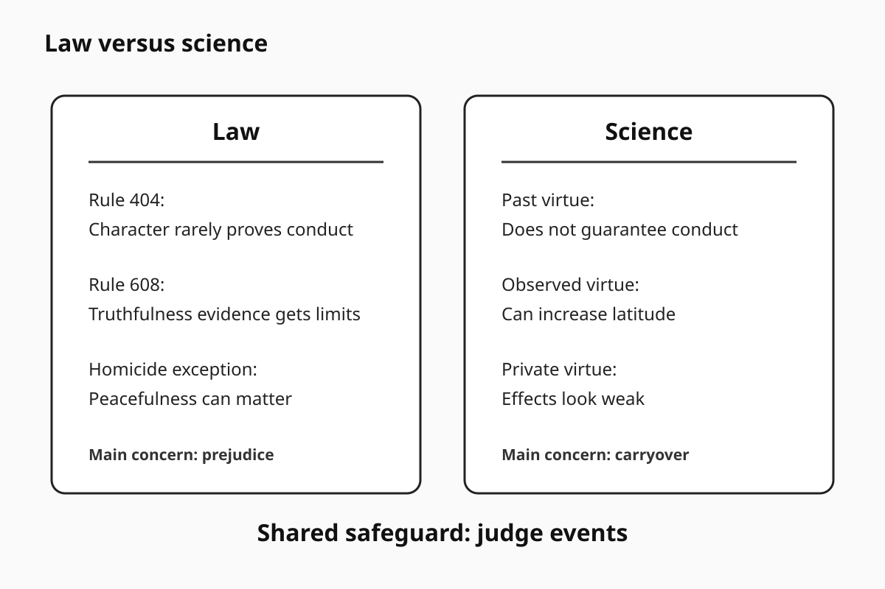
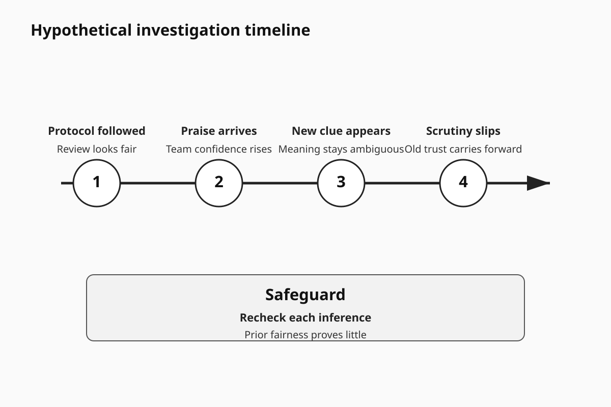

# Human Nature Dossier

## Moral Credentialing

**Date:** 2026-09-23 17:23 +04:00

**Central question:**

Can goodness become permission?

Can virtue purchase latitude?

Can reputation weaken scrutiny?

---

# Page 1

## Core idea

Moral credentialing has limits.

The effect is conditional.

It concerns prior virtue.

That virtue earns credit.

Credit can change judgment.

Later conduct gets latitude.

Sometimes bias becomes expressible.

Sometimes selfishness becomes excusable.

Observation seems important.

Reputation may drive effects.

Internal licensing remains disputed.

**The disturbing truth:**

Good deeds can buy latitude.

**What this does NOT prove:**

Virtue causes later misconduct.

## The buried mechanism

Visible virtue signals goodness.

Observers update reputation.

Actors notice that signal.

Reputational risk then falls.

Questionable choices feel safer.

Ambiguous motives gain cover.

Self-image may help too.

That pathway remains disputed.

The sequence is probabilistic.

No step is guaranteed.

## Lens 1: Psychology

Monin and Miller tested credentials.

They ran three experiments.

Participants earned egalitarian credentials.

Later choices shifted somewhat.

Prejudiced expressions became easier.

The original paper mattered.

Replication changed the picture.

Blanken tested three replications.

All three failed replication.

One sample reached 940.

That result matters greatly.

A 2015 meta-analysis followed.

It included 91 studies.

Participants totaled 7,397.

The estimate was small.

Cohen's d was 0.31.

Published effects were larger.

Unpublished effects were smaller.

That suggests publication bias.

A 2024 replication followed.

It used preregistration.

It tested 932 participants.

The classic effect failed.

Ethnicity effects approached zero.

Gender results reversed direction.

That weakens broad claims.

Then stronger synthesis arrived.

Rotella led that analysis.

It included 115 experiments.

Participants totaled 21,770.

Observation changed the effect.

Observed licensing was larger.

Hedges g reached 0.65.

Unobserved licensing stayed small.

Hedges g reached 0.13.

Bias correction changed more.

Observed effects remained present.

Corrected g reached 0.51.

Unobserved effects disappeared.

Corrected g reached -0.01.

That pattern matters most.

Reputation may drive licensing.

Private moral ledgers weaken.

## Scientists still disagree

The mechanism remains unsettled.

Self-image may still matter.

Reputation may matter more.

Manipulations vary across studies.

Outcomes vary across studies.

Many samples are online.

Some tasks feel artificial.

Observed settings differ greatly.

Publication bias matters here.

Older findings need caution.

Context changes effect sizes.

Null findings remain important.

## Why this unsettles

We treat goodness cumulatively.

We praise moral track-records.

We trust proven allies.

We forgive respected people.

We excuse valued institutions.

Science complicates that habit.

Past virtue can mislead.

Reputation can become shielding.

Goodness becomes social capital.

Capital can fund latitude.

## Counterargument

Consistency effects also exist.

Good acts can reinforce goodness.

Identity can stabilize conduct.

Reputation can deter misconduct.

Observation can increase restraint.

Licensing is not destiny.

Many studies find nothing.

Some findings even reverse.

That counterevidence is central.

---

# Page 2

## Lens 2: Investigation

No homicide study proves licensing.

That limit matters first.

Still, investigation faces bias.

NIJ documents tunnel vision.

Confirmation bias recurs too.

Forensic judgments can drift.

Context can shape interpretation.

Good process can reassure.

That reassurance can mislead.

A team follows protocol.

A supervisor approves steps.

Two suspects get excluded.

Confidence then rises.

Scrutiny may then fall.

That sequence is plausible.

It remains partly inferential.

### Criminal-investigation implication

Never bank procedural virtue.

Recheck each major inference.

Separate review from ownership.

Record rival hypotheses early.

Track disconfirming evidence separately.

Blind forensic review helps.

Audit confidence after praise.

Praise can change posture.

Prior fairness proves little.

Current evidence still controls.

## Legal conflict

Law distrusts character inference.

Rule 404 states this.

Character rarely proves conduct.

That rule has exceptions.

Criminal defendants get exceptions.

Homicide cases get exceptions.

Victim peacefulness can matter.

Rule 608 narrows credibility.

Truthfulness evidence gets limits.

Law therefore shows caution.

Everyday morality shows less.

We often trust credentials.

Science supports that caution.

But science adds nuance.

Observed virtue can shift latitude.

The legal tension remains.

Good character feels probative.

Rules restrict that intuition.

Moral credentialing explains why.

It cannot decide admissibility.

Courts still apply rules.

## Concrete legal tension

Consider a trusted witness.

Past honesty is known.

Community praise is strong.

Later testimony contains bias.

Jurors may grant latitude.

Rule 608 limits bolstering.

That protects case focus.

Psychology supports skepticism.

Yet no study decides.

Evidence must remain specific.

## Lens 3: Political history

A documented example helps.

France held colonial expositions.

Marseille hosted one.

That happened in 1906.

Library records describe aims.

The exposition glorified empire.

It praised civilizing mission.

It highlighted profitable trade.

Those facts are documented.

Now interpretation begins.

Moral mission built legitimacy.

Legitimacy can reduce scrutiny.

That resembles credentialing logic.

It does not prove licensing.

Colonial policy had drivers.

Economics clearly mattered too.

Power clearly mattered too.

National prestige also mattered.

History cannot isolate motives.

This example shows rhetoric.

It does not show causation.

## Social self-image

Groups need moral stories.

Institutions need moral stories.

People need them too.

Those stories guide identity.

They also protect status.

Credentials simplify moral judgment.

That simplification saves effort.

It can hide drift.

## Lens 4: Nietzsche

Nietzsche supplies philosophy only.

He offers no experiments.

One passage fits here.

It concerns virtue belief.

His phrase is brief.

"believing in one's virtues"

He links that belief.

He links good conscience.

This is philosophical suspicion.

It is not evidence.

His lens asks this.

Does virtue hide motives?

Science asks narrower questions.

Those questions need data.

## Lens 5: Robert Greene

Greene discusses role-playing.

He emphasizes social masks.

He emphasizes reputation management.

That overlaps partly here.

Observed licensing supports overlap.

But Greene goes broader.

His claims remain interpretive.

His laws are not laws.

Nonverbal claims need caution.

Strategy is not science.

Use Greene for questions.

Do not use proof.

## Replication limits

The classic effect struggled.

Direct replications failed repeatedly.

The 2024 replication failed.

Meta-analysis found small effects.

Newer synthesis found moderation.

Observation appears crucial.

Private licensing looks weak.

Observed licensing looks stronger.

Publication bias still matters.

Study tasks remain simplified.

Real institutions differ greatly.

Cross-cultural evidence stays limited.

Homicide evidence is indirect.

Historical inference is indirect.

Legal conclusions remain separate.

## Moral conflict

Morality likes moral accounts.

Good deeds earn trust.

Trust then compounds socially.

Science warns against carryover.

Law often warns too.

Identity resists that warning.

We want coherent heroes.

We want coherent villains.

Behavior is less coherent.

That is uncomfortable.

## Bottom line

Past goodness matters socially.

It can change latitude.

Observation strengthens that risk.

Private licensing looks weaker.

Good character proves little.

Current conduct needs evidence.

Institutions need fresh scrutiny.

Investigations need fresh scrutiny.

Reputation should never substitute.

---

# Page 3

## Mechanism flow

Visible virtue starts credit.

Credit changes social risk.

Risk changes later latitude.

---

# Page 4

## Law versus science

Law limits character inference.

Science supports that caution.

Observed credentials can distort.

---

# Page 5

## Concrete scenario

The scenario is hypothetical.

Bias risks are documented.

Licensing remains inferential there.

---

# Evidence summary

Moral licensing is conditional.

Reputation appears central.

Observation strengthens measured effects.

Private effects look weak.

Classic replications often failed.

Character inference stays risky.

Forensic bias is documented.

Tunnel vision is documented.

Political rhetoric creates legitimacy.

Historical causation stays unproven.

Nietzsche supplies philosophy.

Greene supplies interpretation.

# Source list

1. Monin and Miller.
   https://doi.org/10.1037/0022-3514.81.1.33

2. Blanken and colleagues.
   https://doi.org/10.1027/1864-9335/a000189

3. Blanken meta-analysis.
   https://doi.org/10.1177/0146167215572134

4. Xiao and colleagues.
   https://doi.org/10.5334/irsp.945

5. Rotella and colleagues.
   https://doi.org/10.1177/01461672251345512

6. NIJ confirmation-bias review.
   https://nij.ojp.gov/library/publications/confirmation-bias-and-other-systemic-causes-wrongful-convictions-sentinel

7. NIJ wrongful-conviction research.
   https://nij.ojp.gov/topics/articles/predicting-and-preventing-wrongful-convictions

8. NIJ forensic-bias review.
   https://nij.ojp.gov/library/publications/cognitive-bias-and-handwriting-examination-concepts-current-knowledge-and

9. Federal Evidence Rule 404.
   https://www.law.cornell.edu/rules/fre/rule_404

10. Federal Evidence Rule 608.
    https://www.law.cornell.edu/rules/fre/rule_608

11. Library of Congress.
    https://www.loc.gov/item/12020393/

12. Nietzsche primary text.
    https://www.gutenberg.org/files/4363/4363-h/4363-h.htm

13. Greene publisher record.
    https://www.penguinrandomhouse.com/books/317474/the-laws-of-human-nature-by-robert-greene/

# Source warnings

Licensing is not universal.

Reputation seems conditionally important.

Private effects remain uncertain.

Police evidence stays indirect.

History proves no psychology.

Nietzsche proves no psychology.

Greene proves no psychology.

Law remains jurisdiction specific.

# Next topic queue

1. Memory distrust effects.
2. Outgroup threat inflation.
3. Omission bias.
4. Pluralistic ignorance.
5. Illusory moral superiority.

## Queue note

This topic is new.

Earlier folders were checked.

No prior folder matched.
