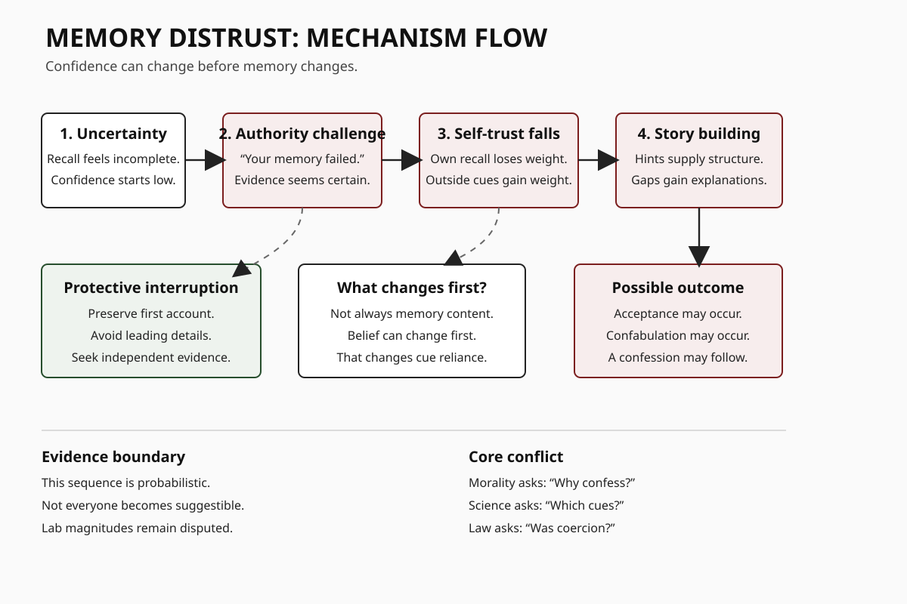
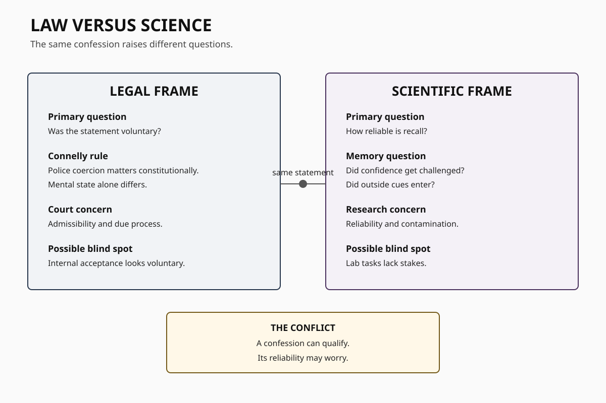
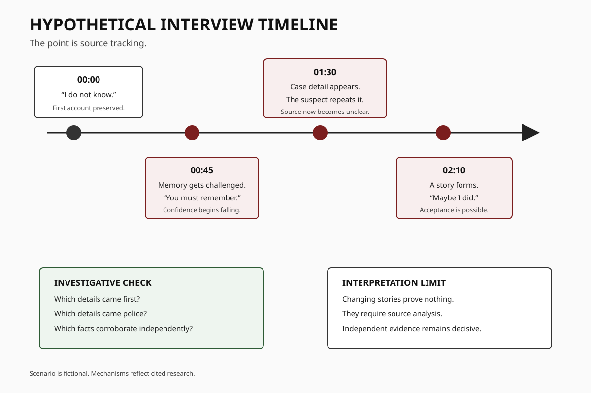

# Human Nature Dossier

## Memory Distrust

**Date:** 2026-09-23 18:26 +04:00

**Central question:**

Can memory lose authority?

Can pressure replace recall?

Can confidence become evidence?

Can law miss that?

---

# Page 1

## Core idea

Memory distrust is metacognition.

It concerns memory belief.

Memory may remain vivid.

Confidence can still collapse.

External claims then matter.

Authority can gain weight.

Suggestions can gain weight.

False evidence can matter.

Social feedback can matter.

Repeated questioning can matter.

The effect is conditional.

No pathway is automatic.

**The disturbing truth:**

Confidence can be socially broken.

**What this does NOT prove:**

Memory distrust proves innocence.

## What scientists mean

Memory has two layers.

One layer stores content.

Another judges that content.

That second layer matters.

Researchers call it metacognition.

Memory distrust targets it.

A person may recall.

They may distrust recall.

They then seek cues.

Those cues may mislead.

Confidence can detach.

Belief can also detach.

Recall can then shift.

## A proposed pathway

First comes uncertainty.

Then comes outside challenge.

The challenge gains authority.

Self-trust then weakens.

Alternative stories gain plausibility.

Repeated cues add structure.

A new account emerges.

Acceptance may then follow.

Confabulation may sometimes follow.

That pathway remains probabilistic.

## Lens 1: Psychology

Gudjonsson studied this mechanism.

His 2014 review matters.

It examined internalized confessions.

Two homicide cases featured.

Six people were convicted.

Five showed memory distrust.

Several pressures co-occurred.

Isolation was one factor.

Contamination was another factor.

Suggestibility also mattered.

Compliance also mattered.

Memory weakness sometimes mattered.

The model has stages.

Trigger comes first.

Plausibility follows next.

Acceptance can then follow.

Reconstruction may then follow.

Resolution can come last.

This is heuristic.

It is not deterministic.

Van Bergen tested mechanisms.

Fifty students were accused.

They had not cheated.

Five tactics were tested.

Memory suggestions mattered most.

They increased memory distrust.

False technical evidence mattered.

It increased confession willingness.

Effects differed by tactic.

That limits simple claims.

Another study used robbery.

Participants viewed video footage.

Memory distrust predicted misinformation.

This was a community sample.

Sample size was eighty.

Later work broadened measurement.

Zhang tested trait distrust.

Two studies were used.

Higher distrust showed associations.

False memory reports increased.

Nonbelieved memories increased too.

Self-esteem was lower too.

Causality was not established.

Measures were often self-report.

That limitation matters.

## False confession research

A classic task exists.

Students typed computer text.

They were falsely accused.

Some signed false confessions.

Some internalized responsibility.

Some confabulated supporting details.

Later studies replicated parts.

Rates varied substantially.

A 2012 review followed.

Accusatorial methods increased risk.

Information gathering performed better.

A 2024 update followed.

Twenty false-confession studies contributed.

Accusatorial approaches increased odds.

Direct questioning did better.

Information gathering did better.

However, criticism remains serious.

A 2026 meta-analysis challenged calibration.

It analyzed 41 studies.

Ninety-nine conditions were analyzed.

Rates varied enormously.

The prediction interval widened.

It spanned 3–93%.

Design features dominated variation.

Real-world extrapolation became doubtful.

That critique matters.

## Scientists still disagree

Memory distrust clearly exists.

Its scale remains debated.

State effects seem plausible.

Trait effects seem measurable.

Causal pathways stay uncertain.

Laboratory realism stays limited.

Student samples remain common.

Consequences are usually small.

Real interrogations are different.

Known cases remain informative.

Cases cannot estimate prevalence.

Correlations cannot prove causation.

Confession tasks measure compliance.

Sometimes they measure more.

The boundary stays disputed.

## Why this unsettles

We trust inner certainty.

We praise confident witnesses.

We trust confident suspects.

We distrust changing stories.

Yet confidence is social.

Confidence can be manipulated.

Uncertainty can be induced.

External cues can dominate.

This troubles moral judgment.

We equate confession broadly.

We equate certainty broadly.

Both can mislead.

## Counterargument

Most people resist suggestions.

Memory distrust is not universal.

False confessions remain uncommon.

Laboratory rates overstate reality.

Some paradigms lack realism.

Confession can be truthful.

Confidence can track accuracy.

Evidence can restore confidence.

Good interviewing reduces risk.

These limits are central.

---

# Page 2

## Lens 2: Investigation

Homicide investigations carry pressure.

Uncertainty can be extreme.

Police need coherent accounts.

Suspects face uncertainty too.

This creates interaction risks.

A suspect may hesitate.

Hesitation may seem deceptive.

Investigators may challenge memory.

That can weaken confidence.

Case details may leak.

Those details can contaminate.

Later recall then changes.

OJP warns about contamination.

Open questions reduce leakage.

Independent details matter greatly.

Recording interviews also helps.

### Criminal-investigation implication

Treat confidence as data.

Do not treat proof.

Track information origins.

Separate suspect-originated details.

Separate police-originated details.

Record uncertainty verbatim.

Avoid memory accusations.

Avoid feeding crime facts.

Test independent corroboration.

Preserve first accounts.

Compare later changes.

Changes need explanations.

They do not prove guilt.

They do not prove innocence.

## Homicide relevance

Gudjonsson analyzed homicide cases.

Memory distrust appeared strongly.

Coercion also appeared strongly.

Isolation also appeared strongly.

Contamination also appeared strongly.

Multiple vulnerabilities interacted.

That matters for practice.

One factor rarely suffices.

Investigators need source control.

Corroboration should stay independent.

## Legal conflict

Law separates questions.

Voluntariness is one question.

Reliability is another question.

They can diverge sharply.

Colorado v. Connelly matters.

The Court required coercion.

Police coercion was necessary.

Mental condition alone failed.

That was constitutional doctrine.

It was not neuroscience.

It was not memory science.

This creates tension.

A statement may qualify.

Yet reliability may worry.

Memory distrust adds complexity.

Internal acceptance looks voluntary.

That appearance can mislead.

Science asks reliability.

Law asks admissibility too.

Those questions are different.

## Juror conflict

Confessions carry strong weight.

Jurors may discount coercion.

Research remains mixed here.

A 2024 meta-analysis reviewed this.

Confession evidence influenced verdicts.

Safeguards showed variable effects.

That matters legally.

A confession can dominate.

Its origin needs scrutiny.

## Lens 3: Political history

Political systems use confessions.

The Moscow Trials illustrate.

Library archives document them.

Show trials occurred publicly.

They ran during 1936–1938.

Former Bolsheviks were targeted.

Confessions served prosecution narratives.

Fear shaped the system.

Repression shaped the system.

Political control shaped proceedings.

Now interpretation begins.

Confession has symbolic power.

It converts accusation inward.

The accused voices guilt.

That strengthens public narratives.

Memory distrust is unproven.

No diagnosis is justified.

Historical records show pressure.

They show political use.

They do not prove mechanism.

This distinction is essential.

## Social self-image

People value self-knowledge.

We assume private access.

We trust autobiographical memory.

We call confession ownership.

Memory distrust challenges that.

Self-knowledge can become unstable.

Authority can enter reconstruction.

That threatens legal intuition.

It also threatens identity.

## Lens 4: Nietzsche

Nietzsche offers philosophy only.

He gives no experiments.

His memory view helps.

He treats forgetting actively.

Memory serves social functions.

Promises require trained memory.

That is his argument.

It is not neuroscience.

It raises one question.

Who governs remembered meaning?

Institutions can shape meaning.

So can punishment.

So can moral judgment.

Science tests narrower mechanisms.

Nietzsche cannot validate them.

## Lens 5: Robert Greene

Greene studies social influence.

He emphasizes hidden motives.

He emphasizes strategic pressure.

That overlaps superficially.

Authority can reshape behavior.

Research supports social influence.

Greene goes much further.

His narratives lack controls.

They cannot diagnose memory.

They cannot prove confabulation.

They cannot estimate prevalence.

Use Greene for questions.

Do not use proof.

## Replication limits

Memory-distrust studies are small.

Many use student samples.

Some use self-report measures.

Confession tasks are artificial.

Real stakes cannot replicate.

Ethics prevent full simulation.

Case studies lack controls.

Case classification can vary.

Trait findings are correlational.

State effects need replication.

False evidence effects replicate.

Magnitude remains disputed.

Accusatorial risk appears supported.

Exact prevalence remains unknown.

The 2026 critique matters.

It questions task calibration.

That does not erase risk.

It narrows valid claims.

## Moral conflict

Morality likes confession.

Confession signals responsibility.

Repentance signals agency.

Memory distrust complicates both.

A person may accept.

Acceptance may be mistaken.

That feels morally strange.

Law needs individual responsibility.

Science shows social permeability.

Neither removes agency.

Neither guarantees truth.

## Bottom line

Memory confidence is constructed.

Social pressure can change it.

Authority can change it.

False evidence can change it.

Most people still resist.

Effects vary by context.

Confessions need corroboration.

Interview contamination matters.

Law asks voluntariness.

Science asks reliability.

Those questions can diverge.

---

# Page 3

## Mechanism flow

Uncertainty opens a gap.

Authority can fill it.

Confidence may then fall.

External stories gain weight.

---

# Page 4

## Law versus science

Law tests admissibility.

Science tests reliability.

Those tests differ.

Memory distrust exposes tension.

---

# Page 5

## Concrete scenario

The scenario is hypothetical.

Its mechanisms are documented.

No guilt is implied.

---

# Evidence summary

Memory distrust concerns confidence.

It can be situational.

It can be trait-like.

Social challenge can matter.

False evidence can matter.

Suggestive questioning can matter.

Confession internalization can occur.

Real prevalence stays uncertain.

Laboratory calibration is disputed.

Accusatorial methods increase risk.

Information gathering reduces risk.

Corroboration remains essential.

Legal admissibility differs.

Political history shows leverage.

Nietzsche supplies philosophy.

Greene supplies interpretation.

# Source list

1. Gudjonsson and colleagues.
   https://doi.org/10.1002/acp.3002

2. Van Bergen and colleagues.
   https://doi.org/10.1080/10683160701822533

3. Van Bergen and colleagues.
   https://doi.org/10.1002/acp.1595

4. Zhang.
   https://doi.org/10.1002/acp.3917

5. Kassin and Kiechel.
   https://doi.org/10.1111/j.1467-9280.1996.tb00344.x

6. Horselenberg and colleagues.
   https://doi.org/10.1080/10683160308141

7. Meissner and colleagues.
   https://doi.org/10.4073/csr.2012.13

8. Catlin and colleagues.
   https://doi.org/10.1002/cl2.1441

9. Mourtgos and Adams.
   https://doi.org/10.1007/s10940-026-09687-1

10. OJP memory-distrust measure.
    https://www.ojp.gov/library/publications/assessing-trait-memory-distrust-psychometric-properties-squire-subjective

11. OJP confession safeguards.
    https://ojp.gov/ncjrs/virtual-library/abstracts/criminal-confessions-overcoming-challenges

12. Colorado v. Connelly.
    https://www.law.cornell.edu/supremecourt/text/479/157

13. Juror confession meta-analysis.
    https://doi.org/10.1037/lhb0000563

14. Library of Congress.
    https://www.loc.gov/exhibits/archives/intn.html

15. Nietzsche primary text.
    https://www.gutenberg.org/files/52319/52319-h/52319-h.htm

16. Greene publisher record.
    https://www.penguinrandomhouse.com/books/317474/the-laws-of-human-nature-by-robert-greene/

# Source warnings

Memory distrust proves nothing.

Confessions can be truthful.

Case studies cannot generalize.

Lab rates need caution.

Prevalence remains uncertain.

History proves no diagnosis.

Nietzsche proves no psychology.

Greene proves no psychology.

Law varies by jurisdiction.

# Next topic queue

1. Outgroup threat inflation.
2. Omission bias.
3. Pluralistic ignorance.
4. Illusory moral superiority.
5. Moral dumbfounding.

## Queue note

This topic is new.

Previous queue was checked.

No prior dossier matched.
