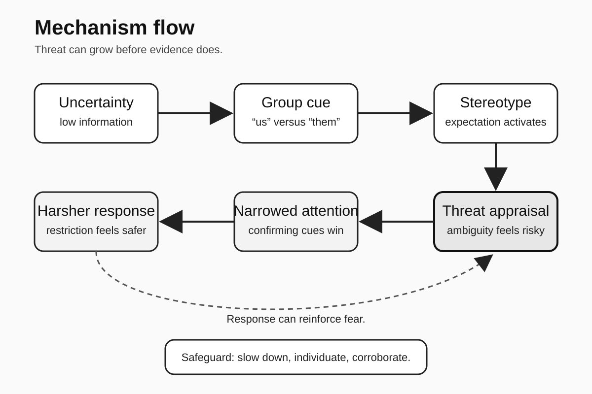
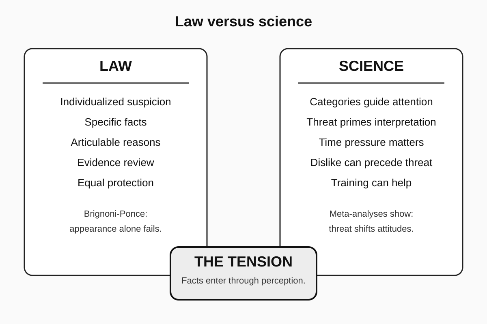
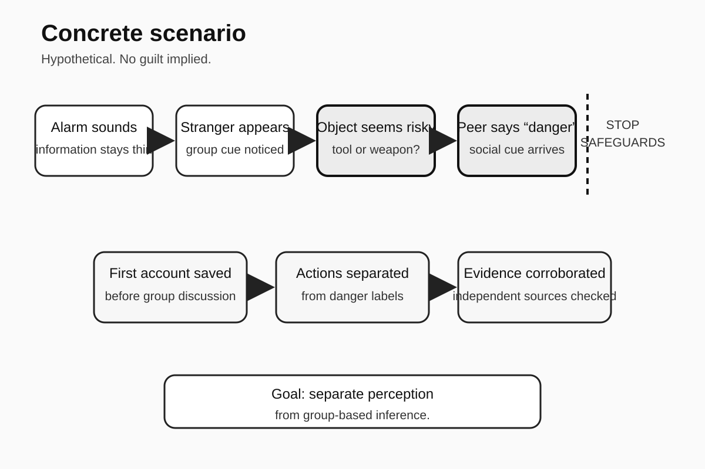

# Human Nature Dossier

## Outgroup Threat Inflation

**Date:** 2026-09-23 19:26 +04:00

**Central question:**

Can fear redraw fairness?

Can groups reshape danger?

Can suspicion feel factual?

Can law catch that?

---

# Page 1

## Core idea

This label is shorthand.

It is not diagnosis.

Researchers study perceived threat.

Groups shape threat perception.

Fear can widen differences.

Uncertainty can magnify danger.

Stereotypes can fill gaps.

Past conflict can prime fear.

Status concerns can matter.

Symbols can matter too.

Actual danger can matter.

Perceived danger can differ.

That gap matters legally.

**The disturbing truth:**

Fear can redraw fairness.

**What this does NOT prove:**

Outgroups are inherently dangerous.

## What threat means

Threat has several forms.

Realistic threat concerns safety.

Resources can also matter.

Symbolic threat concerns values.

Identity can feel threatened.

Status can feel threatened.

Contact anxiety also matters.

These forms can overlap.

They are not identical.

## Basic mechanism

A group cue appears.

Uncertainty already exists.

Old stereotypes become available.

Threat gets inferred quickly.

Attention then narrows.

Ambiguity becomes less tolerated.

Neutral actions seem suspicious.

Harsh responses feel safer.

Later facts get filtered.

The cycle can strengthen.

No step is inevitable.

## Lens 1: Psychology

Riek reviewed threat research.

Their meta-analysis used samples.

Ninety-five samples contributed.

Five threats showed associations.

Outgroup attitudes became harsher.

Status changed some effects.

Most evidence was correlational.

Causation remained limited.

Bahns tested reverse causation.

Three experiments were used.

Novel groups were conditioned.

Prejudice was experimentally created.

Threat judgments then increased.

This matters conceptually.

Threat can follow dislike.

Threat can justify dislike.

The direction can reverse.

Carriere studied rights restrictions.

Their review was larger.

Forty-six articles were included.

Over ninety-one-thousand participated.

Threat predicted rights restrictions.

Outgroups faced larger restrictions.

Ingroups faced smaller restrictions.

This pattern was pooled.

It was not universal.

## Perception under pressure

Payne tested weapon perception.

Race cues preceded objects.

Participants saw guns.

Participants also saw tools.

Black primes sped guns.

Time pressure changed errors.

Tools became guns more.

That effect was contextual.

It was not destiny.

Correll used shoot simulations.

Race influenced response patterns.

Student samples showed bias.

Police results were different.

A later review matters.

Officer patterns were complex.

Training supported cognitive control.

Biased shooting was inconsistent.

Response timing still shifted.

That distinction is important.

## Why this unsettles

We value neutral judgment.

We trust our fear.

We call fear intuitive.

We call suspicion reasonable.

Science complicates those labels.

Perception is not passive.

Categories guide attention.

Expectations guide interpretation.

Dislike can create threat.

Threat can justify dislike.

That loop feels invisible.

## Scientists still disagree

Threat measures differ widely.

Groups differ across studies.

Cultures differ across studies.

Threat can be real.

Threat can be symbolic.

Correlations dominate some literatures.

Reverse causality is plausible.

Experimental groups feel artificial.

Laboratory stakes stay low.

Police simulations remain simplified.

Field causality stays difficult.

Publication bias remains possible.

Effect sizes vary strongly.

Context can reverse patterns.

## Counterargument

Sometimes danger is real.

Base rates can matter.

Specific facts can matter.

Training can reduce errors.

Contact can reduce prejudice.

Individuals often resist stereotypes.

Categories need not dominate.

Fear can improve vigilance.

Law cannot ignore risk.

Science cannot erase danger.

The issue is calibration.

---

# Page 2

## Lens 2: Investigation

Investigations begin with uncertainty.

Uncertainty invites threat cues.

Group cues can intrude.

Witnesses can overread danger.

Investigators can too.

Time pressure worsens control.

Ambiguity worsens interpretation.

Prior beliefs can guide questions.

Questions can guide memory.

Memory can then harden.

That creates feedback.

### Criminal-investigation implication

Record first descriptions.

Record exact observed actions.

Separate inference from observation.

Avoid danger labels early.

Avoid group-based shortcuts.

Use structured witness interviews.

Use blind lineup methods.

Preserve confidence statements.

Document cross-race conditions.

Seek independent corroboration.

Review alternative explanations.

Slow critical decisions.

## Eyewitness complication

Meissner reviewed face memory.

Thirty years were analyzed.

Nearly five-thousand participated.

Ninety-one samples contributed.

Own-race recognition was better.

Cross-race errors increased.

This concerns face memory.

It is not threat.

Yet mechanisms can combine.

Poor recognition adds uncertainty.

Threat stereotypes add interpretation.

Together risks can compound.

That interaction needs caution.

NIJ research remains useful.

Cross-race lineups stay difficult.

A 2025 project confirmed.

Discriminability was lower cross-race.

A not-sure option failed.

It did not restore accuracy.

That finding is narrow.

## Legal conflict

Law seeks individualized suspicion.

Psychology shows category pressure.

Doctrine requires specific facts.

Perception selects those facts.

That creates tension.

Brignoni-Ponce illustrates this.

The Court set limits.

Appearance alone was insufficient.

Specific facts were required.

Mexican ancestry could not suffice.

This was Fourth Amendment law.

It was not psychology.

Science adds another concern.

Group cues shape interpretation.

Thus facts need auditing.

## Rights under threat

Law protects equal treatment.

Emergencies increase pressure.

Threat can narrow rights.

Carriere found this pattern.

Outgroups lost more support.

Ingroups lost less support.

That conflicts with universality.

Rights become psychologically conditional.

Law says otherwise.

## Lens 3: Political history

One case is documented.

Executive Order 9066 matters.

Roosevelt signed it.

The date was 1942.

February nineteenth was signing.

Military exclusion then expanded.

Japanese Americans were removed.

Families lost normal liberty.

The order named no ethnicity.

Implementation targeted Japanese ancestry.

Later review changed judgment.

Congress created a commission.

Its report appeared 1982.

Military necessity was rejected.

The commission named causes.

Race prejudice was one.

War hysteria was another.

Leadership failure was another.

Congress later apologized.

Redress followed in 1988.

Those are documented facts.

Now interpretation begins.

A group became danger.

Individual evidence became secondary.

Fear widened collective suspicion.

Institutions amplified that suspicion.

That resembles threat inflation.

It does not prove mechanism.

No historical mind-reading works.

## Law versus history

Emergency power felt necessary.

Collective suspicion felt efficient.

Later evidence rejected necessity.

Later law acknowledged injustice.

This reveals institutional risk.

Threat can normalize exceptions.

Exceptions can target outgroups.

## Lens 4: Nietzsche

Nietzsche offers philosophy only.

He ran no experiments.

His genealogy studies morality.

Enemies shape moral identity.

Opposition can define virtue.

Resentment can organize categories.

His lens asks this:

Who needs an enemy?

Who gains self-definition?

Who names danger?

Those are philosophical questions.

They are not findings.

Science tests narrower claims.

Nietzsche cannot validate them.

## Lens 5: Robert Greene

Greene offers interpretation only.

He studies group behavior.

He stresses conformity pressures.

He stresses hidden aggression.

He describes contagious emotions.

Some overlap exists.

Social influence is supported.

Threat effects are supported.

Greene goes much further.

His stories lack controls.

His claims lack prevalence.

They cannot prove universality.

Use him for questions.

Do not use proof.

## Replication limits

Meta-analysis supports association.

Association cannot prove cause.

Experiments improve causal inference.

Artificial groups reduce realism.

Weapon tasks simplify encounters.

Shooter tasks simplify encounters.

Police samples show differences.

Training changes performance.

Threat categories vary.

Political context changes effects.

Cross-race memory differs separately.

Combining mechanisms needs evidence.

Historical analogy proves little.

Legal doctrine varies jurisdictionally.

## Moral conflict

Morality praises equal judgment.

Fear rewards quick sorting.

Law requests individual facts.

Brains use category shortcuts.

Societies praise impartiality.

Groups still shape suspicion.

We condemn prejudice openly.

We trust intuition privately.

That contradiction is central.

## Bottom line

Threat perception is flexible.

Group boundaries can shape it.

Dislike can create threat.

Threat can justify dislike.

Pressure can reduce control.

Training can improve control.

Evidence must stay individual.

History shows institutional amplification.

Law tries limiting it.

Science explains the pressure.

Neither abolishes agency.

---

# Page 3

## Mechanism flow

Group cues meet uncertainty.

Stereotypes supply expectations.

Threat then feels concrete.

Attention narrows further.

Responses become harsher.

Feedback can reinforce fear.

---

# Page 4

## Law versus science

Law requests specific facts.

Science studies perception itself.

Facts enter through attention.

Attention can be biased.

Reasonableness needs safeguards.

---

# Page 5

## Concrete scenario

This scenario is hypothetical.

No group is specified.

No guilt is implied.

It shows compounding errors.

Safeguards interrupt the chain.

---

# Evidence summary

Perceived threat predicts attitudes.

Meta-analysis supports that link.

Causal direction can reverse.

Prejudice can create threat.

Threat can narrow rights.

Outgroups can bear more.

Time pressure can magnify bias.

Training can improve control.

Cross-race memory adds risk.

Group suspicion needs auditing.

Individual evidence remains essential.

Historical analogy needs caution.

Nietzsche supplies philosophy only.

Greene supplies interpretation only.

# Source list

1. Riek, Mania, Gaertner.
   https://doi.org/10.1207/s15327957pspr1004_4

2. Bahns.
   https://doi.org/10.1177/1368430215591042

3. Carriere and colleagues.
   https://doi.org/10.1177/1368430220962563

4. Payne.
   https://doi.org/10.1037/0022-3514.81.2.181

5. Correll and colleagues.
   https://doi.org/10.1037/0022-3514.83.6.1314

6. Correll and colleagues.
   https://doi.org/10.1111/spc3.12099

7. Meissner and Brigham.
   https://doi.org/10.1037/1076-8971.7.1.3

8. NIJ lineup research.
   https://nij.ojp.gov/library/publications/testing-not-sure-instruction-reduce-harmful-impact-system-and-estimator

9. Brignoni-Ponce.
   https://www.law.cornell.edu/supremecourt/text/422/873

10. Executive Order 9066.
    https://www.archives.gov/milestone-documents/executive-order-9066

11. Personal Justice Denied.
    https://www.archives.gov/research/aapi/ww2/justice

12. Civil Liberties Act.
    https://www.archives.gov/press/press-releases/2013/nr13-118.html

13. Nietzsche primary text.
    https://www.gutenberg.org/files/52319/52319-h/52319-h.htm

14. Greene publisher record.
    https://www.penguinrandomhouse.com/books/317474/the-laws-of-human-nature-by-robert-greene/

# Source warnings

Threat is not destiny.

Groups are not diagnoses.

History proves no mechanism.

Lab tasks simplify reality.

Race is socially constructed.

Cross-race memory is separate.

Police findings are mixed.

Threat can be justified.

Specific evidence still matters.

Law varies by jurisdiction.

Nietzsche proves no psychology.

Greene proves no psychology.

# Next topic queue

1. Omission bias.
2. Pluralistic ignorance.
3. Illusory moral superiority.
4. Moral dumbfounding.
5. Scarcity-driven exclusion.

## Queue note

This topic is new.

Previous queue was checked.

No prior dossier matched.
