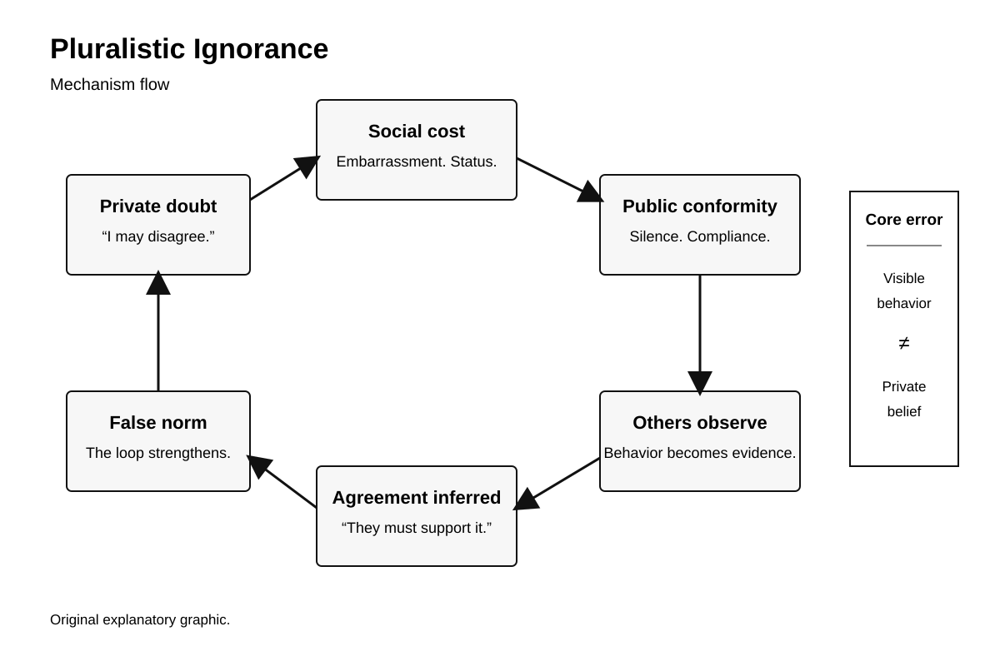
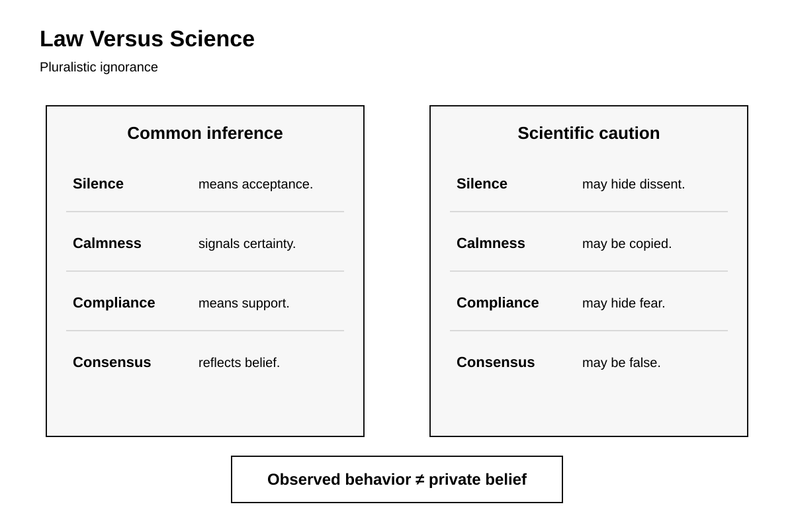
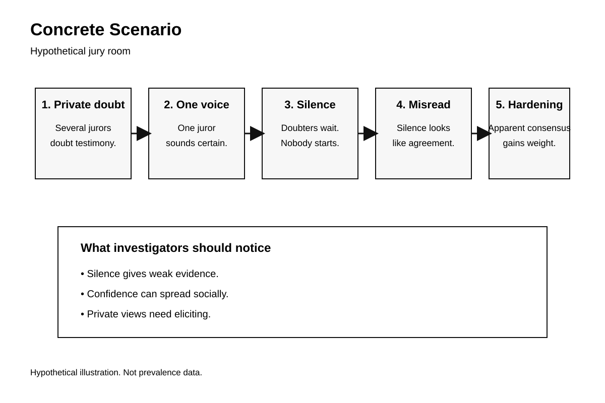

# Human Nature Dossier

## Pluralistic Ignorance

Date: 2026-09-23 21:27.

Central question:

What does silence hide?

**The disturbing truth:**
Groups can enforce disliked norms.

**What this does NOT prove:**
This does not prove mindlessness.

---

# Page 1 — The mechanism

## What is it?

Pluralistic ignorance is misreading.

Private beliefs differ.
Public behavior looks similar.
People notice public behavior.
They infer private agreement.
That inference can fail.

A person feels doubt.
Others look unconcerned.
The person stays quiet.
Others see that quiet.
They infer acceptance.
Everyone learns the mistake.

The loop can persist.
Nobody needs deception.
Nobody needs coordination.
Nobody needs bad intent.

Social fear can matter.
Embarrassment can matter.
Status can matter.
Uncertainty can matter.
Belonging can matter.

Miller studied this mechanism.
McFarland studied it too.
Their experiments tested embarrassment.
Participants avoided visible risk.
They misread others' motives.

Prentice studied campus drinking.
Miller joined that work.
Students disliked drinking norms.
They thought peers approved.
Some attitudes then shifted.

Later work broadened domains.
Boards show similar patterns.
Public opinion can mislead.
Social norms can drift.

Recent evidence remains broad.
Geiger studied eleven countries.
Participants misread climate consensus.
The pattern crossed countries.

Yukura studied bullying bystanders.
Peer evaluation concerns mattered.
Conformity followed norm errors.
That study appeared recently.

## Why this unsettles

We trust visible consensus.
We call silence agreement.
We call calmness confidence.
We call repetition belief.
Those shortcuts can fail.

People may dislike rules.
Yet rules still survive.
Each person watches others.
Each person sees compliance.
Each person updates wrongly.

This threatens self-image.
We value independent judgment.
We imagine private courage.
But social cues guide us.

## What scientists debate

Definitions vary across studies.
Mechanisms also vary.
Embarrassment explains some cases.
Identity explains other cases.
Sanctions explain other cases.

Measurement creates problems.
Private views need reports.
Reports can distort views.
Groups can change rapidly.
Sampling can skew norms.

No single meta-analysis settles everything.
The literature remains heterogeneous.

Still, replications exist.
O'Gorman replicated norm errors.
Later domains showed parallels.
Miller reviewed the century.

## Counterargument

Sometimes silence means agreement.
Sometimes norms are accurate.
Sometimes minorities misperceive majorities.
Sometimes dissent stays rare.

Pluralistic ignorance needs evidence.
It cannot be assumed.
Observed conformity proves little.
Private attitudes need measurement.

---

# Page 2 — Five lenses

## 1. Psychology

The core conflict persists.
Behavior looks socially shared.
Beliefs may not match.

Prentice found drinking misperceptions.
Miller found motive misreadings.
O'Gorman found opinion errors.
Geiger found cross-national errors.

Bursztyn tested norm correction.
Saudi men answered privately.
Most supported women's employment.
Many underestimated peer support.
Norm information changed behavior.

That matters greatly.
Facts alone did little.
Social facts changed choices.

## 2. Criminal investigation

Witnesses read other witnesses.
Silence becomes social evidence.
Calmness becomes social evidence.
Both can mislead.

A witness may hesitate.
Others may hesitate too.
Each infers reduced danger.
Each may delay reporting.

Investigators face another risk.
Group behavior looks informative.
It may hide uncertainty.

NIJ emphasizes careful interviewing.
Individual recollection needs protection.
Documentation matters from outset.

Practical implication:
Do not infer indifference.
Do not infer certainty.
Ask witnesses separately.
Record confidence early.
Record uncertainty too.

This mechanism differs elsewhere.
Memory conformity changes memory.
Pluralistic ignorance changes inference.
Both can interact.

## 3. Political history

East Germany offers caution.
The case is documented.
The interpretation needs limits.

Federal archives record discontent.
They record election protests.
They record growing demonstrations.
They record state repression.

Public quiet preceded mobilization.
Then public dissent expanded.

Kuran called related behavior:
Preference falsification.
That concept overlaps here.
It is not identical.

Historical fact remains separate.
Archives show changing protest.
They do not measure everyone.
They do not prove mechanism.

The inference remains cautious.
Visible compliance can mislead.
Institutional stability can mislead.

## 4. Nietzsche

Nietzsche distrusted herd judgment.
He examined social valuation.
He questioned inherited morality.

That lens fits partially.
It highlights social pressure.
It highlights borrowed judgment.

But Nietzsche gives philosophy.
He does not give experiments.
His language is interpretive.
His claims are not proof.

Science adds measurement.
Science tests predictions.
Science can contradict philosophy.

## 5. Robert Greene

Greene studies social pressure.
He warns about conformity.
He stresses group influence.

That lens feels relevant.
But it remains literary.
It is not causal evidence.

Research adds constraints.
Conformity is not universal.
Silence has many causes.
Group pressure varies greatly.

Where Greene overgeneralizes,
research narrows the claim.

---

# Page 3 — Mechanism visual

This visual shows recursion.
Private doubt starts it.
Public conformity feeds it.
Observers misread conformity.
The false norm grows.

Key distinction:
Behavior is observable.
Belief often is not.

---

# Page 4 — Law versus science

Law needs observable facts.
Moral judgment does too.
But social behavior compresses motives.

A quiet person varies.
A quiet group varies.
Consensus can be genuine.
Consensus can be false.

## Legal conflict

Law uses behavioral evidence.
Juries inspect visible conduct.
Investigators inspect visible reactions.
Institutions inspect public compliance.

Science adds caution.
Silence may hide dissent.
Calmness may hide uncertainty.
Conformity may hide disagreement.

The conflict is evidentiary.
Behavior does not equal belief.

That principle has limits.
Behavior still matters legally.
Context still matters legally.
Corroboration remains necessary.

---

# Page 5 — Concrete scenario

This scenario is hypothetical.
It illustrates the mechanism.
It is not prevalence data.

Several jurors feel doubt.
Nobody speaks first.
One speaker sounds certain.
Silence looks like agreement.
Private doubt stays hidden.

The danger is simple.
Apparent consensus hardens.
Nobody planned that outcome.

## Replication limits

Classic studies used students.
Some samples were narrow.
Some measures used self-report.
Domains differ substantially.
Cultures differ substantially.

Later work broadened settings.
That helps generality.
It does not erase limits.

The strongest conclusion stays narrow.
People misestimate group beliefs.
Those errors can matter.
Correcting them sometimes matters.

## Takeaway

Visible consensus can lie.
Nobody must lie deliberately.

---

# Sources

1. Miller, Dale T.; McFarland, Cathy. 1987. *Pluralistic Ignorance: When Similarity Is Interpreted as Dissimilarity.* Journal of Personality and Social Psychology 53(2):298–305. DOI: https://doi.org/10.1037/0022-3514.53.2.298

2. Prentice, Deborah A.; Miller, Dale T. 1993. *Pluralistic Ignorance and Alcohol Use on Campus.* Journal of Personality and Social Psychology 64(2):243–256. DOI: https://doi.org/10.1037/0022-3514.64.2.243

3. Prentice, Deborah A.; Miller, Dale T. 1996. *Pluralistic Ignorance and the Perpetuation of Social Norms by Unwitting Actors.* Advances in Experimental Social Psychology 28:161–209. DOI: https://doi.org/10.1016/S0065-2601(08)60238-5

4. O'Gorman, Hubert J.; Garry, Stephen L. 1976. *Pluralistic Ignorance—A Replication and Extension.* Public Opinion Quarterly 40(4):449–458. DOI: https://doi.org/10.1086/268331

5. Miller, Dale T. 2023. *A century of pluralistic ignorance.* Frontiers in Social Psychology. DOI: https://doi.org/10.3389/frsps.2023.1260896

6. Geiger, Sandra J. et al. 2025. *What We Think Others Think and Do About Climate Change.* Psychological Science. DOI: https://doi.org/10.1177/09567976251335585

7. Yukura, Miyuki; Inagaki, Tsutomu; Kohyama, Takaya. 2026. *The effect of pluralistic ignorance on bullying bystander behavior.* Japanese Journal of Social Psychology 41(3):146–157. DOI: https://doi.org/10.14966/jssp.2025-003

8. Bursztyn, Leonardo; González, Alessandra L.; Yanagizawa-Drott, David. 2018. *Misperceived Social Norms: Female Labor Force Participation in Saudi Arabia.* NBER Working Paper 24736. DOI: https://doi.org/10.3386/w24736

9. National Institute of Justice. 2003. *Eyewitness Evidence: A Trainer's Manual for Law Enforcement.* https://nij.ojp.gov/library/publications/eyewitness-evidence-trainers-manual-law-enforcement

10. Bundesarchiv. *Die Stasi und die Wahlfälschung 1989.* https://www.bundesarchiv.de/themen-entdecken/online-entdecken/themenbeitraege/die-stasi-und-die-wahlfaelschung-1989/

11. Bundesarchiv. *Überall kocht und brodelt es.* https://www.bundesarchiv.de/publikationen/publikation/ueberall-kocht-und-brodelt-es/

12. Kuran, Timur. 1995. *Private Truths, Public Lies.* Harvard University Press. JSTOR DOI: https://doi.org/10.2307/j.ctvt1sgqt

13. Nietzsche, Friedrich. *On the Genealogy of Morals.* Project Gutenberg: https://www.gutenberg.org/files/52319/52319-h/52319-h.htm

14. Greene, Robert. 2018. *The Laws of Human Nature.* Publisher page: https://www.penguinrandomhouse.com/books/317474/the-laws-of-human-nature-by-robert-greene/

---

# Next topic queue

1. Illusory moral superiority.
2. Moral dumbfounding.
3. Defensive attribution.
4. Scarcity-driven exclusion.
5. Effort justification.

Pluralistic ignorance is complete.
