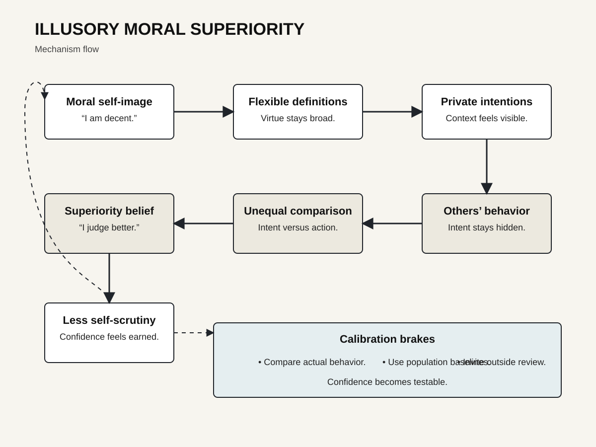
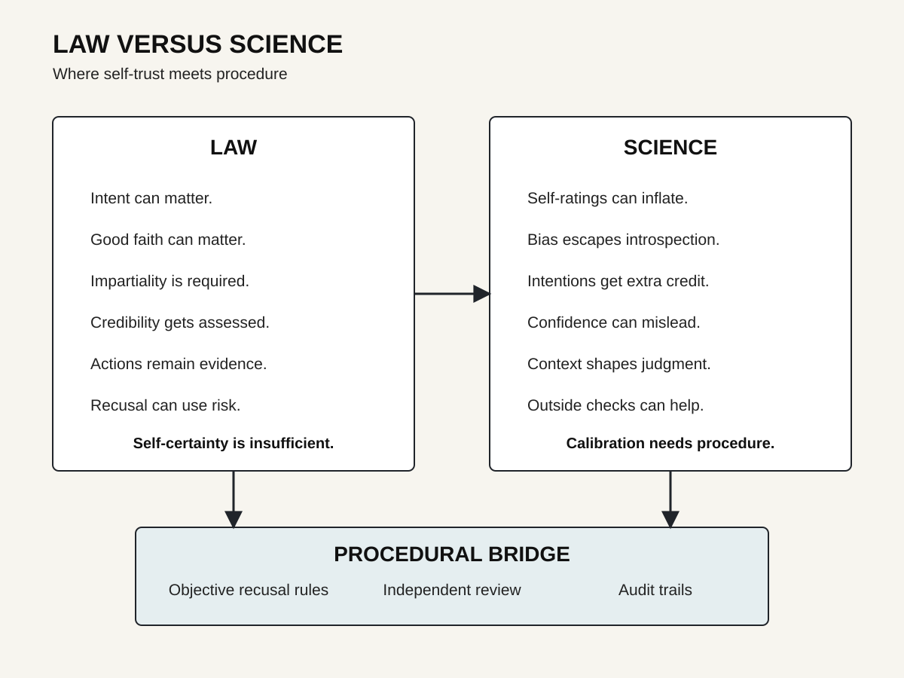
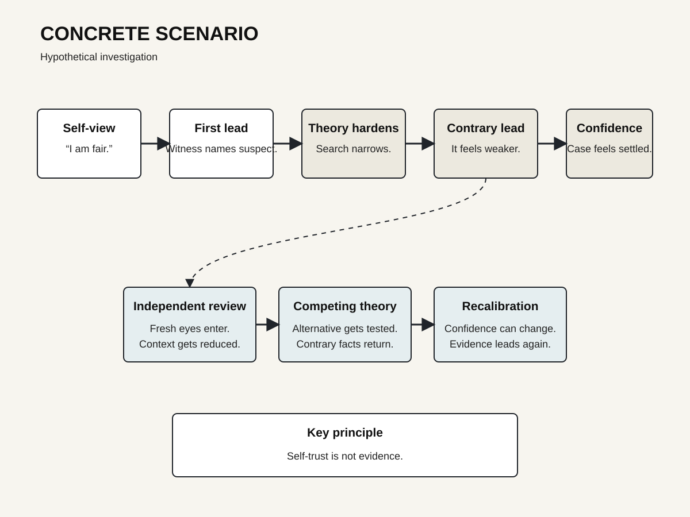

# Human Nature Dossier

## Illusory Moral Superiority

Date: 2026-09-23 22:26.

Central question:

Why trust our goodness?

**The disturbing truth:**
We excuse ourselves first.

**What this does NOT prove:**
People are not frauds.

---

# Page 1 — The mechanism

## What is it?

People rate themselves morally higher.
Others get lower ratings.
This gap can mislead.

Morality lacks one meter.
People define virtue differently.
Those definitions stay flexible.
That flexibility favors self.

We know our intentions.
Others show us actions.
Intentions feel morally important.
Actions look more concrete.
The comparison becomes unequal.

Epley tested moral predictions.
Dunning joined those studies.
Participants predicted generous behavior.
Self-predictions ran too high.
Peer predictions proved better.
Actual behavior exposed errors.

Tappin studied moral superiority.
McKay joined that work.
They tested 270 adults.
Participants rated moral traits.
They rated agency traits.
They rated sociability traits.

Moral inflation was strongest.
The authors modeled irrationality.
Most participants showed inflation.
Self-esteem did not explain it.

Earlier work helps explain.
Ambiguous traits invite flexibility.
Dunning tested that mechanism.
Trait definitions shifted personally.
People chose favorable definitions.

Pronin studied bias blindness.
People noticed others' biases.
They missed their own.
Warnings did not erase this.

Prisoners show another clue.
Sedikides studied one prison.
Participants rated prosocial traits.
They rated themselves higher.
Law-abidingness became the exception.

This evidence converges.
But convergence has limits.
Measures differ across studies.
Samples differ across studies.
Morality remains hard measuring.

## Mechanism steps

First comes self-image.
Most people value goodness.
Then ambiguity enters.
Virtue has many meanings.

Next comes private access.
We know our motives.
We know our excuses.
We know our constraints.

Others lose that access.
We see their outcomes.
We see their mistakes.
We see their violations.

Then comparison begins.
Our intentions receive credit.
Their actions receive weight.
Our context receives mercy.
Their context gets compressed.

A superiority belief emerges.
That belief protects identity.
It may reduce scrutiny.
It may raise certainty.

Certainty can spread outward.
Groups can inherit it.
Moral status can rise.
Outgroups can fall.

Zhang tested group superiority.
Chen joined that work.
Five studies were reported.
The sample totaled 1,158.
Moral superiority increased dehumanization.
Perceived status mediated effects.

Those studies matter.
They test downstream effects.
They do not replicate Tappin.
They use group comparisons.
Their mechanism differs somewhat.

## Why this unsettles

We trust moral introspection.
Law often needs intent.
Society praises good motives.
People defend their motives.

Yet motives need interpretation.
Self-interpretation can bend.
Memory can protect identity.
Definitions can shift too.

The result feels personal.
We dislike that possibility.
We prefer stable character.
Data show weaker calibration.

People can mean well.
They can still misjudge.
They can also harm.
Good intent prevents neither.

---

# Page 2 — Five lenses

## 1. Psychology

The broad pattern persists.
Self-enhancement appears often.
Moral traits show strength.

Epley found prediction errors.
People overpredicted generosity.
Peer predictions tracked behavior.

Tappin found moral inflation.
The effect exceeded agency.
It exceeded sociability too.

Dunning found definition flexibility.
Ambiguity increased self-favoring judgments.

Pronin found bias blindness.
People exempted themselves more.

Sedikides found prisoner enhancement.
That sample was unusual.
That makes it informative.
It also limits generality.

Moral licensing offers adjacency.
It is not identical.
Blanken reviewed 91 studies.
They included 7,397 participants.
The pooled effect was small.
Cohen's d reached 0.31.
Published effects ran larger.

This suggests caution.
Good self-images can loosen restraint.
But mechanisms remain disputed.

## Scientists disagree

The benchmark creates debate.
"Average" can mean many things.
Trait distributions can be skewed.
Many can exceed means.

Self-knowledge can add accuracy.
People know hidden actions.
Observers miss those actions.
That can justify differences.

Cultural patterns also matter.
Self-praise norms differ.
Modesty norms differ too.
Trait meanings vary cross-culturally.

Behavior is another problem.
Morality spans many behaviors.
No single act settles character.
No single survey does.

The exact Tappin method
has limited direct replication.
Broader self-enhancement evidence converges.
That distinction matters.

## Counterargument

Some people are kinder.
Some people behave better.
Some self-ratings are accurate.
Some observers misjudge people.

Moral superiority needs calibration.
A rating proves little.
Behavioral benchmarks help.
Outside ratings help too.
Repeated measures help more.

## 2. Criminal investigation

Investigators need working theories.
Theories guide evidence searches.
That is unavoidable.

Danger follows commitment.
A suspect becomes central.
Evidence gets filtered.
Contrary facts feel weaker.

This dossier links cautiously.
Tunnel vision is separate.
Bias blindness is separate.
Moral superiority is separate.
They can still interact.

Elaad tested police investigators.
The scenarios were hypothetical.
Investigators showed more tunnel vision.
They also rated lie-detection highly.

NIJ documents human factors.
Forensic decisions face bias.
Context can shape judgments.
Expertise does not immunize.

NIJ also studied convictions.
Tunnel vision linked system failures.
Weak cases can harden.
Exculpatory facts get missed.

### Investigation implication

Confidence needs external checks.
Good intent proves little.
Expertise proves little too.

Use competing hypotheses.
Seek disconfirming evidence.
Document rejected alternatives.
Separate reviewers when possible.
Limit irrelevant context.
Record confidence before feedback.

Moral self-trust matters here.
An investigator may feel fair.
That feeling lacks calibration.
Procedure supplies calibration instead.

## 3. Political history

One case illustrates risk.
It does not prove mechanism.

Robespierre spoke in 1794.
He addressed the Convention.
He linked government with virtue.
He also justified terror.

That speech is documented.
Its moral framing is explicit.
Its psychology remains interpretive.

The example shows something.
Political actors claim virtue.
Opponents become moral threats.
Coercion can gain justification.

But history cannot diagnose.
Motives remain partly hidden.
Institutions also mattered.
War also mattered.
Factional struggle mattered.
State survival mattered.

So keep layers separate.
The speech is fact.
The mechanism is interpretation.

Modern research adds caution.
Moral conviction raises distance.
Skitka found lower cooperation.
Effects crossed issue positions.

Political superiority crosses camps.
Toner studied belief superiority.
Extremity predicted superiority.
Direction mattered less.

No party owns this.
No ideology owns this.

## 4. Nietzsche

Nietzsche examined moral origins.
He distrusted moral innocence.
He questioned moral self-certainty.

His lens asks motive.
Who benefits from judgment?
What drives condemnation?
What hides beneath virtue?

That lens fits partly.
It targets self-exoneration.
It targets moral hierarchy.
It targets hidden motives.

But Nietzsche offers philosophy.
He supplies no experiment.
He supplies no prevalence estimate.
He cannot validate causation.

Research must stand separately.

## 5. Robert Greene

Greene stresses self-rationalization.
He studies status games.
He studies social masks.

That lens fits partly.
People explain themselves favorably.
They can judge rivals harshly.

But Greene writes interpretation.
His examples are selective.
His claims can overgeneralize.
They lack experimental control.

Research narrows the claims.
Self-enhancement has evidence.
Universal motives do not.

---

# Page 3 — Mechanism visual

The loop starts inward.
Self-image seeks coherence.
Ambiguity offers room.
Intentions receive extra credit.
Others receive harsher measurement.
Superiority then feels earned.

The visual adds brakes.
Behavior adds calibration.
Base rates add calibration.
Outside review adds calibration.

---

# Page 4 — Law versus science

## Legal conflict

Law often examines intent.
Law also demands impartiality.
Those aims can clash.

A decision-maker feels fair.
That feeling seems relevant.
Science adds a warning.
Introspection misses some bias.

Federal recusal law responds.
Section 455 uses appearances.
Reasonable doubt can matter.
Subjective certainty cannot settle it.

Caperton sharpened that principle.
The Court used objectivity.
Actual bias was unnecessary.
Risk could require recusal.

This creates conflict.
Morality favors sincere intent.
Law sometimes distrusts intent.
Science explains that distrust.

The lesson stays narrow.
Bias is not guilt.
Risk is not misconduct.
Recusal is not condemnation.

Procedure protects everyone.

---

# Page 5 — Concrete scenario

This scenario is hypothetical.
It shows process risk.
It proves no prevalence.

A detective feels fair.
A witness names someone.
One theory becomes central.
Confirming leads feel useful.
Contrary leads feel peripheral.

The detective stays sincere.
No corruption is needed.
No malice is needed.

Then confidence rises.
Notes reinforce confidence.
Colleagues inherit framing.
Alternative theories shrink.

A review can interrupt.
Another investigator enters.
Context gets reduced.
Competing hypotheses return.
Contrary evidence gets tested.

The core problem remains.
Self-trust feels like evidence.
It is not evidence.

## Replication limits

Tappin used 270 adults.
Recruitment used Mechanical Turk.
That limits population claims.

Epley used student samples.
Tasks simplified moral choices.
Prediction differs from life.

Prisoner research stayed narrow.
One prison was studied.
The sample numbered 79.

Trait ratings remain self-report.
Average-person comparisons stay vague.
Moral behavior has breadth.

The Zhang studies help.
They use multiple designs.
They span two countries.
They include minimal groups.

Still, they study groups.
They do not settle individuals.
They also measure dehumanization.
That differs from conduct.

Licensing research is adjacent.
It has meta-analytic support.
Publication bias remains possible.
Its effect is modest.

## What law assumes

Law needs accountable actors.
It often asks knowledge.
It often asks intent.
It often asks reasonableness.

Science adds friction.
People misread themselves.
Certainty can exceed accuracy.
Good faith can coexist.

That does not erase agency.
It changes safeguards.

## What morality assumes

Moral judgment seeks character.
Character feels stable.
Research finds context sensitivity.
Self-description can drift.

This can feel threatening.
It weakens moral certainty.
It does not erase ethics.

## Final takeaway

We judge through asymmetry.
We know our inner story.
We see others outside.
That gap favors us.

The answer is procedural.
Compare actions consistently.
Use outside checks.
Test opposing explanations.
Reward correction over certainty.

---

# Sources

1. Tappin, Ben M.; McKay, Ryan T. 2017. *The Illusion of Moral Superiority.* Social Psychological and Personality Science 8(6):623–631. DOI: https://doi.org/10.1177/1948550616673878

2. Epley, Nicholas; Dunning, David. 2000. *Feeling “Holier Than Thou”.* Journal of Personality and Social Psychology 79(6):861–875. DOI: https://doi.org/10.1037/0022-3514.79.6.861

3. Dunning, David; Meyerowitz, Judith A.; Holzberg, Amy D. 1989. *Ambiguity and Self-Evaluation.* Journal of Personality and Social Psychology 57(6):1082–1090. DOI: https://doi.org/10.1037/0022-3514.57.6.1082

4. Pronin, Emily; Lin, Daniel Y.; Ross, Lee. 2002. *The Bias Blind Spot.* Personality and Social Psychology Bulletin 28(3):369–381. DOI: https://doi.org/10.1177/0146167202286008

5. Sedikides, Constantine; Meek, Rosie; Alicke, Mark D.; Taylor, Sarah. 2014. *Behind Bars but Above the Bar.* British Journal of Social Psychology 53(2):396–403. DOI: https://doi.org/10.1111/bjso.12060

6. Blanken, Irene; van de Ven, Niels; Zeelenberg, Marcel. 2015. *A Meta-Analytic Review of Moral Licensing.* Personality and Social Psychology Bulletin 41(4):540–558. DOI: https://doi.org/10.1177/0146167215572134

7. Zhang, Zaixuan; Chen, Zhansheng. 2026. *When Virtues Are Weaponized.* Political Psychology 47(3):e70140. DOI: https://doi.org/10.1111/pops.70140

8. Skitka, Linda J.; Bauman, Christopher W.; Sargis, Edward G. 2005. *Moral Conviction.* Journal of Personality and Social Psychology 88(6):895–917. DOI: https://doi.org/10.1037/0022-3514.88.6.895

9. Toner, Kaitlin; Leary, Mark R.; Asher, Michael W.; Jongman-Sereno, Katrina P. 2013. *Feeling Superior Is a Bipartisan Issue.* Psychological Science 24(12):2454–2462. DOI: https://doi.org/10.1177/0956797613494848

10. Elaad, Eitan. 2022. *Tunnel Vision and Confirmation Bias.* SAGE Open 12(2). DOI: https://doi.org/10.1177/21582440221095022

11. National Institute of Justice. 2012. *Predicting Erroneous Convictions.* https://nij.ojp.gov/library/publications/predicting-erroneous-convictions-social-science-approach-miscarriages-justice

12. National Institute of Justice. 2021. *Challenges to Reasoning in Forensic Science Decisions.* https://nij.ojp.gov/library/publications/challenges-reasoning-forensic-science-decisions

13. National Institute of Justice. 2024. *Forensic DNA Interpretation and Human Factors.* https://nij.ojp.gov/library/publications/forensic-dna-interpretation-and-human-factors-improving-practice-through

14. 28 U.S.C. §455. *Judicial Disqualification.* https://www.law.cornell.edu/uscode/text/28/455

15. *Caperton v. A. T. Massey Coal Co.*, 556 U.S. 868 (2009). https://www.law.cornell.edu/supremecourt/text/08-22

16. Robespierre, Maximilien. 1794. *On Political Morality.* George Mason University project. https://revolution.chnm.org/d/413

17. Nietzsche, Friedrich. 1887. *On the Genealogy of Morals.* Project Gutenberg. https://www.gutenberg.org/ebooks/52319

18. Greene, Robert. 2018. *The Laws of Human Nature.* Publisher page. https://www.penguinrandomhouse.com/books/317474/the-laws-of-human-nature-by-robert-greene/

---

# Next topic queue

1. Moral dumbfounding.
2. Defensive attribution.
3. Scarcity-driven exclusion.
4. Effort justification.
5. Naive realism.

Illusory moral superiority is complete.
