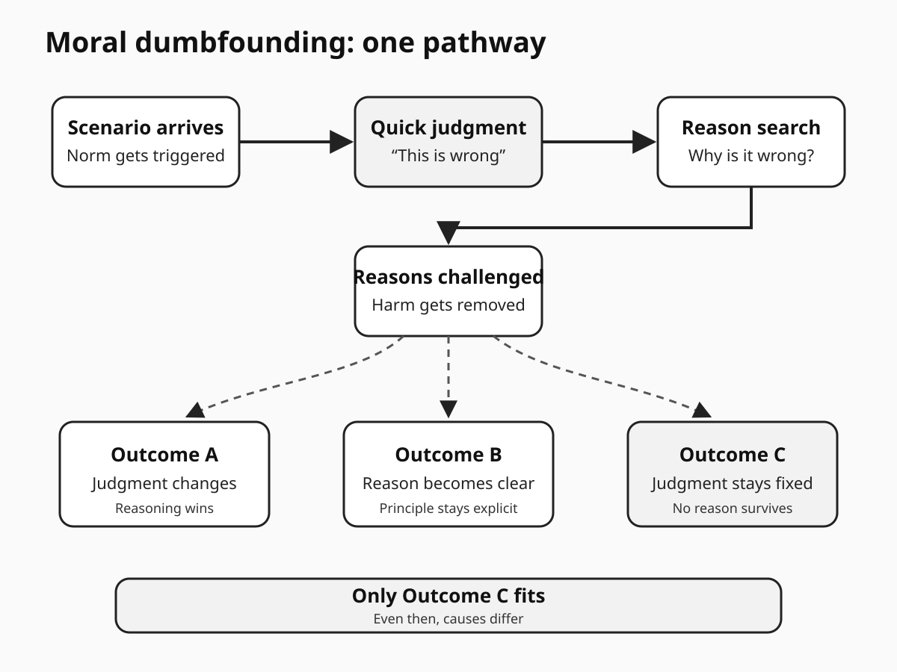
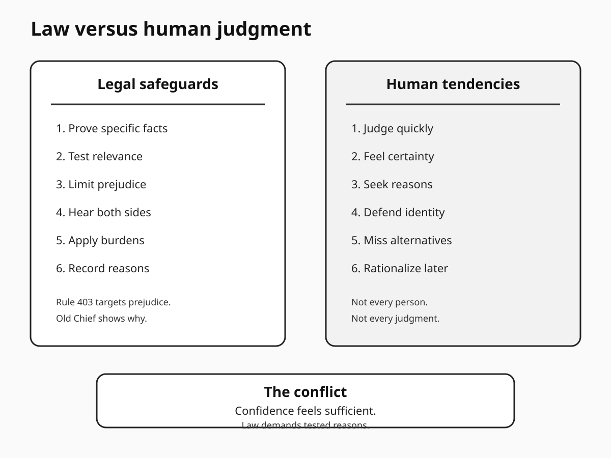
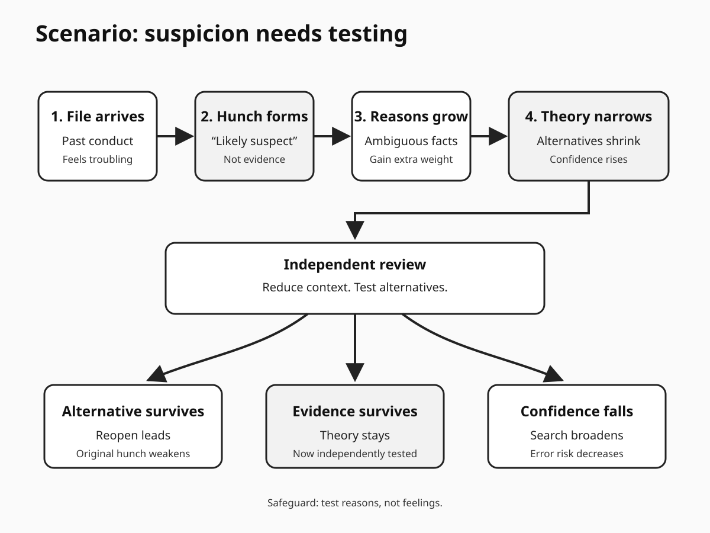

# Human Nature Dossier

## Moral Dumbfounding

Date: 2026-09-23 23:25.

Central question:

Why judge before reasons?

**The disturbing truth:** Judgment can precede reasons.

**What this does NOT prove:** Reason does not vanish.

---

# Page 1 — The mechanism

## What is it?

Moral dumbfounding has structure.

A judgment appears first.
Reasons are requested afterward.
Those reasons get challenged.
The judgment still remains.

Someone may then say:

"It is just wrong."

That response matters.
But interpretation remains contested.

The core claim stays narrow.
People sometimes keep judgments.
They cannot explain why.

That pattern seems uncomfortable.
We expect moral reasons.
We expect conscious access.
We expect reasons first.

Research complicates that picture.

Haidt proposed intuitionist models.
Fast evaluations can lead.
Reasoning can follow afterward.
Social discussion can reshape judgment.

That model stays broader.
Dumbfounding tests one piece.

## The basic sequence

First comes a scenario.
It triggers quick evaluation.
The person says wrong.

Then reasons get requested.
The person names harm.
The interviewer removes harm.

Another reason appears.
That reason gets challenged.
The judgment may persist.

The person feels certainty.
Yet reasons stay weak.

That creates dumbfounding.

## What studies found

Early evidence stayed limited.
The famous study was small.
It lacked peer review.

That matters greatly.
The concept became famous.
Evidence lagged behind discussion.

McHugh changed that.
His team tested measures.
They published three studies.
They found measurable dumbfounding.

Their 2017 paper mattered.
It defined observable indicators.
It separated reasons carefully.

Later work tightened exclusions.
McHugh tested reason endorsement.
He tested reason articulation.
He tested reason consistency.

Dumbfounding still appeared.
Rates were not universal.
The effect looked conditional.

Cross-cultural work followed.
Three samples were studied.
China included 165 participants.
India included 181 participants.
Another sample included 264.

That sample was mixed.
MENA participants dominated it.

Dumbfounding appeared there too.
This expanded earlier evidence.
It did not prove universality.

## Another important finding

Cushman studied moral principles.
Participants judged harm scenarios.
They then explained judgments.

Some principles were verbalized.
One principle was not.
Yet judgments tracked it.

That result matters.
Judgment and explanation differ.
The difference can persist.

It does not prove dumbfounding.
It supports dissociation.

## Why this unsettles

Moral certainty feels reasoned.
Often it probably is.
Sometimes access is incomplete.

That gap feels threatening.
We link reasons with fairness.
We link reasons with responsibility.
We link reasons with law.

Yet humans can judge.
Then reasons may follow.

That sequence permits rationalization.
It also permits correction.

Both outcomes remain possible.

## Scientists disagree

The disagreement is serious.

Royzman challenged classic studies.
His team tested disbelief.
Participants distrusted scenario premises.

That changed the picture.
People often perceived harm.
Those people had reasons.

Under stricter classification,
dumbfounding nearly disappeared.

That critique remains important.

McHugh later responded.
Reason endorsement seems insufficient.
People can endorse prompts.
That does not prove causation.

His studies added tests.
Reasons needed articulation.
Reasons needed consistent application.
Dumbfounding then reappeared.

The debate stays open.

## Disgust is separate

Dumbfounding often involves taboo.
Disgust sometimes accompanies taboo.
Those are not identical.

Landy reviewed 50 studies.
They tested incidental disgust.
The raw effect was small.
Publication bias mattered greatly.

Adjusted effects approached zero.

So avoid one shortcut.
Disgust does not explain everything.

## Counterargument

People may have reasons.
They may lack words.

Tacit reasoning can exist.
Memory retrieval can fail.
Conversation can add pressure.
Scenarios can feel unrealistic.
Norms can remain implicit.

Those points weaken claims.
They do not erase findings.

The safest conclusion follows.

Judgment sometimes outruns explanation.
The causes remain debated.

---

# Page 2 — Five lenses

## 1. Psychology

The evidence supports dissociation.
It does not support irrationality.

Haidt emphasized intuition.
Cushman found hidden principles.
McHugh found dumbfounding.
Royzman found strong challenges.

Together they show tension.

People can judge quickly.
Reasons can arrive later.
Some reasons remain inaccessible.
Some reasons remain implicit.
Some reasons are reconstructed.

Scientists dispute frequencies.
They dispute mechanisms too.

### Replication limits

The original demonstration struggled.
Its sample was tiny.
It stayed unpublished formally.

Later studies improved measurement.
But tasks remain artificial.

Taboo vignettes create problems.
Participants reject assumptions.
They import real-world risks.
They infer hidden harms.

Interview pressure also matters.
Repeated challenges can corner participants.
That may manufacture confusion.

Cross-cultural samples help.
But they remain limited.
They cannot prove universality.

Moral language also differs.
Norm meanings differ too.

### Methodological limit

Reason reports are imperfect.

A missing reason
is not absent cognition.

An offered reason
is not causal proof.

That measurement problem persists.

## 2. Criminal investigation

This link needs caution.

Dumbfounding studies test morality.
Police studies test investigation.
They are different literatures.

Still, one risk overlaps.
Early impressions can harden.

Investigators need hypotheses.
That is normal work.

Problems start afterward.
One hypothesis gains priority.
Contrary evidence feels weaker.
Search choices become selective.

Rassin tested this pattern.
Initial guilt estimates mattered.
Search choices followed them.

Elaad tested investigators.
Tunnel vision appeared stronger.
The scenarios were hypothetical.

NIJ reports similar risks.
Tunnel vision can cascade.
Wrongful convictions can follow.

### Investigation implication

A hunch needs testing.
It never becomes evidence.

Write competing hypotheses.
Seek disconfirming evidence.
Record early confidence.
Revisit rejected leads.
Use independent review.

These safeguards matter.
They work without blame.

The risk is cognitive.
Corruption is unnecessary.

### Homicide relevance

Homicide cases create pressure.
The stakes stay high.
Public attention can rise.
Case closure matters strongly.

A disliked suspect
may feel morally wrong.

That feeling can mislead.
It can guide searches.
It can color ambiguity.

This is an implication.
It is not direct proof.

## 3. Political history

Consider the Lavender Scare.

The facts are documented.

In 1953,
Eisenhower signed Executive Order 10450.

The order listed conduct.
It included "sexual perversion."
It included "immoral" conduct.

Homosexual federal workers faced removal.
Thousands lost federal careers.

National Archives documents this.
Federal policy later changed.

The Civil Service Commission
ended its ban in 1975.

The State Department followed.
Its ban ended in 1977.

### Interpretation

The historical fact stands.
The psychology remains interpretation.

Officials linked morality
with national security risk.

That linkage had reasons.
It also reflected stigma.
Fear shaped institutions too.

Moral dumbfounding cannot diagnose history.

Still, the case illustrates
one political danger.

Moral certainty can precede
strong evidentiary foundations.
Institutions can then rationalize.

That interpretation needs caution.
Cold War fears mattered.
Blackmail concerns mattered too.
Existing prejudice also mattered.

No single mechanism suffices.

## 4. Nietzsche

Nietzsche distrusted moral innocence.

His genealogical method asks:
Where did values arise?
Who benefits from them?
Which emotions shaped them?

He often examined ressentiment.
He examined value creation.

That lens fits partially.

A person says wrong.
Nietzsche asks what preceded it.

Was it principle?
Was it resentment?
Was it inherited norm?
Was it status conflict?

Those are philosophical questions.
They are not experiments.

Nietzsche proves nothing here.
His lens prompts inquiry.

## 5. Robert Greene

Greene emphasizes hidden motives.
He emphasizes rationalization too.

His strategic lens asks:
What story protects identity?
What story preserves status?

That can fit dumbfounding.
Reasons may become defenses.

But Greene overgeneralizes sometimes.
His method stays literary.
Historical examples are selective.

Research imposes stricter limits.

Dumbfounding is not deception.
It may involve confusion.
It may involve tacit norms.
It may involve poor recall.

Greene cannot settle causes.

---

# Page 3 — Mechanism visual

The visual shows sequence.

A judgment appears.
Reasons get requested.
Challenges remove reasons.
Judgment may persist.

Three exits remain.

The person revises.
The person finds reasons.
The person stays certain.

Only the last path
resembles dumbfounding.

---

# Page 4 — Law versus science

## Legal conflict

Law asks for evidence.
It also limits prejudice.

Human judgment can differ.
Emotion can feel probative.
Character can feel probative.

Federal Rule 403 responds.
Relevant evidence can be excluded.
Unfair prejudice can dominate.

Old Chief illustrates this.
The Supreme Court warned
about improper guilt grounds.

That legal safeguard matters.
It assumes humans need structure.

Moral dumbfounding adds friction.
Certainty may lack reasons.

### The conflict

Moral confidence feels sufficient.
Legal proof requires more.

A juror may feel
that someone seems wrong.

Law demands offense evidence.
It rejects pure character inference.

Science explains one risk.
Rapid judgment can lead.
Reasons may follow later.

This does not invalidate juries.
It supports procedural safeguards.

---

# Page 5 — Concrete scenario

## Scenario

A homicide file arrives.
One suspect has history.
The history feels troubling.

A detective feels suspicion.
That reaction is understandable.

Then ambiguous facts appear.
One witness seems uncertain.
A timeline has gaps.
An alibi looks awkward.

The team seeks reasons.
Each ambiguity gains weight.
Contrary facts receive less.

No one fabricates evidence.
No one needs malice.

The case still narrows.

Then review begins.
A second team enters.
They see reduced context.
They test alternatives.

Some facts weaken.
Other leads reopen.
The original theory survives
only if evidence supports it.

That is the safeguard.

### What this scenario shows

Gut reactions are data.
They are not proof.

Reasons need testing.
Confidence needs calibration.
Alternatives need protection.

### What this scenario cannot show

It cannot estimate prevalence.
It cannot diagnose investigators.
It cannot prove dumbfounding.

It shows structural risk.

---

# Why law cares

Law assumes responsibility.
That assumption remains necessary.

Law also demands reasons.
It demands evidence too.

Science adds one warning.
Introspection can be incomplete.

People may feel certain
without knowing the cause.

That means safeguards matter.

Evidence rules matter.
Disclosure rules matter.
Independent review matters.
Recorded interviews matter.
Alternative hypotheses matter.

None removes judgment.
They discipline judgment instead.

# Why morality cares

Morality needs reasons too.
But everyday morality differs.

People often use shortcuts.
Culture supplies norms.
Families supply norms.
Peers supply norms.
Institutions supply norms.

These norms become familiar.
Familiarity feels like truth.

Dumbfounding exposes that possibility.
It does not settle it.

# Final takeaway

Judgment can come first.
Reasons can come second.
Sometimes reasons stay unavailable.

That does not erase agency.
It does weaken certainty.

The best response
is not cynicism.

Ask for reasons.
Test those reasons.
Test alternatives too.
Allow revision without shame.

---

# Sources

1. Haidt, Jonathan. 2001. *The Emotional Dog and Its Rational Tail.* Psychological Review 108(4):814–834. DOI: https://doi.org/10.1037/0033-295X.108.4.814

2. McHugh, Cillian; McGann, Marek; Igou, Eric; Kinsella, Elaine. 2017. *Searching for Moral Dumbfounding.* Collabra: Psychology 3(1):23. DOI: https://doi.org/10.1525/collabra.79

3. McHugh, Cillian; McGann, Marek; Igou, Eric; Kinsella, Elaine. 2020. *Reasons or Rationalizations.* Journal of Behavioral Decision Making 33(3):376–392. DOI: https://doi.org/10.1002/bdm.2167

4. McHugh, Cillian et al. 2023. *Just Wrong? Or Just WEIRD?* Memory & Cognition 51:1043–1060. DOI: https://doi.org/10.3758/s13421-022-01386-z

5. Royzman, Edward; Kim, Kwanwoo; Leeman, Robert. 2015. *The Curious Tale of Julie and Mark.* Judgment and Decision Making 10(4):296–313. DOI: https://doi.org/10.1017/S193029750000512X

6. Cushman, Fiery; Young, Liane; Hauser, Marc. 2006. *The Role of Conscious Reasoning and Intuition.* Psychological Science 17(12):1082–1089. DOI: https://doi.org/10.1111/j.1467-9280.2006.01834.x

7. Landy, Justin; Goodwin, Geoffrey. 2015. *Does Incidental Disgust Amplify Moral Judgment?* Perspectives on Psychological Science 10(4):518–536. DOI: https://doi.org/10.1177/1745691615583128

8. Olatunji, Bunmi; Puncochar, Bieke. 2014. *Emotion, Reason, Morality, and Punishment.* Review of General Psychology 18(3). DOI: https://doi.org/10.1037/gpr0000010

9. Rassin, Eric; Eerland, Anita; Kuijpers, Ilse. 2010. *Let's Find the Evidence.* Journal of Investigative Psychology and Offender Profiling 7(3):231–246. DOI: https://doi.org/10.1002/jip.126

10. Elaad, Eitan. 2022. *Tunnel Vision and Confirmation Bias.* SAGE Open 12(2). DOI: https://doi.org/10.1177/21582440221095022

11. National Institute of Justice. 2012. *Predicting Erroneous Convictions.* https://nij.ojp.gov/library/publications/predicting-erroneous-convictions-social-science-approach-miscarriages-justice

12. Federal Rule of Evidence 403. https://www.law.cornell.edu/rules/fre/rule_403

13. *Old Chief v. United States*, 519 U.S. 172 (1997). https://www.law.cornell.edu/supremecourt/text/519/172

14. National Archives. 2016. *These People Are Frightened to Death.* https://www.archives.gov/publications/prologue/2016/summer/lavender.html

15. National Archives. *Executive Order 10450.* https://www.archives.gov/federal-register/codification/executive-order/10450.html

16. Nietzsche, Friedrich. 1887. *On the Genealogy of Morals.* https://www.gutenberg.org/ebooks/52319

17. Greene, Robert. 2018. *The Laws of Human Nature.* https://www.penguinrandomhouse.com/books/317474/the-laws-of-human-nature-by-robert-greene/

---

# Next topic queue

1. Defensive attribution.
2. Scarcity-driven exclusion.
3. Effort justification.
4. Naive realism.
5. Moral typecasting.

Moral dumbfounding is complete.
