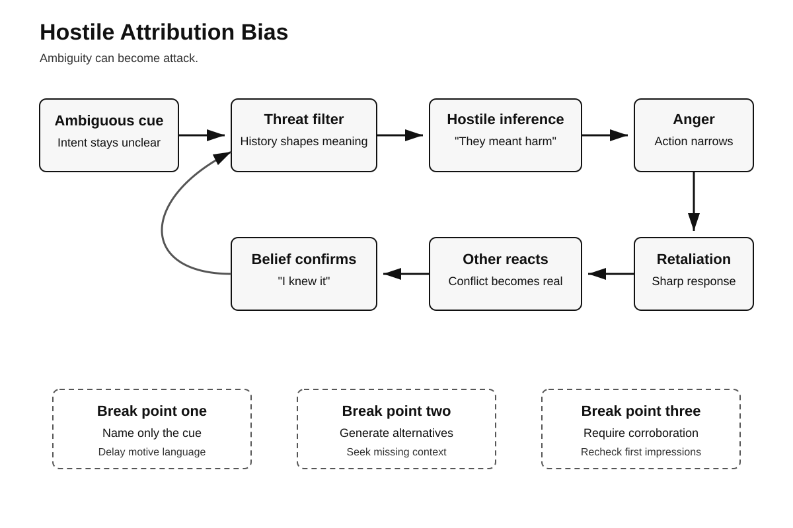
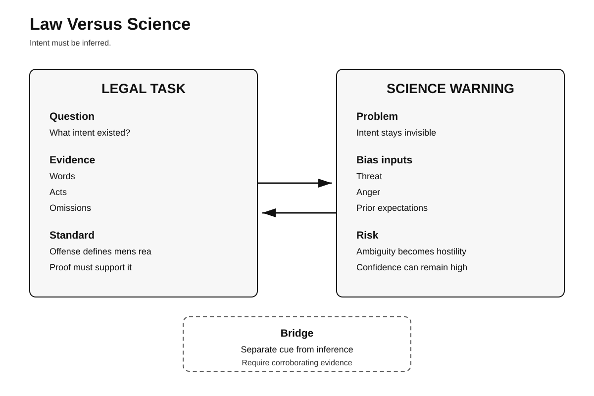
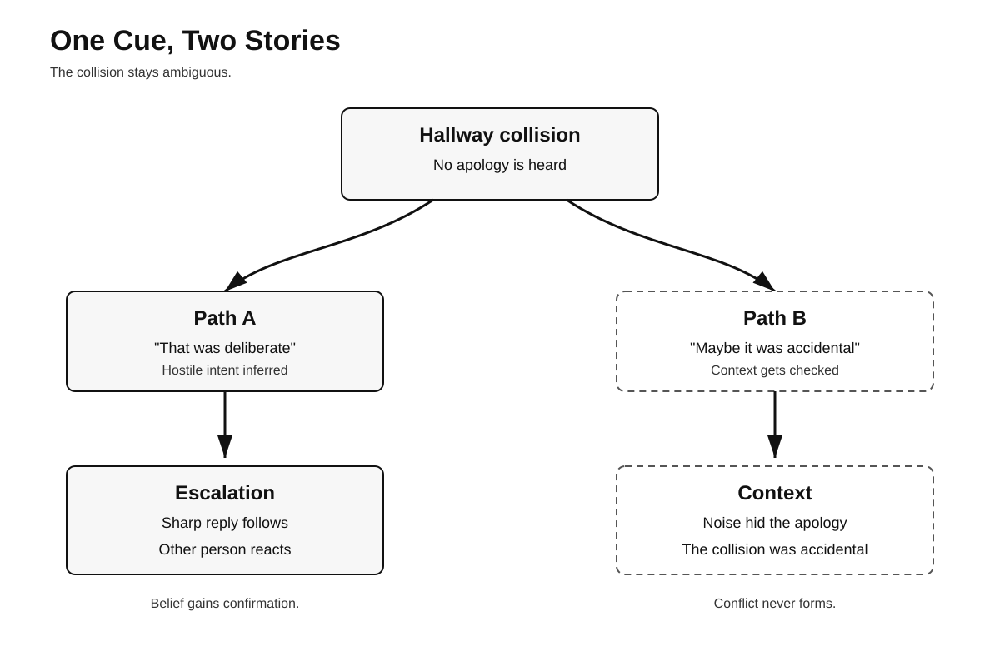

# Human Nature Dossier

## Hostile Attribution Bias

**Date:** 2026-09-24 01:25 +04:00  
**Series:** Human Nature / Law / Science

> Central question:  
> Why does ambiguity become hostility?

## One-line answer

Uncertainty invites hostile inference.

**The disturbing truth:**  
Ambiguity can become perceived attack.

**What this does NOT prove:**  
Suspicion never proves hostile intent.

---

# Page 1 — Psychology

## The buried mechanism

Hostile attribution bias matters.

The pattern is simple.

Ambiguous behavior occurs.

Intent stays unclear.

Past expectations activate.

Threat receives extra weight.

Benign explanations lose ground.

Hostile intent feels likely.

Anger can then rise.

Retaliation becomes easier.

The other person reacts.

That reaction seems confirming.

A loop can form.

## What research finds

Early work studied children.

Aggressive children differed reliably.

Ambiguous acts looked hostile.

A 2002 meta-analysis followed.

It included 41 studies.

Participants totaled 6,017.

The association was reliable.

Effects varied across studies.

Stronger aggression increased effects.

Methods also changed effects.

Real interactions showed more.

Threat can strengthen bias.

Dodge tested this directly.

Self-threat increased hostile inferences.

Aggressive boys changed most.

Cross-national evidence followed.

Nine countries were studied.

Children numbered 1,299.

Hostile attribution tracked aggression.

The design stayed longitudinal.

It did not prove causation.

Adult findings also exist.

A 2019 review included 25 studies.

Most found positive associations.

Effects were small-to-medium.

Samples varied substantially.

Forensic samples were included.

A 2024 meta-analysis expanded evidence.

It covered 118 studies.

Hostile attribution correlated aggression.

Reported correlation was .303.

Reactive aggression linked stronger.

A 2026 meta-analysis updated anger.

It included 35 studies.

Participants totaled 10,451.

Trait anger correlated .32.

Heterogeneity remained very high.

I² reached 80.3 percent.

That limits simple conclusions.

## Why this unsettles

People trust their impressions.

Intent often feels visible.

But intent stays hidden.

We infer it indirectly.

Emotion shapes that inference.

History shapes it too.

Threat can narrow alternatives.

Confidence can still remain.

This creates moral trouble.

Blame follows inferred intention.

Punishment can follow blame.

Yet the inference erred.

## Counterargument

Suspicion can protect people.

Some threats are real.

Experience can improve detection.

Hostility sometimes is obvious.

Not every inference biases.

Aggression has many causes.

Hostile attribution explains little.

Context often dominates outcomes.

---

# Page 2 — Five Lenses

## Lens 1: Psychology

The evidence is consistent.

But strength varies greatly.

Children dominate early studies.

Adult evidence is newer.

Many studies are cross-sectional.

Measures differ between labs.

Vignettes remain common tools.

Real interactions remain fewer.

Neural evidence stays mixed.

A 2024 review warns.

Twenty-one studies were reviewed.

Results were heterogeneous.

Networks differed across studies.

No neural signature exists.

Intervention evidence also cautions.

Bias training changes ratings.

Behavior changes less reliably.

A 2024 meta-analysis found this.

Sixteen trials were included.

Participants totaled 1,449.

Hostile interpretations decreased moderately.

Aggression changes were small.

Observer-rated effects weakened further.

Treatment evidence stays insufficient.

### Replication limits

The core association replicates.

Its size remains unstable.

Measurement creates heterogeneity.

Samples create heterogeneity.

Provocation types also matter.

Causality remains partly unresolved.

## Lens 2: Investigation

Direct homicide evidence is sparse.

That limitation matters.

Related evidence still applies.

Investigators infer human intent.

Witnesses infer intent too.

Ambiguous conduct creates risk.

Silence can look hostile.

Avoidance can look guilty.

Nervousness can look deceptive.

A stare can look threatening.

Those meanings remain inferential.

NIJ warns about bias.

Early theories shape reasoning.

Context can distort interpretation.

Threat research adds caution.

Police anxiety affects perception.

It can affect decisions.

That evidence is adjacent.

It is not identical.

### Criminal-investigation implication

Record behavior first.

Record interpretation separately.

Generate benign alternatives.

Generate hostile alternatives.

Seek independent corroboration.

Delay motive language.

Recheck early assumptions.

Use blind review where possible.

Do not infer guilt.

Ambiguity needs more evidence.

## Lens 3: Political history

### USS Maine, 1898

The ship exploded suddenly.

The cause was uncertain.

Tensions with Spain existed.

Public suspicion rose quickly.

Some newspapers blamed Spain.

The Navy investigated later.

Its board favored mining.

It identified no culprit.

War followed that April.

Modern cause remains disputed.

Navy history notes uncertainty.

Internal fire remains plausible.

This history is documented.

The mechanism remains interpretive.

Hostile attribution is possible.

It cannot be proven.

That distinction matters.

### Historical lesson

Threat amplifies hostile narratives.

Ambiguity can become intention.

Institutions need evidence barriers.

## Lens 4: Nietzsche

Nietzsche examined ressentiment.

He distrusted moral simplification.

Enemies can organize judgment.

Blame can organize identity.

That resembles hostile attribution.

But similarity proves nothing.

Nietzsche offered philosophy only.

He did not test bias.

Use him interpretively.

## Lens 5: Robert Greene

Greene stresses emotional detachment.

He warns against projection.

He recommends motive analysis.

That overlaps this topic.

But Greene uses examples.

He provides no experiments.

His claims remain interpretive.

Research sets the limits.

Where Greene overreaches, stop.

---

# Page 3 — Mechanism Flow

The visual shows escalation.

It separates cue and inference.

It also shows breakpoints.

---

# Page 4 — Law Versus Science

## Legal conflict

Criminal law needs intent.

Intent depends on offense.

Courts require evidence.

Jurors infer mental states.

Ninth Circuit guidance reflects this.

Words can show intent.

Acts can show intent.

Omissions can show intent.

But observers interpret behavior.

Science adds a warning.

Ambiguous behavior invites projection.

Threat can bend inference.

Anger can bend inference.

Prior beliefs can intrude.

The conflict is structural.

Law needs mental-state judgments.

Science finds judgment vulnerability.

### Safeguard

Separate observation from inference.

Require corroborating evidence.

Test alternative explanations.

Name uncertainty explicitly.

---

# Page 5 — Concrete Scenario

A hallway collision occurs.

No apology is heard.

Intent stays ambiguous.

One person assumes hostility.

Anger rises immediately.

A sharp reply follows.

The second person reacts.

Now hostility becomes real.

The first belief strengthens.

The loop self-confirms.

A second path differs.

The person checks context.

Noise blocked the apology.

The collision was accidental.

No conflict develops.

### Core lesson

Perception can create evidence.

That evidence feels retrospective.

The original intent differed.

---

# Practical safeguards

Name the observable cue.

Then name your inference.

List three alternatives.

Check missing context.

Delay motive judgments.

Ask what would falsify.

Seek independent evidence.

Revisit after arousal falls.

These steps are imperfect.

They slow hostile certainty.

---

# Topic queue

Next topics remain distinct.

1. Moral typecasting
2. Effort justification
3. Group-serving attribution
4. Responsibility laundering
5. Naive realism

Completed topics stay excluded.

Future runs use one.

---

# Illustrations

- [Mechanism flow](01-mechanism-flow.svg)
- [Law versus science](02-law-vs-science.svg)
- [Concrete scenario](03-concrete-scenario.svg)

---

# Sources

## Psychology

- Orobio de Castro, B., et al. *Hostile attribution of intent and aggressive behavior: a meta-analysis.* Child Development, 2002. DOI: https://doi.org/10.1111/1467-8624.00447
- Dodge, K. A., & Somberg, D. R. *Hostile attributional biases among aggressive boys are exacerbated under conditions of threats to the self.* Child Development, 1987. DOI: https://doi.org/10.1111/j.1467-8624.1987.tb03501.x
- Dodge, K. A., et al. *Hostile attributional bias and aggressive behavior in global context.* PNAS, 2015. DOI: https://doi.org/10.1073/pnas.1418572112
- Klein Tuente, S., Bogaerts, S., & Veling, W. *Hostile attribution bias and aggression in adults: a systematic review.* Aggression and Violent Behavior, 2019. DOI: https://doi.org/10.1016/j.avb.2019.01.009
- Xu, X., et al. *The Role of Parent-Child Attachment, Hostile Attribution Bias in Aggression: A Meta-Analytic Review.* Trauma, Violence, & Abuse, 2024. DOI: https://doi.org/10.1177/15248380231210920
- Fenerdjian, C., & Gagnon, J. *The Association Between Trait Anger and Hostile Attribution Bias: A Systematic Review and Meta-Analysis.* Journal of Personality, 2026. DOI: https://doi.org/10.1111/jopy.70092
- Wagels, L., & Hernandez-Pena, L. *Neural correlates of hostile attribution bias — A systematic review.* Aggression and Violent Behavior, 2024. DOI: https://doi.org/10.1016/j.avb.2024.101975
- AlMoghrabi, N., et al. *The Effects of Cognitive Bias Modification on Hostile Interpretation Bias and Aggressive Behavior.* Cognitive Therapy and Research, 2024. DOI: https://doi.org/10.1007/s10608-023-10415-3

## Forensic and policing

- McNiel, D. E., Eisner, J. P., & Binder, R. L. *The relationship between aggressive attributional style and violence by psychiatric patients.* Journal of Consulting and Clinical Psychology, 2003. DOI: https://doi.org/10.1037/0022-006X.71.2.399
- Nieuwenhuys, A., Cañal-Bruland, R., & Oudejans, R. R. D. *Effects of Threat on Police Officers' Shooting Behavior.* Applied Cognitive Psychology, 2012. DOI: https://doi.org/10.1002/acp.2838
- National Institute of Justice. *Challenges to Reasoning in Forensic Science Decisions.* Stable link: https://nij.ojp.gov/library/publications/challenges-reasoning-forensic-science-decisions

## Law

- Ninth Circuit. *Knowingly—Defined.* Stable link: https://www3.ce9.uscourts.gov/jury-instructions/node/373
- Ninth Circuit. *Specific Intent.* Stable link: https://www3.ce9.uscourts.gov/jury-instructions/node/370

## Political history

- U.S. Naval History and Heritage Command. *Maine I.* Stable link: https://www.history.navy.mil/research/histories/ship-histories/danfs/m/maine-i.html
- U.S. Naval History and Heritage Command. *USS Maine.* Stable link: https://www.history.navy.mil/browse-by-topic/ships/ships-of-steam/uss-maine.html
- Library of Congress. *Sinking of the Maine.* Stable link: https://guides.loc.gov/chronicling-america-sinking-maine

## Philosophy

- Friedrich Nietzsche. *The Genealogy of Morals.* Project Gutenberg. Stable link: https://www.gutenberg.org/ebooks/52319

## Strategic lens

- Robert Greene. *The Laws of Human Nature.* Penguin Random House. Stable link: https://www.penguinrandomhouse.com/books/317474/the-laws-of-human-nature-by-robert-greene/
