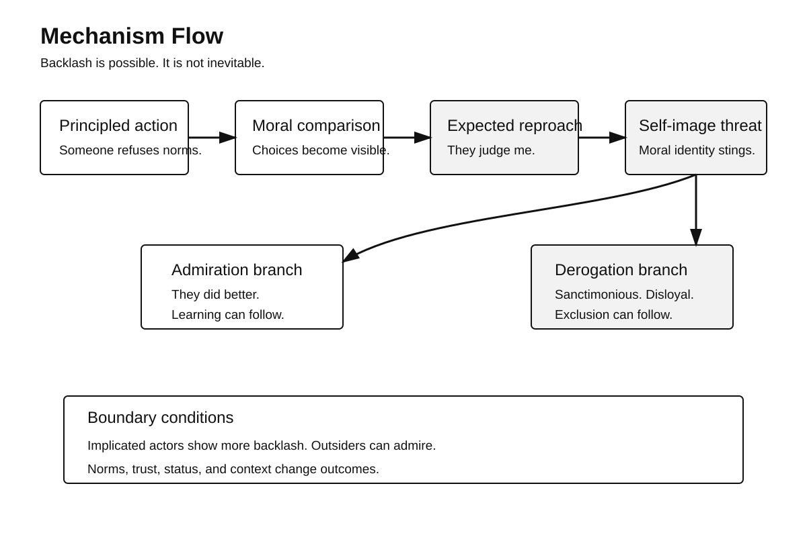
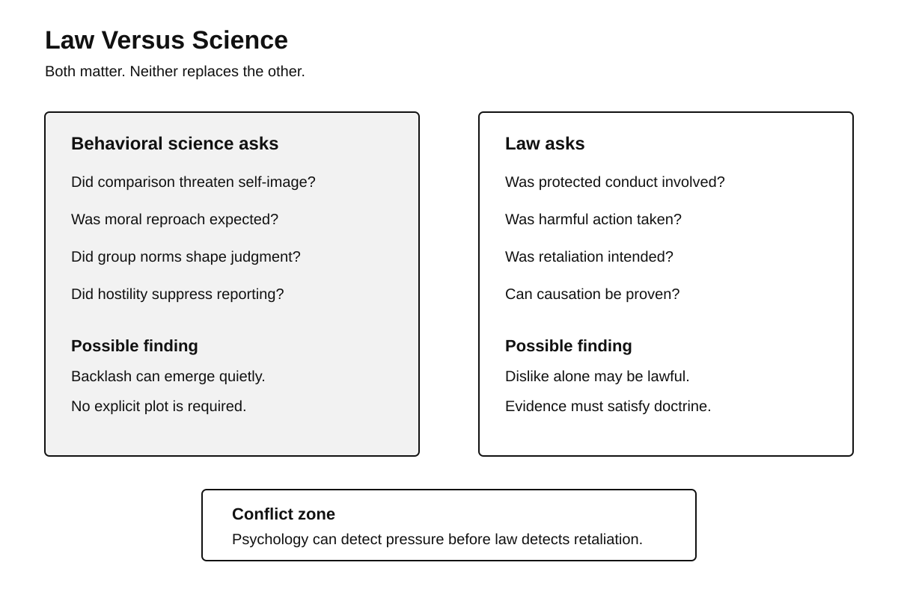
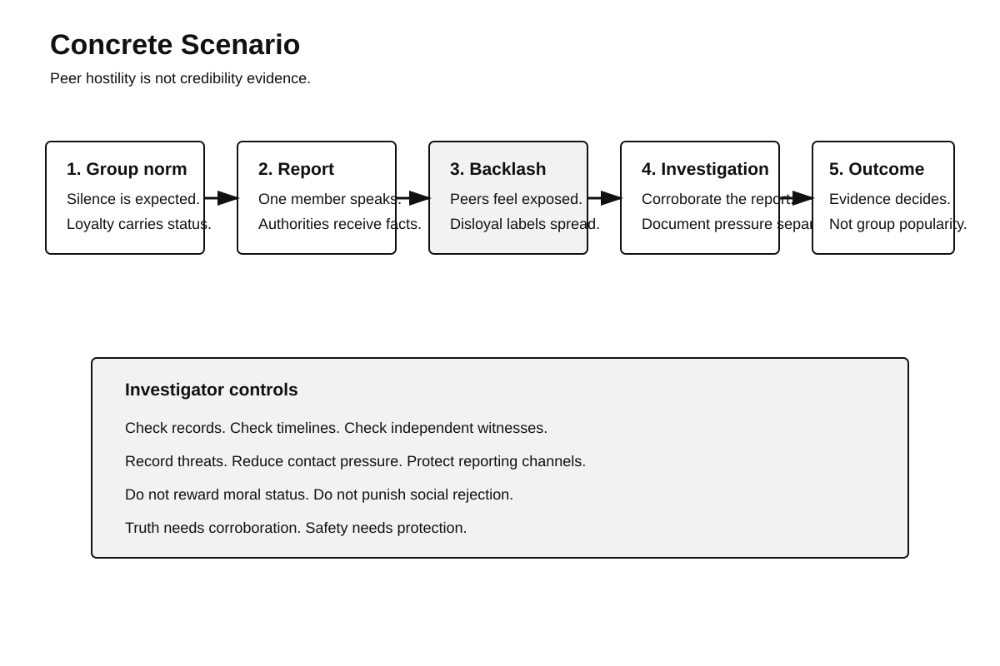

# Human Nature Dossier
## Do-Gooder Derogation

**Date:** 2026-09-25 21:27

**Central question:**
Why punish moral behavior?

**Working definition:**
Good conduct can threaten.
It creates social comparison.
It can imply reproach.
That implication can sting.
Some observers strike back.

**The disturbing truth:**
Good conduct can provoke punishment.

**What this does NOT prove:**
Virtue does not cause hate.

---

# Page 1 — Mechanism

## The buried trait

Humans protect self-image.
Moral self-image matters deeply.
Comparison can threaten it.
Moral dissent creates comparison.
Nobody needs explicit criticism.

The comparison can suffice.
The observer feels exposed.
The rebel becomes threatening.
The act seems accusatory.
Dislike can then rise.

Researchers call this pattern
“do-gooder derogation.”
Related work studies
“moral rebel rejection.”
These labels overlap partly.

They are not identical.
Antisocial punishment differs too.
That work studies sanctions.
It often uses games.
The mechanisms can differ.

## Core mechanism

First, norms become shared.
Then someone breaks them.
The break seems principled.
Others stayed compliant.
Their choice becomes visible.

A comparison now appears.
The rebel chose differently.
That can imply judgment.
The observer anticipates reproach.
Self-image comes under pressure.

Several responses become possible.
One response is reflection.
Another response is admiration.
Another response is rejection.
Rejection protects self-regard.

The person gets redefined.
“Principled” becomes “self-righteous.”
“Courageous” becomes “disloyal.”
“Consistent” becomes “extreme.”
The act stays unchanged.

The social meaning changes.
That shift matters legally.
It also matters institutionally.

## What experiments found

Minson and Monin studied vegetarians.
Participants were meat eaters.
Vegetarians formed moral minorities.
Many participants anticipated judgment.

Study One found negativity.
Forty-seven percent volunteered negatives.
Expected reproach predicted negativity.
The association was correlational.

Study Two manipulated salience.
Participants imagined moral judgment.
Ratings then became harsher.
That supports causal influence.

The studies were narrow.
Diet was the domain.
Samples were not global.
The mechanism needs boundaries.

Monin and colleagues studied rebels.
Participants faced biased instructions.
Some complied with them.
Another actor refused.

Observers often admired refusal.
Compliant actors reacted differently.
They often disliked rebels.
Moral implication mattered greatly.

That difference is crucial.
Backlash was not universal.
Personal implication changed reactions.

O’Connor and Monin followed.
They tested rival explanations.
Two studies supported threat.
Principled stance mattered.
Rebellion also mattered.

That work is useful.
It is not independent.
Monin coauthored both lines.
No giant replication exists.

Related evidence broadens context.
Herrmann and colleagues tested punishment.
Sixteen participant pools participated.
Some punished high contributors.

Cross-society differences were large.
That finding is uncomfortable.
Cooperation was sometimes sanctioned.
Yet this is adjacent evidence.

It does not prove
do-gooder derogation specifically.
Different motives can operate.

Balliet and Van Lange
reviewed punishment experiments.
Their meta-analysis covered
eighty-three separate studies.
It included 7,361 participants.

Punishment effects varied socially.
Trust moderated cooperation benefits.
This supports context dependence.
It does not isolate reproach.

## Why this disturbs us

We prefer another story.
Good acts earn approval.
Bad acts earn blame.
Reality is less tidy.

Moral conduct creates comparison.
Comparison threatens social identity.
Groups also police loyalty.
Dissent can seem betrayal.

This creates moral inversion.
The helpful member becomes
the social problem.

That inversion can spread.
Others watch the backlash.
Future dissent becomes costly.
Silence can become safer.

No conspiracy is required.
No evil plan exists.
Ordinary comparison can suffice.

---

# Page 2 — Five lenses

## 1. Psychology

The strongest direct evidence
comes from moral-rebel studies.
Anticipated reproach matters.
Personal implication matters too.

The mechanism looks conditional.
Outsiders can admire dissenters.
Implicated actors may resent them.
That contrast weakens determinism.

Self-image maintenance offers
one plausible process.
Norm violation offers another.
Status threat may contribute.
Identity threat may contribute.

These mechanisms can coexist.
Experiments separate them imperfectly.

### Counterargument

Sometimes criticism seems earned.
Some moral actors preach.
Some exaggerate superiority.
Some impose coordination costs.

Dislike can reflect behavior.
It need not reflect threat.

Moral dissent also inspires.
Observers sometimes admire rebels.
That happened experimentally too.

So the claim narrows:
moral conduct can trigger
backlash under certain conditions.

### Replication limits

Direct studies remain limited.
Samples often remain Western.
Tasks simplify real conflict.
Demand effects remain possible.

Independent multisite replication
was not located here.
Conceptual follow-ups exist.
Related paradigms converge partly.

Antisocial punishment shows breadth.
Whistleblowing studies show retaliation.
Neither proves identical mechanisms.

## 2. Criminal investigation

Witnesses can become deviants.
Reporting breaks local silence.
That can threaten peers.
It can threaten suspects.
It can threaten institutions.

NIJ documents intimidation risks.
Some intimidation is explicit.
Some intimidation is implicit.
Both can reduce cooperation.

OJP guidance also warns
systems can discourage witnesses.
Respect affects cooperation.
Safety affects cooperation too.

Do-gooder derogation adds caution.
Peer hostility proves little.
It cannot establish lying.
It cannot establish truth.

Investigators need separation.
Assess testimony independently.
Corroborate factual claims.
Document retaliation separately.
Protect reporting channels.

A homicide investigation amplifies stakes.
Witnesses may face loyalty pressure.
Group labels can emerge.
“Snitch” can become identity.

That label has consequences.
It can silence others.
It can contaminate accounts.
It can change cooperation.

### Investigation implication

Never infer credibility
from peer approval.

Never infer guilt
from peer hostility.

Test evidence directly instead.

## 3. Political history

Hugh Thompson offers context.
He served in Vietnam.
He intervened at My Lai.
He reported what happened.

Army sources document intervention.
VA sources document backlash.
Thompson faced public criticism.
He also faced ostracism.

Later recognition changed.
He received the Soldier’s Medal.
That occurred in 1998.

This history shows reversal.
A dissenter can shift
from “disloyal” to “honored.”

The facts are documented.
The mechanism is interpretation.
We cannot diagnose motives.
History cannot prove psychology.

Still, the case illustrates
the social cost
of principled group dissent.

## 4. Nietzsche lens

Nietzsche studied moral resentment.
His “ressentiment” is philosophical.
It is not laboratory evidence.

His question remains useful.
Does condemnation protect pride?
Does moral language mask
a struggle over status?

For this dossier, Nietzsche
offers a suspicion lens.
He does not confirm mechanisms.

His account is broader.
It also differs historically.
Do-gooder research tests
specific social reactions.

Do not merge them.

## 5. Robert Greene lens

Greene emphasizes hidden motives.
He studies envy, status,
self-image, and group pressure.

That lens fits narratively.
Moral superiority can provoke resistance.
Visible virtue can threaten rank.

But Greene is interpretive.
He is not evidence.
His claims require testing.

Research also warns
against confident mind-reading.
Hostility has many causes.
Intent needs independent proof.

---

# Page 3 — Mechanism flow

The flow is conditional.
It is not destiny.

Personal implication increases risk.
Observer distance can reduce it.
Group norms also matter.

The crucial turning point
is anticipated moral judgment.

A moral act occurs.
An observer compares choices.
Threat can follow.
Derogation can then follow.

But another branch exists.
The observer may admire.
The observer may learn.
The norm may change.

---

# Page 4 — Law versus science

Law asks different questions.
Was protected conduct involved?
Was harmful action taken?
Was retaliation intended?
Can causation be shown?

Science asks other questions.
Did comparison threaten self-image?
Did group norms shift judgment?
Did anticipated reproach matter?
Did hostility alter behavior?

These frameworks overlap.
They are not interchangeable.

Under federal witness law,
retaliation requires specified conduct.
Intent also matters legally.

Psychological dislike alone
is not criminal retaliation.

Yet dislike can matter.
It may precede action.
It may shape testimony climates.
It may suppress reporting.

That creates conflict.
Law needs provable acts.
Science studies hidden processes.

Neither replaces the other.

---

# Page 5 — Concrete scenario

A team witnesses wrongdoing.
One member reports it.
The group feels exposed.
Peers call them disloyal.

An investigator arrives.
Peer hostility is obvious.
The easy inference tempts:
“Everyone distrusts this witness.”

That inference is unsafe.
Group hostility has causes.
The report may be true.
The report may be false.

The investigator needs evidence.
Corroboration comes first.
Threats need documentation.
Contact patterns need review.
Witness safety needs assessment.

The reporting person
also needs skepticism.

Moral status proves nothing.
Whistleblowers can still err.
Memory can still fail.
Motives can remain mixed.

The correct rule follows:
protect reporting pathways.
Test claims independently.

---

# Legal conflict

Federal law criminalizes
certain witness retaliation.

Section 1513 requires intent.
Psychology predicts broader hostility.
That hostility can remain lawful.

So science may detect
pressure before law does.

But science cannot substitute
for legal proof.

Burlington Northern adds context.
Employment retaliation can include
actions beyond workplace changes.

The Court used deterrence.
Would conduct dissuade reporting?

That resembles behavioral thinking.
Yet legal tests remain
jurisdiction-specific and evidentiary.

---

# What scientists dispute

Researchers dispute scope.
They dispute boundary conditions.
They dispute motive mixtures.

Is backlash self-threat?
Is it norm enforcement?
Is it perceived sanctimony?
Is it status competition?

Evidence supports several routes.
No single route dominates.

Culture also changes patterns.
Institutional trust matters.
Local norms matter strongly.

That variability matters most.

---

# Practical safeguards

Do not moralize witnesses.
Do not demonize dissenters.
Do not sanctify whistleblowers.

Use corroboration.
Use protected channels.
Track retaliation signals.
Separate loyalty from truth.

Ask one key question:
What evidence changes belief?

---

# Sources

## Direct research

1. Minson, Julia A.
Monin, Benoît.
Do-Gooder Derogation.
Social Psychological and Personality Science.
2012; 3(2):200–207.
DOI: https://doi.org/10.1177/1948550611415695

2. Monin, Benoît.
Sawyer, Pamela J.
Marquez, Matthew J.
The rejection of moral rebels.
Journal of Personality and Social Psychology.
2008; 95(1):76–93.
DOI: https://doi.org/10.1037/0022-3514.95.1.76

3. O’Connor, Kieran.
Monin, Benoît.
When principled deviance becomes moral threat.
Group Processes & Intergroup Relations.
2016; 19(5):676–693.
DOI: https://doi.org/10.1177/1368430216638538

4. Herrmann, Benedikt.
Thöni, Christian.
Gächter, Simon.
Antisocial punishment across societies.
Science.
2008; 319(5868):1362–1367.
DOI: https://doi.org/10.1126/science.1153808

5. Balliet, Daniel.
Van Lange, Paul.
Trust, Punishment, and Cooperation.
Perspectives on Psychological Science.
2013; 8(4):363–379.
DOI: https://doi.org/10.1177/1745691613488533

6. Mesmer-Magnus, Jessica.
Viswesvaran, Chockalingam.
Whistleblowing in Organizations.
Journal of Business Ethics.
2005; 62(3):277–297.
DOI: https://doi.org/10.1007/s10551-005-0849-1

7. Anvari, Farid, et al.
Social psychology of whistleblowing.
DOI: https://doi.org/10.1177/2041386619849085

## Justice sources

8. National Institute of Justice.
Witness intimidation report.
https://nij.ojp.gov/library/publications/preventing-gang-and-drug-related-witness-intimidation

9. Office of Justice Programs.
Witness Intimidation guidance.
https://www.ojp.gov/ncjrs/virtual-library/abstracts/witness-intimidation-meeting-challenge

10. 18 U.S.C. § 1513.
Witness retaliation statute.
https://www.law.cornell.edu/uscode/text/18/1513

11. Burlington Northern v. White.
548 U.S. 53 (2006).
https://www.supremecourt.gov/opinions/boundvolumes/548bv.pdf

## Historical sources

12. U.S. Army University Press.
The Moral Courage Paradox.
https://www.armyupress.army.mil/books/browse-books/ibooks-and-epubs/the-moral-courage-paradox/

13. U.S. Veterans Affairs.
Hugh Thompson Jr.
https://news.va.gov/111176/america250-army-veteran-hugh-thompson-jr/

## Philosophical lens

14. Friedrich Nietzsche.
The Genealogy of Morals.
Project Gutenberg.
https://www.gutenberg.org/files/52319/52319-h/52319-h.htm

## Strategic lens

15. Robert Greene.
The Laws of Human Nature.
Penguin Random House.
https://www.penguinrandomhouse.com/books/317474/the-laws-of-human-nature-by-robert-greene/9780698184541/

---

# Method note

Direct evidence comes first.
Adjacent evidence stays labeled.
Historical examples stay descriptive.
Philosophy stays philosophical.
Greene stays interpretive.

No biological determinism appears.
No conspiracy claim appears.
No political endorsement appears.

---

# Topic queue

Current: Do-gooder derogation.

Next: Black-sheep effect.

Then: Omission bias.

Then: Pluralistic moral ignorance.

Then: System justification.

Then: Defensive organizational silence.

Earlier topics stay excluded.
Future runs should rotate.