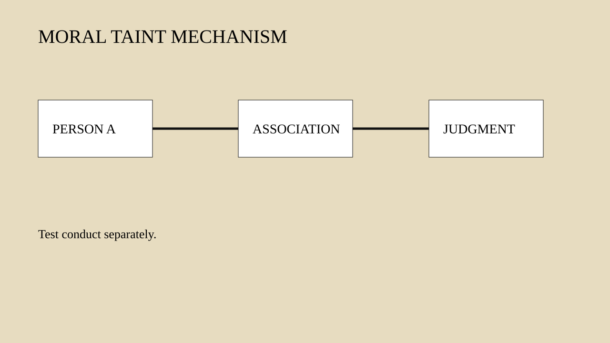
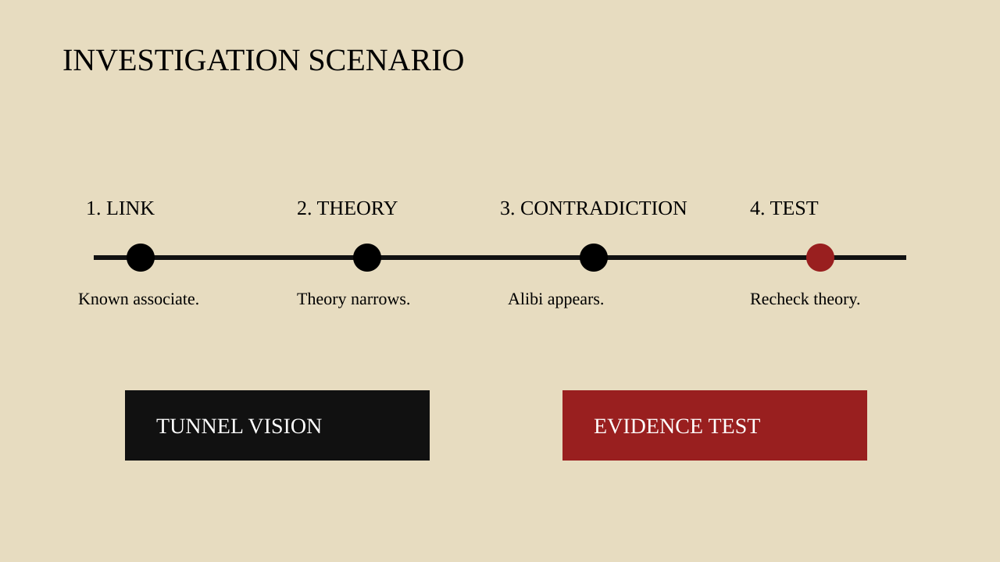

# Human Nature Dossier

## Moral Taint by Association

**Date:** 2026-09-28 12:30

**Central question:**
What buried trait creates conflict?
Science sees transfer intuitions.
Law demands individual proof.
Morality often spreads blame.
Social identity amplifies links.

**The disturbing truth:**
Blame can spread sideways.

**What this does NOT prove:**
Association establishes no guilt.

## Pages 1–2

### Page 1 — Mechanism

Moral taint feels transferable. Contact can trigger it. Association can trigger it. Design can trigger it. The mind treats character as residue. That residue seems portable. This is not literal transfer. It is an inference. Disgust can support it. Essence beliefs can support it. Social learning can reinforce it. The effect matters socially. People may avoid objects. They may avoid associates. They may avoid institutions. The target did nothing. The link does the work. This creates moral discomfort. Responsibility feels contagious. Law usually resists that. Liability normally needs conduct. Intent often matters too. Science shows the intuition. Science does not justify it. The disturbing truth: blame can spread sideways. What this does NOT prove: association establishes guilt. A counterargument also matters. Association sometimes carries information. Networks can reveal opportunity. Contact can reveal access. The error starts later. A clue becomes a verdict. That jump lacks support.

### Page 2 — Evidence

Classic work tested contagion beliefs. Rozin and colleagues studied them. Contact changed object judgments. People acted as if essence remained. Later work tested morality. Eskine and colleagues used transgressors. Participants experienced physical contact. Some contact was indirect. Reported guilt then increased. Disgust sensitivity moderated effects. Another program removed contact. Stavrova and colleagues tested design. Participants judged designed objects. The designer never touched them. Evaluations still shifted. The authors called this intention-based contagion. They separated it experimentally. Mere association differed somewhat. These findings support mechanisms. They do not establish universality. Samples were limited. Tasks were artificial. Effects can depend context. Replication depth also varies. The field mixes constructs. Contagion is not prejudice. Contagion is not conformity. It is not social media diffusion. Definitions therefore matter. The strongest claim stays narrow. Moral information can alter value. Sometimes physical contact matters. Sometimes symbolic creation matters. Human judgment can exceed evidence.

### Five lenses

#### 1. Psychology

Contact can shift judgments.
Disgust can moderate effects.
Essence beliefs can matter.
Intent can transfer value.
Mere association differs somewhat.

#### 2. Criminal investigation

Associations create useful leads.
They can also narrow.
Tunnel vision can follow.
NIJ documents that risk.
Behavior needs separate testing.

#### 3. Political history

McCarthy-era records apply.
Cold War fears mattered.
Association carried political weight.
Senate censure came later.
Mechanism attribution stays interpretive.

#### 4. Nietzsche

Genealogy questions moral labels.
It traces value origins.
This is philosophy only.
It proves nothing empirically.

#### 5. Robert Greene

Greene emphasizes reputation.
Association shapes perceived standing.
This is strategic interpretation.
It is not science.

## Counterargument

Associations can carry information.
Networks can reveal access.
Relationships can reveal opportunity.
Law permits relevant evidence.
The issue is substitution.
Connection cannot prove culpability.

## Replication limits

Several studies are small.
Many tasks are artificial.
Constructs sometimes overlap.
Cross-cultural evidence stays limited.
Direct replications remain sparse.
Effect sizes may vary.

## Legal conflict

Association suggests moral character.
Doctrine requires personal responsibility.
Claiborne states this clearly.
Specific unlawful intent matters.
Individual conduct matters too.

## Investigation implication

Treat links as leads.
Test each link separately.
Seek disconfirming evidence.
Preserve alternate suspects.
Document theory changes.

## Pages 3–5

### Page 3 — Mechanism flow

### Page 4 — Law versus science

### Page 5 — Concrete scenario

## Six visual chapters

### 1. The transfer illusion

Moral taint feels transferable. Contact can trigger it. Association can trigger it. Design can trigger it. The mind treats character as residue. That residue seems portable. This is not literal transfer. It is an inference. Disgust can support it. Essence beliefs can support it. Social learning can reinforce it. The effect matters socially. People may avoid objects. They may avoid associates. They may avoid institutions. The target did nothing. The link does the work. This creates moral discomfort. Responsibility feels contagious. Law usually resists that. Liability normally needs conduct. Intent often matters too. Science shows the intuition. Science does not justify it. The disturbing truth: blame can spread sideways. What this does NOT prove: association establishes guilt. A counterargument also matters. Association sometimes carries information. Networks can reveal opportunity. Contact can reveal access. The error starts later. A clue becomes a verdict. That jump lacks support.

### 2. What experiments found

Classic work tested contagion beliefs. Rozin and colleagues studied them. Contact changed object judgments. People acted as if essence remained. Later work tested morality. Eskine and colleagues used transgressors. Participants experienced physical contact. Some contact was indirect. Reported guilt then increased. Disgust sensitivity moderated effects. Another program removed contact. Stavrova and colleagues tested design. Participants judged designed objects. The designer never touched them. Evaluations still shifted. The authors called this intention-based contagion. They separated it experimentally. Mere association differed somewhat. These findings support mechanisms. They do not establish universality. Samples were limited. Tasks were artificial. Effects can depend context. Replication depth also varies. The field mixes constructs. Contagion is not prejudice. Contagion is not conformity. It is not social media diffusion. Definitions therefore matter. The strongest claim stays narrow. Moral information can alter value. Sometimes physical contact matters. Sometimes symbolic creation matters. Human judgment can exceed evidence.

### 3. Law draws boundaries

Law confronts this intuition. Association alone is dangerous. The Supreme Court said so. Claiborne Hardware is direct. Group membership was insufficient. Mere association was insufficient. Specific unlawful intent mattered. Individual conduct mattered too. The rule protects agency. It also limits contagion logic. A person cannot inherit liability. Another member caused harm. The Constitution blocks shortcuts. Evidence rules share concerns. Character evidence faces limits. Prejudice can distort inference. Yet legal actors are human. Jurors carry intuitions. One mock-jury study tested this. Arbuthnot used murder materials. Association evidence changed judgments. Effects were not simple. Moral reasoning also mattered. The study is old. Its sample was narrow. It needs cautious use. Still, the conflict remains. Law asks for attribution. Minds can spread blame. That gap matters. Legal conflict: association suggests character. Doctrine demands specific proof. The disturbing risk is substitution. Social proximity replaces conduct. Courts resist that substitution.

### 4. Investigation can narrow

Investigations begin with links. Links can be useful. They can show access. They can show sequence. They can identify witnesses. Problems begin with closure. One link becomes identity. Identity becomes theory. Theory filters later evidence. NIJ research calls this tunnel vision. Wrongful-conviction studies show systems can lock in. Confirmation bias then matters. Exculpatory facts lose attention. Weak facts gain weight. The latest NIJ network work agrees. Failures have multiple causes. They interact across systems. The lesson stays procedural. Association should generate leads. It should not settle guilt. FBI behavioral analysis uses behavior. It examines victim selection. It examines event sequence. It examines offender actions. That is a useful contrast. Criminal-investigation implication: map associations. Then test each link. Seek disconfirming facts. Separate access from culpability. Preserve alternate hypotheses. Homicide cases create pressure. Pressure rewards closure. Closure can magnify taint. The mechanism is plausible. Direct causal proof remains limited.

### 5. Political history example

History shows institutional stakes. Consider the McCarthy era. Cold War fears mattered. Communist infiltration concerns existed. Senator McCarthy made accusations. Proof was often disputed. Associations became politically potent. The National Archives documents this. Senate records document censure. McCarthy faced censure in 1954. The Senate condemned his conduct. The episode became linked with guilt-by-association tactics. That phrase describes method. It is not diagnosis. Psychology cannot explain history alone. Institutions shaped outcomes. Media shaped incentives. Partisanship also mattered. Security policy mattered. Individual choices mattered too. The cognitive lens adds one question. When does proximity substitute proof? That question fits this case. It also fits others. Political neutrality matters here. No party owns this mechanism. Coalition systems can use it. Movements can use it. States can use it. Citizens can use it. Documented facts come first. Psychological interpretation comes second. Historical analogy never proves mechanism.

### 6. Nietzsche, Greene, limits

Nietzsche offers one lens. Genealogy questions moral labels. It asks where values arose. It tracks social functions. Apply that method cautiously. A tainted label can travel. Groups can inherit meanings. This is philosophy only. It is not experimental evidence. Greene offers another lens. His writing treats reputation strategically. Associations shape perceived character. That can explain tactics. It cannot prove cognition. Research must stay primary. There are strong limits. Moral contagion samples are small. Many tasks are hypothetical. Replications remain incomplete. Culture may change effects. Disgust is not universal. Mere association differs experimentally. Some associations are informative. Criminal networks can matter. Political networks can matter. Institutional ties can matter. The scientific warning is narrower. Do not convert connection. Do not convert it automatically. Test conduct and intent. Test alternative explanations. The buried trait is simple. Humans spread moral value. Legal systems demand individuation. That tension never disappears.

## Sources

- [Rozin, Millman & Nemeroff (1986)](https://doi.org/10.1037/0022-3514.50.4.703) — Sympathetic magic and contagion.
- [Eskine, Novreske & Richards (2013)](https://doi.org/10.1016/j.jesp.2013.04.009) — Moral contagion after contact.
- [Stavrova et al. (2016)](https://doi.org/10.1017/S1930297500004770) — Intention-based contagion.
- [Arbuthnot (1983)](https://doi.org/10.2466/pr0.1983.52.1.287) — Mock juror association evidence.
- [NAACP v. Claiborne Hardware](https://www.law.cornell.edu/supremecourt/text/458/886) — Association alone cannot establish liability.
- [NIJ: Confirmation Bias](https://nij.ojp.gov/library/publications/confirmation-bias-and-other-systemic-causes-wrongful-convictions-sentinel) — Investigative failure and confirmation bias.
- [NIJ: Criminal Investigative Failures (2025)](https://nij.ojp.gov/library/publications/criminal-investigative-failures-network-analysis) — Network analysis of investigative failures.
- [FBI Behavioral Analysis](https://www.fbi.gov/how-we-investigate/behavioral-analysis) — Behavior-based investigative support.
- [National Archives: McCarthy Censure](https://www.archives.gov/milestone-documents/censure-of-senator-joseph-mccarthy) — Primary institutional history.
- [Nietzsche: Genealogy of Morals](https://www.gutenberg.org/ebooks/52319) — Philosophical lens only.
- [Robert Greene: author page](https://www.penguinrandomhouse.com/authors/243460/robert-greene/) — Strategic literary lens only.

## Topic queue

- audience inhibition
- betrayal aversion
- moral licensing after punishment
- identity fusion and sacrifice
- strategic ignorance
- ambiguity-driven suspicion

## Production notes

Video uses six chapters.
Motion uses stepped poses.
Final rate is 25fps.
Visual cadence mimics 12.5fps.
Audio is absent.
Verification appears separately.
