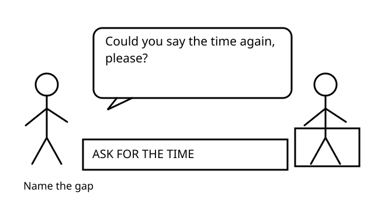

# Sorry, Could You Say That Again?

FML-0001 | v1.1.0

Goal: Ask someone to repeat one missed detail, then confirm what was heard.

Audience: Older teenagers and adults. A2–B1 estimate. Duration: 3–5 minutes.

Prerequisites: Can understand simple service conversations; Can form basic questions

## Situation

The receptionist says: Breakfast starts at six [noise] in the Palm Room. You missed the time.

When one detail is missed, ask for that part again. After hearing it, confirm the detail before continuing.

## Conversation

**Hear the message:** Breakfast starts at six [noise] in the Palm Room.

The place is known. The time is missing.

**Name the gap:** Could you say the time again, please?

Name the detail you need repeated.

**Hear the reply:** Six forty-five.

The reply supplies the missing time.

**Check the detail:** Six forty-five, right?

Checking gives space for correction.

**Build your request:** Could you | say | the time | again, please?

Could you + base verb forms the request.

**Try the café:** You missed the table number. Ask, then check: fourteen.

Say or write one sentence asking for the number again. Then add one checking sentence after you hear: fourteen.

## Language

**meaning:** Use a repetition request when words were not heard clearly. Use a checking question after hearing the detail again.

**form:** Could you + base verb + ... ? / Did you say + detail? / detail + right?

**appropriateness:** Can and could both work for requests. Could often sounds more polite. Tone and context also matter.

**distinction:** If you heard the words but do not understand their meaning, ask for clarification instead of repetition.

## You missed the time. What helps most?

- **What?** It signals a problem. It does not show which detail you missed. In some contexts, it can sound abrupt.

- **Could you say the time again, please?** This names the missing detail. It asks for repetition. It is clear and polite.

- **Breakfast is good.** This comments on breakfast. It does not repair the missed information.

## You missed everything. Which request works?

- **Sorry, could you say that again, please?** This asks for the whole message again. Sorry can soften the interruption.

- **Could you explain breakfast?** This asks for an explanation. Use it when the meaning is unclear, not when the words were missed.

- **Repeat.** The meaning is understandable. The imperative is very direct. A request form usually suits service situations better.

## The receptionist repeats: Six forty-five. What checks it?

- **Six forty-five, right?** This checks the detail you heard. It gives the other person a chance to correct it.

- **Could you repeat?** You can ask again if needed. Here, you already heard the detail. Checking is faster.

- **Yes, breakfast.** This does not confirm the time. The risky detail remains unchecked.

## Your turn

A café worker tells you: Your table is outside, number fourteen. You hear the location, but not the number.

Say or write one sentence asking for the number again. Then add one checking sentence after you hear: fourteen.

- I asked for repetition.
- I named the missing detail.
- I checked fourteen afterwards.
- My wording fits the situation.

Examples; alternatives can work.

Could you say the table number again, please? Fourteen, right?

Sorry, could you repeat the number, please? Did you say fourteen?

Can you say the number again, please? Fourteen?

## Later recall

Tomorrow, without looking: what can you say when you miss one detail?

## Sources

Cambridge Dictionary, English Grammar Today. Can, could or may?. https://dictionary.cambridge.org/us/grammar/british-grammar/can-could-or-may

Accessed 2026-09-27. Coverage: Official search excerpt inspected; direct page returned HTTP 403. Can/could in requests; could described as more polite than can.

British Council LearnEnglish. How to ask someone to repeat something. https://learnenglish.britishcouncil.org/sites/podcasts/files/LearnEnglish-Howto-ask-someone-to-repeat-something.pdf

Accessed 2026-09-27. Coverage: Full four-page reference inspected; repetition expressions only.

Cambridge Dictionary, English Grammar Today. Questions: echo and checking questions. https://dictionary.cambridge.org/grammar/british-grammar/questions-echo-and-checking-questions

Accessed 2026-09-27. Coverage: Official search excerpt inspected; direct page returned HTTP 403. Echo/checking questions used for confirmation in spoken English.

Owner review required. No deployment.
