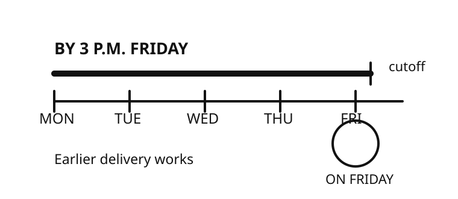

# By Friday?

FML-0010 | v1.0.0 | A2-B1 estimate | 3-5 minutes

**Goal:** Confirm whether a work deadline includes Friday, then restate the exact cutoff.

**Audience:** Older teenagers and adults

**Prerequisites:** Understand weekdays and clock times; Form short confirmation questions.

## Situation

Your manager writes: ‘Please send the revised rota by Friday.’ You need the exact deadline before promising delivery.

## Deadline map

Picture a line running toward Friday. ‘By Friday’ points to the line’s end: finish before or at that boundary. ‘On Friday’ circles Friday itself: the event happens that day. Adding ‘3 p.m.’ makes the boundary visible.

## Model

**Worker:** Just to confirm, do you need it before Friday starts, or anytime on Friday?

**Manager:** By 3 p.m. Friday, please.

**Worker:** Understood. I’ll send it no later than 3 p.m. Friday.

## Meaning, form, context

**Meaning:** By marks the latest acceptable point. On places an event on that day.

**Form:** by + deadline: by Friday; by 3 p.m. Friday / on + day/date: on Friday; on 27 September

**Context:** When ‘by Friday’ lacks an exact hour, clarify the cutoff. Workplaces may interpret the day differently.

‘Send it by Friday’ allows earlier delivery. ‘Send it on Friday’ places delivery on Friday.

## What does ‘by Friday’ usually signal?

- **Friday is the latest point.** Yes. ‘By’ marks a deadline. Earlier delivery works. The exact Friday cutoff may still need checking.
- **Delivery must happen on Friday.** Not necessarily. ‘On Friday’ places the event that day. ‘By Friday’ also permits earlier delivery.
- **Delivery can wait until Monday.** No. Monday follows the stated deadline. Ask before assuming any extension.

## Which reply finds the missing detail?

- **Just to confirm, before Friday starts, or anytime Friday?** Best. It exposes the ambiguity and requests an exact boundary.
- **Okay, I’ll send it Friday.** This promises a day but never checks the cutoff. The manager may expect it earlier.
- **Why did you choose Friday?** This asks about the reason. It does not establish the deadline.

## The manager says, ‘By 3 p.m. Friday.’ Choose the clearest check.

- **Understood. No later than 3 p.m. Friday.** Best. It restates the latest acceptable time without changing it.
- **Understood. After 3 p.m. Friday.** This reverses the deadline. ‘By 3 p.m.’ means not later than 3 p.m.
- **Understood. Exactly at 3 p.m. Friday.** Too narrow. A deadline permits earlier completion.

## Your turn

A colleague writes: ‘Can you share the figures by Tuesday?’

Write one reply. Confirm the cutoff. Then state when you plan to send the figures.

- I asked about Tuesday’s cutoff.
- I used by for the deadline.
- I stated my delivery plan.
- My reply stays polite.

Possible replies:

- Just to confirm, do you need them before Tuesday, or anytime Tuesday? I can send them Monday afternoon.
- Do you need the figures by a specific time Tuesday? I plan to send them by noon.

Other clear replies can work.

## Later recall

Tomorrow, explain the difference: ‘Send it by Friday’ and ‘Send it on Friday.’

## Sources

- Cambridge University Press & Assessment. [By - English Grammar Today](https://dictionary.cambridge.org/grammar/british-grammar/by). Accessed 2026-09-27. The page states that by can mean not later than for arrangements and deadlines. Limitation: The lesson’s workplace dialogue and activities are original.

- Cambridge University Press & Assessment. [At, on and in (time) - English Grammar Today](https://dictionary.cambridge.org/grammar/british-grammar/in-on-and-at-time). Accessed 2026-09-27. The page explains on with dates and singular weekdays for one occasion. Limitation: The lesson narrows that distinction to deadline clarification.

- British Council. [Prepositions of time: at, in, on](https://learnenglish.britishcouncil.org/free-resources/grammar/a1-a2-grammar/prepositions-of-time-at-in-on). Accessed 2026-09-27. The page covers time prepositions, including on with days and dates. Limitation: It supports form only. It does not define the lesson’s workplace cutoff.

Owner review required.

No publication occurred.
