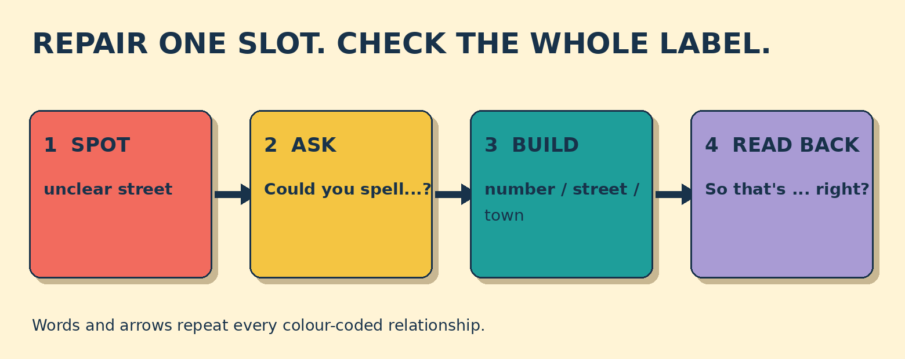

# Could You Spell the Street Name?

**Goal:** Clarify one unclear part of a delivery address and confirm the complete address accurately.

A customer says: Deliver it to 14 Rue des Alizes, 97460 Saint-Paul. The courier clearly hears 14, 97460, and Saint-Paul, but the street name is unclear.

## Papercut diagram

First identify the unclear address slot. Ask only for that missing detail. Place the repaired detail beside the number, postcode, and town. Read back the complete label and invite confirmation.

## Model

> Could you spell the street name, please?  
> A-L-I-Z-E-S. Alizes.  
> So that's 14 Rue des Alizes, 97460 Saint-Paul, right?

## Meaning, grammar, use

**Grammar:** Could you + base verb makes a polite request: Could you spell ...? The readback uses So that's ... , right? or Is that correct? to invite confirmation.

**Meaning:** Clarifying targets only the unclear part. Reading back the full address checks that every delivery detail is accurate.

**Appropriateness:** Could you ... please? is polite in a service call. A shorter Can you spell that? can also work in a friendly context. Do not assume an unclear street name.

**Address order:** For this French address, keep the house number with the street name, then the five-digit postcode with the town. Address formats differ by country.

### The courier heard 14, 97460, and Saint-Paul. Which part needs clarification?

- **The street name** — Correct. The street name is the only unclear part, so ask about that detail.
- **The house number** — The courier clearly heard 14. Asking for it again adds work but does not repair the unclear street name.
- **The town** — Saint-Paul was clear. The missing evidence is the street name.

### Choose the clearest polite repair question.

- **Could you spell the street name, please?** — Best. It names the exact missing detail and asks for a useful action.
- **Could you repeat everything?** — Polite, but too broad. The number, postcode, and town are already clear.
- **What?** — This shows a problem but does not identify what needs repair. It may sound abrupt in a service call.

### Match the address slots

- **14** → house number
- **Rue des Alizes** → street name
- **97460 Saint-Paul** → postcode and town

## Your turn

A cafe asks for a delivery to 27 Avenue des Palmiers, 97420 Le Port. You hear the number, postcode, and town, but not the avenue name.

Write one clarification question. Then write one complete readback question after the customer spells the avenue name.

Self-check:
- I named the unclear detail.
- I used a polite request.
- I repeated the complete address.
- I invited confirmation.

Valid alternatives: Other clear requests and readbacks can work. Street name and avenue name are both acceptable here.

## Later retrieval

Tomorrow, explain why a courier might ask Could you spell the street name? before saying So that's ... right?

## Sources

- British Council. [Requests, offers and invitations](https://learnenglish.britishcouncil.org/free-resources/grammar/english-grammar-reference/requests-offers-invitations). Accessed 2026-09-27. Lines 8-18: could you and would you as polite request forms; can and will described as less polite. Limitation: The delivery dialogue and exercises are original. The source supports request form only.
- La Poste. [Comment saisir correctement une destination ?](https://aide.laposte.fr/contenu/comment-saisir-correctement-une-destination). Accessed 2026-09-27. Lines 77-110: French address fields, ordered components, and five-digit postcode with locality. Limitation: The lesson simplifies formatting for a short spoken readback. It does not reproduce a postal form.
- Universal Postal Union. [Addressing Solutions](https://www.upu.int/en/postal-solutions/programmes-services/addressing-solutions). Accessed 2026-09-27. Lines 393-397 and 453-491: address formats vary by country; address elements and postcodes support correct processing. Limitation: Used for context only. Country-specific rules remain authoritative.

Owner review required. No publication occurred.
