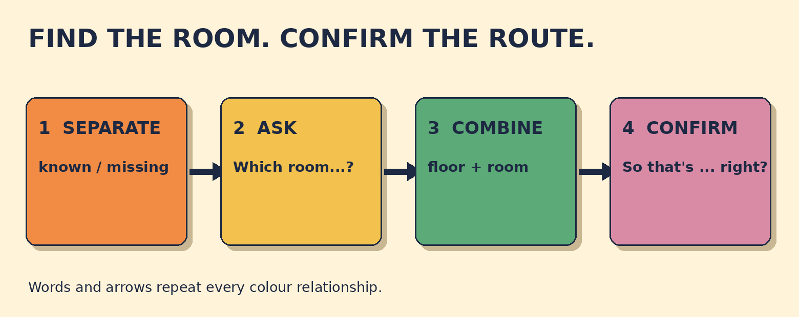

# Which Room Is the Meeting In?

**Goal:** Clarify which meeting room to use, then confirm the floor and room accurately.

Your invitation says Client check-in at 10:00 on the third floor. The room name is smudged. Reception says the meeting is in the Orchid Room.

## Papercut diagram

First separate the known clues from the missing clue. Ask which room using a direct or embedded question. In the embedded version, keep statement order: the meeting is in. Then repeat the room and floor together and invite confirmation.

## Model

> Could you tell me which room the meeting is in, please?  
> The Orchid Room, on the third floor.  
> So that's the Orchid Room on the third floor, right?

## Meaning, grammar, use

**Grammar:** After Could you tell me, use statement order in the embedded question: which room the meeting is in. Do not repeat direct-question order as which room is the meeting in.

**Meaning:** The floor narrows the location, but the room name identifies the exact meeting place. The readback joins both details for confirmation.

**Appropriateness:** Could you tell me ... please? is polite at a reception desk. Which room is the meeting in, please? is also correct and more direct. Which room, please? works when the situation is already clear.

**Location language:** Use in for the room and on for the floor: in the Orchid Room, on the third floor.

### The time and floor are clear. Which detail still needs clarification?

- **The room name** — Correct. The exact room is missing, so ask which room the meeting is in.
- **The meeting time** — The invitation clearly says 10:00. Asking again would not solve the missing-room problem.
- **The floor** — The third floor is already clear. You still need the room name.

### Choose a correct, polite reception question.

- **Could you tell me which room the meeting is in, please?** — Correct. The polite frame is followed by statement order: the meeting is in.
- **Which room is the meeting in, please?** — Also correct. This direct question is polite with please, though less indirect.
- **Could you tell me which room is the meeting in?** — The meaning is understandable, but standard embedded-question order is which room the meeting is in.

### Match the meeting clues

- **10:00** → time
- **third floor** → floor
- **Orchid Room** → room

## Your turn

A workshop starts at 14:30 on the second floor. The room name is unclear. Reception says Palm Room.

Write one polite clarification question. Then write one complete readback question with Palm Room and the second floor.

Self-check:
- I asked for the missing room.
- I used a polite form.
- I repeated the room and floor.
- I invited confirmation.

Valid alternatives: Both direct and embedded questions can work. Meeting, workshop, session, and event are acceptable when they fit the situation.

## Later retrieval

Tomorrow, explain why we say Could you tell me which room the meeting is in? rather than Could you tell me which room is the meeting in?

## Sources

- British Council. [Requests, offers and invitations](https://learnenglish.britishcouncil.org/free-resources/grammar/english-grammar-reference/requests-offers-invitations). Accessed 2026-09-27. Requests section: could you and would you are polite request forms; can and will are described as less polite. Limitation: The meeting-room dialogue and activities are original. The source supports the polite request frame only.
- Cambridge Dictionary. [Reported speech: indirect speech](https://dictionary.cambridge.org/grammar/british-grammar/reported-speech-indirect-speech). Accessed 2026-09-27. Indirect wh-question section: statement word order uses subject plus verb, not direct-question inversion. Limitation: The lesson applies the same embedded-question order after Could you tell me. It does not reproduce Cambridge exercises.
- British Council. [Prepositions of place: in, on, at](https://learnenglish.britishcouncil.org/free-resources/grammar/a1-a2/prepositions-place). Accessed 2026-09-27. Examples include on the fifth floor and locations inside rooms or spaces. Limitation: Used only to support the conventional location phrases in the original scenario.

Owner review required. No publication occurred.
