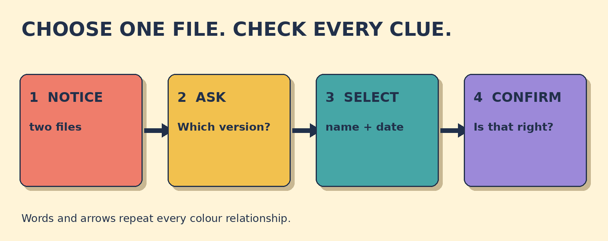

# Which Version Should I Send?

**Goal:** Clarify which document version to send, then confirm the filename and date accurately.

A colleague writes: Please send the final proposal. The folder contains proposal_client_v3_12-Sep.pdf and proposal_client_v4_18-Sep.pdf. The word final does not identify one file.

## Papercut diagram

First notice that final does not identify one file. Ask which version to send. Use the reply to select the version number, filename, and date. Then repeat the complete filename and date and invite confirmation.

## Model

> Which version should I send, please?  
> Version 4, dated 18 September.  
> So I should send proposal_client_v4_18-Sep.pdf, dated 18 September. Is that right?

## Meaning, grammar, use

**Grammar:** In the direct wh-question, use which version + should + subject + base verb: Which version should I send? In the checking question, Do you mean ...? is followed by the detail you want to verify.

**Meaning:** Version identifies a particular form of a document. The filename is the computer file's name. The date provides a second clue, so the readback checks both details before sending.

**Appropriateness:** Which version should I send, please? is clear and polite at work. Do you mean version 4, dated 18 September? is useful when you already have a likely choice but want confirmation. Avoid guessing from the word final when two files remain possible.

**Detail language:** Latest means newest or most recent. A document dated 18 September has that date written on it. Say dated 18 September, without on.

### The request says final, but two files are present. What must you clarify?

- **Which version to send** — Correct. Final does not identify one of the two filenames, so ask which version.
- **Who wrote the proposal** — The sender needs the correct file. The writer's identity does not distinguish these two versions.
- **Whether email exists** — The email route is already clear. The unresolved detail is the document version.

### Choose a clear clarification question.

- **Which version should I send, please?** — Correct. Which asks the colleague to choose from the known versions; should I send follows normal question order.
- **Do you mean version 4, dated 18 September?** — Also correct when version 4 is your likely interpretation and you want a yes-or-no check.
- **Which version I should send?** — This is not standard direct-question order. Ask Which version should I send?

### Match the file clues

- **proposal_client_v4_18-Sep.pdf** → filename
- **version 4** → version
- **18 September** → date

## Your turn

A manager asks for the latest budget report. You see budget_report_v2_03-Oct.xlsx and budget_report_v3_09-Oct.xlsx. The manager replies: version 3, dated 9 October.

Write one clarification question. Then write one complete confirmation with the filename and date.

Self-check:
- I asked which version to send.
- I used a polite form.
- I repeated the complete filename.
- I repeated the date and invited confirmation.

Valid alternatives: Which version should I send? and Do you mean ...? can both work. File, document, proposal, and report are acceptable when they fit the situation.

## Later retrieval

Tomorrow, explain the word order in Which version should I send? Then give one checking question with Do you mean ...?

## Sources

- Cambridge Dictionary. [Which](https://dictionary.cambridge.org/grammar/british-grammar/which). Accessed 2026-09-27. Which is used in questions when selecting from a limited set. Limitation: The workplace dialogue and activities are original. The source supports the question word only.
- Cambridge Dictionary. [Version](https://dictionary.cambridge.org/dictionary/english/version). Accessed 2026-09-27. Business English coverage defines a version as a document or product that differs from previous or later forms and lists current/latest/new version combinations. Limitation: Used only to support the meaning of version. No dictionary examples are reproduced in the activity.
- Cambridge Dictionary. [Filename](https://dictionary.cambridge.org/dictionary/english/filename). Accessed 2026-09-27. Filename is defined as the name given to a computer document or file. Limitation: The filenames in this lesson are original fictional data.
- Cambridge Dictionary. [Date](https://dictionary.cambridge.org/dictionary/english/date). Accessed 2026-09-27. Business English coverage shows date as a verb meaning to put a day's date on something, including the pattern a letter dated 30 March. Limitation: Used only to support the pattern dated plus date. The lesson uses original examples.
- Cambridge Dictionary. [Latest](https://dictionary.cambridge.org/dictionary/english/latest). Accessed 2026-09-27. Latest is defined as newest or most recent. Limitation: Used only to explain meaning. The lesson still requires clarification when filenames leave room for doubt.

Owner review required. No publication occurred.
