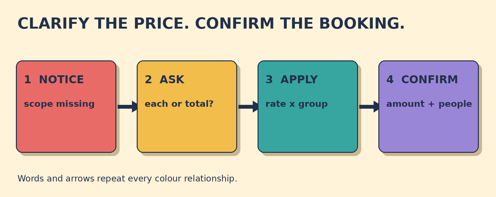

# Is That €60 Each or in Total?

**Goal:** Clarify whether a quoted price is per person or total, then confirm the amount and group size accurately.

The agent says: The tour is €60. Your group has three adults. The quote does not say whether €60 is for each person or for the whole group.

## Papercut diagram

First notice that a price without a scope can have two meanings. Ask whether it is per person or in total. Use the reply with the group size to identify the whole amount. Then repeat the total and number of people and invite confirmation.

## Model

> Is that €60 per person or €60 in total?  
> It is €60 per person.  
> So that is €180 in total for three people, right?

## Meaning, grammar, use

**Grammar:** With be, put is before the subject: Is that ...? An alternative question presents two possibilities joined by or: Is that €60 per person or €60 in total? A checking statement can end with right? in neutral informal conversation.

**Meaning:** Per person means for each person. In total means the whole amount for everyone together. The two phrases change the cost, so repeat both the final amount and the group size.

**Appropriateness:** The direct alternative question is clear and neutral at a tour desk. Just to check softens the question. Avoid asking only Is that right? before stating the amount you want confirmed.

**Detail language:** For three people names the group size. If the price is €60 per person, three people cost €180 in total. The arithmetic illustrates the language consequence; the target skill is clarification and readback.

### The agent says only: The tour is €60. What is unclear?

- **Whether €60 is per person or total** — Correct. The quote gives an amount but not its scope: one person or the whole group.
- **Whether the tour exists** — The agent is offering the tour. The missing detail is what the €60 price covers.
- **Whether three is a number** — The group size is already clear. You need to connect the quoted price to each person or everyone together.

### Choose a clear clarification question.

- **Is that €60 per person or €60 in total?** — Correct. The question names both possible meanings and lets the agent choose one.
- **Just to check, is the €60 price for each person or for the whole group?** — Also correct. Just to check softens the question; each person and the whole group explain the two meanings.
- **That €60 per person or total?** — The meaning may be guessed, but the standard full question needs be before the subject: Is that ...?

### Match the price clues

- **€60 per person** → rate
- **three people** → group size
- **€180 in total** → final total

## Your turn

A kayak hire worker says: The lesson is €45. You are booking for two people. The worker explains that €45 is per person.

Write one question that clarifies the price scope. Then write one complete confirmation with the total and the group size.

Self-check:
- I asked whether the price was for each person or the whole group.
- I used a complete question with is before the subject.
- I repeated the final total.
- I repeated the group size and invited confirmation.

Valid alternatives: Per person and for each person are equivalent here. In total, altogether, and for the whole group can work when the amount clearly covers everyone. A different final wording is acceptable if it repeats the amount and group size.

## Later retrieval

Tomorrow, explain the difference between per person and in total. Then make one alternative question with or and one complete price readback.

## Sources

- Cambridge Dictionary. [Per](https://dictionary.cambridge.org/dictionary/english/per). Accessed 2026-09-27. The search result defines per in prices and rates as for each. Limitation: The page itself returned a 403 to the retrieval tool. The indexed definition snippet was inspected; the lesson dialogue and tasks are original.
- Cambridge Dictionary. [Total](https://dictionary.cambridge.org/dictionary/english/total). Accessed 2026-09-27. The indexed definition coverage identifies total as the whole amount; related Cambridge results describe sum total as the whole of something. Limitation: The page itself returned a 403 to the retrieval tool. No dictionary example is reproduced.
- British Council LearnEnglish. [Question forms](https://learnenglish.britishcouncil.org/free-resources/grammar/a1-a2/question-forms). Accessed 2026-09-27. The explanation states that questions with be put the verb before the subject and illustrates A1-A2 question formation. Limitation: It supports question order, not this original tour-price scenario.
- British Council LearnEnglish Teens. [Question words](https://learnenglishteens.britishcouncil.org/comment/88129). Accessed 2026-09-27. The A2-B1 page explains auxiliary-before-subject question formation and includes a choice question using or. Limitation: The source does not prescribe the lesson's exact alternative question.

Owner review required. No publication occurred.
