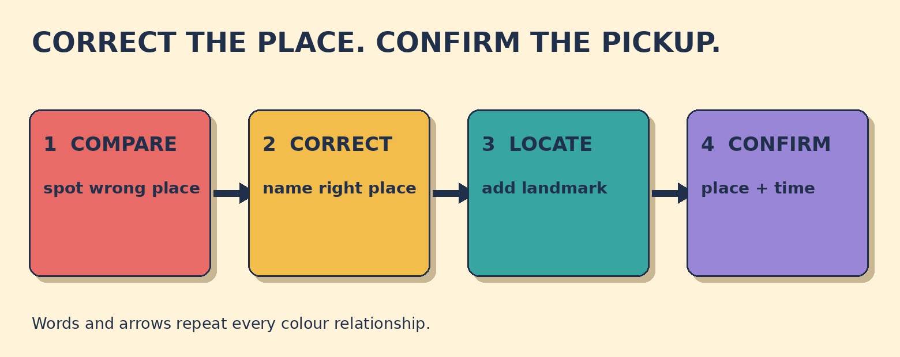

# Not the Main Entrance - the Taxi Rank

**Goal:** Correct a mistaken pickup location, then confirm the landmark and pickup time accurately.

The driver says: I'll meet you at the station main entrance at 8:15. Your booking says: taxi rank beside the blue clock, 8:15.

## Papercut diagram

First compare the spoken message with the booking. Correct only the mistaken place. Add the landmark to identify the exact point. Then repeat the place, landmark, and time in one confirmation question.

## Model

> Sorry, not the main entrance - the taxi rank beside the blue clock.  
> The driver says: Yes, the taxi rank beside the blue clock.  
> So you'll meet me at the taxi rank beside the blue clock at 8:15, right?

## Meaning, grammar, use

**Grammar:** A concise correction can contrast not X with Y: not the main entrance - the taxi rank. In the full readback, at introduces the exact meeting point and the clock time: at the taxi rank ... at 8:15.

**Meaning:** The time is already correct; the mistaken detail is the place. Beside means next to or at the side of something. The landmark makes the taxi rank easier to identify.

**Appropriateness:** Sorry or Just to clarify makes the correction polite and direct. State the correct place immediately, then repeat place, landmark, and time so the driver can confirm.

**Detail language:** At can identify an exact position such as an entrance and also a clock time. Beside the blue clock adds a visible landmark; colour is repeated in words, so colour is not the only cue.

### Compare the driver's message with the booking. Which detail is mistaken?

- **The pickup location** — Correct. Both messages say 8:15, but the driver says main entrance and the booking says taxi rank.
- **The pickup time** — Both messages say 8:15. The location is the detail that changes.
- **The person collecting you** — The driver is already clear. Correct the meeting place, then confirm the landmark and time.

### Choose a clear, polite correction.

- **Sorry, not the main entrance - the taxi rank beside the blue clock.** — Correct. It names the wrong place, supplies the right place, and includes the landmark.
- **Just to clarify, the pickup point is the taxi rank beside the blue clock, not the main entrance.** — Also correct. Just to clarify softens the correction, and the exact pickup point comes before the contrast.
- **No. Wrong.** — This rejects the message but does not supply the correct pickup point. Name the taxi rank and landmark.

### Match the pickup details

- **the taxi rank** → place
- **beside the blue clock** → landmark
- **at 8:15** → time

## Your turn

A hotel driver says: I'll collect you in the lobby at 6:40. Your message says: side entrance beside the pharmacy, 6:40.

Write one polite correction. Then write one complete confirmation with the correct place, landmark, and time.

Self-check:
- I politely corrected the wrong place.
- I stated the correct pickup place.
- I included the landmark.
- I repeated the time and invited confirmation.

Valid alternatives: Next to can replace beside here. Is that correct?, right?, and correct? can all invite confirmation. A speaker may omit the wrong place if the correct pickup point is stated clearly, but naming the contrast can prevent another mix-up.

## Later retrieval

Tomorrow, recall the three readback slots for a pickup point. Then correct one wrong place and confirm place, landmark, and time.

## Sources

- British Council LearnEnglish. [Prepositions of place: in, on, at](https://learnenglish.britishcouncil.org/free-resources/grammar/a1-a2/prepositions-place). Accessed 2026-09-27. The A1-A2 explanation states that at can mark common meeting places and exact positions, including a station and an entrance. Limitation: It supports the location pattern, not this original taxi scenario.
- British Council LearnEnglish. [Prepositions of time: at, in, on](https://learnenglish.britishcouncil.org/free-resources/grammar/a1-a2-grammar/prepositions-of-time-at-in-on). Accessed 2026-09-27. The A1-A2 explanation states that at is usually used with clock times. Limitation: It supports at 8:15, not the lesson's complete dialogue.
- Cambridge Dictionary. [Beside or besides?](https://dictionary.cambridge.org/grammar/british-grammar/beside-or-besides). Accessed 2026-09-27. The indexed Cambridge grammar result defines beside as at the side of or next to. Limitation: Direct page retrieval returned a 403. The indexed definition snippet was inspected; no dictionary example is reproduced.

Owner review required. No publication occurred.
