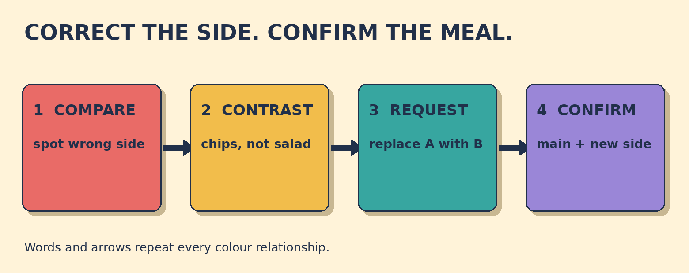

# Chips, Not Salad

**Goal:** Ask a restaurant to replace the wrong side dish, then confirm the corrected order.

You ordered grilled fish with chips. The server brings grilled fish with salad.

## Papercut diagram

First compare the order with the plate. Name the side dish you ordered and contrast it with the side you received. Ask to replace the incorrect side with the ordered side. Then repeat the main dish and corrected side in one confirmation question.

## Model

> Excuse me, I ordered chips, not salad.  
> Could you replace the salad with chips, please?  
> Thank you. So that's grilled fish with chips, right?

## Meaning, grammar, use

**Grammar:** I ordered X, not Y contrasts the expected item with the item received. In replace A with B, A is removed and B takes its place: replace the salad with chips.

**Meaning:** The main dish is correct; only the side dish needs changing. The request names both the item to remove and the replacement, so the correction is easy to check.

**Appropriateness:** Excuse me gets the server's attention politely. Could you ... please? is a polite request. A calm readback of the whole meal checks that the change is understood.

**Detail language:** With links the main dish and side dish: grilled fish with chips. Instead of is a valid alternative when the requested replacement is clear.

### Compare the order with the plate. Which detail is wrong?

- **The side dish** — Correct. The order says chips, but the plate has salad. The grilled fish is correct.
- **The main dish** — Both the order and the plate have grilled fish. The side dish is the mismatch.
- **The table number** — No table number is given. Compare the food: chips were ordered, but salad arrived.

### Choose a clear, polite request for the change.

- **Could you replace the salad with chips, please?** — Correct. It names what should leave and what should replace it, and the request is polite.
- **Excuse me, could I have chips instead of salad, please?** — Also correct. Instead of makes the replacement clear, and Excuse me plus please suits a service situation.
- **This is wrong. Take it away.** — This reports a problem but does not clearly name the replacement. Ask for chips and keep the tone polite.

### Match the meal details

- **grilled fish** → main dish
- **salad** → incorrect side
- **chips** → replacement side

## Your turn

You ordered a burger with a side salad. The server brings a burger with onion rings.

Write one polite correction and request. Then write one confirmation of the complete corrected meal.

Self-check:
- I politely introduced the correction.
- I named the incorrect side dish.
- I clearly requested the replacement side.
- I confirmed the main dish and corrected side.

Valid alternatives: Could I have ... instead of ...? and Could you change ... to ...? can work when both sides are clear. Right?, correct?, and Is that right? can all invite confirmation.

## Later retrieval

Tomorrow, recall the two slots after replace: replace the incorrect side with the ordered side. Then confirm one complete corrected meal.

## Sources

- British Council LearnEnglish. [Requests, offers and invitations](https://learnenglish.britishcouncil.org/free-resources/grammar/english-grammar-reference/requests-offers-invitations). Accessed 2026-09-27. The requests section states that could you and would you are polite ways to ask someone to do something, and gives a could you ... please pattern. Limitation: It supports the request form, not this original restaurant scenario.
- Cambridge Dictionary. [Replace](https://dictionary.cambridge.org/dictionary/english/replace). Accessed 2026-09-27. The dictionary entry defines replace as taking the place of something or putting one thing or person in the place of another and illustrates replace with. Limitation: It supports the change-of-item meaning and complement pattern; no dictionary example is reproduced in the lesson.

Owner review required. No publication occurred.
