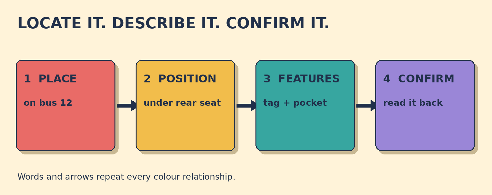

# Was It on the Bus or at the Station?

**Goal:** Clarify whether a lost item was left on a bus or at the station, then describe it for identification.

Your small black backpack is missing. You remember putting it under a seat near the back of the number 12 bus. It has a red zip tag and a front pocket.

## Papercut diagram

First choose the vehicle or place from the evidence: on bus 12, not at the station. Next state the exact position: under a seat near the back. Then describe the item with visible identifying features. Finish by reading back the transport and position for confirmation.

## Model

> I think I left it on the number 12 bus, not at the station.  
> It's a small black backpack with a red zip tag and a front pocket.  
> So that's bus 12, under a seat near the back, correct?

## Meaning, grammar, use

**Grammar:** Use on with public transport such as a bus or train, and at with a place used as a point, such as a station. With can add identifying features: a backpack with a red zip tag.

**Meaning:** The route and exact position tell staff where to search. Size, colour, item type, and distinctive features help distinguish one bag from another.

**Appropriateness:** I think or I believe honestly shows that a memory may be uncertain. Not at the station corrects the alternative. A short confirmation lets both people check the location before ending the call.

**Detail language:** Small black backpack is a natural compact description here. The lesson models size before colour before the item, but it does not claim that every English adjective sequence follows one universal rule.

### Which location best matches the memory?

- **On the number 12 bus** — Correct. You remember putting the bag under a seat near the back of bus 12.
- **At Central Station** — The station is the alternative, but the evidence points to a seat on bus 12.
- **In a taxi** — No taxi appears in the memory. Use the route and seat clue: on bus 12.

### Which description gives useful identifying evidence?

- **It's a small black backpack with a red zip tag and a front pocket.** — Correct. It gives item type, size, colour, and two visible features.
- **It's a bag. I really need it.** — The need is understandable, but 'a bag' is too general. Add colour, size, and a distinctive feature.
- **It's nice and quite new.** — Nice and new are subjective or hard to verify. Give visible details such as colour, tag, and pocket.

### Match the lost-item details

- **number 12 bus** → transport
- **under a seat near the back** → exact position
- **red zip tag and front pocket** → identifying feature

## Your turn

You left an umbrella on train 6, on the overhead rack. It has a blue curved handle and a name label.

Write one location clarification, one identifying description, and one confirmation question.

Self-check:
- I distinguished the vehicle from the station.
- I named the route and exact position.
- I gave the item type and visible features.
- I ended with a confirmation question.

Valid alternatives: I think and I believe can both mark uncertain memory. On train 6 and aboard train 6 can work. Right?, correct?, and Is that right? can all invite confirmation.

## Later retrieval

Tomorrow, recall the three lost-item slots: transport, exact position, and identifying features. Describe one imaginary item using all three.

## Sources

- British Council LearnEnglish. [Prepositions of place: 'in', 'on', 'at'](https://learnenglish.britishcouncil.org/free-resources/grammar/a1-a2/prepositions-place). Accessed 2026-09-27. The full grammar explanation says on is used for some public transport, including a bus and train, and at is used for common activity places and exact positions, including a train station. Limitation: It supports the location prepositions, not this original lost-property scenario.
- Transport for London. [Lost property](https://tfl.gov.uk/help-and-contact/lost-property). Accessed 2026-09-27. The official search result identifies the page as guidance for reporting and claiming items lost on London transport, including buses. Limitation: The page itself returned HTTP 403 in this environment, so no form fields or procedural details were relied upon.
- British Council Singapore. [How to use the English prepositions in, at, on correctly](https://www.britishcouncil.sg/blog/Understand-English-prepositions). Accessed 2026-09-27. The full article contrasts on the train/bus with in a car/taxi and discusses at for specific places. Limitation: It supports transport usage only; the examples and activity here are original.

Owner review required. No publication occurred.
