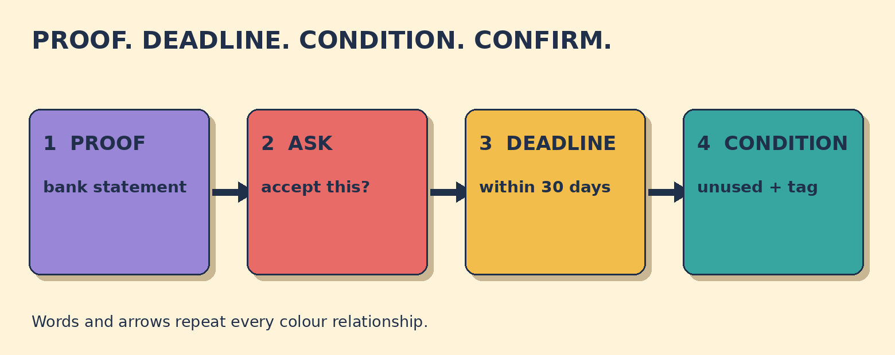

# Can I Return It Without the Receipt?

**Goal:** Ask whether a shop can accept a return without a receipt, then confirm the deadline and required item condition.

You bought a sweater 12 days ago. It is unused and the tag is attached. You lost the paper receipt, but your bank statement shows the purchase. The shop policy accepts returns within 30 days with proof of purchase.

## Papercut diagram

First say what is missing and offer alternative proof. Ask whether the shop accepts it. Then identify the policy deadline and the item's required condition. Finish by reading back all three details: proof, deadline, and condition.

## Model

> Could I return this without the paper receipt? I have the bank statement.  
> The sweater is unused, and the tag is still attached.  
> So I can return it within 30 days with proof of purchase, and it must be unused with the tag attached, right?

## Meaning, grammar, use

**Grammar:** Can I ...? asks for permission. Could I ...? is more formal and polite. Without names something that is absent. Instead of presents an alternative: a bank statement instead of the receipt.

**Meaning:** The question checks whether alternative proof is accepted. The readback separates three policy details: proof of purchase, the 30-day deadline, and the required condition of the item.

**Appropriateness:** Could I ...? suits a polite service encounter. Explaining what proof you do have is more useful than only saying what is missing. Confirming the deadline and condition prevents another misunderstanding.

**Detail language:** Within 30 days means no later than the end of that period. With the tag attached describes the item's required condition. This lesson uses a fictional shop policy; real rights and policies vary by place and purchase type.

### Which evidence best replaces the missing paper receipt in this scenario?

- **The bank statement showing the purchase** — Correct. The scenario says the statement shows the purchase and the shop accepts proof of purchase.
- **The shop's carrier bag** — A bag may come from the shop, but it does not clearly show this purchase. Use the bank statement.
- **No evidence at all** — The fictional policy asks for proof of purchase. Offer the bank statement rather than no evidence.

### Which question clearly checks permission and offers the alternative proof?

- **Could I return this without the paper receipt? I have the bank statement.** — Correct. It politely asks permission and immediately names the available proof.
- **Can I use my bank statement as proof of purchase instead of the receipt?** — Also correct. It directly checks whether the alternative evidence is acceptable.
- **I lost it. Give me a refund.** — This does not identify the available proof or check the policy. Ask whether the bank statement is accepted.

### Match the return-policy details

- **bank statement** → proof
- **within 30 days** → deadline
- **unused with the tag attached** → item condition

## Your turn

You bought headphones online 20 days ago. They are unopened. You have the purchase email but no paper receipt. The fictional policy allows returns within 28 days with proof of purchase.

Write one polite question about the purchase email. Then confirm the 28-day deadline and unopened condition.

Self-check:
- I politely checked permission.
- I named the alternative proof.
- I confirmed the exact deadline.
- I confirmed the required item condition.

Valid alternatives: Can I ...? and Could I ...? are both possible; could is more formal and polite. Right?, correct?, and Is that right? can all invite confirmation.

## Later retrieval

Tomorrow, recall the three return-policy slots: proof, deadline, and item condition. Make one confirmation question using all three.

## Sources

- British Council LearnEnglish. [Permission](https://learnenglish.britishcouncil.org/free-resources/grammar/english-grammar-reference/permission). Accessed 2026-09-27. The full grammar explanation states that can asks permission and could is more formal and polite. Limitation: It supports the permission forms, not this original retail scenario.
- GOV.UK. [Accepting returns and giving refunds: the law](https://www.gov.uk/accepting-returns-and-giving-refunds). Accessed 2026-09-27. The official guidance says a business may ask for proof of purchase and that evidence can include a sales receipt, bank statement, or packaging. Limitation: This is UK business guidance. The lesson uses a fictional policy and does not present jurisdiction-specific legal advice.

Owner review required. No publication occurred.
