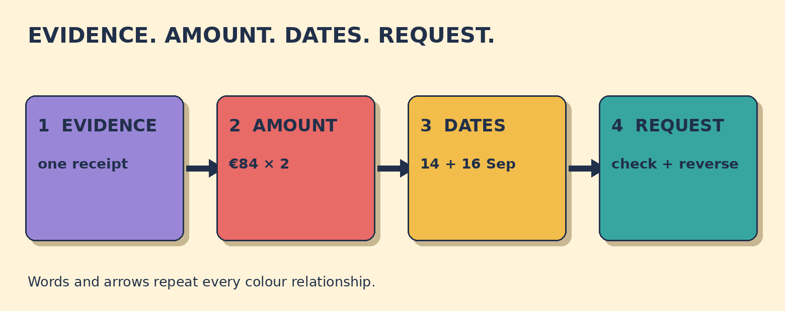

# Why Was I Charged Twice?

**Goal:** Explain that the same hotel charge appears twice, identify both transaction dates, and ask when the duplicate will be reversed.

Your hotel receipt shows one room charge of €84. Your bank app shows two €84 transactions from the same hotel: 14 September and 16 September.

## Papercut diagram

First compare the one receipt charge with the two matching bank transactions. State the amount and both dates. Say that you think you were charged twice, then ask which transaction is the duplicate. Finish by asking when it will be reversed and confirming when to check again.

## Model

> I think I was charged twice for the same stay. The first €84 transaction is dated 14 September, and the second is dated 16 September.  
> Could you check which one is the duplicate?  
> When will the duplicate charge be reversed? So the 16 September charge will be reversed, and I should check my account again on Friday, right?

## Meaning, grammar, use

**Grammar:** In the direct question When will the duplicate charge be reversed?, the order is question word + will + subject + be + past participle. The passive form focuses on the charge and the action, not on who caused the problem.

**Meaning:** Charged twice means two matching payments appear for one purchase. Duplicate names the repeated transaction. Reverse means undo a completed payment entry in this fictional scenario.

**Appropriateness:** I think ... signals a problem without making an accusation. Give the amount and both dates, ask the staff member to check, and then request a clear action and time.

**Detail language:** Transaction date identifies when an entry appears. The original transaction is dated 14 September; the matching second transaction is dated 16 September. Real reversal times and dispute procedures vary by provider and location.

### Which evidence best shows a possible duplicate in this scenario?

- **One receipt charge and two matching €84 bank transactions** — Correct. The receipt shows one room charge, while the bank app shows the same amount twice.
- **Two different hotel services with different prices** — Different services and prices do not show the same charge twice. Compare the one €84 receipt line with the two €84 transactions.
- **One €84 transaction on 14 September** — One transaction matches the receipt. The possible duplicate appears only when the second matching €84 transaction is included.

### Which report is clear, calm, and specific?

- **I think I was charged twice. The €84 transactions are dated 14 and 16 September. Could you check which one is the duplicate?** — Correct. It states the problem, gives the amount and both dates, and asks for a check.
- **My receipt shows one €84 charge, but my bank app shows two. Could you check the transaction dated 16 September?** — Also correct. It contrasts the receipt with the bank app and identifies the second date.
- **You took my money twice. Fix it now.** — This accuses the listener and omits the dates. State the evidence, ask for a check, and request the action.

### Match the charge-report details

- **€84** → amount
- **14 September** → original date
- **16 September** → duplicate date
- **check and reverse the duplicate** → requested action

## Your turn

A car-rental receipt shows one €120 deposit. Your bank app shows two €120 transactions: 3 October and 5 October.

Write a calm report with the amount and both dates. Then ask when the duplicate will be reversed and confirm when to check again.

Self-check:
- I stated the repeated amount.
- I gave both transaction dates.
- I asked for a check without accusing anyone.
- I asked when the duplicate would be reversed.

Valid alternatives: I think I was charged twice, I can see two matching charges, and my bank app shows the amount twice are all valid. Could you check ...? and Can you check ...? are both possible; could is more formal and polite.

## Later retrieval

Tomorrow, recall the four report slots: amount, original date, duplicate date, and requested action. Make one calm question using all four.

## Sources

- British Council LearnEnglish. [Question forms](https://learnenglish.britishcouncil.org/free-resources/grammar/english-grammar-reference/question-forms). Accessed 2026-09-28. The grammar explanation describes inversion in questions and gives question-word examples. Limitation: It supports the question pattern, not this original hotel scenario.
- Cambridge Dictionary. [duplicate](https://dictionary.cambridge.org/dictionary/english/duplicate). Accessed 2026-09-28. The entry defines duplicate as an exact copy and gives noun, adjective, and verb uses. Limitation: It supports one vocabulary item, not a payment-dispute procedure.
- Cambridge Dictionary. [transaction](https://dictionary.cambridge.org/dictionary/english/transaction). Accessed 2026-09-28. The entry defines a transaction as an occasion when money is exchanged or something is bought or sold. Limitation: It supports one vocabulary item, not this fictional evidence set.
- Consumer Financial Protection Bureau. [How to fix mistakes in your credit card bill](https://www.consumerfinance.gov/ask-cfpb/how-to-fix-mistakes-in-your-credit-card-bill-en-82/). Accessed 2026-09-28. The official page advises reviewing charges, explaining what is wrong, and asking the provider to investigate a suspected billing mistake. Limitation: It is U.S. credit-card guidance. The lesson does not teach legal deadlines or replace provider-specific advice.

Owner review required. No publication occurred.
