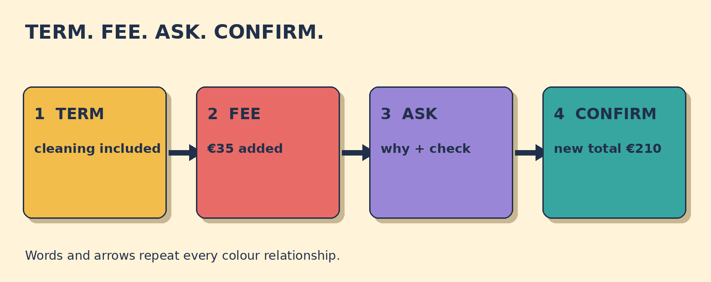

# Why Is There a Cleaning Fee?

**Goal:** Ask a hotel to explain an unexpected cleaning fee, compare it with the written booking terms, and confirm whether it will be removed.

Your booking confirmation says: Total €210. Cleaning included. Your checkout bill says: Total €245, including a €35 cleaning fee.

## Papercut diagram

First find the exact written term in the confirmation. Compare it with the separate fee and amount on the bill. Ask why the fee was added and request a check. If the fee is removed, confirm the corrected total.

## Model

> My booking confirmation says cleaning is included, but this bill adds a €35 cleaning fee.  
> Could you explain why this fee was added? Could you check the written booking terms and remove the fee if it was included?  
> So the €35 fee will be removed and the corrected total will be €210, right?

## Meaning, grammar, use

**Grammar:** In the direct question Why was this fee added?, the order is question word + auxiliary verb + subject. After Could you explain ..., the embedded question uses statement order: why this fee was added, not why was this fee added.

**Meaning:** Included means already part of the stated total. An added fee is a separate amount placed on the bill. Corrected total means the new total after an agreed change.

**Appropriateness:** Name the exact written term and amount, contrast them with but, and ask for an explanation before requesting a change. This is clear without accusing the listener.

**Detail language:** Written booking terms are useful evidence in this fictional exchange. Real hotel policies, consumer rights, taxes, and mandatory charges vary by provider and location.

### Which evidence best supports your question about the fee?

- **The confirmation says cleaning is included, but the bill adds a €35 cleaning fee.** — Correct. It compares the exact written term with the exact added amount.
- **The hotel room was comfortable.** — Comfort does not explain the fee. Use the written words cleaning included and the €35 bill line.
- **The bill total is €245.** — The total matters, but it does not show the conflict by itself. Compare cleaning included with the €35 cleaning fee.

### Which question is clear, calm, and grammatically well formed?

- **Could you explain why this fee was added?** — Correct. The embedded question uses statement order: why this fee was added.
- **Could you explain why was this fee added?** — After Could you explain, use statement order: why this fee was added.
- **You added a fake fee. Remove it now.** — This accuses the listener and skips the evidence. State the written term and ask for an explanation first.

### Match the booking-fee details

- **cleaning included** → written term
- **€35** → added fee
- **€210** → corrected total
- **explain and remove if included** → requested action

## Your turn

An airport hotel confirmation says shuttle included and shows a total of €160. The checkout bill is €178 because it adds an €18 shuttle fee.

Write one sentence that compares the written term with the bill. Ask why the fee was added, request a check, and confirm the corrected total.

Self-check:
- I quoted or paraphrased the written term.
- I named the added fee and amount.
- I asked for an explanation or check without accusing anyone.
- I confirmed the corrected total.

Valid alternatives: Can you explain ...? and Could you explain ...? are both possible; could is more formal and polite. Why was the fee added? is a valid direct question. After explain, use why the fee was added.

## Later retrieval

Tomorrow, recall the four request slots: written term, added fee, requested action, and corrected total. Make one calm request using all four.

## Sources

- British Council LearnEnglish. [Question forms](https://learnenglish.britishcouncil.org/free-resources/grammar/english-grammar-reference/question-forms). Accessed 2026-09-28. The grammar explanation describes inversion in direct questions and the position of question words. Limitation: It supports the direct-question pattern, not this original hotel scenario.
- British Council LearnEnglish. [Reported speech: questions](https://learnenglish.britishcouncil.org/free-resources/grammar/b1-b2-grammar/reported-speech-questions). Accessed 2026-09-28. The page explains that indirect questions retain the question word but use statement word order. Limitation: It supports the embedded-question explanation, not a billing procedure.
- UK Competition and Markets Authority. [Hotel booking websites: compliance principles for businesses](https://www.gov.uk/government/publications/hotel-booking-websites-compliance-principles-for-businesses). Accessed 2026-09-28. The official principles discuss clear presentation of total costs and additional charges in hotel booking contexts. Limitation: This is UK business guidance. The lesson uses it only to support the value of written price evidence and does not teach legal rights.
- Cambridge Dictionary. [fee](https://dictionary.cambridge.org/dictionary/english/fee). Accessed 2026-09-28. The entry defines fee as money paid for a particular piece of work or service. Limitation: It supports one vocabulary item, not whether a particular fee is lawful or refundable.

Owner review required. No publication occurred.
