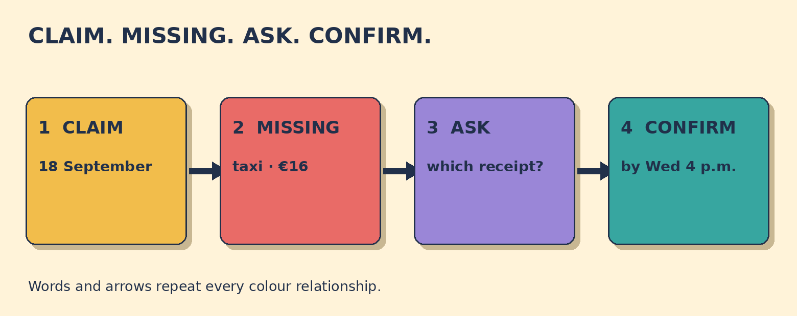

# Which Receipt Is Missing?

**Goal:** Ask which expense receipt is missing, identify the claim date and amount, and confirm the submission deadline.

Your 18 September expense claim totals €76: train €42, lunch €18, and taxi €16. The checklist shows the train and lunch receipts are attached. The taxi receipt is missing. Finance says: Please upload it by 4 p.m. Wednesday.

## Papercut diagram

First identify the claim by date. Scan the receipt checklist and find the category without a check mark. Read its amount. Ask which receipt is missing, then confirm the category, amount, and deadline.

## Model

> Which receipt is missing from my 18 September expense claim?  
> The taxi receipt for €16 is missing.  
> So I need to upload the €16 taxi receipt by 4 p.m. Wednesday, right?

## Meaning, grammar, use

**Grammar:** In Which receipt is missing?, which receipt is the subject, so there is no do-support. In Which receipt do I need to upload?, which receipt is the object, so present-simple question order uses do + subject + base verb.

**Meaning:** Missing means not attached to the claim. The claim date identifies the form; the category and amount identify the receipt. By 4 p.m. Wednesday means no later than that time, not only at exactly 4 p.m.

**Appropriateness:** Ask a neutral question, name the claim date, then read back the category, amount, and deadline. This checks details without blaming the colleague.

**Detail language:** Expense processes and evidence rules vary by employer and location. Follow the actual policy and ask the responsible team when unsure.

### Which receipt is missing from the 18 September claim?

- **The €16 taxi receipt.** — Correct. The checklist marks train and lunch as attached, leaving the taxi receipt missing.
- **The €42 train receipt.** — The train receipt is attached. Look for the category without a check mark.
- **The €18 lunch receipt.** — The lunch receipt is attached. The missing category is taxi.

### Which question is grammatically well formed and useful here?

- **Which receipt is missing from my 18 September claim?** — Correct. Which receipt is the subject of is missing, so no do is needed.
- **Which receipt does missing from my 18 September claim?** — Do not use does before missing in this subject question. Say Which receipt is missing?
- **Why did you lose my receipt?** — This assumes blame and does not identify the missing item. Ask which receipt is missing first.

### Match the expense-receipt details

- **18 September** → claim date
- **taxi** → receipt category
- **€16** → amount
- **4 p.m. Wednesday** → deadline

## Your turn

A 6 October claim lists parking €12 and lunch €21. The parking receipt is attached, but the lunch receipt is missing. Finance asks for it by noon Friday.

Write one neutral question that identifies the claim. Then write a readback with the missing category, amount, and deadline.

Self-check:
- I named the claim date.
- I asked which receipt was missing without assigning blame.
- I included the category and amount.
- I confirmed the deadline with by.

Valid alternatives: Which receipt is missing? and Which receipt do I need to upload? are both valid, but their grammar differs because the question phrase has a different job. Can you confirm ...? is also acceptable.

## Later retrieval

Tomorrow, recall the four readback slots: claim date, receipt category, amount, and deadline. Make one question and one confirmation.

## Sources

- British Council LearnEnglish. [Unit 6: Enquiries](https://learnenglish.britishcouncil.org/free-resources/business/english-emails/unit-6-enquiries). Accessed 2026-09-28. The retrieved page explains that subject questions do not add do, while object questions use an auxiliary verb. Limitation: It supports the question-form contrast, not this original expense scenario.
- Cambridge Dictionary — English Grammar Today. [By](https://dictionary.cambridge.org/grammar/british-grammar/by). Accessed 2026-09-28. The retrieved grammar entry explains by as not later than for arrangements and deadlines. Limitation: It supports the deadline meaning, not any employer policy.
- Cambridge Dictionary. [expenses claim](https://dictionary.cambridge.org/dictionary/english/expenses-claim). Accessed 2026-09-28. The retrieved entry defines an expenses claim as business spending an employee seeks to have repaid. Limitation: It supports workplace vocabulary only; terminology varies.
- Cambridge Dictionary. [receipt](https://dictionary.cambridge.org/dictionary/english/receipt). Accessed 2026-09-28. The retrieved entry defines a receipt as paper or a message proving that money, goods, or information were received. Limitation: It supports one vocabulary item, not evidence or reimbursement rules.

Owner review required. No publication occurred.
